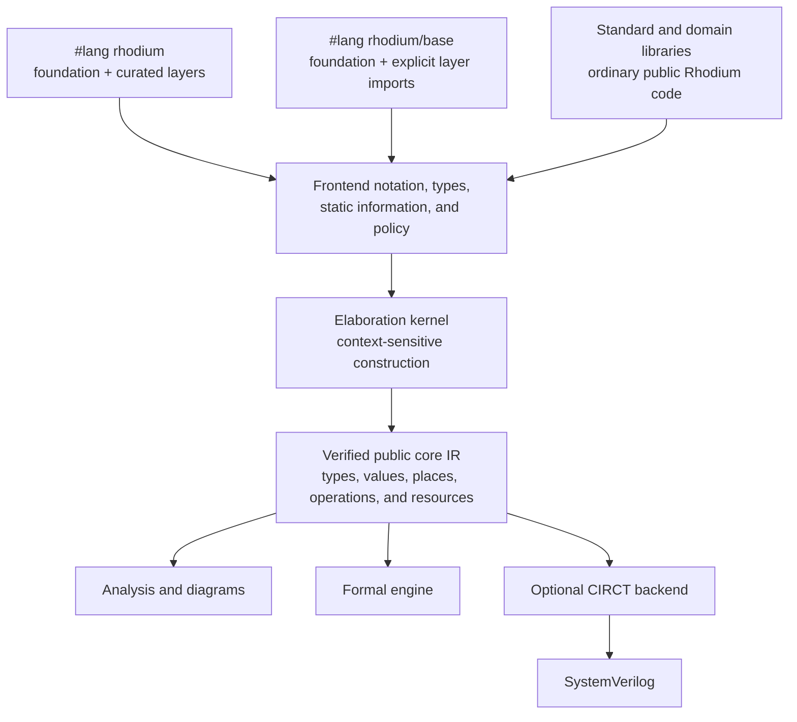

<!-- Introduces Rhodium, its authoring model, quick start, public capabilities, and user-facing documentation. -->
<!-- SPDX-License-Identifier: Apache-2.0 -->

# Rhodium

> Original Rhodium code and text were developed with a coding agent under my
> direction and review; this disclaimer is the only text I wrote directly.
> This statement does not describe separately licensed derived code or Git
> submodules.

Rhodium is an experimental hardware description language built for explicit
hardware and extensible abstractions. Hosted by
[Rhombus](https://docs.racket-lang.org/rhombus/), it combines programmable
hardware generation with typed connections and composable language layers.
Domain-specific types, library operators, and user-defined notation can feel
like native language features while remaining inspectable down to the hardware
they describe.

Every layer builds the same small, verified hardware IR. Connectivity and
priority are explicit, without last-connect semantics or competing drivers.
That shared foundation supports protocol-aware flow composition, transaction
tracing, clock-crossing checks, and validated network generation. For RTL
generation, Rhodium lowers through CIRCT to SystemVerilog.

## Core principles that set Rhodium apart

### Explicit hardware, simple IR

Rhodium rejects last-connect and competing-driver semantics: every place has
one effective driver, with priority represented directly in the hardware graph.
`when` and `switch` lower to explicit selection and guarded drives, giving
authors, verification, analysis, and backends the same dataflow graph. See the
[IR contract](rhodium/core/README.md).

### Language-oriented programming

Rhodium builds its authoring surface from composable Rhombus layers, so syntax,
types, and operations can grow together without a separate hardware model.
Authors can follow an abstraction down to the public core IR; the
[layered authoring examples](examples/lop/) show the same circuit at several
language layers.

### Extend the language with hardware types

Equal widths do not imply semantic compatibility. Extensible hardware types let
libraries enforce domain distinctions during elaboration, from `OneHot` and
`Mask` values to nominal enums and tagged unions, while still lowering to the
same core IR. See the [type extension surface](rhodium/frontend/layers/README.md#shared-extension-surface).

## What layers and libraries make possible

### Declarative decoding

Typed decode tables preserve partially specified outputs, so synthesis can
choose don't-care bits that simplify the circuit. Rhodium keeps the table as a
non-overlapping relation and CIRCT lowers it to sparse `casez` logic. See
[decode generation](rhodium/std/README.md) and the
[lowering contract](rhodium/backend/README.md#selection-and-relations).

### Domain-specific hardware vocabulary

The libraries use that extensibility for domain vocabulary: CHI protocol fields
and RISC-V page-table values become typed values with domain operations, not
unstructured bit fields. See the [CHI types](chi/protocol/flits.rhdl) and
[RISC-V translation types](riscv/rtl/sv39.rhdl).

### Protocol-aware flow composition

The [flow library](flow/README.md) composes buffers, arbitration, routing,
joins, and splits with `|>`. Connections check payload, direction, and protocol
compatibility across `Valid`, `Decoupled`, and `Irrevocable`, while composition
keeps atomicity and backpressure guarantees explicit.

### Transaction-aware Perfetto traces

Annotate flow checkpoints and the [event compiler](rhodium/event/README.md)
derives transaction ancestry from actual transfers through supported flow
components, then exports the event graph to Perfetto. Unsupported ancestry is
rejected rather than guessed, and tracing leaves synthesis unchanged.

### Validated NoC generation

The [NoC library](noc/README.md) analyzes symbolic topology and routing before
RTL construction, checking reachability and deadlock under documented VC
assumptions and retaining failure witnesses for the authored network. These
guarantees do not imply fairness or whole-protocol correctness; validated plans
feed [hardware generation](noc/rtl/README.md).

### Clock-crossing safety from signal provenance

Rhodium's [clock-crossing checker](rhodium/analysis/README.md#review-or-enforce-cdc-violations)
traces signal provenance through logic, hierarchy, records, and vectors.
Opt-in `elaborate_with_cdc` rejects unsafe or unknown-timing sampling unless
verified crossing evidence permits it; it does not insert synchronizers or
claim blanket safety for buses, handshakes, or reset crossings.

## Quick start

### Requirements

- Racket 9.2 or a compatible current release
- Rhombus 1.1
- Device Tree Compiler for DTB interoperability tests and FESVR simulations
- CIRCT and Verilator only for external backend integration tests
- Rosette only for optional equivalence, reachability, and output-property tests

On a Homebrew-based macOS setup:

```sh
brew install minimal-racket dtc
raco pkg install --auto rhombus
```

On x86-64 Linux or Apple Silicon macOS, install the pinned CIRCT release into
the ignored `.tools` directory:

```sh
make setup-circt
```

For simulation, build the pinned Verilator 5.038 (requires a C++ toolchain,
Autoconf, Bison, Flex, Make, Perl, and Python 3):

```sh
make setup-verilator
export PATH="$PWD/.tools/verilator/bin:$PATH"
```

Root Make targets also prefer this installation automatically. CI uses the
same installer and verifies the version on cache hits as well as fresh builds.

On other platforms, install CIRCT separately and set `CIRCT_OPT` to the path of
`circt-opt` when running backend integration tests.

### First circuit

```rhombus
#lang rhodium

circuit Adder(width :: PosInt):
  input(a, b): Bits(width)
  output sum: Bits(width)
  sum <== a + b

def design = elaborate(Adder(8))

export:
  Adder
  design
```

Run the standard adder example from the checkout:

```sh
tools/run-racket-tests.sh examples/lop/adder-standard.rhdl
```

Run all canonical examples:

```sh
make examples
```

The [test runner guide](tests/README.md) explains the available validation
levels. Contributor setup and change validation are in
[`DEVELOPING.md`](DEVELOPING.md#validate-at-the-owning-boundary).

## Mental model

A Rhodium source file contains two kinds of computation:

- **Host computation** is ordinary Rhombus. Host values, functions, loops, and
  conditionals decide what hardware is generated during elaboration.
- **Hardware computation** describes runtime signals, state, memories, and
  hierarchy. Hardware values have explicit types and cannot control ordinary
  host conditionals.

Calling `elaborate` runs the host program, constructs the selected hardware,
and verifies the completed design. Macro expansion and frontend layers do not
create intermediate hardware languages: every authoring path converges on the
same public core IR.

### Authoring profiles

| Profile | Intended use | Provides |
|---|---|---|
| `#lang rhodium` | Normal design work | Rhombus, the foundational circuit surface, and the curated frontend layers |
| `#lang rhodium/base` | Language composition and focused extensions | Rhombus and the foundation; the program explicitly imports any additional layers |

The foundation supplies circuits, ports, connections, elaboration, and basic
hardware types. Selectable layers add notation, types, static information, and
authoring policy. Ordinary standard and domain libraries build on the public
language; they are not compiler layers.

## Architecture



The architectural boundary is semantic rather than syntactic. A concept belongs
in core only when verification and every backend must preserve its hardware
meaning. Notation, organization, reusable host descriptions, and policy over
existing operations belong in frontend layers or ordinary libraries. Optional
derived facts and reports belong in analysis packages.

The public package map is in [`rhodium/README.md`](rhodium/README.md). Its
enforced implementation graph and direct-dependency inventories are maintained
in [`rhodium/DEVELOPING.md`](rhodium/DEVELOPING.md).

## Design commitments

- One public, inspectable hardware IR rather than frontend-specific IRs.
- Explicit widths and conversions, fixed-width arithmetic, and deterministic
  host elaboration.
- Readable values and driveable places with exactly one effective driver.
- Frontend-defined types and notation that reuse core semantics whenever
  possible.
- Backends consume verified IR and never import frontend syntax.
- CIRCT owns SystemVerilog generation.

The [Rhodium comparison guide](docs/comparisons/README.md) places these choices
alongside construction languages, rule-based and functional HDLs, timing-typed
research languages, compiler IRs, multi-level modeling systems, and
SystemVerilog.

## Explore the project

### Learn the language

- [`examples/README.md`](examples/README.md) — executable language walkthrough
  and example catalog
- [`rhodium/frontend/README.md`](rhodium/frontend/README.md) — elaboration,
  profiles, and extension boundaries
- [`rhodium/frontend/layers/README.md`](rhodium/frontend/layers/README.md) —
  frontend feature and syntax guide
- [`rhodium/std/README.md`](rhodium/std/README.md) — host utilities, protocols,
  and reusable circuit generators

### Inspect or extend the implementation

- [`DEVELOPING.md`](DEVELOPING.md) — contributor entry point and change workflow
- [`rhodium/README.md`](rhodium/README.md) and
  [`rhodium/DEVELOPING.md`](rhodium/DEVELOPING.md) — public package map and
  enforced implementation architecture
- [`rhodium/core/README.md`](rhodium/core/README.md) and
  [`rhodium/core/DEVELOPING.md`](rhodium/core/DEVELOPING.md) — public IR
  semantics and core implementation guidance
- [`rhodium/analysis/README.md`](rhodium/analysis/README.md) — clock/reset
  inventory and temporal provenance
- [`rhodium/diagram/README.md`](rhodium/diagram/README.md) — logical hierarchy,
  interface, and flow diagrams
- [`rhodium/event/README.md`](rhodium/event/README.md) — event dependency
  inference and compiler instrumentation
- [`rheg/README.md`](rheg/README.md) — C++ event collection and streaming or
  standalone Perfetto export
- [`rhodium/backend/README.md`](rhodium/backend/README.md) — CIRCT lowering and
  SystemVerilog generation
- [`rhodium/formal/README.md`](rhodium/formal/README.md) — Rosette equivalence,
  reachability, and output properties
- [`tests/README.md`](tests/README.md) and
  [`tests/DEVELOPING.md`](tests/DEVELOPING.md) — running validation and
  maintaining the test architecture

### Explore hardware libraries and systems

- [`flow/README.md`](flow/README.md) — streaming buffers, arbitration, routing,
  packet adapters, and typed pipeline composition
- [`devicetree/README.md`](devicetree/README.md) — validated host-side device
  trees with native DTS and DTB encoding
- [`noc/README.md`](noc/README.md) — graph-validated NoC authoring and hardware
  bridge
- [`riscv/README.md`](riscv/README.md) — RISC-V instruction model and Rhodium
  adapter
- [`hardfloat/README.md`](hardfloat/README.md) — Berkeley HardFloat port
- [`chi/README.md`](chi/README.md) and [`devices/README.md`](devices/README.md) —
  AMBA CHI and platform devices
- [`cores/README.md`](cores/README.md) and [`socs/README.md`](socs/README.md) —
  reusable processors and SoC composition
- [`sims/README.md`](sims/README.md) — executable SoC simulation harnesses

### Physical and development tooling

- [`rfpl/README.md`](rfpl/README.md) — physical views over existing Rhodium
  circuits
- [`sram/README.md`](sram/README.md) — technology-independent SRAM mapping
- [`vlsi/README.md`](vlsi/README.md) — physical integration and mapped simulation
- [`support/README.md`](support/README.md) — dependency-neutral Rhombus
  refinements
- [`tools/emacs/README.md`](tools/emacs/README.md) — project-aware Emacs
  integration

## Contributing

Read [`DEVELOPING.md`](DEVELOPING.md) before changing implementation packages,
tests, generated references, or documentation ownership. Package-level
`DEVELOPING.md` files refine that repository-wide workflow without redefining
their sibling README's public contract. Contributions must carry the
`Signed-off-by` certification described in the [contribution and provenance
policy](DEVELOPING.md#contribution-and-provenance).

## License

Except where noted otherwise, original Rhodium content is licensed under the
[Apache License 2.0](LICENSE). The Berkeley HardFloat port retains its upstream
BSD terms, and Git submodules retain the licenses of their pinned upstream
repositories; see [third-party notices](THIRD_PARTY_NOTICES.md).

Rhodium's license applies to Rhodium itself, not to a user's input design merely
because the compiler processes it. Generated output is not automatically placed
under Apache-2.0 for that reason. Portions copied from or derived from bundled
Rhodium library or hardware-IP implementations remain subject to their
applicable licenses and notices.

## Current status

The current vertical slice includes:

- A public, backend-independent IR with explicit-width types, structural
  aggregates, state, memories, assertions, DPI simulation operations,
  single-driver verification, and combinational-cycle detection.
- Standard and compositional profiles with host-only generation,
  frontend-defined scalar and aggregate types, combinational and sequential
  constructs, hierarchy, directional interfaces, and reusable protocols.
- Deterministic CIRCT lowering, example-owned SystemVerilog references, and
  Verilator simulations.
- Optional Rosette-backed equivalence, reachability, and universal output
  properties over verified IR.
- Backend-independent clock/reset inventory, temporal-provenance reports, and
  durable crossing evidence.
- Logical diagrams plus RFPL physical annotations that leave logical IR and
  generated RTL unchanged.
- RV5Stage, a five-stage RV32/RV64 processor with floating point, privilege and
  trap state, private coherent L1 caches, and CHI integration. See
  [`cores/rv5stage/README.md`](cores/rv5stage/README.md) for its current contract.

## Deferred work

- Memory initialization, masks on asynchronous-read memories, general
  multi-port synchronous memories, and defined inter-port collisions
- Asynchronous reset, reset-polarity metadata, and policy/approval semantics
  for crossings identified by multi-domain temporal analysis
- Runtime-loaded operation dialects
- Multi-role protocols, optional interface fields, and generated protocol
  assertions
- User-authored IR mutation and rewriting before a concrete transformation
  defines transaction and handle-validity requirements

Contributor-facing hardening priorities are tracked in
[`DEVELOPING.md`](DEVELOPING.md#maintain-compatibility-and-generated-artifacts).
