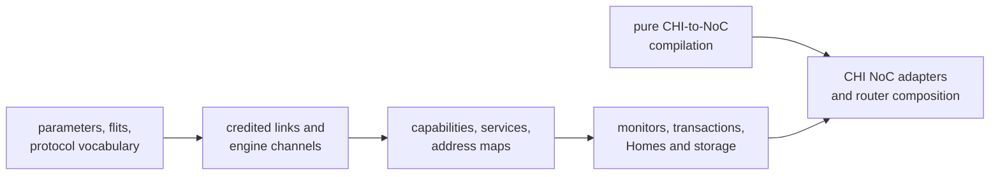

<!-- Guides contributors through extending and validating the standalone AMBA CHI package. -->

# Developing CHI

Read the package [README](README.md) for the public Issue H vocabulary,
protocol layers, endpoint contracts, transaction profiles, and deliberate
limits. This guide owns implementation placement, extension workflow, and
focused validation.

## Architecture and dependency boundary

Keep CHI layered from wire representation toward system composition:



Production `.rhdl` files use the public Rhodium language and libraries rather
than core, frontend, or backend implementation modules. The pure
[`noc/noc-authoring.rhm`](noc/noc-authoring.rhm) bridge may depend on the pure NoC
stack but not Rhodium or CIRCT. Generic topology, routing, validation, and
router machinery remain owned by [`../noc/`](../noc/DEVELOPING.md).
[`check-boundaries.sh`](check-boundaries.sh) enforces these rules.

Production consumers in `devices/`, `cores/`, `socs/`, and `sims/` import the
defining public modules, not `main.rhdl`. Keep endpoint contracts separate from
opt-in monitors, NoC composition, Home engines, and storage implementations at
their use sites. Import protocol-neutral address/transfer types directly from
`rhodium/std/interconnect.rhdl`, even though CHI retains compatibility re-exports.
The facade remains available for convenient external use and compatibility
coverage in `chi/tests/`; do not remove or rename its existing exports.
Use the existing owners before introducing another aggregation layer.

For import-only migrations, check that declarations and RTL bodies are unchanged
apart from namespace qualification. Run affected host contracts, device/cache
behavioral fixtures, and MiniSoC/SimpleSoC/TiledSoC smoke tests for consumers that
span those compositions, with fresh compiled roots. Inspect transitive imports
when claiming narrower loading; a selective name import still loads its module.

## Implementation map

The six production directories express source ownership, not RTL hierarchy.
`protocol/` owns shared wire and endpoint/service contracts; `transactions/`
contains transaction models, checks, retry control, and maintenance.
`home/` and `subordinate/` own their respective engines, `adapters/` owns
transaction-preserving boundary transformations, and `noc/` owns CHI-specific
network integration. Its pure authoring module remains independent of Rhodium.
Keep the public facade and all host tests and authoring fixtures at the package
root and in `tests/`, respectively. Do not duplicate facade modules in each
directory. The boundary audit recursively enumerates production sources while
excluding `tests/`; `bash chi/tests/check-boundaries.sh` covers nested imports,
the pure bridge, and search/enumeration failure propagation.

| Area | Owning modules | Responsibility |
|---|---|---|
| Wire | [`protocol/params.rhdl`](protocol/params.rhdl), [`protocol/flits.rhdl`](protocol/flits.rhdl), [`protocol/protocol.rhdl`](protocol/protocol.rhdl), [`protocol/coherence.rhdl`](protocol/coherence.rhdl) | Physical configuration, packed payloads, packet helpers, and coherent state vocabulary |
| Messages | [`protocol/messages.rhdl`](protocol/messages.rhdl) | Stateless requester write data, subordinate/Home responses, and metadata-preserving REQ/DAT transforms; no allocator or endpoint state |
| Shared Home support | [`home/home-common.rhdl`](home/home-common.rhdl) | HN-F configuration, placement validation, runtime identity, request legality, and Home-specific message policy; no state machine |
| Home snoop targets | [`home/home-snoop-targets.rhdl`](home/home-snoop-targets.rhdl) | Pending-target mask, priority selection, accepted-target removal, and remembered responder NodeID; no response sequencing |
| Single-beat devices | [`subordinate/single-beat-subordinate.rhdl`](subordinate/single-beat-subordinate.rhdl) | One-outstanding MMIO sequencing, saved request/read snapshot, common write association, and response backpressure |
| Shared memory control | [`subordinate/memory-controller.rhdl`](subordinate/memory-controller.rhdl) | Memory configuration and identity, multibeat transaction sequencing, response arbitration, and request/data checks; no storage backend |
| Endpoint and service | [`protocol/link.rhdl`](protocol/link.rhdl), [`protocol/channels.rhdl`](protocol/channels.rhdl), [`protocol/fabric.rhdl`](protocol/fabric.rhdl) | Credited links, ready-valid engine boundaries, capabilities, services, and address maps |
| Checking and control | [`transactions/monitor.rhdl`](transactions/monitor.rhdl), [`transactions/transaction.rhdl`](transactions/transaction.rhdl), [`transactions/coherent-transaction.rhdl`](transactions/coherent-transaction.rhdl), [`transactions/retryable-transaction.rhdl`](transactions/retryable-transaction.rhdl) | Link assertions, bounded transaction checks, and reusable retry association |
| Homes and storage | [`subordinate/subordinate-slots.rhdl`](subordinate/subordinate-slots.rhdl), [`home/home.rhdl`](home/home.rhdl), [`home/coherent-home.rhdl`](home/coherent-home.rhdl), [`home/inclusive-home.rhdl`](home/inclusive-home.rhdl), [`subordinate/ram.rhdl`](subordinate/ram.rhdl), [`subordinate/dpi-memory.rhdl`](subordinate/dpi-memory.rhdl), [`adapters/transfer-fragmenter.rhdl`](adapters/transfer-fragmenter.rhdl), [`adapters/address-projector.rhdl`](adapters/address-projector.rhdl) | Transaction allocation, Home engines, backing memory, fragmentation, and address projection |
| NoC | [`noc/noc-authoring.rhm`](noc/noc-authoring.rhm), [`noc/noc-adapter.rhdl`](noc/noc-adapter.rhdl), [`noc/noc-router.rhdl`](noc/noc-router.rhdl) | Logical connections, validated channel plans, adapters, and router-family composition |
| Facade | [`main.rhdl`](main.rhdl) | Public exports for the supported package surface |
| Cache maintenance | [`transactions/cache-maintenance.rhdl`](transactions/cache-maintenance.rhdl) | One dataless requester composed with retry control; cache arrays and downstream completion remain Home-owned |
| Host coverage | [`tests/`](tests/) | Protocol models, parameters, routing plans, and invalid connections |
| Backend coverage | [`../tests/backend/`](../tests/backend/DEVELOPING.md#fixture-and-artifact-ownership) | CIRCT fixtures and Verilator benches |

## Extend a protocol layer

Component-specific mechanisms and validation live with their owners:

- [subordinate](subordinate/DEVELOPING.md)
- [noc](noc/DEVELOPING.md)
- [transactions](transactions/DEVELOPING.md)
- [protocol](protocol/DEVELOPING.md)
- [adapters](adapters/DEVELOPING.md)
- [home](home/DEVELOPING.md)

1. Confirm the behavior's owner: physical field, packet helper, link contract,
   service/capability description, monitor, transaction engine, storage
   adapter, or CHI-to-NoC mapping.
2. Add packed fields and enums at the wire layer before consuming them above.
   Keep opcode-dependent interpretation explicit rather than pretending an
   overlapping field has one universal semantic type.
3. State accepted and emitted capabilities at endpoint boundaries. A monitor
   may check only the profile advertised by its endpoint; an enum entry alone
   does not imply engine support.
4. Preserve per-channel independence and exact credit accounting. Keep retry,
   DataID, DBID, CompAck, snoop, and dirty-data obligations in their owning
   transaction state machine.
5. Compile CHI relationships through the pure NoC bridge, then consume only
   validated route and family plans in RTL. Generic physical-slot binding and
   unused-local closure belong in `noc/rtl/router.rhdl`; CHI owns channel-plane
   attachment policy, not another copy of those router mechanics.
6. Add host coverage for pure protocol/configuration behavior and intentional
   invalid connections. Test observable hardware behavior in a backend fixture;
   do not duplicate it with internal-shape assertions. Update
   [README.md](README.md) when the supported public profile changes.

## Focused validation

Run host-side CHI checks and invalid-connection fixtures from the repository
root:

```sh
make chi-test
```

This target includes package-boundary checking, every
`chi/tests/*-test.rhm` host test, and the negative cases under
[`tests/invalid/`](tests/invalid/). Use `tools/run-racket-tests.sh` for one host
file so it receives a fresh compiled root. Do not add a host test merely to
inspect a component's elaborated shape.

The backend protocol group covers CHI flit, link, monitor, transaction, Home,
RAM, NoC, router, and fragmenter paths:

```sh
bash tests/backend/run-circt.sh --group protocols
```

That group also includes nearby NoC and device fixtures. Use the backend test
[`DEVELOPING.md`](../tests/backend/DEVELOPING.md) to select narrower modes and
maintain checked-in artifacts.
