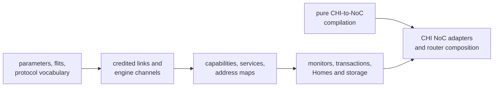

<!-- Guides contributors through extending and validating the standalone AMBA CHI package. -->

# Developing CHI

Read the package [README](README.md) for the public Issue H vocabulary,
protocol layers, endpoint contracts, transaction profiles, and deliberate
limits. This guide owns implementation placement, extension workflow, and
focused validation.

## Architecture and dependency boundary

Keep CHI layered from wire representation toward system composition:



Production `.rhdl` files use the public Rhodium language and libraries rather
than core, frontend, or backend implementation modules. The pure
[`noc-authoring.rhm`](noc-authoring.rhm) bridge may depend on the pure NoC
stack but not Rhodium or CIRCT. Generic topology, routing, validation, and
router machinery remain owned by [`../noc/`](../noc/DEVELOPING.md).
[`check-boundaries.sh`](check-boundaries.sh) enforces these rules.

## Implementation map

| Area | Owning modules | Responsibility |
|---|---|---|
| Wire | [`params.rhdl`](params.rhdl), [`flits.rhdl`](flits.rhdl), [`protocol.rhdl`](protocol.rhdl), [`coherence.rhdl`](coherence.rhdl) | Physical configuration, packed payloads, packet helpers, and coherent state vocabulary |
| Endpoint and service | [`link.rhdl`](link.rhdl), [`channels.rhdl`](channels.rhdl), [`fabric.rhdl`](fabric.rhdl) | Credited links, ready-valid engine boundaries, capabilities, services, and address maps |
| Checking and control | [`monitor.rhdl`](monitor.rhdl), [`transaction.rhdl`](transaction.rhdl), [`coherent-transaction.rhdl`](coherent-transaction.rhdl), [`retryable-transaction.rhdl`](retryable-transaction.rhdl) | Link assertions, bounded transaction checks, and reusable retry association |
| Homes and storage | [`subordinate-slots.rhdl`](subordinate-slots.rhdl), [`home.rhdl`](home.rhdl), [`coherent-home.rhdl`](coherent-home.rhdl), [`inclusive-home.rhdl`](inclusive-home.rhdl), [`ram.rhdl`](ram.rhdl), [`dpi-memory.rhdl`](dpi-memory.rhdl), [`transfer-fragmenter.rhdl`](transfer-fragmenter.rhdl), [`address-projector.rhdl`](address-projector.rhdl) | Transaction allocation, Home engines, backing memory, fragmentation, and address projection |
| NoC | [`noc-authoring.rhm`](noc-authoring.rhm), [`noc-adapter.rhdl`](noc-adapter.rhdl), [`noc-router.rhdl`](noc-router.rhdl) | Logical connections, validated channel plans, adapters, and router-family composition |
| Facade | [`main.rhdl`](main.rhdl) | Public exports for the supported package surface |
| Cache maintenance | [`cache-maintenance.rhdl`](cache-maintenance.rhdl) | One dataless requester composed with retry control; cache arrays and downstream completion remain Home-owned |
| Host coverage | [`tests/`](tests/) | Protocol models, parameters, routing plans, and invalid connections |
| Backend coverage | [`../tests/backend/`](../tests/backend/DEVELOPING.md#fixture-and-artifact-ownership) | CIRCT fixtures and Verilator benches |

## Extend a protocol layer

Packet position and naturally aligned, unelided transfer packet sets belong in
`protocol.rhdl`, below both engines and monitors. Use its address-aware helpers
for RAM/DPI addressing and requester, subordinate, Home, and refill logic; do
not introduce node-role-specific DataID renumbering. Each engine and monitor
keeps its own receipt state and checks duplicate/unexpected packets. The
`chi-packets` backend fixture compares all three bus widths with independent
byte-enumeration expectations and runs RV5Stage write constructors through DAT
monitoring; RAM and fragmenter fixtures cover storage and multibeat retirement.

1. Confirm the behavior's owner: physical field, packet helper, link contract,
   service/capability description, monitor, transaction engine, storage
   adapter, or CHI-to-NoC mapping.
2. Add packed fields and enums at the wire layer before consuming them above.
   Keep opcode-dependent interpretation explicit rather than pretending an
   overlapping field has one universal semantic type.
3. State accepted and emitted capabilities at endpoint boundaries. A monitor
   may check only the profile advertised by its endpoint; an enum entry alone
   does not imply engine support.
4. Preserve per-channel independence and exact credit accounting. Keep retry,
   DataID, DBID, CompAck, snoop, and dirty-data obligations in their owning
   transaction state machine.
5. Compile CHI relationships through the pure NoC bridge, then consume only
   validated route and family plans in RTL.
6. Add host coverage for pure protocol/configuration behavior and intentional
   invalid connections. Test observable hardware behavior in a backend fixture;
   do not duplicate it with internal-shape assertions. Update
   [README.md](README.md) when the supported public profile changes.

## Focused validation

Run host-side CHI checks and invalid-connection fixtures from the repository
root:

```sh
make chi-test
```

This target includes package-boundary checking, every
`chi/tests/*-test.rhm` host test, and the negative cases under
[`tests/invalid/`](tests/invalid/). Use `tools/run-racket-tests.sh` for one host
file so it receives a fresh compiled root. Do not add a host test merely to
inspect a component's elaborated shape.

The backend protocol group covers CHI flit, link, monitor, transaction, Home,
RAM, NoC, router, and fragmenter paths:

```sh
bash tests/backend/run-circt.sh --group protocols
```

That group also includes nearby NoC and device fixtures. Use the backend test
[`DEVELOPING.md`](../tests/backend/DEVELOPING.md) to select narrower modes and
maintain checked-in artifacts.

For maintenance changes, run the `chi-cache-maintenance`,
`chi-maintenance-home`, and `chi-maintenance-inclusive` backend fixtures. The
last two share a behavioral bench with independent RN-F caches and backing
RAM, rather than using coherent reads as evidence of memory visibility.
Include `chi-coherent-home`, `chi-inclusive-home`, and `rv5stage-dcache` when
changing the data-preserving versus discard snoop policy. Shared opcode
classification stays in `coherence.rhdl`; each Home retains its own SRAM,
transaction, and dirty-data lifetime. Maintain error state until completion.
