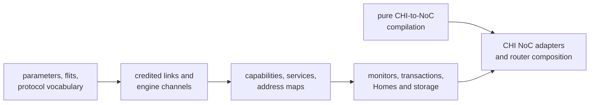

<!-- Guides contributors through extending and validating the standalone AMBA CHI package. -->

# Developing CHI

Read the package [README](README.md) for the public Issue H vocabulary,
protocol layers, endpoint contracts, transaction profiles, and deliberate
limits. This guide owns implementation placement, extension workflow, and
focused validation.

## Architecture and dependency boundary

Keep CHI layered from wire representation toward system composition:



Production `.rhdl` files use the public Rhodium language and libraries rather
than core, frontend, or backend implementation modules. The pure
[`noc/noc-authoring.rhm`](noc/noc-authoring.rhm) bridge may depend on the pure NoC
stack but not Rhodium or CIRCT. Generic topology, routing, validation, and
router machinery remain owned by [`../noc/`](../noc/DEVELOPING.md).
[`check-boundaries.sh`](check-boundaries.sh) enforces these rules.

Production consumers in `devices/`, `cores/`, `socs/`, and `sims/` import the
defining public modules, not `main.rhdl`. Keep endpoint contracts separate from
opt-in monitors, NoC composition, Home engines, and storage implementations at
their use sites. Import protocol-neutral address/transfer types directly from
`rhodium/std/interconnect.rhdl`, even though CHI retains compatibility re-exports.
The facade remains available for convenient external use and compatibility
coverage in `chi/tests/`; do not remove or rename its existing exports.
Use the existing owners before introducing another aggregation layer.

For import-only migrations, check that declarations and RTL bodies are unchanged
apart from namespace qualification. Run affected host contracts, device/cache
behavioral fixtures, and MiniSoC/SimpleSoC/TiledSoC smoke tests for consumers that
span those compositions, with fresh compiled roots. Inspect transitive imports
when claiming narrower loading; a selective name import still loads its module.

## Implementation map

The six production directories express source ownership, not RTL hierarchy.
`protocol/` owns shared wire and endpoint/service contracts; `transactions/`
contains transaction models, checks, retry control, and maintenance.
`home/` and `subordinate/` own their respective engines, `adapters/` owns
transaction-preserving boundary transformations, and `noc/` owns CHI-specific
network integration. Its pure authoring module remains independent of Rhodium.
Keep the public facade and all host tests and authoring fixtures at the package
root and in `tests/`, respectively. Do not duplicate facade modules in each
directory. The boundary audit recursively enumerates production sources while
excluding `tests/`; `bash chi/tests/check-boundaries.sh` covers nested imports,
the pure bridge, and search/enumeration failure propagation.

| Area | Owning modules | Responsibility |
|---|---|---|
| Wire | [`protocol/params.rhdl`](protocol/params.rhdl), [`protocol/flits.rhdl`](protocol/flits.rhdl), [`protocol/protocol.rhdl`](protocol/protocol.rhdl), [`protocol/coherence.rhdl`](protocol/coherence.rhdl) | Physical configuration, packed payloads, packet helpers, and coherent state vocabulary |
| Messages | [`protocol/messages.rhdl`](protocol/messages.rhdl) | Stateless requester write data, subordinate/Home responses, and metadata-preserving REQ/DAT transforms; no allocator or endpoint state |
| Shared Home support | [`home/home-common.rhdl`](home/home-common.rhdl) | HN-F configuration, placement validation, runtime identity, request legality, and Home-specific message policy; no state machine |
| Home snoop targets | [`home/home-snoop-targets.rhdl`](home/home-snoop-targets.rhdl) | Pending-target mask, priority selection, accepted-target removal, and remembered responder NodeID; no response sequencing |
| Single-beat devices | [`subordinate/single-beat-subordinate.rhdl`](subordinate/single-beat-subordinate.rhdl) | One-outstanding MMIO sequencing, saved request/read snapshot, common write association, and response backpressure |
| Shared memory control | [`subordinate/memory-controller.rhdl`](subordinate/memory-controller.rhdl) | Memory configuration and identity, multibeat transaction sequencing, response arbitration, and request/data checks; no storage backend |
| Endpoint and service | [`protocol/link.rhdl`](protocol/link.rhdl), [`protocol/channels.rhdl`](protocol/channels.rhdl), [`protocol/fabric.rhdl`](protocol/fabric.rhdl) | Credited links, ready-valid engine boundaries, capabilities, services, and address maps |
| Checking and control | [`transactions/monitor.rhdl`](transactions/monitor.rhdl), [`transactions/transaction.rhdl`](transactions/transaction.rhdl), [`transactions/coherent-transaction.rhdl`](transactions/coherent-transaction.rhdl), [`transactions/retryable-transaction.rhdl`](transactions/retryable-transaction.rhdl) | Link assertions, bounded transaction checks, and reusable retry association |
| Homes and storage | [`subordinate/subordinate-slots.rhdl`](subordinate/subordinate-slots.rhdl), [`home/home.rhdl`](home/home.rhdl), [`home/coherent-home.rhdl`](home/coherent-home.rhdl), [`home/inclusive-home.rhdl`](home/inclusive-home.rhdl), [`subordinate/ram.rhdl`](subordinate/ram.rhdl), [`subordinate/dpi-memory.rhdl`](subordinate/dpi-memory.rhdl), [`adapters/transfer-fragmenter.rhdl`](adapters/transfer-fragmenter.rhdl), [`adapters/address-projector.rhdl`](adapters/address-projector.rhdl) | Transaction allocation, Home engines, backing memory, fragmentation, and address projection |
| NoC | [`noc/noc-authoring.rhm`](noc/noc-authoring.rhm), [`noc/noc-adapter.rhdl`](noc/noc-adapter.rhdl), [`noc/noc-router.rhdl`](noc/noc-router.rhdl) | Logical connections, validated channel plans, adapters, and router-family composition |
| Facade | [`main.rhdl`](main.rhdl) | Public exports for the supported package surface |
| Cache maintenance | [`transactions/cache-maintenance.rhdl`](transactions/cache-maintenance.rhdl) | One dataless requester composed with retry control; cache arrays and downstream completion remain Home-owned |
| Host coverage | [`tests/`](tests/) | Protocol models, parameters, routing plans, and invalid connections |
| Backend coverage | [`../tests/backend/`](../tests/backend/DEVELOPING.md#fixture-and-artifact-ownership) | CIRCT fixtures and Verilator benches |

## Extend a protocol layer

`subordinate/memory-controller.rhdl` owns the common `CHIRamConfig`, `CHIRamParams`,
`CHIRamIdentity`, operation/completion payloads, and `build_chi_ram_controller`.
`subordinate/ram.rhdl` owns only the `SyncRam1RW` backend and re-exports the shared bindings
for existing importers. `subordinate/dpi-memory.rhdl` imports the controller directly and
owns the DPI ABI, access enable/reset policy, and model-status assertion.
The facade imports shared configuration from its owner, not through SRAM.

Keep the controller as an elaboration helper, not a wrapper circuit or a new
public memory protocol. Its backend factory runs once in the caller's module
and returns the binder for nonstallable issue/completion flows. Preserve the
operation metadata and ordering on every completion. Both current backends
complete one cycle after issue; `CompletionQueue` owns capacity reservations
and downstream backpressure. Storage and DPI policy remain backend-owned.
Static configuration checks run in the shared constructors; request alignment,
range, mask, and poison assertions remain runtime controller checks. Do not
repeat constructor invariants in either concrete memory circuit.

For memory-controller changes, run the RAM configuration and DPI ABI host tests,
`chi-ram` simulation and its expected invalid-request assertion, the native DPI
memory test, and MiniSoC/SimpleSoC smoke tests. These cover the SRAM and DPI
consumers without adding tests of incidental hierarchy or internal instance counts.

NoC adapters share injection wiring and flow-stage bookkeeping in
`noc/noc-adapter.rhdl`, and reuse generic envelope-removal binding from
`noc/rtl/route-adapter.rhdl`. Keep the typed channel circuits and fixed
versus family-site factories explicit. REQ/RSP/DAT select `tgt_id`; SNP selects
`CHISnoopDispatch.target_id` and transports only its flit. Ejection checks remain
channel-owned because SNP has no target field. These helpers add no hierarchy,
buffering, or route policy beyond the existing `noc/rtl` injector/ejector.
The `chi-noc-adapter` backend fixture covers all sixteen variants, complete
payloads, stalls, and invalid routes, targets, and family sites. Its host test
checks the transform kinds, fixed NodeID properties, and implementation
associations consumed by diagram/event tooling. Run the SNP, subordinate,
family NoC, and router-composition integration fixtures alongside it.

Endpoint attachment policy lives in `CHINoCPlane` in `noc/noc-adapter.rhdl`.
Both fixed connection helpers and `CHIRouter`'s family attachments use its
injection and queued-ejection methods; keep the RN/HN/SN field mappings and
fixed versus family adapter choices explicit at their callers. The one-entry
queue precedes the ejection adapter, and router availability tracks its input
readiness, not the final sink. `CHINoCPorts` groups existing plane endpoints for
fixed-router callers without introducing circuit parameters, ports, or hierarchy.
Generic physical-link binding remains in `noc/rtl`, outside this CHI queue policy.
The SN fixture exercises fixed attachments in both directions under stalls;
the family fixture fills, stalls, and drains an asymmetric three-router path
with complete-packet ordering checks. Validate MiniSoC and SimpleSoC for fixed
RN-F/HN attachments and TiledSoC for coherent family attachments.

Monitoring attachments in `transactions/monitor.rhdl` separate credited transport checks,
shared packet checks, and accepted-event transaction attachment. Both credited
and ready-valid wrappers call the same coverage validation and transaction
entry points. Keep coverage derived from the actual capabilities and delivered
checker behavior, not a separate profile field. Reject requested coverage
that would otherwise leave an advertised transaction class unchecked.
Private transaction-checker circuits isolate state and register names when
multiple attachments observe independent endpoints or the same event stream.
Ready-valid attachment checks explicit endpoint metadata using the same
`endpoint_pair_legal` predicate as link compatibility. It does not change
the channel's wire schema or infer peer metadata from arbitrary wiring.

Packet checkers take the concrete parameterized flit rather than a parallel
list of its fields. Identity selection remains explicit at each attachment;
credited calls use valid while ready-valid calls use accepted transfers.
Do not change activation, credit state, assertion labels, or transaction
coverage during packet-API cleanup. Internal non-coherent transaction tables
use typed zero literals for their Free state, matching coherent tables;
allocation and progression remain explicit record construction/updates.

The `chi-transaction`, `chi-transaction-sn`, and `chi-coherent` fixtures
mirror credited events through ready-valid attachments. The
`chi-channel-monitor` fixture checks stalls, reset, and retirement from both
requester and subordinate viewpoints; its negative cases check accepted
duplicate TxnIDs, wrong identity, and early DAT. Host
`tests/channel-monitor-test.rhm` checks incompatible contracts, unsupported
requested coverage, and explicit opt-out. Keep transport activation tests
in `chi-monitor`.

`CHISingleBeatSubordinate` owns the shared five-phase MMIO transaction lifetime.
Its port remains `CHISNChannels`; devices forward their native port directly.
Device policy supplies request acceptance, the combinational read snapshot,
extra write legality, and write readiness. The engine's acceptance pulses are
edge events, not a second memory protocol. Do not feed acceptance back into its
own readiness predicate. Devices decode the incoming request for reads and the
retained request for writes. Read side effects occur on request acceptance;
write side effects occur on DAT acceptance, never on completion acceptance.
Snapshot storage and all responses are engine-owned. Keep register masks,
read-to-clear effects, interrupt state, and FIFO backpressure device-owned.

Boot-address, ACLINT, PLIC, and UART16550 all use this engine. Preserve their
existing gating versus assertion-only mask policies; sharing sequencing is
not permission to strengthen protocol checks. BootROM's multibeat read engine
and RAM's queued transactions are separate. Run all four device simulations;
boot-address negatives also exercise the shared association/early-DAT checks.

Exact node-to-ICN peer metadata belongs to `CHINodeParams.icn_peer()` in
`protocol/link.rhdl`. RAM, devices, and SoC compositions derive it there rather than
repeating capability reversal. Home placement parameters derive their
subordinate endpoint from the service; retain separate structural configuration
and runtime identity. Host link and Home tests cover derivation and service
compatibility, while RAM/device/Home simulations cover connected consumers.

Credited link compatibility compares the complete immutable link parameters
structurally, then checks endpoint roles, identity, and capability containment
separately. Keep RN, RN-I, and SN link types distinct. The link host tests
construct independent equal values and vary every credit field and flit width.

Semantic packet construction belongs in `protocol/messages.rhdl`, below transaction
engines. Inclusive-Home cached data reuses the subordinate read builder and
overrides trace tag and coherent response state. Victim DAT reuses the
NonCopyBackWriteData builder and explicitly retains the Home's HomeNID, trace
tag, and QoS. Keep those policy overrides in the Home. Maintenance REQs use
immutable construction with their existing inactive-field defaults; command
PAS/SnoopMe and retry-attempt fields remain maintenance-owned. Run the message,
inclusive-Home, both maintenance-Home, and cache-maintenance fixtures for these
builders; consumer benches compare full packets, not only payloads.

The current RN/SN/Home RSP constructors share `chi_response` for inactive-field
initialization. Keep active routing, opcode, DBID, response-state, error, and QoS
choices in their semantic wrappers. Its zero policy does not apply to every
RSP opcode; forwarding transforms must continue preserving untouched metadata.
Run `chi-messages` and `rv5stage-chi-requests` for complete packet comparisons,
alongside the Home and cache consumer fixtures.

HN-I forwarding also lives in `protocol/messages.rhdl`: immutable REQ/RSP/DAT
updates retain all untouched metadata, including optional fields. HN-I keeps
its own return routing and DBID translation policy rather than inheriting
HN-F field clearing. Historical transaction-module exports remain aliases;
production message consumers import the owner directly.

Bounded capability predicates belong beside `CHIChannelCapabilities` in
`protocol/link.rhdl`; requester and subordinate non-coherent checks use the
same channel sets with reversed directions. These describe supported subsets,
not selectable monitor profiles. Coverage attachment and checker state remain
in `transactions/`. Home configuration must not import a checker just to
validate capabilities.

Home and subordinate maps share a private decode helper in
`protocol/fabric.rhdl`, but retain distinct service validation and nominal
result types. Preserve zero NodeID on misses, including a valid hit on NodeID
zero; construction still rejects overlapping regions. `chi-foundation`
sweeps both hardware maps over region boundaries and sparse holes.

Bank geometry belongs to `StripedAddressLayout` in
`rhodium/std/interconnect.rhdl`. Inclusive Homes and SoCs use it directly.
`CHIAddressProjectorConfig` retains its existing constructor as a CHI-width
validation wrapper with a `layout` property; the adapter owns native-channel
forwarding and runtime base translation, not stripe arithmetic.

Service opcode/encoded-Size matching belongs to `CHIRequestSupport.matches`
in `protocol/fabric.rhdl`. HN-I retains address-map matching; HN-F retains opcode
translation, runtime service base, and maintenance exceptions. Do not conflate
this hardware predicate with host `.supports(opcode, bytes)` queries. The
foundation fixture sweeps all opcodes and encoded sizes across representative
single-size and bounded ranges. HN-I cross-field parameter checks run in
`CHIHNIParams` construction; host negatives must not require circuit elaboration.

The subordinate allocator owns occupancy, DBID association, and packet
receipt state, not response construction. Devices can consume the builders
through `main.rhdl`; RAM imports their owner directly. Keep address maps,
device side effects, and endpoint policy with callers. The `chi-messages`
simulation checks routing, byte masks, payloads, and default fields at all DAT
widths with optional fields enabled and disabled, including repeated calls in
one circuit with distinct inputs. Builders should construct immutable values,
not declare caller-scoped named wires. The read-completion builder's zero
literal expresses only its existing inactive-field policy; it is not a
universal default for other CHI messages.

RV5Stage and FESVR share `chi_rn_write_data` construction through the facade.
Keep their DataID, CCID, and overloaded DBID/MECID field choices in caller
wrappers, alongside data placement and address policy. The message fixture
checks every output bit, including inactive optional fields, across DAT widths;
`chi-packets`, `rv5stage-uncached`, `rv5stage-dcache`, and `fesvr-mmio` cover the
packet rules and engine consumers.

Home REQ/DAT forwarding uses immutable field replacement to retain untouched
metadata, including optional fields. `home/home-common.rhdl` keeps the policy
wrappers that select downstream opcodes, early-write acknowledgement, and
coherent response state; `protocol/messages.rhdl` receives those decisions explicitly.
Both Home implementations import those wrappers directly; neither implementation
imports the other. Shared configuration and identity also live in
`home/home-common.rhdl`. Preserve the existing facade and coherent-Home re-exports
for callers while making new shared consumers import the owning module.
Keep LLC lookup, replacement, dirty-data ownership, and retirement in their
respective engines rather than adding modes to one shared state machine.

Both Homes instantiate `CHIHomeSnoopTargets` from its owning module. This small
child circuit shares the Home's clock/reset and replaces only the pending-mask
and expected-responder registers; it adds no snoop-payload buffer or pipeline
stage. Each Home computes its target mask, constructs the snoop, and gates
`target.ready` with its own issue phase and SNP sink readiness. That handshake
must coincide with the outgoing snoop handshake. In particular, a pending
target must not advance while the Home is processing the previous responder's
control, dirty data, or intervention write. Keep receipt masks and completion
decisions in the Home engines. Mask loading and dispatch are phase-exclusive
in both callers. Run both Home fixtures and both maintenance fixtures when
changing this bookkeeping; the shared maintenance bench checks target order,
stalled dispatch stability, and reset before and after a dispatch.

`CHIInclusiveHNF` owns `resident_lines`, indexed by LLC set/way and configured
RN-F order. Keep the absence invariant separate from LLC dirty state and from
`chi_request_allocates_coherent`, whose opcode family includes non-allocating
`WriteUniquePtl`. A successful final read-data transfer publishes a possible
cached copy before the serialized Home can accept another request; CompAck
still owns transaction completion when requested. Only complete successful
snoop responses may remove a responder. Track retained/error state across all
dirty packets, and keep a failed victim invalidation from replacing its entry.
Successful line installation starts with an empty directory. Never attach the
old victim's bits to the new tag. Coordinated reset clears LLC and requester
state; independent requester state surviving a Home reset is not supported.

Use `chi-inclusive-home` for residency, shared/unique grants, snapshot reads,
silent-eviction cleanup, stalled dispatch, delayed CompAck, partial dirty packets,
and response-error behavior. The maintenance bench establishes inclusive L1
copies through actual read grants, not test-only injection behind the directory.
Run `chi-maintenance-inclusive`, the I-cache coherence fixtures, and cache-level
LR/SC progress after changing target selection. Rerun SimpleSoC vvadd with
unchanged host polling and inspect `tohost` snoops and pipeline replay counts;
keep correctness and reduced traffic distinct from a cycle-count prediction.

The message constructor fixture compares complete transformed packets at every DAT
width, with optional REQ/DAT metadata enabled and disabled. Run it alongside
both Home and maintenance fixtures when changing these transforms. Snoop and
intervention-write packet construction lives in `protocol/messages.rhdl`; its callers
choose opcode, address override, transaction identity, and early-write-ack policy.
The builders preserve the existing zero policy for inactive optional fields
and return immutable values, so repeated calls do not allocate colliding wires.

Packet position and naturally aligned, unelided transfer packet sets belong in
`protocol/protocol.rhdl`, below both engines and monitors. Use its address-aware helpers
for RAM/DPI addressing and requester, subordinate, Home, and refill logic; do
not introduce node-role-specific DataID renumbering. Each engine and monitor
keeps its own receipt state and checks duplicate/unexpected packets. The
`chi-packets` backend fixture compares all three bus widths with independent
byte-enumeration expectations and runs RV5Stage write constructors through DAT
monitoring; RAM and fragmenter fixtures cover storage and multibeat retirement.

Fragmenter DAT/RSP translations stay private to `adapters/transfer-fragmenter.rhdl` and
use immutable field replacement. DAT forwarding clears `replicate` and `num_dat`
and substitutes the child TxnID; completion forwarding restores the parent
DBID. Preserve every other field, including optional metadata, without copying
the flit schema. Run `chi-fragmenter-metadata` for complete-packet comparisons
at all DAT widths with options enabled/disabled, reverse-order input packets,
distinct child DBIDs, and stalled requests/data/responses. Its randomized
metadata checks transparency, not additional protocol-profile support. Keep
`chi-transfer-fragmenter` for the RAM-backed write/read behavior and the host
fragmenter test for service configuration and invalid transfer limits.

1. Confirm the behavior's owner: physical field, packet helper, link contract,
   service/capability description, monitor, transaction engine, storage
   adapter, or CHI-to-NoC mapping.
2. Add packed fields and enums at the wire layer before consuming them above.
   Keep opcode-dependent interpretation explicit rather than pretending an
   overlapping field has one universal semantic type.
3. State accepted and emitted capabilities at endpoint boundaries. A monitor
   may check only the profile advertised by its endpoint; an enum entry alone
   does not imply engine support.
4. Preserve per-channel independence and exact credit accounting. Keep retry,
   DataID, DBID, CompAck, snoop, and dirty-data obligations in their owning
   transaction state machine.
5. Compile CHI relationships through the pure NoC bridge, then consume only
   validated route and family plans in RTL. Generic physical-slot binding and
   unused-local closure belong in `noc/rtl/router.rhdl`; CHI owns channel-plane
   attachment policy, not another copy of those router mechanics.
6. Add host coverage for pure protocol/configuration behavior and intentional
   invalid connections. Test observable hardware behavior in a backend fixture;
   do not duplicate it with internal-shape assertions. Update
   [README.md](README.md) when the supported public profile changes.

## Focused validation

Run host-side CHI checks and invalid-connection fixtures from the repository
root:

```sh
make chi-test
```

This target includes package-boundary checking, every
`chi/tests/*-test.rhm` host test, and the negative cases under
[`tests/invalid/`](tests/invalid/). Use `tools/run-racket-tests.sh` for one host
file so it receives a fresh compiled root. Do not add a host test merely to
inspect a component's elaborated shape.

The backend protocol group covers CHI flit, link, monitor, transaction, Home,
RAM, NoC, router, and fragmenter paths:

```sh
bash tests/backend/run-circt.sh --group protocols
```

That group also includes nearby NoC and device fixtures. Use the backend test
[`DEVELOPING.md`](../tests/backend/DEVELOPING.md) to select narrower modes and
maintain checked-in artifacts.

For maintenance changes, run the `chi-cache-maintenance`,
`chi-maintenance-home`, and `chi-maintenance-inclusive` backend fixtures. The
last two share a behavioral bench with independent RN-F caches and backing
RAM, rather than using coherent reads as evidence of memory visibility.
Include `chi-coherent-home`, `chi-inclusive-home`, and `rv5stage-dcache` when
changing the data-preserving versus discard snoop policy. Shared opcode
classification stays in `protocol/coherence.rhdl`; each Home retains its own SRAM,
transaction, and dirty-data lifetime. Maintain error state until completion.
