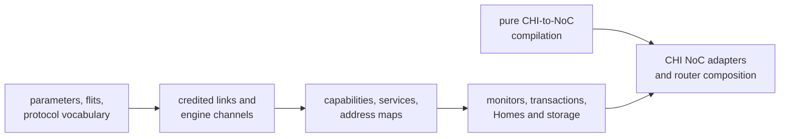

<!-- Guides contributors through extending and validating the standalone AMBA CHI package. -->

# Developing CHI

Read the package [README](README.md) for the public Issue H vocabulary,
protocol layers, endpoint contracts, transaction profiles, and deliberate
limits. This guide owns implementation placement, extension workflow, and
focused validation.

## Architecture and dependency boundary

Keep CHI layered from wire representation toward system composition:



Production `.rhdl` files use the public Rhodium language and libraries rather
than core, frontend, or backend implementation modules. The pure
[`noc-authoring.rhm`](noc-authoring.rhm) bridge may depend on the pure NoC
stack but not Rhodium or CIRCT. Generic topology, routing, validation, and
router machinery remain owned by [`../noc/`](../noc/DEVELOPING.md).
[`check-boundaries.sh`](check-boundaries.sh) enforces these rules.

## Implementation map

| Area | Owning modules | Responsibility |
|---|---|---|
| Wire | [`params.rhdl`](params.rhdl), [`flits.rhdl`](flits.rhdl), [`protocol.rhdl`](protocol.rhdl), [`coherence.rhdl`](coherence.rhdl) | Physical configuration, packed payloads, packet helpers, and coherent state vocabulary |
| Messages | [`messages.rhdl`](messages.rhdl) | Stateless requester write data, subordinate/Home responses, and metadata-preserving REQ/DAT transforms; no allocator or endpoint state |
| Shared Home support | [`home-common.rhdl`](home-common.rhdl) | HN-F configuration, placement validation, runtime identity, request legality, and Home-specific message policy; no state machine |
| Single-beat devices | [`single-beat-subordinate.rhdl`](single-beat-subordinate.rhdl) | One-outstanding MMIO sequencing, saved request/read snapshot, common write association, and response backpressure |
| Endpoint and service | [`link.rhdl`](link.rhdl), [`channels.rhdl`](channels.rhdl), [`fabric.rhdl`](fabric.rhdl) | Credited links, ready-valid engine boundaries, capabilities, services, and address maps |
| Checking and control | [`monitor.rhdl`](monitor.rhdl), [`transaction.rhdl`](transaction.rhdl), [`coherent-transaction.rhdl`](coherent-transaction.rhdl), [`retryable-transaction.rhdl`](retryable-transaction.rhdl) | Link assertions, bounded transaction checks, and reusable retry association |
| Homes and storage | [`subordinate-slots.rhdl`](subordinate-slots.rhdl), [`home.rhdl`](home.rhdl), [`coherent-home.rhdl`](coherent-home.rhdl), [`inclusive-home.rhdl`](inclusive-home.rhdl), [`ram.rhdl`](ram.rhdl), [`dpi-memory.rhdl`](dpi-memory.rhdl), [`transfer-fragmenter.rhdl`](transfer-fragmenter.rhdl), [`address-projector.rhdl`](address-projector.rhdl) | Transaction allocation, Home engines, backing memory, fragmentation, and address projection |
| NoC | [`noc-authoring.rhm`](noc-authoring.rhm), [`noc-adapter.rhdl`](noc-adapter.rhdl), [`noc-router.rhdl`](noc-router.rhdl) | Logical connections, validated channel plans, adapters, and router-family composition |
| Facade | [`main.rhdl`](main.rhdl) | Public exports for the supported package surface |
| Cache maintenance | [`cache-maintenance.rhdl`](cache-maintenance.rhdl) | One dataless requester composed with retry control; cache arrays and downstream completion remain Home-owned |
| Host coverage | [`tests/`](tests/) | Protocol models, parameters, routing plans, and invalid connections |
| Backend coverage | [`../tests/backend/`](../tests/backend/DEVELOPING.md#fixture-and-artifact-ownership) | CIRCT fixtures and Verilator benches |

## Extend a protocol layer

Monitoring attachments in `monitor.rhdl` separate credited transport checks,
shared packet checks, and accepted-event transaction attachment. Both credited
and ready-valid wrappers call the same coverage validation and transaction
entry points. Keep coverage derived from the actual capabilities and delivered
checker behavior, not a separate profile field. Reject requested coverage
that would otherwise leave an advertised transaction class unchecked.
Private transaction-checker circuits isolate state and register names when
multiple attachments observe independent endpoints or the same event stream.
Ready-valid attachment checks explicit endpoint metadata using the same
`endpoint_pair_legal` predicate as link compatibility. It does not change
the channel's wire schema or infer peer metadata from arbitrary wiring.

The `chi-transaction`, `chi-transaction-sn`, and `chi-coherent` fixtures
mirror credited events through ready-valid attachments. The
`chi-channel-monitor` fixture checks stalls, reset, and retirement from both
requester and subordinate viewpoints; its negative cases check accepted
duplicate TxnIDs, wrong identity, and early DAT. Host
`tests/channel-monitor-test.rhm` checks incompatible contracts, unsupported
requested coverage, and explicit opt-out. Keep transport activation tests
in `chi-monitor`.

`CHISingleBeatSubordinate` owns the shared five-phase MMIO transaction lifetime.
Its port remains `CHISNChannels`; devices forward their native port directly.
Device policy supplies request acceptance, the combinational read snapshot,
extra write legality, and write readiness. The engine's acceptance pulses are
edge events, not a second memory protocol. Do not feed acceptance back into its
own readiness predicate. Devices decode the incoming request for reads and the
retained request for writes. Read side effects occur on request acceptance;
write side effects occur on DAT acceptance, never on completion acceptance.
Snapshot storage and all responses are engine-owned. Keep register masks,
read-to-clear effects, interrupt state, and FIFO backpressure device-owned.

Boot-address, ACLINT, PLIC, and UART16550 all use this engine. Preserve their
existing gating versus assertion-only mask policies; sharing sequencing is
not permission to strengthen protocol checks. BootROM's multibeat read engine
and RAM's queued transactions are separate. Run all four device simulations;
boot-address negatives also exercise the shared association/early-DAT checks.

Exact node-to-ICN peer metadata belongs to `CHINodeParams.icn_peer()` in
`link.rhdl`. RAM, devices, and SoC compositions derive it there rather than
repeating capability reversal. Home placement parameters derive their
subordinate endpoint from the service; retain separate structural configuration
and runtime identity. Host link and Home tests cover derivation and service
compatibility, while RAM/device/Home simulations cover connected consumers.

Semantic packet construction belongs in `messages.rhdl`, below transaction
engines. The subordinate allocator owns occupancy, DBID association, and packet
receipt state, not response construction. Devices can consume the builders
through `main.rhdl`; RAM imports their owner directly. Keep address maps,
device side effects, and endpoint policy with callers. The `chi-messages`
simulation checks routing, byte masks, payloads, and default fields at all DAT
widths with optional fields enabled and disabled, including repeated calls in
one circuit with distinct inputs. Builders should construct immutable values,
not declare caller-scoped named wires. The read-completion builder's zero
literal expresses only its existing inactive-field policy; it is not a
universal default for other CHI messages.

RV5Stage and FESVR share `chi_rn_write_data` construction through the facade.
Keep their DataID, CCID, and overloaded DBID/MECID field choices in caller
wrappers, alongside data placement and address policy. The message fixture
checks every output bit, including inactive optional fields, across DAT widths;
`chi-packets`, `rv5stage-uncached`, `rv5stage-dcache`, and `fesvr-mmio` cover the
packet rules and engine consumers.

Home REQ/DAT forwarding uses immutable field replacement to retain untouched
metadata, including optional fields. `home-common.rhdl` keeps the policy
wrappers that select downstream opcodes, early-write acknowledgement, and
coherent response state; `messages.rhdl` receives those decisions explicitly.
Both Home implementations import those wrappers directly; neither implementation
imports the other. Shared configuration and identity also live in
`home-common.rhdl`. Preserve the existing facade and coherent-Home re-exports
for callers while making new shared consumers import the owning module.
Keep LLC lookup, replacement, dirty-data ownership, and retirement in their
respective engines rather than adding modes to one shared state machine.
The constructor fixture compares complete transformed packets at every DAT
width, with optional REQ/DAT metadata enabled and disabled. Run it alongside
both Home and maintenance fixtures when changing these transforms. Snoop and
intervention-write packet construction lives in `messages.rhdl`; its callers
choose opcode, address override, transaction identity, and early-write-ack policy.
The builders preserve the existing zero policy for inactive optional fields
and return immutable values, so repeated calls do not allocate colliding wires.

Packet position and naturally aligned, unelided transfer packet sets belong in
`protocol.rhdl`, below both engines and monitors. Use its address-aware helpers
for RAM/DPI addressing and requester, subordinate, Home, and refill logic; do
not introduce node-role-specific DataID renumbering. Each engine and monitor
keeps its own receipt state and checks duplicate/unexpected packets. The
`chi-packets` backend fixture compares all three bus widths with independent
byte-enumeration expectations and runs RV5Stage write constructors through DAT
monitoring; RAM and fragmenter fixtures cover storage and multibeat retirement.

1. Confirm the behavior's owner: physical field, packet helper, link contract,
   service/capability description, monitor, transaction engine, storage
   adapter, or CHI-to-NoC mapping.
2. Add packed fields and enums at the wire layer before consuming them above.
   Keep opcode-dependent interpretation explicit rather than pretending an
   overlapping field has one universal semantic type.
3. State accepted and emitted capabilities at endpoint boundaries. A monitor
   may check only the profile advertised by its endpoint; an enum entry alone
   does not imply engine support.
4. Preserve per-channel independence and exact credit accounting. Keep retry,
   DataID, DBID, CompAck, snoop, and dirty-data obligations in their owning
   transaction state machine.
5. Compile CHI relationships through the pure NoC bridge, then consume only
   validated route and family plans in RTL. Generic physical-slot binding and
   unused-local closure belong in `noc/rtl/router.rhdl`; CHI owns channel-plane
   attachment policy, not another copy of those router mechanics.
6. Add host coverage for pure protocol/configuration behavior and intentional
   invalid connections. Test observable hardware behavior in a backend fixture;
   do not duplicate it with internal-shape assertions. Update
   [README.md](README.md) when the supported public profile changes.

## Focused validation

Run host-side CHI checks and invalid-connection fixtures from the repository
root:

```sh
make chi-test
```

This target includes package-boundary checking, every
`chi/tests/*-test.rhm` host test, and the negative cases under
[`tests/invalid/`](tests/invalid/). Use `tools/run-racket-tests.sh` for one host
file so it receives a fresh compiled root. Do not add a host test merely to
inspect a component's elaborated shape.

The backend protocol group covers CHI flit, link, monitor, transaction, Home,
RAM, NoC, router, and fragmenter paths:

```sh
bash tests/backend/run-circt.sh --group protocols
```

That group also includes nearby NoC and device fixtures. Use the backend test
[`DEVELOPING.md`](../tests/backend/DEVELOPING.md) to select narrower modes and
maintain checked-in artifacts.

For maintenance changes, run the `chi-cache-maintenance`,
`chi-maintenance-home`, and `chi-maintenance-inclusive` backend fixtures. The
last two share a behavioral bench with independent RN-F caches and backing
RAM, rather than using coherent reads as evidence of memory visibility.
Include `chi-coherent-home`, `chi-inclusive-home`, and `rv5stage-dcache` when
changing the data-preserving versus discard snoop policy. Shared opcode
classification stays in `coherence.rhdl`; each Home retains its own SRAM,
transaction, and dirty-data lifetime. Maintain error state until completion.
