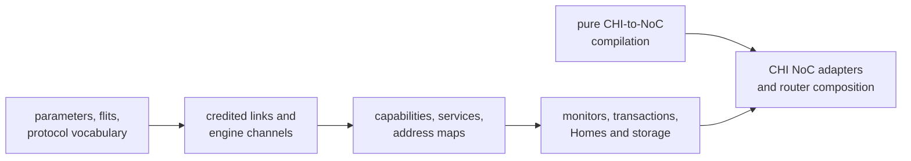

<!-- Guides contributors through extending and validating the standalone AMBA CHI package. -->
<!-- SPDX-License-Identifier: Apache-2.0 -->

# Developing CHI

Read the package [README](README.md) for the public Issue H vocabulary,
protocol layers, endpoint contracts, transaction profiles, and deliberate
limits. This guide owns implementation placement, extension workflow, and
focused validation.

## Architecture and dependency boundary

Keep CHI layered from wire representation toward system composition:


```mermaid
flowchart LR
  Wire["parameters, flits,<br/>protocol vocabulary"] --> Links["credited links and<br/>engine channels"]
  Links --> Services["capabilities, services,<br/>address maps"]
  Services --> Engines["monitors, transactions,<br/>Homes and storage"]
  PureNoC["pure CHI-to-NoC<br/>compilation"] --> Adapters["CHI NoC adapters<br/>and router composition"]
  Engines --> Adapters
```

Production `.rhdl` files use the public Rhodium language and libraries rather
than core, frontend, or backend implementation modules. The pure
[`noc/noc-authoring.rhm`](noc/noc-authoring.rhm) bridge may depend on the pure NoC
stack but not Rhodium or CIRCT. Generic topology, routing, validation, and
router machinery remain owned by [`../noc/`](../noc/DEVELOPING.md).
[`check-boundaries.sh`](check-boundaries.sh) enforces these rules.

Production consumers in `devices/`, `cores/`, `socs/`, and `sims/` import the
defining public modules, not `main.rhdl`. Keep endpoint contracts separate from
opt-in monitors, NoC composition, Home engines, and storage implementations at
their use sites. Import protocol-neutral address/transfer types directly from
`rhodium/std/interconnect.rhdl`, even though CHI retains compatibility re-exports.
The facade remains available for convenient external use and compatibility
coverage in `chi/tests/`; do not remove or rename its existing exports.
Use the existing owners before introducing another aggregation layer.

## Implementation map

The six production directories express source ownership, not RTL hierarchy.
The child guides own file-level maps and local extension rules:

| Directory | Responsibility |
|---|---|
| [`protocol/`](protocol/DEVELOPING.md) | Wire, endpoint, message, capability, and service contracts |
| [`transactions/`](transactions/DEVELOPING.md) | Monitoring, transaction checks, retry control, and requester engines |
| [`home/`](home/DEVELOPING.md) | Noncaching and inclusive Home engines and their shared policy |
| [`subordinate/`](subordinate/DEVELOPING.md) | Device sequencing and memory controller/storage backends |
| [`adapters/`](adapters/DEVELOPING.md) | Transaction-preserving fragmentation and address projection |
| [`noc/`](noc/DEVELOPING.md) | Pure CHI-to-NoC compilation and CHI-specific RTL attachment |
| [`main.rhdl`](main.rhdl) | Compatibility facade; no per-directory facades |
| [`tests/`](tests/) | Host tests, invalid cases, CIRCT fixtures, and Verilator benches |

The boundary audit recursively enumerates production sources while excluding
`tests/`; `bash chi/tests/check-boundaries.sh` covers nested imports, the pure
bridge, and search/enumeration failure propagation.

## Extend a protocol layer

1. Confirm the behavior's owner: physical field, packet helper, link contract,
   service/capability description, monitor, transaction engine, storage
   adapter, or CHI-to-NoC mapping.
2. Add packed fields and enums at the wire layer before consuming them above.
   Keep opcode-dependent interpretation explicit rather than pretending an
   overlapping field has one universal semantic type.
3. State accepted and emitted capabilities at endpoint boundaries. A monitor
   may check only the profile advertised by its endpoint; an enum entry alone
   does not imply engine support.
4. Preserve per-channel independence and exact credit accounting. Keep retry,
   DataID, DBID, CompAck, snoop, and dirty-data obligations in their owning
   transaction state machine.
5. Compile CHI relationships through the pure NoC bridge, then consume only
   validated route and family plans in RTL. Generic physical-slot binding and
   unused-local closure belong in `noc/rtl/router.rhdl`; CHI owns channel-plane
   attachment policy, not another copy of those router mechanics.
6. Add host coverage for pure protocol/configuration behavior and intentional
   invalid connections. Test observable hardware behavior in a backend fixture;
   do not duplicate it with internal-shape assertions. Update
   [README.md](README.md) when the supported public profile changes.

For import-only migrations, check that declarations and RTL bodies are unchanged
apart from namespace qualification. Inspect transitive imports before claiming
narrower loading: a selective name import still loads its module. Run affected
host contracts, device/cache fixtures, and the Mini, Single, or Tiled SoC smoke
tests when consumers span those compositions.

## Focused validation

Run host-side CHI checks and invalid-connection fixtures from the repository
root:

```sh
make chi-test
```

This target includes package-boundary checking, every
`chi/tests/*-test.rhm` host test, and the negative cases under
[`tests/invalid/`](tests/invalid/). Use `tools/run-racket-tests.sh` for one host
file so it receives the managed worktree-specific root. Do not add a host test merely to
inspect a component's elaborated shape.

The backend protocol group covers CHI flit, link, monitor, transaction, Home,
RAM, NoC, router, and fragmenter paths:

```sh
bash tools/testing/circt/run.sh --group protocols
```

That group also includes nearby NoC and device fixtures. Use the backend test
[`DEVELOPING.md`](../tools/testing/circt/DEVELOPING.md) to select narrower modes and
maintain checked-in artifacts.
