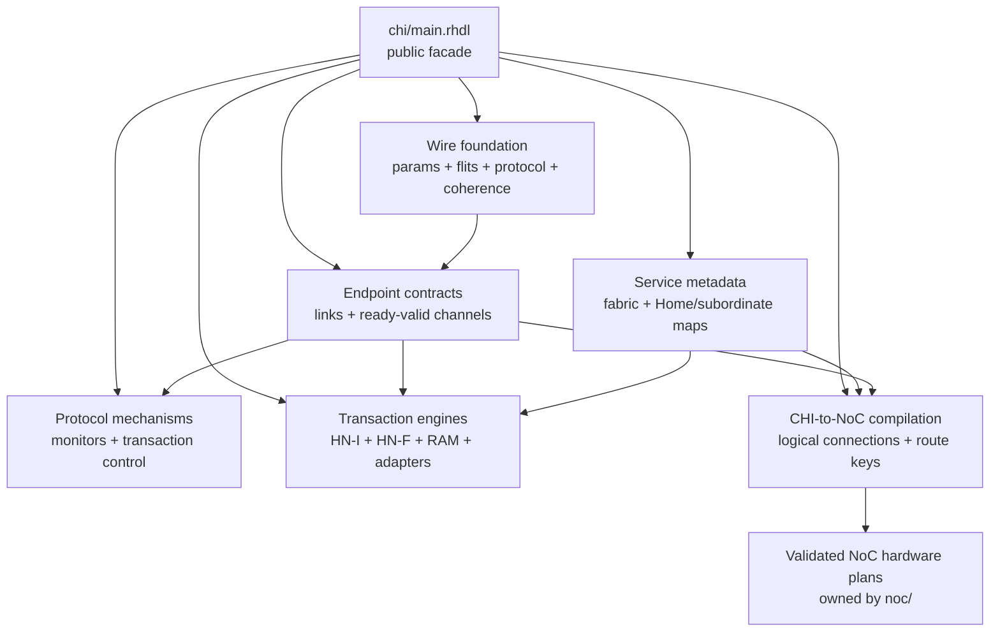
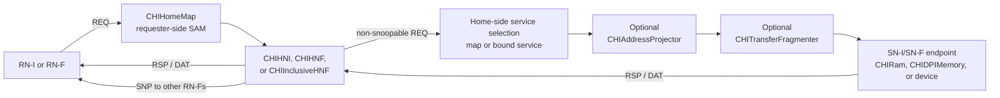

<!-- Defines the standalone AMBA CHI package, its implemented layers, and supported transaction profile. -->

# AMBA CHI domain library

`chi/` is the standalone AMBA CHI domain library. It provides exact protocol
payloads, node-role contracts, monitoring, transaction engines, address-map
metadata, and an adapter from CHI channel relationships to validated NoC plans.
The public facade is [`main.rhdl`](main.rhdl).

The wire definitions follow revision IHI 0050H of the AMBA CHI Architecture
Specification. That revision is the provenance of the implemented encodings,
not a selectable API parameter. Defining an opcode or flit field does not imply
that every endpoint engine implements the corresponding transaction; the
authoritative delivered profiles are collected under
[Delivered profile and limits](#delivered-profile-and-limits).

Contributors extending the package should read
[`DEVELOPING.md`](DEVELOPING.md).

## At a glance

| Layer | Delivered surface | Key boundary |
| --- | --- | --- |
| Wire | Parameterized REQ, RSP, SNP, and DAT flits; all non-reserved Issue H opcodes; typed closed fields and packet helpers | Optional fields are physically absent when disabled |
| Endpoint | RN-F/RN-D, RN-I, and SN-F/SN-I link shapes; capability and credit contracts; ready-valid engine channels | Physical credited links and internal ready-valid channels are distinct |
| Service | Request/transfer-size descriptions, Home and subordinate service maps, combinational NodeID lookup | Requester-to-Home and Home-to-subordinate maps are separate |
| Transactions | Link-local monitors, bounded non-coherent and RN-F checkers, reusable retry control, HN-I/HN-F engines, RAM and memory adapters | Monitors check advertised profiles; engines implement only the profiles below |
| Network | Pure CHI connection compilation, per-channel adapters, and three- or four-plane router composition | [`noc/`](../noc/README.md) owns topology, routing policy, proofs, and generic routers |



## Reading paths

| Goal | Start here |
| --- | --- |
| Import CHI or understand package ownership | [Package boundary and import](#package-boundary-and-import) |
| Define flits, parameters, and node capabilities | [Wire and protocol foundation](#wire-and-protocol-foundation) and [Endpoint links and engine channels](#endpoint-links-and-engine-channels) |
| Route addresses through Homes and subordinates | [Services and System Address Maps](#services-and-system-address-maps) |
| Add assertions around an endpoint | [Monitoring and transaction control](#monitoring-and-transaction-control) |
| Compile CHI traffic onto a NoC | [NoC compilation and transport](#noc-compilation-and-transport) |
| Choose a Home or backing-memory component | [Build an end-to-end path](#build-an-end-to-end-path) |
| Check exactly what works today | [Delivered profile and limits](#delivered-profile-and-limits) |
| Find the owning implementation module | [Contributor implementation map](DEVELOPING.md#implementation-map) |

## Package boundary and import

Import the implemented public surface with:

```rhombus
import:
  lib("chi/main.rhdl") open
```

For stateless subordinate responses, import `lib("chi/messages.rhdl")` directly
or use the facade. `chi_sn_dbid_response` and `chi_sn_write_completion` correlate
responses with the request's source and TxnID and the supplied DBID;
`chi_sn_read_completion` uses its return-node/return-TxnID fields, derives byte
enables from the transfer, and accepts the packet's DataID and payload. These
builders emit successful responses with the existing inactive/default optional
fields; they do not allocate transactions, validate endpoint capabilities, or
implement retry, error, or coherence policy.
They return immutable values and can be called repeatedly in one circuit
without allocating named wires or sharing state between calls.

`messages.rhdl` also provides Home response construction and immutable
downstream-request, snoop-write-data, and upstream-read-data transforms.
These preserve untouched packet metadata, including optional fields. Callers
supply routing identities and policy decisions; the helpers neither allocate
transactions nor choose a coherence policy.

The package boundary follows the protocol layering:

- `chi/` owns CHI node roles, flits, opcodes, transactions, Protocol Credits,
  Link activation, optional CHI fields, endpoint engines, and CHI-specific
  monitoring.
- [`devices/`](../devices/README.md) consumes the facade and owns peripheral
  register maps and behavior. CHI does not import platform devices.
- `rhodium/std` owns protocol-neutral credited transport, ready-valid flows,
  buffering, address and ID sets, storage, and ordinary hardware utilities.
- [`noc/`](../noc/README.md) owns the pure topology, routing, validation, and
  generic router model. CHI supplies symbolic terminals and channel routes to
  that model, then consumes its validated plans in RTL adapters.
- Rhodium core, frontend, and backend require no CHI-specific operation. CHI
  modules use the public `#lang rhodium` surface and must not import those
  implementation layers directly.

## Protocol layers

### Wire and protocol foundation

[`params.rhdl`](params.rhdl) defines the shared `CHIFlitParams`. Its principal
physical choices are:

| Parameter | Accepted values |
| --- | --- |
| NodeID width | 7 through 16 bits |
| REQ address width | 44 through 52 bits |
| DAT width | 128, 256, or 512 bits |
| MPAM width | 0, 12, or 15 bits |
| REQ/DAT RSVDC width | 0, 4, 8, 12, 16, 24, or 32 bits |
| PBHA width | 0 or 4 bits |
| MECID width | 0 or 16 bits |
| StreamID width | 0 or 16 bits, with the dependent SecSID1 selection |
| DataCheck and Poison | Independently enabled or disabled |

The defaults produce 137-bit REQ, 71-bit RSP, 94-bit SNP, and 240-bit DAT
flits. [`flits.rhdl`](flits.rhdl) defines every non-reserved REQ, RSP, SNP, and
DAT opcode from Issue H Tables B13.12 through B13.16 and constructs
`CHIReqFlit`, `CHIRspFlit`, `CHISnpFlit`, and `CHIDatFlit`. Fields are declared
most-significant first so the specification's first field, QoS, occupies packed
bits `[3:0]`. Disabled REQ, SNP, and DAT option groups are absent from both the
record and its packed representation; RSP has no optional field group.

Closed fields use nominal hardware types at their specified widths:
`CHITagOp`, `CHIOrder`, `CHIPAS`, `CHIRespErr`, `CHITransferSize`, and the
four-bit `CHIMemAttr`. Opcode-dependent aliases retain one physical record
field rather than allocating duplicate storage. For example,
`return_nid_or_stash_nid_or_data_target`, `dbid_or_group_id`, and
`dbid_or_mecid` name shared wire locations. The six-bit `size_or_num_req`
location likewise has typed `chi_req_size` and full-width `chi_req_num_req`
views.

[`protocol.rhdl`](protocol.rhdl) owns Size validation and derives physical DAT
packet counts, DataIDs, and transfer-beat positions from Size, address, and
`Data_Width`. Opcode enums own intrinsic family classifiers such as atomic,
non-snoopable, DBID-allocating, data-direction, and snoop-response queries.
Generic `enum_valid` checks encoding membership; endpoint capabilities decide
whether a declared opcode is legal on a particular connection.

`chi_transfer_data_ids(address, size, p)` returns the expected four-bit packet
set for a naturally aligned transfer without data elision. The same rule serves
coherent and non-coherent traffic. DataID identifies a physical position within
a 64-byte line, not a transfer-relative beat: narrow accesses use Addr[5:4] at
128 bits, Addr[5] followed by zero at 256 bits, and zero at 512 bits. CCID remains
a separate critical-chunk identifier. These are the rules in
[IHI 0050H B2.9.4](https://documentation-service.arm.com/static/68d13eb5bd7cab51328bee7a).

`chi_line_data_id(address, p)` selects that physical packet;
`chi_transfer_beat(data_id, p)` and `chi_transfer_data_id(beat, p)` convert between
line packet indices and DataIDs. `chi_data_address(address, data_id, p)` returns
the packet-aligned byte address within the request's line. Memory backends use
it instead of adding a DataID-derived offset to the request address again.
The former checker-owned `coherent_read_data_ids` is replaced by the shared
address-aware `chi_transfer_data_ids` API.

[`coherence.rhdl`](coherence.rhdl) adds `CHICacheState`,
`CHIResponseState`, and the packed `CHICoherentResponse` view. Because the RSP
and DAT `Resp` bits are opcode-dependent, coherent code explicitly converts
them to this view before reading `state` or `pass_dirty`. The module also owns
the complete ordinary SNP opcode set required at an RN-F endpoint. These are
state vocabulary and classifiers, not a cache-state machine.

### Endpoint links and engine channels

[`link.rhdl`](link.rhdl) models the Issue H B13.6 physical channel sets from a
node's point of view:

| Interface | Node kinds | Node transmits | Node receives |
| --- | --- | --- | --- |
| `CHIRNLink` | RN-F, RN-D | REQ, RSP, DAT | RSP, DAT, SNP |
| `CHIRNILink` | RN-I | REQ, RSP, DAT | RSP, DAT |
| `CHISNLink` | SN-F, SN-I | RSP, DAT | REQ, DAT |

HN-F and HN-I are fabric identities, not additional physical endpoint shapes.
For example, an HN-I terminates an RN-I-shaped requester side and originates an
SN-I-shaped subordinate side.

`CHINodeParams` and `CHIICNPortParams` carry the same NodeID and node kind on
the two sides while independently declaring emitted and accepted
`CHIChannelCapabilities`. Construction and connection checking require:

- a legal channel set for the selected role, including limiting any RN-D snoop
  capability to `SnpDVMOp` and requiring every ordinary snoop opcode at RN-F;
- matching kind and NodeID, with the NodeID representable by the physical
  width;
- every emitted opcode to appear in the peer's accepted capability set;
- identical flit parameters, including optional-field selections; and
- equal credit limits for each corresponding physical channel.

`CHIRequesterHomeParams` projects an RN-I or RN-F ICN endpoint into a subset
of its emitted and accepted capabilities for one Home. Its NodeID, kind, and
capacity remain those of the physical endpoint. Homes accept either complete
ICN endpoints or these projections through `CHIHomeRequesterParams`; projections
cannot add capabilities. This permits one RN-F to use coherent traffic toward
an HN-F and non-snooping traffic toward an HN-I without a second endpoint or
a fictitious RN-I identity. HN-F configurations still require complete RN-F
snoop support on their own path.

Each physical protocol channel is `Credited(flit, credit_limit)`. The four Link
activation wires are named relative to the node: the node drives
`tx_link_active_request` and `rx_link_active_ack`, while the ICN drives
`tx_link_active_ack` and `rx_link_active_request`. One request/ack pair covers
all channels in that direction, following Issue H B14.5.

The credited contract has no `ready` wire. A receiver credit grants one future
transfer, a valid flit consumes one prior credit, and a simultaneous grant and
transfer leaves the balance unchanged. A transmitter cannot send at zero
balance; a receiver cannot grant beyond real capacity, including outstanding
grants. Reset creates no credits. `credit_limit` is an elaboration and monitor
contract rather than a packed field. Link Credits apply to one physical hop;
Protocol Credits are CHI transaction messages used for retry and are not
represented by `Credited`. Link activation remains outside the generic
transport interface.

[`channels.rhdl`](channels.rhdl) is the separate ready-valid boundary used by
transaction engines and the internal NoC. It groups independent flows into
`CHIRNIChannels`, `CHIRNChannels`, `CHISNChannels`, `CHIHNIChannels`, and
`CHIHNChannels`. There is no implicit conversion between these channels and a
physical credited link. For multi-requester coherent fabrics,
`CHISnoopDispatch` carries the selected RN-F NodeID beside an exact target-less
SNP flit until endpoint ejection.

### Services and System Address Maps

[`fabric.rhdl`](fabric.rhdl) keeps routed service metadata separate from
physical link identity:

- `CHIRequestSupport` pairs one REQ opcode with accepted `TransferSizes`.
- `CHISubordinateServiceParams` pairs an SN-F/SN-I ICN endpoint with request
  support and one or more `AddressSet` regions.
- `CHIHomeParams` gives an HN-F/HN-I a NodeID and bounded transaction capacity.
- `CHIHomeServiceParams` assigns operations and address regions to a Home.
- `CHIFabricPortParams` pairs an RN or SN ICN endpoint with the role-correct
  physical link parameters.

The two executable maps represent different routing decisions.
`CHIHomeMap.lookup` selects the Home NodeID for an RN request;
`CHISubordinateMap.lookup` selects an SN NodeID after a Home has performed its
ordering or coherence work. Each lowers to a combinational `valid` plus NodeID
result. They do not describe a flat RN-to-SN path.

`CHIFabricParams` derives both maps from its ports, Homes, and services. It
rejects duplicate or width-overflowing NodeIDs, mismatched flit parameters,
missing service targets, out-of-range addresses, overlap within either map,
duplicate service opcodes, and transfer sizes outside CHI's Size field. One
subordinate may retain multiple disjoint service profiles.

### Monitoring and transaction control

[`monitor.rhdl`](monitor.rhdl) instruments one explicitly selected physical
endpoint through `monitor_chi_rn`, `monitor_chi_rni`, or `monitor_chi_sn`.
Link-local checks cover:

- the four-state activation sequence and the point at which traffic or credit
  return is legal;
- independent per-channel credit balances, including zero balance at STOP;
- declared and advertised opcodes;
- ordinary SrcID/TgtID association;
- Link Credit Return timing and its zero TxnID;
- legal REQ Size encodings and reserved Size bits; and
- DAT DataIDs legal for the selected data width.

When an endpoint's advertised capabilities select a delivered transaction
profile, the monitor also instantiates the corresponding bounded stateful
checker. [`transaction.rhdl`](transaction.rhdl) tracks the non-coherent TxnID,
DBID, phase, and complete expected DataID set from both requester and
subordinate viewpoints. [`coherent-transaction.rhdl`](coherent-transaction.rhdl)
separately tracks coherent read lifetimes, CompAck, ordinary and paired-DVM
snoops, and forward-snoop completion. The profile-specific guarantees and
limits are listed once under [Delivered profile and limits](#delivered-profile-and-limits).
`monitor_chi_hni` instead observes the ready-valid transfers on both sides of
an HN-I and checks the Home's transaction translation.

[`retryable-transaction.rhdl`](retryable-transaction.rhdl) is a reusable
requester-side mechanism rather than a complete transaction datapath. A
`CHIResponseProfile` maps accepted RSP opcodes to named completion milestones;
one opcode may complete several milestones and several opcodes may complete the
same milestone. `CHIRetryableTransactionControl` owns request attempts and the
`RetryAck`/`PCrdGrant` association: the messages may arrive in either order,
must agree on Protocol Credit type, and produce a repeat with `AllowRetry`
cleared. `external_progress` prevents retry after another channel has advanced
the transaction. Addresses, TxnIDs, DBIDs, payload storage, response metadata,
and the final completion condition remain endpoint-owned.

### NoC compilation and transport

[`noc-authoring.rhm`](noc-authoring.rhm) describes RN, HN-side, and SN sites as
CHI NodeIDs attached to symbolic NoC terminals. `CHIRNIConnection`,
`CHIRNFConnection`, and `CHISNConnection` expand logical endpoint relationships
into independent REQ, RSP, SNP, and DAT route specifications. RN-I paths omit
SNP; RN-F paths include it. `compile_chi_connections` hands each channel family
to the pure NoC compiler and returns validated route keys and terminal
provenance.

[`noc-adapter.rhdl`](noc-adapter.rhdl) turns those host-compiled results into
destination selection and typed ready-valid injection/ejection stages. Family
adapter plans compile every `(site key, target NodeID)` relation before RTL
elaboration and provide complete attachments for RN-I, RN-F, HN requester, HN
subordinate, and SN roles.

[`noc-router.rhdl`](noc-router.rhdl) composes three independent generic router
families for RN-I/HN-I/SN-only fabrics or four when coherent requester traffic
requires SNP. A shared `RouterFamilyPhysicalPlan` proves that all present
families use the same ordered physical-link shape. Tile or system code owns the
router instances and inter-router links; CHI does not own topology or routing
policy. See the [NoC guide](../noc/README.md) for validation semantics and the
[`noc/rtl` guide](../noc/rtl/README.md) for generic router hardware.

## Build an end-to-end path

A complete fabric distinguishes two routing decisions: first from a requester
to a Home, then from the Home to a subordinate. `CHIHNI` executes a
`CHISubordinateMap`; the current HN-F engines instead bind one subordinate
service in their configuration. REQ travels toward the selected service, RSP
and DAT return through the matching channel planes, and an HN-F may additionally
send SNP traffic to RN-F endpoints.



### Choose the transaction engine

| Component | Use it for | Principal contract |
| --- | --- | --- |
| [`CHIHNI`](home.rhdl) | Non-coherent RN-I or RN-F Home traffic reaching one or more SN-I services | Bounded Home-owned slots and translation of requester TxnIDs, ReturnTxnIDs, data targets, and subordinate DBIDs |
| [`CHIHNF`](coherent-home.rhdl) | Mixed RN-I/RN-F traffic without an LLC | One globally active transaction; broadcast coherence and dirty intervention before non-snoopable subordinate traffic |
| [`CHIInclusiveHNF`](inclusive-home.rhdl) | Mixed RN-I/RN-F traffic with a blocking inclusive LLC | Set-associative `SyncRam1RW` tag/data arrays, hit service, victim invalidation, dirty intervention/writeback, and one active transaction |
| [`CHIRam`](ram.rhdl) | Synthesizable non-coherent memory | SN-F by default or SN-I by selection; configurable 128/256/512-bit DAT and native transfers from one beat through 64 bytes |
| [`CHIDPIMemory`](dpi-memory.rhdl) | Sparse simulation memory | The same native `CHISNChannels` transaction contract as `CHIRam`, backed by a 64-byte-block C++ DPI store and fixed 512-bit ABI |

`CHIHNI` accepts a shared requester channel that retains source NodeID and a
`CHISubordinateMap` that may select multiple SN-Is. It allocates a Home-owned
slot, translates the two transaction-ID namespaces, restores read ReturnTxnID
and data target, and exposes a Home DBID while retaining the subordinate DBID
for writes. REQ, RSP, and DAT may attach to independent transports.

`CHIHNF` and `CHIInclusiveHNF` accept an aggregate requester side addressed by
NodeID. The uncached `CHIHNF` forwards through a subordinate; the inclusive
variant can serve hits and stores complete global line addresses as tags while
using projected dense addresses for set selection. Their exact request subset,
snoop policy, and concurrency ceiling are defined below.

### Shape the backing-memory boundary

`CHIRamConfig` requires a power-of-two region containing at least two physical
DAT beats. `max_transfer_bytes` selects native support from one DAT beat through
64 bytes and cannot exceed the RAM. The RAM uses `SyncRam1RW`, bounded
transaction slots, slot-index DBIDs held through completion, byte enables for
partial writes, and complete DataID sets for multi-beat traffic. Selecting
SN-F does not make the RAM coherent: an upstream HN-F owns coherence and sends
only non-snoopable subordinate requests. `CHIDPIMemory` uses the endpoint
NodeID as its model identity, isolating each sparse DPI store.

[`transfer-fragmenter.rhdl`](transfer-fragmenter.rhdl) widens an intentionally
narrow subordinate service. The serialized adapter emits one child request per
physical DAT beat, offsets child addresses, restores the parent read DataIDs,
and translates the parent write DBID and completion. Parent write packets may
arrive in any legal DataID order and are buffered before serialized child
writes. A line-capable RAM or external memory connects directly without it.

[`address-projector.rhdl`](address-projector.rhdl) composes above the
fragmenter for cache-line-striped Homes. Service metadata fixes the bank-select
bits; the hardware removes those bits from each REQ address so downstream
components see a dense local space. RSP and DAT pass through unchanged. The
stripe must be at least as wide as every advertised transfer, keeping a request
within one Home.

## Delivered profile and limits

This section is the status boundary. The flit enums intentionally describe
more of Issue H than the implemented endpoint transactions.

### Physical and link profile

- Exact parameterized Issue H REQ/RSP/SNP/DAT payloads and all non-reserved
  opcodes are available for authoring.
- RN-F/RN-D, RN-I, and SN-F/SN-I physical credited links, activation, static
  capability compatibility, and explicit link monitors are implemented.
- Ready-valid engine channels, pure CHI-to-NoC compilation, per-channel flow
  adapters, and three- or four-plane CHI router composition are implemented.
- The package does not currently provide an automatic physical credited-link to
  ready-valid adapter. The containing system selects and connects the boundary.

### Initial non-coherent profile

The RN-I and SN stateful checkers activate only when advertised capabilities
are wholly within this subset and include at least one request opcode:

| Operation | Checked transaction sequence |
| --- | --- |
| Read | `ReadNoSnp`, then `CompData` packets completing the expected DataID set |
| Full write | `WriteNoSnpFull`, `DBIDResp`, the complete expected set of `NonCopyBackWriteData`, then `Comp` |
| Partial write | `WriteNoSnpPtl`, `DBIDResp`, the complete expected set of `NonCopyBackWriteData`, then `Comp` |

The checker bounds live transactions by matching endpoint `max_outstanding`
values from 1 through CHI's architectural maximum of 1024. It rejects live
TxnID reuse, table overflow, phase errors, DBID reuse, data before DBID,
mismatched endpoint and return identifiers, duplicate or unexpected DataIDs,
and completion before the entire write data set. A subordinate read also checks
the Home-supplied ReturnNID and ReturnTxnID; Direct Write Transfer is rejected.

Requests are single-request, legal-Size, `NoOrder`, Protocol Credit type zero,
without completion acknowledge, and with invalid `TagOp`. Each data packet has
a physical-width-legal DataID, `NumDat = 0`, and no replication. Link Credit
Return remains link-local and allocates no transaction slot. The HN-I and RAM
engines do not integrate request retry, Protocol Credit handling, atomics,
exclusives, cache maintenance, DVM, direct transfers, data separation, or
memory tagging.

`CHIRam` deliberately returns separate `DBIDResp` and `Comp` messages and emits
`Comp` only after the storage update. This preserves completed-write visibility
for a later read instead of using the permitted pre-data `CompDBIDResp` form.

### Initial coherent requester monitoring

An RN-F monitor with the initial coherent capability profile provides bounded
stateful checks for `ReadShared`, `ReadClean`, and `ReadUnique`. It derives the
complete address- and width-dependent DataID set, rejects duplicate or
unexpected packets, requires successful response data, and associates the Home
and CompAck transaction from the first data packet. A CompAck may arrive after
that first packet, but the read remains live until both CompAck and every
expected packet have arrived.

The first read attempt must set `AllowRetry`; a repeat uses the same live TxnID
with `AllowRetry` clear. The checker recognizes that shape but leaves
`RetryAck`/`PCrdGrant` association to endpoint logic or
`CHIRetryableTransactionControl`. The selected capability envelope also permits
`WriteUniquePtl`, but this bounded checker does not implement a complete
stateful coherent-write model.

Every ordinary incoming SNP is tracked by Home Node and TxnID. Non-forward
snoops finish with a matching snoop RSP or DAT response; forward snoops remain
live until both the Home response and forwarded `CompData` appear. The checker
also associates the two flits of a DVM operation. Its initial snoop-data and
forward-data checks require a single packet (`DataID = 0`, `NumDat = 0`, no
replication). It does not decide cache responses, store tags/data, mutate cache
state, arbitrate response producers, or implement evictions and separated
responses.

### Initial coherent Home engines

Both Home implementations require at least one RN-F and accept one transaction
at a time; `CHIHNFParams` correspondingly requires a Home capacity of exactly
one. RN-I requesters may use `ReadNoSnp`, `WriteNoSnpFull`, and
`WriteNoSnpPtl`; RN-F requesters may use `ReadClean`, `ReadUnique`, and
`WriteUniquePtl`. Both requester kinds may additionally advertise
`CleanShared`, `CleanInvalid`, and `MakeInvalid` for aligned 64-byte blocks.

`CHIHNF` broadcasts `SnpCleanShared` before `ReadClean` and
`SnpUnique` before `ReadUnique` and `SnpCleanInvalid` before `WriteUniquePtl`, excluding the
requesting RN-F. It accepts clean `SnpResp` or a complete dirty
`SnpRespData` intervention with `PassDirty`. Dirty packets are committed to the
subordinate as serialized one-packet writes before the original transaction
continues. Reads become `ReadNoSnp`; their upstream state is SharedClean for
`ReadClean` and Unique for `ReadUnique`, and the Home waits for CompAck.

`CHIInclusiveHNF` adds blocking set-associative storage, serves hits without a
subordinate request, broadcasts before replacing a resident victim, absorbs
dirty snoop data, and writes back dirty victims before refill. Sets are a
power-of-two count of at least two, ways are positive, and the complete cache
must fit the projected dense local range. It requires 64-byte subordinate
`ReadNoSnp` and `WriteNoSnpFull` support.

Neither coherent Home has a sharer directory or concurrent transaction
pipeline. Broadcast invalidation is conservative. General ordering, broader
retry use, parallel Home operation, a precise directory, and broader coherent
request families remain outside the contract.

### Cache maintenance

`CHICacheMaintenance(p, Context)` issues one dataless maintenance transaction.
Its command supplies a physical aligned line address, one of `CleanShared`,
`CleanInvalid`, or `MakeInvalid`, the selected Home ID, PAS, `snoop_me`, and
opaque context. Node and transaction IDs are captured at command acceptance.
The requester retains the command through `RetryAck`/`PCrdGrant` association
and returns one backpressured completion containing context and `CHIRespErr`.
It sends no requester data or CompAck. Snoop handling is an independent path:
the caller must keep it live while maintenance is outstanding, order older
same-line transactions before issuing the command, and prevent conflicting
local accesses until completion. An RN-F may use `snoop_me` to include its own
cache; otherwise it must satisfy the local-cache maintenance preconditions.

Both Homes broadcast maintenance to RN-Fs, including the originating RN-F
when SnpMe is set. `CleanShared` removes dirty responsibility;
`CleanInvalid` preserves dirty data and invalidates; `MakeInvalid` invalidates
without writing discarded data. Dirty interventions for clean/flush reach the
uncached backing subordinate before `Comp`. Maintenance writes disable early
write acknowledgement. Snoop and backing-write errors propagate in `Comp`;
an error completion does not promise that maintenance succeeded or was rolled
back. The inclusive Home retains dirty resident state on a failed clean.

The inclusive Home does not allocate, refill, or replace unrelated lines on
maintenance misses. A clean resident line may remain cached after cleaning;
flush/discard invalidate the matching entry. The backing subordinate is the
maintenance visibility boundary: this profile does not forward CMOs through
additional downstream caches and does not implement persistence or broadcast
control pins. Address selection and access permission checking belong to the
caller. The supported intervention profile transfers complete dirty lines.

Endpoint monitors check maintenance request framing. The requester engine
checks response lifetime, retry association, identity, and completion; Homes
check snoop identities, states, and packet accounting. Merely adding an opcode
to a capability list does not instantiate an execution engine.

## Source map

Source ownership moved to the contributor
[`DEVELOPING.md`](DEVELOPING.md#implementation-map). This heading remains for
existing links.

## Validation

Contributor test selection, negative cases, and backend fixture ownership are
documented in [`DEVELOPING.md`](DEVELOPING.md#focused-validation).

## Specification references

- [AMBA CHI Architecture Specification Issue H](https://developer.arm.com/documentation/ihi0050/h/)
- [Introducing AMBA CHI](https://documentation-service.arm.com/static/68590853961937560be90eb2)
- [Arm AMBA specifications](https://www.arm.com/architecture/system-architectures/amba/amba-specifications)
