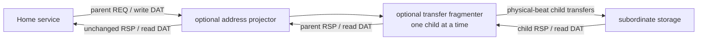

<!-- Introduces CHI transfer fragmentation and address projection at channel boundaries. -->
<!-- SPDX-License-Identifier: Apache-2.0 -->

# CHI transaction adapters

Use `chi/adapters/` when a Home-to-subordinate boundary needs transfer
fragmentation or a dense local address view. These adapters retain native CHI
channels and transaction identity; they do not define another memory protocol.
Contributors should read [DEVELOPING.md](DEVELOPING.md).

## Get started

Choose [`CHITransferFragmenter`](transfer-fragmenter.rhdl) only when a
subordinate service is narrower than the parent transfer. Add
[`CHIAddressProjector`](address-projector.rhdl) above it when service metadata
selects a striped bank whose local REQ address must be dense. A line-capable
RAM or external memory can connect directly. The
[backing-memory guide](../README.md#shape-the-backing-memory-boundary)
describes their placement and configuration.

Import the defining modules directly, or use the package-wide
[`chi/main.rhdl`](../main.rhdl) facade.

## Public contract

The fragmenter emits one child request per physical DAT beat, restores parent
read DataIDs, and translates write DBID/completion association. Parent write
packets may arrive in any legal DataID order. The projector removes the
service-selected bank bits from REQ addresses and passes RSP/DAT unchanged.
The stripe must cover every advertised transfer so one request stays in one
Home. Unaffected packet metadata, including optional fields, is preserved.

This illustrates the current boundary composition. Projection changes REQ
addresses; fragmentation serializes child transactions and restores the parent
response identity and packet positions.

## Limits and navigation

These are serialized boundary transforms, not a crossbar, storage backend, or
source of stripe geometry. Use the protocol-neutral
[`StripedAddressLayout`](../../rhodium/std/README.md#generic-interconnect-parameters)
for geometry and the [NoC integration](../noc/README.md) layer for routes.
