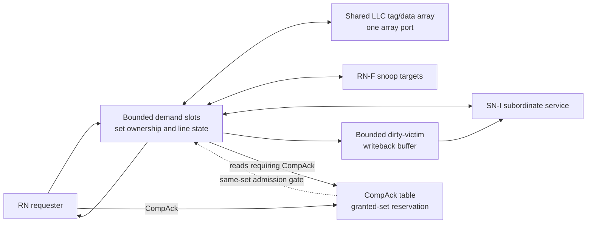

<!-- Describes the public boundary of CHI Home engines. -->
<!-- SPDX-License-Identifier: Apache-2.0 -->

# CHI Home engines

Choose a non-coherent, coherent, or inclusive Home for the requester-to-
subordinate boundary. Shared Home configuration and snoop-target contracts
support these distinct engines. Contributors should read
[DEVELOPING.md](DEVELOPING.md).

## Get started

Import the defining modules directly, or use the package-wide
[`chi/main.rhdl`](../main.rhdl) facade. The
[engine selection table](../README.md#choose-the-transaction-engine) and
[end-to-end path](../README.md#build-an-end-to-end-path) show where each Home
fits; the [delivered profile](../README.md#initial-coherent-home-engines)
defines the supported request and snoop families.

## Public contract

`CHIHNI` selects one or more SN-I services for non-coherent traffic. `CHIHNF`
provides a single-transaction coherent Home without an LLC. `CHIInclusiveHNF`
adds bounded transaction slots, set-associative storage, resident tracking,
and buffered dirty-victim writebacks. All three preserve the distinction
between the requester-side Home map and the subordinate service selection.

`CHIInclusiveHNFConfig` defaults to four outstanding completion-
acknowledgement entries. Set `~comp_ack_entries` to size this bounded DBID table
for the expected acknowledgement latency and requester concurrency.
Set `~victim_writeback_entries` to the positive number of dirty replacement
lines that may progress independently of their refills; it defaults to one.
Demand slots use the low subordinate transaction IDs and writeback entries use
the following IDs. CHI limits one requester to 1024 outstanding transactions,
so the configuration enforces that combined limit even though TxnID is 12 bits.
`CHIHNFConfig(~transaction_slots: ...)` separately selects one through 64 live
coherent transactions. `CHIInclusiveHNF` uses those slots as Home TxnIDs/DBIDs,
permits distinct sets to overlap, and serializes requests that address an owned
set. An LLC hit may return while a distinct-set miss waits for subordinate
memory; non-final fill data can also enter the miss slot while the hit response
is stalled. Once a buffered writeback owns a resolved dirty victim, its parent
slot may issue the replacement refill without waiting for the backing write
completion. The new line is not installed or returned until that completion
succeeds. A failed writeback drains an issued refill and restores the complete
post-snoop victim in its reserved way. Resident snoops issue on consecutive
accepted cycles with distinct transaction IDs and may complete out of order;
the owning Home transaction advances only after every targeted RN-F completes.
Final fill installation retains exclusive use of the shared LLC array port.
The transaction-slot parameter defaults to one for compatibility; the complete
single-core and tiled SoCs select two.

## Inclusive Home resources

This diagram illustrates the current `CHIInclusiveHNF` resource arrangement,
not a separate port or ordering contract. Demand slots retain each live
transaction and own a set while they access one shared LLC tag/data array,
issue snoops, or wait for subordinate service.

A buffered victim writeback can overlap its replacement refill, but the new
line cannot be installed or returned before writeback completion. After final
read DAT, a demand slot can be reused while its CompAck entry still excludes
other transactions from the granted set; other sets can continue.

## Inclusive Home event tracing

The optional event compiler emits `home/transaction[slot]` residency for every
configured transaction slot. Admission captures the request address, symbolic
opcode, TxnID, and SrcID once. Incoming Flow ancestry enters that residency;
requester RSP/DAT and subordinate REQ/write DAT inherit the actual selected
slot's occurrence. Buffered dirty-victim writebacks retain the causing
transaction's occurrence from enqueue through their requests and data beats,
even while another transaction wins the shared outputs. Overlapping
transactions occupy distinct Perfetto lanes, and reused transaction IDs do not
merge occurrences. Residency includes lookup, snoops, refill/writeback waits,
and output backpressure; it ends on final DAT, terminal completion, copyback
retirement, or epoch reset, not on the first response beat. For reads that require
`CompAck`, `CHIInclusiveHNF` assigns a DBID from its configured acknowledgement
table and releases the LLC datapath after final DAT. A later `CompAck` retires
that table entry and ends the same-set grant reservation. Other sets can
continue lookup, snoop, refill, and response work while acknowledgements are
outstanding; the granted set cannot be probed or replaced before receipt.
Ordinary elaboration adds no event instrumentation or functional buffering.
These are transaction lifetimes, not a trace of every internal FSM state.
Separate victim-writeback and CompAck residencies are not yet annotated.

These edges describe request ownership, not backing-memory data provenance.
Incoming subordinate and snoop/data contributions are not incorporated into
requester-response ancestry yet. Callers may observe subordinate transfers
without adding checkpoints inside the Home or victim-writeback buffer.

Home-to-memory request and write-data ancestry is supported in
SingleCoreRV5StageSoC. The emitter enables
[partial tracing](../../rhodium/event/README.md), so missing contracts such as
the uncached engine's ownership become explicit ancestry gaps instead of
blocking all instrumentation. IO-MSHR and uncached ownership remain unannotated.
This does not establish complete NoC or memory-controller graph coverage;
partial tracing does not change the Home's functional request/response behavior.

## Limits and navigation

`CHIInclusiveHNFPhase` names internal implementation states, not CHI protocol
states; it remains exported only for source compatibility. The noncaching
Home remains single-transaction and broadcast-based. General ordering,
broader retry use, same-set parallelism, and additional coherent request
families are outside the delivered profile. See the
[Home engine limits](../README.md#initial-coherent-home-engines) and
[cache maintenance](../README.md#cache-maintenance) contracts for details.
