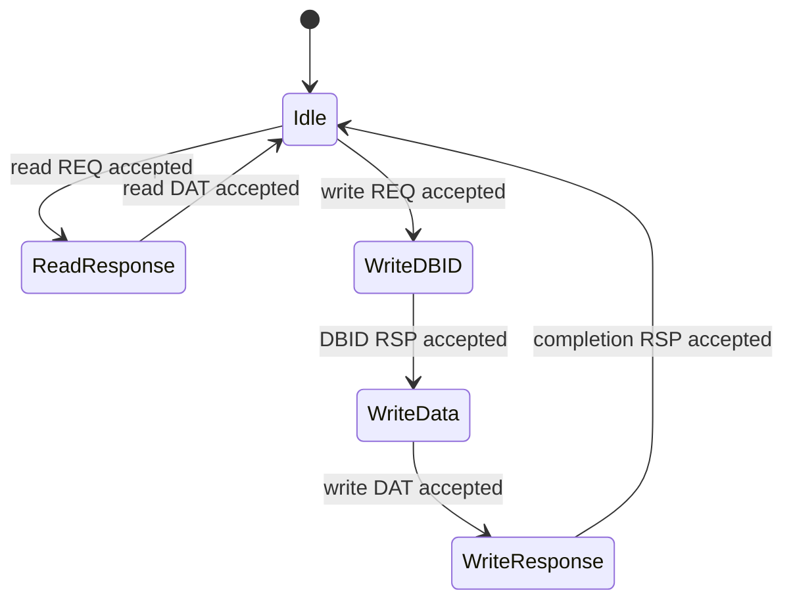

<!-- Describes the public boundary of CHI subordinate engines and storage. -->
<!-- SPDX-License-Identifier: Apache-2.0 -->

# CHI subordinate engines and storage

Use `chi/subordinate/` for native SN channel sequencing: one-outstanding
single-beat devices or multibeat RAM with synthesizable and DPI-backed storage.
Contributors should read [DEVELOPING.md](DEVELOPING.md).

## Get started

Import the defining modules directly, or use the package-wide
[`chi/main.rhdl`](../main.rhdl) facade. Choose
[`CHISingleBeatSubordinate`](single-beat-subordinate.rhdl) for MMIO registers,
[`CHIRam`](ram.rhdl) for synthesizable storage, or
[`CHIDPIMemory`](dpi-memory.rhdl) for sparse simulation memory. The
[backing-memory guide](../README.md#shape-the-backing-memory-boundary)
describes their configuration and shared channel contract.

## Public contract

`CHISingleBeatSubordinate` retains the request and read snapshot, validates
write association, exposes precise read/write acceptance pulses for device
effects, and holds responses under backpressure. `CHIRam` and `CHIDPIMemory`
share one multibeat controller and native `CHISNChannels` semantics but own
different storage backends. Their configuration supports native transfers
from one physical DAT beat through 64 bytes; a narrower service can use the
[transfer fragmenter](../adapters/README.md).

## Single-beat request lifecycle

The diagram illustrates the current engine's handshake phases; these phase
names are implementation details, not additional CHI protocol states. Each
transition requires the indicated transfer to be accepted, so output
backpressure holds the phase and its retained request or read snapshot.

Reset returns to `Idle`; link-credit returns do not advance a transaction.
The device read snapshot is captured with the read REQ, while the write side
effect occurs when the write DAT is accepted.

## Single-beat request tracing

`CHISingleBeatSubordinate` supplies intrinsic tracing contracts from accepted
ordinary REQ traffic to its RSP and read-DAT outputs. Both outputs retain the
same request occurrence through DBID, delayed write data, and backpressure;
ownership ends on final write completion, read completion, or reset. Credit
returns do not capture or release ownership. These are request-ownership edges,
not separate write-data provenance edges.

The contracts add no checkpoints or functional buffering. Place event
annotations on surrounding Flow routes; optional compiler instrumentation
provides metadata storage and DPI emission.

## Limits and navigation

The single-beat engine does not implement retry, coherence, or multibeat
storage. SN-F selection does not make RAM coherent; a Home owns coherence
before issuing non-snoopable subordinate requests. See the
[non-coherent profile](../README.md#initial-non-coherent-profile) and the
[device guide](../../devices/README.md) for platform register policy.
