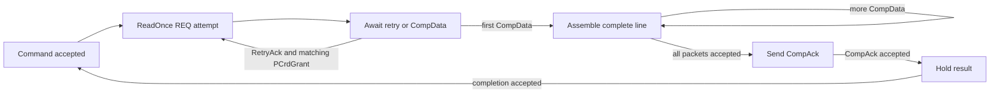

<!-- Describes the public boundary of CHI transaction mechanisms. -->
<!-- SPDX-License-Identifier: Apache-2.0 -->

# CHI transaction mechanisms

Use `chi/transactions/` for opt-in endpoint checking, bounded transaction
models, retry association, and reusable requester engines. These mechanisms
do not assign a service map or endpoint ID policy. Contributors should read
[DEVELOPING.md](DEVELOPING.md).

## Get started

Import the defining module for the mechanism you need, or use the package-wide
[`chi/main.rhdl`](../main.rhdl) facade. Choose a
[physical or channel monitor](../README.md#monitoring-and-transaction-control)
to check an endpoint, `CHIRetryableTransactionControl` for reusable retry
association, [`CHIReadOnce`](read-once.rhdl) for a complete-line RN-I snapshot,
or [`CHIReadStream`](read-stream.rhdl) for ordered streaming reads.

## Public contract

Monitors attach explicitly to an endpoint and check the profile it advertises;
transaction checking is enabled unless the caller selects field/link-only
checking. Retry control associates `RetryAck` and `PCrdGrant` but leaves
payload storage and final completion policy with its caller. Read requesters
retain caller-supplied IDs and routing rather than allocating them.

## Complete-line ReadOnce requester

[`read-once.rhdl`](read-once.rhdl) provides a one-outstanding RN-I requester
for retryable, cacheable 64-byte `ReadOnce` transactions. A command supplies
the physical line address, target Home, PAS, QoS, allocation hint, and opaque
context. The requester retains caller-supplied node and transaction IDs,
reassembles reordered legal DAT packets at 128-, 256-, or 512-bit CHI data
widths, reports the first non-OK response error and accumulated poison, sends
`CompAck`, and holds its result until accepted.

The allocation bit is a request to the Home; whether a Home installs a missed
line remains Home policy. The engine owns no address map or endpoint allocator.
Its RN-I endpoint must advertise `ReadOnce` and `CompAck`, accept
`RetryAck`/`PCrdGrant` and `CompData`, and reserve the supplied transaction ID
until completion transfers.

The diagram illustrates the requester's transaction lifecycle, not an
exposed state enum. `RetryAck` and a matching `PCrdGrant` may arrive in either
order; a retry attempt is emitted only after both, and only before any data
progress. Legal DAT packets can arrive out of order.

The first attempt permits retry; the replay clears `AllowRetry`. The result
becomes valid only after `CompAck` is accepted and remains valid under
completion backpressure.

## Limits and navigation

The bounded checkers do not cover every Issue H transaction merely because
its opcode exists. Unsupported advertised coverage fails attachment unless
transaction checks are explicitly disabled; specialized engines still own
their own lifetimes. See the
[delivered transaction profiles](../README.md#delivered-profile-and-limits)
and [Home engines](../home/README.md) for the matching execution boundary.
