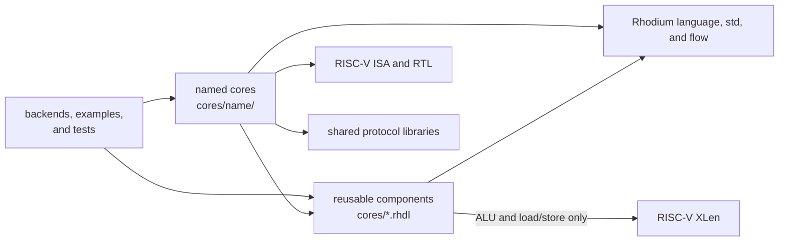

<!-- Guides contributors through placing, implementing, and validating processor components and cores. -->
<!-- SPDX-License-Identifier: Apache-2.0 -->

# Developing processor components and cores

Read the package [README](README.md) for reusable component contracts and the
current named-core catalog. This guide owns source placement, dependency
direction, extension workflow, and contributor validation.

## Choose the right home

Before adding a component, decide who owns its policy:

- Put an execution or data-shaping block directly under `cores/` only when its
  interface is useful to more than one processor and it does not depend on an
  instruction catalog, named core, backend, example, or test.
- Put instruction decode, architectural state, pipeline policy, adapters, and
  integrated tests under `cores/<name>/`.
- Put direct tests for a reusable component in [`tests/`](tests/). Put a named
  core's tests under its own `tests/` directory.

A reusable component may use the closed RISC-V `XLen` configuration when its
contract is specifically RV32/RV64, but instruction catalogs and field models
remain named-core policy. Named cores may depend on reusable blocks, Rhodium
libraries, pure RISC-V ISA/RTL support, and shared protocol libraries, but
never on another named core.

## Dependency direction



Production code must not reverse an arrow toward consumers. Neither reusable
components nor named cores may import a backend, example, or test. Backend
consumers elaborate public designs from outside this package.
[`check-boundaries.sh`](check-boundaries.sh) enforces these rules, prevents
cross-imports between named cache packages, keeps RV5Stage CHI engines
independent of private cache implementations, and keeps generated bytecode out
of `cores/`.

## Add or change a component

1. Define already-decoded physical controls and leave instruction recognition,
   operand routing, pipeline scheduling, and architectural destination policy
   with the caller.
2. Specify combinational or ready-valid timing, backpressure stability, reset,
   and exceptional fixed-width behavior in [README.md](README.md).
3. Use a host test only for pure configuration or public elaboration-time
   rejection. Test datapath results, state, backpressure, and timing through a
   CIRCT/Verilator fixture; do not snapshot internal operations just because a
   component is new.
4. Integrate the component into a named core only after its standalone contract
   is stable.

When adding a named core, create `cores/<name>/` and keep its decode, datapath,
architectural state, adapters, documentation, and tests together. Give it a
public README and companion DEVELOPING guide before adding system integration.

## Focused validation

The packed integer unit in `simd-alu.rhdl` uses guard bits around eight bytes
to perform every element width through one 72-bit adder. Eight byte comparison
pairs feed a shared reduction tree; a tapered 64/32/16/16/8/8/8/8-bit shifter
bank routes different-width operands through the same physical slots. Left
and right shifts share each slice by reversing around the right shifter.
Barrel stages select fill or wrap bits for rotation; repeating a narrow
operand across its slot makes the same network rotate at every element width.
Byte population counts and directional zero counts feed shared reduction
trees. Byte-local bit reversal also serves the permutation path, whose
remaining byte-order changes are wiring and width-selected routing.
Width-specific logic only routes operands and packs results/masks, rather than
instantiating full datapaths per width. These design techniques follow
[Saturn's integer unit](https://github.com/ucb-bar/saturn-vectors/blob/master/src/main/scala/exu/int/IntegerPipe.scala)
and [shift unit](https://github.com/ucb-bar/saturn-vectors/blob/master/src/main/scala/exu/int/ShiftPipe.scala);
the public operation and widening contracts are in [README.md](README.md#packed-simd-integer-alu).
`SimdWidenOperands` prepares one destination group without adding another ALU
or coupling widening to instruction decode. Keep RVV register layout and
architectural policy outside this reusable component. Its direct fixture
checks exhaustive byte operand pairs and directed/random wider elements,
including rotation with dirty fill controls, zero counts, byte permutations,
both widening halves, and enable remapping against independent per-element
models:

```sh
FIXTURE=simd-alu bash tests/backend/run-circt.sh --simulate-only
```

Pure host contracts can use the package tests directly. Cycle-visible behavior
is owned by the matching backend fixtures:

```sh
tools/run-racket-tests.sh cores/tests/branch-resolver-test.rhm
FIXTURES='rv32i-alu rv64i-alu load-store iterative-multiplier iterative-divider' \
  bash tests/backend/run-circt.sh --simulate-only
```

Pass several paths to one invocation when a contract spans components. The
wrapper supplies a fresh compiled root when the caller has not selected one.
After changing imports or package layout, run:

```sh
bash cores/check-boundaries.sh
```

For changes crossing reusable components and RV5Stage integration, run the
end-to-end core fixture set:

```sh
make rv5stage-test
```

Use [`rv5stage/DEVELOPING.md`](rv5stage/DEVELOPING.md) for narrower ownership
and backend-fixture guidance.
