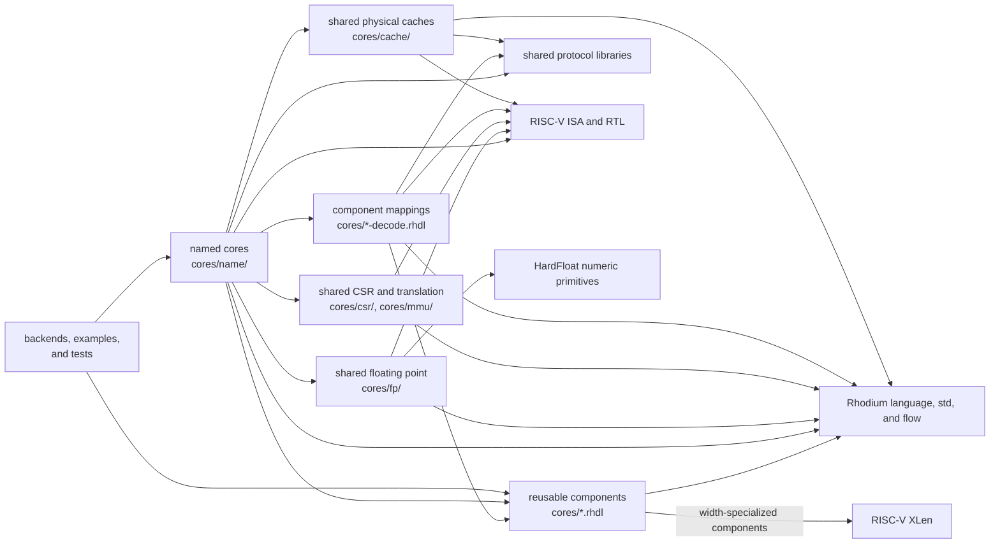

<!-- Guides contributors through placing, implementing, and validating processor components and cores. -->
<!-- SPDX-License-Identifier: Apache-2.0 -->

# Developing processor components and cores

Read the package [README](README.md) for reusable component contracts and the
current named-core catalog. This guide owns source placement, dependency
direction, extension workflow, and contributor validation.

## Choose the right home

Before adding a component, decide who owns its policy:

- Put small reusable execution blocks, data-shaping helpers, and integration
  contracts directly under `cores/`. Keep each component's instruction mapping
  beside it: `alu-decode.rhdl`, `branch-decode.rhdl`, `multiply-decode.rhdl`,
  and `divide-decode.rhdl` describe component controls, not a whole core profile.
  Numeric datapaths consume already-decoded controls; only their mappings
  import instruction catalogs.
- Put substantial shared component families in their own directories:
  [`csr/`](csr/DEVELOPING.md) owns CSR/trap state and
  [`mmu/`](mmu/DEVELOPING.md) owns translation contracts, TLBs, and PTW state;
  [`fp/`](fp/DEVELOPING.md) owns FP mappings, operand execution, and register storage.
  Organize by responsibility, not by a second ISA namespace. Shared does not
  mean ISA-independent: these families may depend on architectural `riscv/`
  definitions, but never a named core's configuration or pipeline payloads.
- Put reusable cache geometry, physical protocols, L1I/L1D state, and cache-side
  CHI engines in [`cache/`](cache/DEVELOPING.md). Completion context belongs
  to the caller and must remain opaque inside shared cache hardware.
- Put instruction decode, core-specific architectural integration, pipeline policy, adapters, and
  integrated tests under `cores/<name>/`.
- Put direct tests for root components in [`tests/`](tests/) and family tests
  under that family's `tests/` directory, including its CIRCT emitters and
  benches. Put a named core's tests under its own `tests/` directory.

A reusable component may use the closed RISC-V `XLen` configuration when its
contract is specifically RV32/RV64. Reusable component mappings may consume
architectural instruction catalogs, while complete
extension selection remains named-core policy. Named cores may depend on
reusable blocks, those mappings, Rhodium libraries, pure RISC-V ISA/RTL
support, and shared protocol libraries, but never on another named core.

## Dependency direction


```mermaid
flowchart LR
  Consumers["backends, examples,<br/>and tests"] --> Named["named cores<br/>cores/name/"]
  Consumers --> Reusable["reusable components<br/>cores/*.rhdl"]
  Named --> Reusable
  Named --> Cache["shared physical caches<br/>cores/cache/"]
  Cache --> Protocols
  Cache --> Riscv
  Cache --> Rhodium
  Named --> Mapping["component mappings<br/>cores/*-decode.rhdl"]
  Mapping --> Reusable
  Mapping --> Riscv
  Mapping --> Protocols
  Mapping --> Rhodium
  Named --> State["shared CSR and translation<br/>cores/csr/, cores/mmu/"]
  State --> Riscv
  State --> Rhodium
  Named --> FP["shared floating point<br/>cores/fp/"]
  FP --> Riscv
  FP --> Rhodium
  FP --> HardFloat["HardFloat numeric primitives"]
  Named --> Riscv["RISC-V ISA and RTL"]
  Named --> Protocols["shared protocol libraries"]
  Named --> Rhodium["Rhodium language, std, and flow"]
  Reusable --> Rhodium
  Reusable -->|"width-specialized components"| Xlen["RISC-V XLen"]
```

Production code must not reverse an arrow toward consumers. Neither reusable
components nor named cores may import a backend, example, or test. Backend
consumers elaborate public designs from outside this package.
[`check-boundaries.sh`](check-boundaries.sh) enforces these rules across root
modules and shared families, prevents imports of named-core policy, keeps CHI engines
independent of private cache implementations, and keeps generated bytecode out
of `cores/`.

## Add or change a component

Small shared integration modules remain at the root:
`chi-hart.rhdl` owns physical-region/Home mapping and requester attachment;
`misaligned-access.rhdl` owns fragment sequencing with opaque caller context;
`memory-response.rhdl` owns optional-response pairing and one-cycle LSU result capture;
`vector-layout.rhm` owns pure physical row geometry; `cosim-source.rhm` owns
passive observation declarations. None selects a named core's profile or
implements its retirement policy. Architectural encodings and stateless
architectural policy stay under `riscv/isa/` and `riscv/rtl/`.

Keep accepted split-access fragments irrevocable and retain their owner until
the response. Translation/PMA checks, interrupt/drain policy, and retirement
belong to the caller. Keep vector row geometry pure host code with an explicit
row width; it must not imply ports, SRAM, or scheduling.

`MemoryResponseCapture` joins a live caller context with its same-cycle response
or fallback. Its context output is combinational; only the result is registered.
Capture the caller's instruction/control state in parallel and rejoin at the
next stage without extra storage. Keep early fault/replay decisions and commit
authorization in the caller, and keep the physical cache response combinational.
For its RV5Stage integration, run the EX/MEM/WB load-path fixtures listed in
[`rv5stage/DEVELOPING.md`](rv5stage/DEVELOPING.md#focused-validation).

`cosim-source.rhm` bridges public core metadata and frontend read/domain APIs.
Its versioned contracts, local taps, explicit child views, and sibling contexts
are remappable read-only declarations, not capture hardware. All selected
components must share the hart's clock/reset domain. DPI producers, adapters,
event reconstruction, and reference checking belong to
[`../sims/cosim/`](../sims/cosim/DEVELOPING.md); functional declarations must not
import compiler passes, simulators, or reference models.

1. Define already-decoded physical controls and leave instruction recognition,
   operand routing, pipeline scheduling, and architectural destination policy
   with the caller.
2. Specify combinational or ready-valid timing, backpressure stability, reset,
   and exceptional fixed-width behavior in [README.md](README.md).
3. Use a host test only for pure configuration or public elaboration-time
   rejection. Test datapath results, state, backpressure, and timing through a
   CIRCT/Verilator fixture; do not snapshot internal operations just because a
   component is new.
4. Integrate the component into a named core only after its standalone contract
   is stable.

When adding a named core, create `cores/<name>/` and keep its decode, datapath,
architectural state, adapters, documentation, and tests together. Give it a
public README and companion DEVELOPING guide before adding system integration.

## Packed SIMD implementation

The packed integer unit in `simd-alu.rhdl` takes `XLen.X32` or `XLen.X64` and
specializes to that architectural width. Guard
bits around four or eight bytes isolate each element within one shared adder;
one additional top bit retains full-word carry. Byte comparison pairs feed a
shared reduction tree. The tapered shifter bank is 32/16/8/8 or
64/32/16/16/8/8/8/8 bits, routing element widths through the same slots. Left
and right shifts share each slice by reversing around the right shifter.
Barrel stages select fill or wrap bits for rotation; repeating a narrow
operand across its slot makes the same network rotate at every element width.
Byte population counts and directional zero counts feed shared reduction
trees. Byte-local bit reversal also serves the permutation path, whose
remaining byte-order changes are wiring and width-selected routing.
Width-specific logic only routes operands and packs results/masks, rather than
instantiating full datapaths per width. These design techniques follow
[Saturn's integer unit](https://github.com/ucb-bar/saturn-vectors/blob/master/src/main/scala/exu/int/IntegerPipe.scala)
and [shift unit](https://github.com/ucb-bar/saturn-vectors/blob/master/src/main/scala/exu/int/ShiftPipe.scala);
the public operation and widening contracts are in [README.md](README.md#packed-simd-integer-alu).
`SimdWidenOperands` independently sign- or zero-extends source halves, or
passes an already destination-width left source alongside one extended source,
without adding another ALU or coupling widening to instruction decode.
`SimdCompress` performs only stable word-local element compaction and returns
its selected-element count; cross-word suffixes and architectural progress
belong to the caller. Keep RVV register layout and architectural policy outside
these reusable components.

## Focused validation

The direct SIMD fixture checks exhaustive byte operand pairs and directed or
random wider elements, including rotation with dirty fill controls, zero counts, byte permutations,
both widening halves, compaction masks, and enable remapping against independent
per-element models:

```sh
FIXTURES='simd-alu simd-alu32' bash tools/testing/circt/run.sh --simulate-only
```

Pure host contracts can use the package tests directly. Cycle-visible behavior
is owned by the matching backend fixtures:

```sh
tools/run-racket-tests.sh cores/tests/branch-resolver-test.rhm
FIXTURES='rv32i-alu rv64i-alu load-store iterative-multiplier pipelined-multiplier iterative-divider' \
  bash tools/testing/circt/run.sh --simulate-only
```

Shared instruction mappings and row geometry use
`cores/tests/{alu-decode,multiply-decode,divide-decode,vector-layout}-test.rhm`.
CSR, translation, and floating-point checks are routed by their respective
[CSR](csr/DEVELOPING.md#change-workflow-and-validation) and
[MMU](mmu/DEVELOPING.md#validation) and [FP](fp/DEVELOPING.md#validation) guides. For shared split-engine changes,
cover both callers with `rv2wide-mmu` and `rv5stage-hypervisor-core` fixtures.
Changes to passive observation metadata need the cosim pass tests.

The protocol-neutral tree-PLRU policy and its `cache-replacement` fixture are
owned by [`../rhodium/std/plru.rhdl`](../rhodium/std/plru.rhdl); core cache
changes should run that fixture together with their integration fixtures.

Pass several paths to one invocation when a contract spans components. The
wrapper supplies the persistent worktree-specific root when none is selected.
After changing imports or package layout, run:

```sh
bash cores/check-boundaries.sh
```

For changes crossing reusable components and RV5Stage integration, run the
end-to-end core fixture set:

```sh
make rv5stage-test
```

Use [`rv5stage/DEVELOPING.md`](rv5stage/DEVELOPING.md) for narrower ownership
and backend-fixture guidance.
