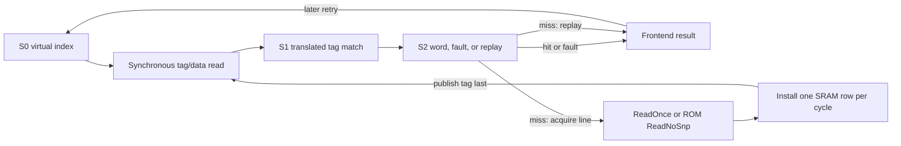

<!-- Specifies shared 32/64-bit instruction fetch blocks and software-synchronized cache snapshots. -->
<!-- SPDX-License-Identifier: Apache-2.0 -->

# Shared instruction cache

This directory owns physical instruction-block lookup, arrays, refill,
replacement, fixed-latency outcomes, flush and architectural invalidation.
Named cores own translation, instruction assembly, replay, and `FENCE.I` ordering.
The [shared cache guide](../README.md) owns geometry and CHI services; the
[CHI guide](../../../chi/README.md) owns protocol vocabulary and fabric-wide
rules.

Contributors changing the L1I implementation should read
[`DEVELOPING.md`](DEVELOPING.md).

## At a glance

| Property | Current contract |
|---|---|
| Organization | Non-aliasing VIPT, set-associative, read-only, nonsnooping instruction snapshots |
| Geometry | Power-of-two sets from 2 through 64, positive ways, fixed 64-byte lines; see [shared geometry](../README.md#entry-point) |
| Core throughput | One aligned 32-bit or 64-bit fetch block per cycle on consecutive hits |
| Core protocol | S1 `Valid` physical resolutions and S2 `Valid` word/fault/replay outcomes |
| Miss policy | One blocking line acquisition: retry-aware `ReadOnce` for coherent RAM, `ReadNoSnp` for immutable ROM |
| Response storage | Completed-word storage and replay belong to the frontend |
| Allocation | Lowest invalid way, otherwise per-set tree PLRU |
| Prefetch | Demand-priority Valid event; a miss launches ordinary `ReadOnce` refill without a response |

`L1ICache(xlen, cache, ~chi: config, ~fetch_bits: fetch_bits)` accepts physical resolutions only
for fetches whose PMA is instruction-cacheable; early virtual reads may precede that decision.
The parent hierarchy routes other executable fetches through
its non-allocating RN-I path. The cache accepts `XLen.X32` or
`XLen.X64`. The cache configuration supplies set/way geometry; the required
CHI configuration supplies flit geometry and the Home map. A separate
`node_id` input supplies the occurrence's RN-I identity. Core addresses use
XLEN, while emitted CHI requests use the configured CHI request-address width
and assert that the original physical address fits. Geometry validation also
requires XLEN to leave at least one tag bit above the line offset and set index.

```rhdl
import:
  lib("cores/cache/l1i/cache.rhdl") open
  lib("cores/cache/config.rhm") open
  lib("riscv/isa/xlen.rhm") open
inst instructions(L1ICache(XLen.X64, CacheConfig(32, 2), ~chi: config, ~fetch_bits: 64))
```

`fetch_bits` is required and supports 32 or 64, independently of XLEN.
Requests must be aligned to `fetch_bits / 8`; blocks never cross cache lines or
4-KiB pages. The low-order bits contain the lowest-address bytes. The caller
selects instruction parcels and combines separately checked blocks for crossing
instructions. RV5Stage selects 32 bits; RV2Wide selects 64 bits without imposing
its assembly or issue policy here.

## Core-facing protocol

[`protocol.rhdl`](protocol.rhdl) defines the cache's
`InstructionCacheLookup(address_width, fetch_bits)` interface:

| Direction | Member | Meaning |
|---|---|---|
| Requester → cache | `request: Valid(InstructionCacheReq)` | S1 permitted, block-aligned physical address |
| Frontend → cache | `s1_kill` | Cancel the younger S1 lookup, without canceling S2 or accepted refill work |
| Frontend → cache | `flush` | Kill speculative lookups and detach the refill's fault consumer; a simultaneously accepted virtual lookup starts the new fetch epoch |
| Frontend → cache | `invalidate_all` | Also invalidate resident lines and prevent old refill installation |
| Cache → requester | `response: Valid(InstructionCacheResult)` | Registered S2 `data`, `access_fault`, and `replay`; never backpressured |

The separate `virtual_lookup: Decoupled(Bits(XLEN))` port launches S0 SRAM
reads without waiting for ITLB/PMA resolution. A surviving S1 physical request
must match its preceding read's page offset; assertions enforce pairing and
unique physical-tag hits. Translation rejection, uncached selection, or
`s1_kill` discards an unresolved read without allocation.
The physical result contains no page-fault or guest-state fields. Translation
and architectural fault provenance are supplied by the caller's memory router.

The separate `prefetch: Valid(CachePrefetchReq)` port accepts best-effort
physical instruction prefetches, lower priority than live virtual demand.
Prefetches never return an architectural result.

## Data path and arrays

S0 reads the virtual index, S1 compares translated tags, and S2 registers the
word, hit decision, or miss context. Each surviving lookup produces one S2
outcome. A miss returns replay immediately and may launch one blocking
line refill. A refill does not produce an eventual response for that attempt:
after installation, a frontend retry obtains the word through the hit path.
Response storage belongs to the frontend, so Decode readiness has no path to
SRAM admission.

The tag array and valid bits hold one entry per way and set. There is no CHI ownership-state array. The
byte-masked data array has `sets * (64 / row_bytes)` rows, with
`row_bytes = max(XLEN, fetch_bits) / 8` per way. Parallel comparisons select
the hit way; assertions reject duplicate valid tags. A 32-bit fetch from a
64-bit row uses address bit 2; otherwise the selected row is the full block.

S0 admission depends on registered refill/installation state, not S1 tag
comparison. Installation and SRAM lookup are mutually exclusive.
A prefetch reuses the blocking refill path without producing a response.

This diagram illustrates the current lookup/refill flow. A miss reports
replay immediately; the completed line is installed before a later frontend
attempt can hit. Accepted CHI work is never canceled by a fetch flush.



## Refill and replacement

Every coherent-RAM miss issues one 64-byte `ReadOnce`. The [snapshot engine](../chi/line-read.rhdl)
retains its line address and context through retry, collects every `CompData`
packet, and sends `CompAck` before exposing the result. The response grants no
coherent ownership or dirty responsibility. With 128-bit DAT, four packets form
a line. A demand read error is retained until a matching replay receives one instruction
access fault, without allocation;
prefetch errors are discarded without an architectural response.
Immutable ROM uses the same arrays and installation path after a 64-byte
`ReadNoSnp`, with no coherent ownership or `CompAck`. ROM data reads remain
uncached. Prefetch permissions remain the caller's responsibility.

Installation writes one SRAM row per cycle—eight writes for a 64-bit row or
sixteen for a 32-bit row—and publishes the tag and valid bit only on the final
word. Allocation selects the lowest invalid way before using the set's
tree-PLRU victim. Every admitted resident hit and successful installation marks
its way most recently used. Prefetch hits participate; discarded or failed
refills and non-allocating events do not. Non-power-of-two associativities use a
padded tree whose unused leaves are never eligible victims.

## Flush and architectural invalidation

The two controls deliberately have different residency effects:

| Event | Lookup and response state | Active refill | Resident lines |
|---|---|---|---|
| `s1_kill` | Kill only the younger S1 lookup | Preserve ownership and fault consumer | Preserve |
| `flush` | Kill old lookup stages and retained fault; preserve a simultaneous replacement lookup | Drain and install, but discard a detached consumer's error | Preserve |
| `invalidate_all` | Apply all flush behavior while permitting a simultaneous replacement lookup | Drain without installing or returning the pre-invalidation line | Invalidate all ways and reset replacement state |
| Reset | Clear lookup, fault, refill-tracking, and installation state | Reset transaction state | Invalidate all ways and reset replacement state |

The parent core implements `FENCE.I` by first waiting for L1D quiescence, then
asserting this local `invalidate_all` control and redirecting Fetch. A
speculative redirect uses `flush` instead, so wrong-path activity does not
silently become architectural invalidation. In either case, a virtual lookup
accepted with the control belongs to the new epoch; an invalidating lookup sees
the cleared residency state when its translated S1 request arrives.

## Coherence and synchronization

L1I is an RN-I requester, not a coherent sharer. The Home services `ReadOnce`
through coherent D-cache intervention when needed, but does not track the
instruction snapshot. Outer-cache replacement cannot invalidate it. Local
replacement, reset, and `FENCE.I` can discard it.

`FENCE.I` first orders older accesses, invalidates the instruction cache and
fetch pipeline, and prevents all pre-fence refills from installing or returning
instructions. Accepted CHI requests drain normally; cancellation never abandons
a transaction. Post-fence refills consult dirty D-cache owners, so synchronization
does not require writing the whole D-cache back to RAM. Other harts synchronize
their own instruction streams separately.

## Deliberate limits

- Prefetches are not buffered, cannot run under a miss, and may delay a later
  demand once an admitted miss has launched its blocking refill.
- The cache has no hit-under-miss or autonomous prefetcher.
- Core-initiated invalidation is whole-cache only; there is no selective form.
- L1I and L1D have no direct connection. Coherent snapshot reads go through Home;
  instruction synchronization is owned by the parent core.
- Translation and alignment faults belong to the parent fetch/MMU path.
  The cache reports read-completion errors as instruction access faults.
