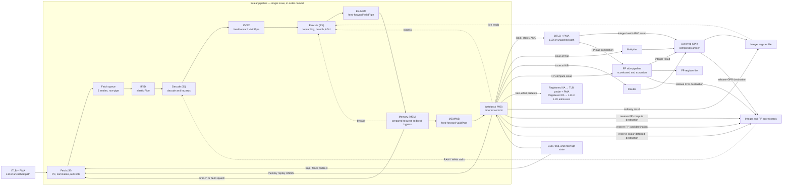
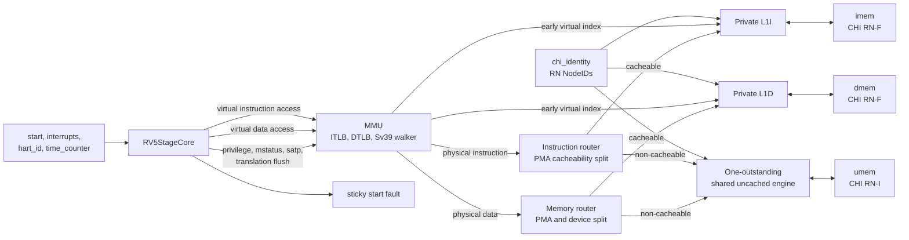

<!-- Defines RV5Stage's public microarchitecture, system boundary, and supported behavior. -->

# RV5Stage

RV5Stage is a single-issue, in-order, five-stage RISC-V processor implemented
as one authoritative Rhodium RTL circuit. A required `xlen :: XLen` host
parameter selects RV32 or RV64 without admitting arbitrary integer widths.
Optional floating-point, half-precision, and compressed-instruction parameters
specialize the same scalar pipeline with a parallel FP execution engine and
variable-length Fetch.

Core-specific decode, architectural state, pipeline policy, MMU, and private L1
caches live here. Reusable execution components remain directly under
[`cores/`](../).

Contributors changing the core should read
[`DEVELOPING.md`](DEVELOPING.md).

## At a glance

| Property | Contract |
|---|---|
| Pipeline | Fetch, Decode, Execute, Memory, Writeback |
| Issue and retirement | Single issue; ordered WB commit |
| Pipeline boundaries | Producer-owned fetch queue and elastic IF/ID, then feed-forward ID/EX, EX/MEM, and MEM/WB |
| Deferred work | Loads, atomics, multiply, divide, and FP results may complete after their scalar token retires |
| Integer widths | RV32 and RV64 selected by `XLen.X32` or `XLen.X64` |
| Floating point | Disabled by default; RV32F or RV64D, with optional Zfhmin, Zfh, or Zfa |
| Address translation | Bare for RV32; Bare or Sv39 for RV64 |
| Private caches | Separate configurable L1I and blocking write-back L1D; fixed 64-byte lines; demand-priority Zicbop admission |
| External memory | Separate instruction and data CHI RN-F channels plus a shared uncached RN-I channel |

The integer decode includes RV32I/RV64I, A, B, M, Zicond, Zimop, Zicsr, Zifencei, and
the supported privileged instructions. Optional Zicbop decode turns its
otherwise legal `ORI x0` hints into best-effort WB-authorized prefetch events.
Optional C expansion follows the
selected XLEN and FP profile; RV32F or RV64F and RV64D rows, plus optional
Zfhmin, Zfh, and Zfa rows, are added only by their matching FP specialization. Zicntr
views come from the CSR block rather than instruction rows. The
[`decode guide`](decode/README.md#select-a-decode-specialization) owns the exact
specialization matrix and catalog composition. RV32D and an RV64F-only core are
deliberately rejected.

## Microarchitecture

The five logical stages are regions of one [`RV5StageCore`](core.rhdl) circuit,
not module boundaries. Scalar tokens issue and reach WB in order, while
selected register-producing operations may complete later through explicit
scoreboards and a completion arbiter.



### Stage contract

| Region | Output boundary | May hold? | Primary responsibility |
|---|---|---:|---|
| Fetch | Five-entry `Queue`, then IF/ID `Pipe` | Yes | Producer-owned PC generation, L1I request correlation, and redirect flushing |
| Decode | ID/EX `ValidPipe` | No | Structured decode, serialization, RAW/WAW hazard checks, and local execution-resource reservation |
| Execute | EX/MEM `ValidPipe` | No | Live operand reads, forwarding, ALU, branch resolution, address generation, local synchronous-fault classification, FP operand preparation, and structural replay |
| Memory | MEM/WB `ValidPipe` | No | Prepared-request staging, branch recovery, early fault/replay squash, and bypass |
| Writeback | Ordered commit | At defined architectural waits | Memory/FP dispatch, translation and access faults, replay, register/CSR effects, traps, fences, and deferred reservations |

Within the pipeline, the nonbackpressured pipeline token uses `Valid` flow transforms
for fanout, filtering, and payload mapping. Ready-sensitive architectural
decisions remain explicit: in particular, an L1D request that is not ready
becomes a replay, so its request boundary must not turn readiness into EX/MEM
backpressure.

Fetch retains up to two ordered, aligned instruction words in a flushable
window so the physical instruction hierarchy can preserve response order while
the pipelined L1I accepts and returns one hit per cycle. Redirects clear that
window and flush the MMU, instruction-router, L1I lookup, and buffered-response
state. A wrong-path refill may finish internally but cannot return an
instruction to Fetch; an in-flight uncached read is drained without publishing
its response.

Decode holds an instruction in IF/ID until its operands and locally reserved
execution resources are available. Once admitted, its ID/EX token advances on
the next edge. ID/EX stores register indices rather than captured values;
Execute reads the integer register file live and applies MEM and WB forwarding.

Once Execute transfers an instruction into EX/MEM, no later scalar stage can
backpressure it. Execute prepares branch decisions, effective virtual addresses,
integer and FP operands, and locally classified faults. Memory stages those
values and performs branch recovery and integer bypass; it does not authorize
memory requests or FP execution.

WB is the boundary where an instruction becomes nonspeculative. Loads, stores,
LR/SC, AMOs, block zero, FP execution, and prefetch hints issue only from WB.
This includes loads because a translated address may select a side-effecting
device. CSR changes, fences, integer writes, and deferred destination reservations
also occur at WB or later. Early operand reads, instruction fetching, translation
bookkeeping, and autonomous cache/coherence activity are not architectural
instruction effects and remain independent.

A WB memory attempt performs translation and permission checks. A page/access
fault traps without authorizing a physical request; an unavailable resource
replays from the original PC without retirement or destination reservation.
Accepted requests execute exactly once and are never replayed. FP computation
uses the same accepted-or-replay rule. Deferred results can finish after younger
independent instructions, but all dispatch and scalar retirement remain ordered.
Late CHI bus-error handling remains the separate existing transport contract;
this boundary does not introduce a reorder buffer or precise late bus faults.

## Execution and completion

| Result class | Dispatch point | Completion path |
|---|---|---|
| Integer ALU, branch link, immediate, and ordinary CSR result | Scalar pipeline | Ordinary WB register-file port |
| Load or atomic result | Memory request and GPR reservation accepted at WB | L1D or uncached response to the deferred completion arbiter |
| Multiply or divide | Execution resource reserved in Decode; GPR reserved and request issued at WB | Deferred completion arbiter |
| FP result targeting an integer register | FP request and GPR reservation accepted at WB | FP completion to deferred completion arbiter |
| FP result targeting an FP register | FP request and FPR reservation accepted at WB | FP pipeline's internal FP register-file port |
| FP load | Memory request and FPR reservation accepted at WB | Memory response to FP pipeline's load port |

The fixed-priority deferred arbiter gives integer memory responses priority
because they cannot be backpressured. Multiplier, divider, and FP integer
responses remain stable until selected. Its output drives the second integer
register-file write port and clears the corresponding scoreboard entry. The
ordinary WB result uses the other write port. WAW gating prevents both ports
from targeting the same register in one cycle, and a WB-aligned cache hit can
set and clear a destination without an extra busy cycle.

[`fetch.rhdl`](fetch.rhdl) keeps a two-entry window of ordered, aligned L1I
words and a five-entry flow-through queue of assembled instructions. Fetch
advances when that producer-owned queue accepts an instruction, so Decode
backpressure can drain or fill the queue but cannot combinationally control the
next L1I request. With C enabled Fetch can reuse either halfword, assemble a
32-bit instruction that straddles adjacent words, and expand legal compressed
instructions before the ordinary decoder. It retains the original 16-bit word
for illegal-instruction trap values, reports second-word faults precisely, and
flushes retained, queued, or outstanding wrong-path data on redirects.

The optional [FP subsystem](fp/README.md) owns the FP register file, FPR
scoreboard, execution lanes, LSU bridges, and completion arbitration. FP
requests attempt dispatch at WB. A structurally rejected request replays without
retirement or reservation; an accepted request is nonspeculative and must
eventually complete. FP state updates accrue exception
flags and mark `mstatus.FS` dirty.

FP loads and stores share the scalar address generator, MMU, PMA checks, ordered
L1D, and uncached path. An FP load reserves its destination only when its WB
request is accepted. Decode probes an FP store's one-cycle register-file read
while the instruction is present, aligning its data with the instruction in EX;
a missing or stale response replays instead of holding EX. The cache data path
remains XLEN-wide: half and single stores occupy its low 16 or 32 bits, and half
and single loads are NaN-boxed into
the selected 32- or 64-bit FP register width. Exact precision metadata follows
a load through the MMU and cache response path.

## Control, hazards, and ordering

Decode stalls on scoreboard RAW and WAW hazards and on direct conflicts with
deferred instructions still crossing ID/EX or EX/MEM. Independent younger
instructions may proceed while a load, multiply, divide, or FP result remains
outstanding. D-cache responses are ordered, and a blocking miss prevents younger
memory requests from entering the cache even when non-memory work can pass it.

A data request never carries downstream readiness back through EX/MEM. If WB
cannot dispatch it because of a DTLB miss, walker ownership, cache pressure, or
an unavailable FP-load reservation, WB squashes younger work and refetches the
instruction without retiring it.
The initial DTLB-miss attempt is still sufficient to start the page-table walk;
subsequent refetches replay until the translation or other resource is ready.

The structured decoder selects the integer-only, RV32F, or RV64D base catalog
and optionally composes Zfhmin, Zfh, or Zfa at host elaboration. It emits component
control bundles through one hardware decode relation, without an
instruction-kind enum or parallel runtime decoders. Unused controls remain
synthesis don't-cares behind a separate valid bit.

Standard B and Zicond operations reuse the shared combinational
[`ALU`](../alu.rhdl). Zba, Zbb, Zbs, and Zicond add no second decoder, execution
unit, pipeline state, reservation, or scoreboard path. A operations use the
semantic memory machinery in [`memory.rhdl`](memory.rhdl) and return through the
same deferred path as loads.

CSR instructions return the old value and update state atomically at WB. System
instructions serialize in Decode and wait for older deferred work before
entering the pipeline. Execute-detected exceptions cross EX/MEM before Memory
squashes younger work. Data page and access faults are instead classified from
the registered virtual request at WB. CSR state records EPC, cause, and trap
value after older authorized memory and register-producing work has drained.
Eligible interrupts stop Fetch and Decode, drain the scalar pipeline and all
authorized memory/compute work, and enter the trap after the last retired
instruction. A legal `WFI`
retires at that same serialization boundary and then holds Fetch and Decode
until an individually enabled interrupt becomes pending. WFI wakeup ignores
global interrupt-enable and delegation state; an eligible interrupt enters its
handler with EPC equal to the instruction after `WFI`, while a globally masked
wake resumes that instruction directly. U-mode `WFI` and S-mode `WFI` with
`mstatus.TW` set raise an illegal-instruction exception.

`FENCE`, `FENCE.I`, and `SFENCE.VMA` share the serialization boundary. Decode
waits for older deferred completions and L1D quiescence, then prevents younger
instructions from entering Execute until the fence reaches WB. `FENCE.I` also
invalidates L1I and redirects Fetch to the fence's `pc + 4`; speculative fetch
flush and architectural cache invalidation remain distinct operations.

## System-facing composition

[`rv5stage.rhdl`](rv5stage.rhdl) wraps `RV5StageCore` with address translation,
physical-region routing, private caches, and CHI transaction boundaries:



`RV5StageCHIConfig` supplies the flit shape and a single list of physical
regions paired with CHI Homes. From that list it derives both the RISC-V
physical-memory map and `CHIHomeMap`, preventing permissions, cacheability, and
CHI routing from describing different address ranges. Cache transactions decode
their address once and retain the selected HN-F NodeID through retry, data, and
completion acknowledgement. The [RV5Stage CHI contract](chi/README.md) owns
endpoint configuration and shared transaction behavior.

`RV5StageCHIParams` contains host-only placement metadata for instruction and
data RN-F NodeIDs and the optional uncached RN-I NodeID. An occurrence receives
those values through `RV5StageCHIIdentity` hardware inputs, allowing one
specialized core definition to be stamped at multiple placements.

### Generator parameters

[`profile.rhm`](profile.rhm) defines the immutable `RVCoreProfile` host
model: XLEN, effective ISA extensions, MMU mode, and independent instruction
and data cache geometry. It validates supported combinations, derives the
canonical ISA extension list and `misa` value, and is the sole architectural
specialization input to `RV5Stage` and `RV5StageCore`.

| Parameter | Meaning |
|---|---|
| `profile.xlen` | Required `XLen.X32` or `XLen.X64` architectural width |
| `profile.extensions` | Floating-point, half-precision, Zfa, Zicbop, Zicboz, and compressed-extension selection; Zicbop and Zicboz default to disabled |
| `profile.mmu_mode` | `Bare` or, for RV64, `Sv39` translation behavior |
| `profile.cache_geometry` | Independent L1I and L1D set and way geometry |
| `~chi` | Required physical flit, address-region, and Home-routing policy |

All supported compressed-extension selections include Zca and permit two-byte
instruction alignment. A Zca-only integer core may advertise `misa.C`; once F
or D is present, `misa.C` is advertised only by the complete C composition
containing the corresponding Zcf or Zcd subset. Zcb is independently selected
and uses the same canonical 32-bit decode and execution paths. Zcmop is also
independently selected, expands its eight encodings to a canonical no-effect
instruction, and does not depend on Zimop. Neither extension affects `misa.C`.

Cache line size is fixed at 64 bytes and is not a generator parameter. Each way
contributes one XLEN-wide word to a data-array row, and a core lookup selects one
such word, so installation takes eight RV64 or sixteen RV32 SRAM writes. A
refill contains four, two, or one DAT packet for a supplied 128-, 256-, or
512-bit CHI data width, respectively; the default `CHIFlitParams()` width is 128
bits.

### UDB configuration

[`udb.rhm`](udb.rhm) projects an `RVCoreProfile` into a Unified Database fully
configured architecture. The profile selects XLEN, FP, compressed, and MMU
extensions. The projection adds the core's fixed architectural behavior,
including U/S/M privilege, direct-only `mtvec` and `stvec`, read-only `misa`,
no PMP or HPM counters, trapping misaligned accesses, exact-address-and-width
LR/SC reservations, and the implemented base counters. Physical address width
and PMA granularity remain explicit inputs because they are properties of the
core's integration rather than `RVCoreProfile`.

The projection conservatively declares `S` and `Sm` 1.11. RV5Stage faults on
unset Sv39 A/D bits, but does not advertise the post-1.12 `Svade` extension
name because the core does not yet implement the mandatory 1.12 `mconfigptr`
and RV32 `mstatush` CSRs.

Generate the configuration for one checked-in SoC composition from the
repository root:

```sh
make riscv-udb-config RISCV_UDB_CONFIGURATION=simple-soc
```

The [SoC UDB configuration catalog](../../socs/README.md#risc-v-udb-configuration-catalog)
documents the available keys and output controls. Its RV5Stage entries read
the selected SoC's actual core profile and CHI request-address width and use a
PMA granularity of three, matching the shared platform's smallest eight-byte
PMA region.

The generated configuration is the architectural input to ACT4 test
selection. It is not the entire ACT target bundle: simulator macros, linker
and Sail configuration, and the execution command remain simulation-owned.

### Top-level ports

| Port | Contract |
|---|---|
| `chi_identity` | Placement-specific instruction RN-F, data RN-F, and uncached RN-I NodeIDs |
| `start` | One-shot `Irrevocable(Bits(xlen.width))` initial-PC consumer; four-byte aligned, or two-byte aligned with C |
| `interrupts` | Controller-independent supervisor and machine software, timer, and external interrupt levels |
| `hart_id` | Platform hart identity exposed through `mhartid` |
| `time_counter` | Platform 64-bit time source exposed through `time` and RV32 `timeh` |
| `imem` | Instruction-cache CHI RN-F channels |
| `dmem` | Data-cache CHI RN-F channels |
| `umem` | Shared instruction/data uncached CHI RN-I channels |
| `fault` | Sticky rejection of a misaligned external start address |

Home Nodes, physical credited links, fabric topology, interrupt controllers,
and SoC policy remain outside RV5Stage.

## Memory hierarchy

Both L1 caches are non-aliasing virtually indexed, physically tagged (VIPT).
`RV5StageCacheConfig` rejects `sets * 64 > 4096`: the line offset and set index
must fit within a 4 KiB page, even for Bare profiles. Thus 64 sets is the maximum;
more ways increase total capacity without adding virtual index bits. Physical
tags retain every address bit above the set index, including page-offset bits
not consumed by smaller geometries. MiniSoC's 32-set, one-way caches remain 2 KiB.

RV64 supports Bare and Sv39 translation; RV32 remains Bare. Early virtual
lookups reach the SRAMs independently of translation and physical-region checks.
A permitted physical request is paired with the read at the clock edge; only
that resolved token can subsequently match physical tags or initiate a refill.
Unresolved or rejected reads have no completion or cache-state effect. Separate eight-entry fully
associative ITLB and DTLB instances retain PTE permissions and recheck current
privilege, `SUM`, and `MXR`. A single non-speculative walker services one miss at
a time through the shared physical data path after older cache or uncached work
drains; cacheable PTE reads then use L1D. A DTLB miss
starts that walk and returns an unaccepted request to the core, whose ordered
replay mechanism refetches the memory instruction until the lookup completes.
See the
[`MMU contract`](mmu/README.md) for translation, permission, and fault ownership.

L1I is a clean-only, one-hit-per-cycle instruction cache with flushable lookup
and response state. Executable non-cacheable regions bypass it as aligned
four-byte `ReadNoSnp` requests and never allocate a line. Such regions must be
read-idempotent; a typical BootROM PMA is readable, executable, non-cacheable,
non-atomic, non-device, and read-idempotent. L1D is a blocking write-back/
write-allocate cache supporting loads, stores, LR/SC, and AMOs. All
non-cacheable instruction and data requests arbitrate onto the same
one-outstanding RN-I engine, with a presented data request taking priority.
Unmapped, denied, or non-cacheable atomic requests fault locally
instead of entering CHI.

With Zicboz enabled, `cbo.zero` zeros the entire naturally aligned 64-byte block
containing `rs1`. It uses the ordinary store-translation path, with no scalar
alignment requirement or register result. M-mode may always execute it;
S-mode requires `menvcfg.CBZE`, and U-mode requires both `menvcfg.CBZE` and
`senvcfg.CBZE`. These bit-7 fields reset to zero and are read-only zero when
the extension is disabled. Other environment-configuration fields remain zero.
The original virtual address is retained for store page/access faults.

The PMA router requires write permission and explicit block-zero support
over the complete block before accepting any side effect. Normal SoC RAM
supports block zero; ROM and devices do not. Cacheability is independent:
L1D zeros an exclusively owned line and retains it dirty, while uncached RAM
uses eight acknowledged 64-bit writes and produces one completion. The memory
path stays undrained throughout either operation. Fences wait for both
in-pipeline memory instructions and accepted memory work. Block zero does not
provide instruction-cache synchronization; modified code still needs FENCE.I.

With Zicbop enabled, `RV5StageCore` computes the virtual prefetch address in
Execute and, at WB, emits `Valid(CachePrefetchReq(xlen.width))`. This event has no
backpressure, response, or architectural-fault path. `RV5StageMmu` translates
Bare addresses or probes the operation-selected existing TLB entry; a miss,
permission denial, non-cacheable PMA, or intended-operation PMA denial drops
the event without walking or faulting. The accepted physical event is aligned
to its 64-byte line and routed to L1I for `PREFETCH.I` or L1D for
`PREFETCH.R/W`. The MMU registers hints both before translation and before cache
delivery; its [prefetch contract](mmu/README.md#best-effort-prefetch-probes)
defines the two-cycle latency and cancellation rules.

Demand requests always win each cache lookup port. An admitted L1I hint may
launch `ReadClean`; an admitted L1D read hint may launch `ReadClean`, while a
write hint may launch `ReadUnique` and retain the result as UniqueClean. Hits
produce no response, refills allocate without an architectural completion, and
L1D drops a hint that would require writing back a dirty victim.

The parent core owns only integration-level ordering. Array organization,
replacement, refill, dirty writeback, snoop behavior, DVM handling, and CHI
response stability are specified by the subsystem documents:

- [`icache/README.md`](icache/README.md) — instruction protocol and clean L1I
- [`dcache/README.md`](dcache/README.md) — data protocol and write-back L1D
- [`mmu/README.md`](mmu/README.md) — Sv39 translation and L1D walker arbitration
- [`chi/README.md`](chi/README.md) — shared CHI configuration, cache transaction
  engines, snoop handling, and uncached RN-I access

## Privileged and architectural state

[`csr.rhdl`](csr.rhdl) owns user, machine, and supervisor CSRs, current
privilege, trap entry, interrupt selection, and `MRET`/`SRET`. FP profiles add
the aliased `fflags`, `frm`, and `fcsr` views, `mstatus.FS` state, and derived
`SD`. The `csr_bank` declaration is the single source for recognized IDs, read
values, storage, aliases, WARL masks, and ordinary write dispatch.

The integer register file has 32 XLEN-wide registers with `x0` hardwired to
zero. An FP profile adds 32 raw FLEN-wide registers (32 bits for F, 64 bits for
D), but FP instructions and FP CSRs remain illegal while `mstatus.FS` is Off.
Accepted FP state changes mark FS Dirty, and `misa` reports the selected C, F,
and D features.

The core consumes controller-independent interrupt levels defined by
[`interrupt.rhdl`](interrupt.rhdl). CSR state combines them with writable
pending bits and applies enables, delegation, privilege, and architectural
priority. Reusable 64-bit `mcycle` and `minstret` state supplies Zicntr views;
`minstret` advances only when an instruction reaches WB without a synchronous
exception.

## Implementation map

Source ownership and dependency enforcement moved to
[`DEVELOPING.md`](DEVELOPING.md#implementation-map). This heading remains for
existing links.

## Generated detailed diagrams

Contributor diagram generation moved to
[`DEVELOPING.md`](DEVELOPING.md#generated-detailed-diagrams).

## Verification

Contributor host, CIRCT, and Verilator workflows are documented in
[`DEVELOPING.md`](DEVELOPING.md#focused-validation). SoC-level architectural
and FESVR simulation belongs to the [simulation guide](../../sims/README.md).

## Deliberate limits

- RV32D and RV64F-only core specializations are rejected.
- PMP, Zihpm performance counters, vectored trap mode, and platform interrupt
  controllers remain outside this slice.
- `WFI` quiesces instruction issue but does not gate the core clock; physical
  clock gating and always-on wake distribution remain platform policy.
- Sv48/Sv57, nonzero ASIDs, hardware A/D updates, PBMT, NAPOT, multi-hart
  shootdown, and speculative page-table walks are not implemented.
- `SFENCE.VMA` and `satp` writes conservatively flush both TLBs completely.
- Zicbop translation is TLB-hit-only and never launches a page-table walk;
  hints may be dropped under translation, PMA, lookup, refill, snoop, response
  capacity, or dirty-victim pressure.
- The private caches do not implement hit-under-miss or autonomous prefetching;
  detailed cache-specific limits are maintained in their owning READMEs.
