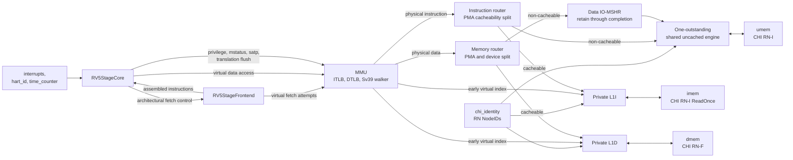

<!-- Defines RV5Stage's public microarchitecture, system boundary, and supported behavior. -->
<!-- SPDX-License-Identifier: Apache-2.0 -->

# RV5Stage

RV5Stage is a single-issue, in-order, five-stage RISC-V processor implemented
with a frontend and an execution core in ordinary Rhodium RTL. A required `xlen :: XLen` host
parameter selects RV32 or RV64 without admitting arbitrary integer widths.
Optional floating-point, half-precision, and compressed-instruction parameters
specialize the same scalar pipeline with a parallel FP execution engine and
variable-length Fetch.

Core-specific decode, architectural state, pipeline policy, MMU, and private L1
caches live here. Reusable execution components remain directly under
[`cores/`](../).

Contributors changing the core should read
[`DEVELOPING.md`](DEVELOPING.md).

The opt-in [vector path](vector/README.md) provides configurable VLEN,
a flat XLEN-bit register bank with three general reads and a dedicated `v0` mask
shadow, SIMD packing, and opt-in WB-owned `vset*`/CSR
and same-width integer execution. One macro travels through the scalar pipeline
as a side-effect-free launch token, then WB starts a separate
[`vector.rhdl`](vector.rhdl) pipeline containing the sequencer,
SIMD datapath, and vector bank. The allocated macro unrolls autonomously through
local feed-forward execution and memory stages; scalar stages do not carry its
micro-ops. Compute, including owner-scoped reductions, hands the sole sequencer
to its successor when its tail beat issues, while completion slots retain older
issued work. Replayable memory and explicitly checkpointed cross-beat operations
remain serialized. Nonfaulting certification lets independent scalar instructions retire
while the macro executes in the background. Contiguous one- or two-page memory
ranges use retained page translations; other memory forms keep precise
element-wise execution. See the [vector ownership contract](vector/README.md#execution-ownership)
for certification, deferred destinations, and scalar ordering barriers.
Vector memory arbitrates for scalar LSU lookup and dispatch across unit-stride,
strided, indexed, segmented, and fault-only-first forms, with tagged
completion slots, precise element restart, and fault-only-first VL truncation. The host profile's
`~vector_completion_slots` selects a power-of-two depth, default eight,
independently of VLEN. RV64D also shares scalar FP execution for same-width
FP32/FP64 vector add, subtract, and multiply, with locally accepted operands and
scheduled VRF writes and completion-time flag updates. Vectors also share the profile-selected
integer multiplier and iterative divider for SEW8/16/32/64 `.vv` and `.vx`
operations, with independent arbitration and reserved completion ownership.
`VectorProfile` selects
one of the five standard Zve profiles or complete V 1.0, advertises its implied
Zve closure and cumulative `Zvl<N>b` minimum lengths, and constrains ELEN and FP
legality accordingly. Only `VectorProfile.V` advertises `V` and sets `misa.V`.
`profile.vector_extensions` independently enables `Zvfhmin`, which admits only
the standard F16-to-F32 widening and F32-to-F16 narrowing conversions, or full
`Zvfh`, which admits the standard FP vector surface at SEW=16 plus its six
SEW=8 widening/narrowing integer conversions. `Zvbb` independently enables
the vector basic bit-manipulation operations through the shared packed SIMD
datapath while advertising the required `Zvkb` subset. The default remains
`VectorProfile.None` with no orthogonal vector extensions.

## At a glance

| Property | Contract |
|---|---|
| Pipeline | Fetch, Decode, Execute, Memory, Writeback |
| Issue and retirement | Single issue; ordered WB commit |
| Pipeline boundaries | Flow-through raw-packet queue and core parcel buffer directly into Decode, then feed-forward ID/EX, EX/MEM, and MEM/WB |
| Deferred work | Loads, atomics, multiply, divide, and FP results may complete after their scalar token retires |
| Integer widths | RV32 and RV64 selected by `XLen.X32` or `XLen.X64` |
| Floating point | Disabled by default; RV32F or RV64D, with optional Zfhmin, Zfh, or Zfa |
| Vector | Disabled by default; opt-in Zve32x on RV32; Zve32x/f, Zve64x/f/d, or V 1.0 on RV64; power-of-two VLEN from twice XLEN through 65536 bits |
| Address translation | Bare for RV32; Bare or Sv39 for RV64 |
| Private caches | Separate configurable L1I and single-miss write-back L1D with independent load hit-under-miss; fixed 64-byte lines; demand-priority Zicbop admission |
| External memory | Instruction RN-I snapshot reads, data RN-F coherence, and a separate shared uncached RN-I channel |

The integer decode includes RV32I/RV64I, A, B, M, Zicond, Zimop, Zicsr, Zifencei, and
the supported privileged instructions. Optional Zicbop decode turns its
otherwise legal `ORI x0` hints into best-effort WB-authorized prefetch events.
Optional Zicbom adds `CBO.CLEAN`, `CBO.INVAL`, and `CBO.FLUSH`; enable it with
`RV5StageExtensions(~zicbom: #true)`. It remains disabled by default.
Optional C expansion follows the
selected XLEN and FP profile; RV32F or RV64F and RV64D rows, plus optional
Zfhmin, Zfh, and Zfa rows, are added only by their matching FP specialization. Zicntr and Zihpm
views come from the CSR block rather than instruction rows. The
[`decode guide`](decode/README.md#select-a-decode-specialization) owns the exact
specialization matrix and catalog composition. RV32D and an RV64F-only core are
deliberately rejected.

## Cache-block and reservation bounds

Every RV32 and RV64 profile advertises **Zic64b 1.0.0** and **Za64rs 1.0.0**,
including profiles without CMO instructions. These describe existing hardware;
they add no opcodes, CSRs, `misa` bits, or enable switches.

Zic64b fixes the naturally aligned cache block at 64 bytes across L1I, L1D,
refill/writeback, and cache-block operations. Cache capacity and associativity
remain configurable, but line size does not. Za64rs bounds a contiguous,
naturally aligned reservation set to **at most** 64 bytes, not exactly 64.
RV5Stage reserves the naturally aligned LR access (4 bytes for LR.W, 8 for
RV64 LR.D) and requires SC to match its physical address and width. Conservative
same-line invalidations may also cause SC failure; the
[L1D reservation contract](dcache/README.md#lrsc-reservation) describes them.
This size guarantee does not establish Ziccrse's LR/SC forward-progress guarantee.

Profile-derived device trees advertise `zic64b` and `za64rs`. UDB includes their
exact versions, the implied weaker `Za128rs` bound, a 64-byte `CACHE_BLOCK_SIZE`
even without CMO decode, and the access-sized `LRSC_RESERVATION_STRATEGY`.
Definitions follow the [ratified profiles](https://docs.riscv.org/reference/rvb23/v1.0/rvb23.html).

UDB 0.1.16 has an applicability inconsistency for CMO-free profiles: Zic64b
requires `CACHE_BLOCK_SIZE`, but that database defines the parameter only for
Zicbom/Zicbop/Zicboz. The projection retains the truthful hardware value;
validation of those CMO-free configurations requires a corrected UDB definition.
The concrete SoC profiles enable CMOs and are unaffected.

## Coherent main-memory guarantees

`RV5StageExtensions(~ziccif: #true, ~ziccamoa: #true)` advertises **Ziccif
1.0.0** and **Ziccamoa 1.0.0** in device trees and UDB. Both default to false
for custom integrations; MiniRV5StageSoC, SingleCoreRV5StageSoC, and the TiledSoC RV5Stage configuration enable both.
These are integration guarantees, not decoder switches, and do not change `misa`.

Ziccif requires every cacheable coherent main-memory region to support instruction
fetch, with atomic naturally aligned power-of-two fetches through 32 bits
(`min(ILEN, XLEN)` here). Ziccamoa requires AMOArithmetic in every such region:
all nine A-extension AMOs at word width, plus doubleword width for RV64.
`RV5Stage` checks the corresponding executable and atomic PMAs during elaboration;
its CHI configuration already requires coherent HN-F Homes and complete cache lines.
BootROM and device HN-I regions are outside these requirements.

These claims do not provide Ziccrse forward progress, misaligned access support,
or automatic instruction-cache synchronization; select Ziccrse separately below.
Self-modifying code still needs
the architectural instruction-synchronization sequence. Integrators remain
responsible for the external Home/memory coherence contract. See the
[focused validation and its limits](DEVELOPING.md#focused-validation).

### LR/SC eventuality (Ziccrse)

`RV5StageExtensions(~ziccrse: #true)` advertises **Ziccrse 1.0.0** through the
profile's ISA extension list, device tree, and UDB configuration. It adds no
instructions, CSRs, or `misa` bit and does not change the datapath. The switch
defaults to false for custom integrations; the qualified MiniRV5StageSoC, SingleCoreRV5StageSoC,
and the TiledSoC RV5Stage profile enable it.

All cacheable coherent main-memory regions provide **RsrvEventual**: the
architectural eventual-success guarantee for constrained LR/SC loops. This
includes LR.W/SC.W on RV32 and RV64 and LR.D/SC.D on RV64. With competing
SCs, the guarantee is system progress, not starvation freedom for every hart.
It does not promise a fixed cycle bound or success for unconstrained loops.
BootROM, MMIO, and other uncached regions are outside this claim.

Elaboration requires cacheable regions to permit reads, writes, atomics, and
idempotent reads; the CHI configuration also enforces HN-F routing and complete
cache lines. These static checks cannot establish external fabric liveness.
Integrators enabling the claim must provide fair request/coherence service and
eventual memory responses, and qualify their complete fetch, translation,
cache, and fabric configuration. The [progress gate](DEVELOPING.md#ziccrse-progress-gate)
records the concrete evidence and repeatable regression suite. Reservation
size remains the independent [Za64rs contract](#cache-block-and-reservation-bounds).

## Data-independent timing (Zkt)

Every RV32 and RV64 profile advertises **Zkt 1.0.1**, including FP-enabled
specializations. This is an intrinsic execution guarantee, not an optional
decoder feature: it adds no instruction, CSR, or `misa` bit. Profile-derived
device trees advertise `zkt`; the UDB projection includes the exact version.

Implemented instructions in the [architectural Zkt scope](../../riscv/isa/zkt.rhm)
have operand-independent execution latency. The ALU is combinational; multiply
uses the fixed, operand-independent latency of the profile-selected iterative
or pipelined implementation. Forwarding, scoreboards, issue, and completion
arbitration depend on instruction/register metadata and availability, not
arithmetic operand values.

This does **not** promise identical elapsed cycles under different environments:
fetch stalls, older work, and completion contention may delay execution. The
comparison holds code, initial control state, and external scheduling fixed
while varying covered operands. Loads/stores, conditional branches, divide and
remainder, FP instructions, CSR accesses, and fences are outside this contract.
It is not a guarantee against cache-address leakage, speculation attacks, power,
or electromagnetic side channels. See the
[RISC-V Zkt definition](https://github.com/riscv/riscv-unified-db/blob/main/spec/std/isa/ext/Zkt.yaml).

## Vector data-independent timing (Zvkt)

Every enabled vector profile additionally advertises **Zvkt 1.0.0**. Like Zkt,
this is an intrinsic RV5Stage timing guarantee rather than an instruction-set
switch: it adds no opcode, CSR, control field, or `misa` bit. Profiles with
`VectorProfile.None` do not advertise it.

For every implemented instruction in the
[architectural Zvkt scope](../../riscv/isa/zvkt.rhm), vector admission, beat
issue, deferred-service latency, completion, and retirement do not depend on
data operands. The guarantee includes data in masked-off, pre-`vstart`, and tail
elements. `vl`, `vtype`, the execution mask, immediates, and the specification's
explicit gather/slide index operands remain control inputs and may affect
latency. The packed integer datapath is combinational; multiply uses the same
profile-selected fixed-latency service qualified by Zkt; the sequencer schedules
from decoded metadata and architectural vector control rather than result data.

The contract covers only the instructions named by Zvkt. In particular, vector
memory, general FP arithmetic, divide/remainder, saturating/averaging/fixed-point
operations, compression, reductions, min/max, mask scans, and vector
configuration are outside it. The two FP slide forms explicitly named by Zvkt
remain covered because they use the ordinary slide datapath. This is an RTL
execution-latency contract, not a claim about cache-address leakage, physical
power or electromagnetic leakage, or speculation attacks. See section 2.15 of
the [RISC-V Vector Cryptography specification](https://docs.riscv.org/reference/isa/extensions/crypto-vector/_attachments/riscv-crypto-spec-vector.pdf).

## Non-temporal locality hints

`RV5StageExtensions(~zihintntl: #true)` enables the four NTL hints and their
aliases when compressed instructions are selected. The generic extension option
defaults off; SingleCoreRV5StageSoC, MiniRV5StageSoC, and the TiledSoC RV5Stage configuration explicitly enable it. NTL retires
without draining or serializing the pipeline. Ordered WB retains its locality
selector for exactly the next
instruction: retirement consumes it even for a non-memory instruction, and
another retiring NTL replaces it. Rejected dispatch/replay preserves the hint
for the same target. Trap/interrupt entry clears it; speculative flushes do not.

Ordinary integer and FP loads/stores carry the selector in their accepted data
request. Other operations currently ignore it. MMU/PMA routing, lookup, and
retained L1D miss/refill context preserve the selector without changing
translation, permissions, ordering, or coherence. It expresses architectural
intent, not a cache policy. L1D currently interprets every non-default selector
as non-allocating on ordinary load misses, using its coherent transaction buffer;
hits and stores retain their existing behavior. See the
[L1D policy](dcache/README.md#miss-acquisition-and-replacement-flow) for ordering,
resident-line preservation, and outer-cache limits.

## Pipeline event tracing

The core carries metadata-only checkpoints named `core/s2.decode`,
`core/s3.execute`, `core/s4.memory`, and `core/s5.wb`. Ordinary elaboration does not add
counters or DPI calls; `TRACE=1` instruments the selected SoC elaboration.
The [RV5Stage SoC trace mode](../../sims/README.md#export-rv5stage-soc-events-to-perfetto)
includes these sites automatically. Stage-number prefixes keep their names in
pipeline order when sorted lexicographically.

The complete `RV5Stage` module supplies one inherited `hart` instance context
from `hart_id`, so its core, frontend, cache, vector, and MMU tracks appear under
`hart[N]` in Perfetto. The ID is sampled on first traced activity and must remain
stable until reset. Standalone component traces need caller-supplied context.

Accepted `frontend/s0.request` events start lineage, followed by registered
`frontend/s1.lookup` and `frontend/s2.outcome` events. Decode inherits the one
or two admitted S2 packets that supply its instruction, including same-cycle
queue bypass and retained halfwords. It records issue only when hazard and squash
gating permit it. Raw-packet acceptance is not a separate instruction transfer.
Execute and Memory record surviving stage transfers; WB records successful
architectural retirement, using the same qualification as `minstret`.
Replayed attempts and trapping instructions do not emit WB. WRS and cache
maintenance emit once on successful completion, retaining their original
instruction lineage. Ordinary retirement remains one cycle after MEM; retained
retirement may take longer. Deferred register completion is still separate.
Repeated PCs have separate occurrence identities; squashed tokens may have no
later-stage descendant.

WB captures `branch_prediction`: `0 = NotBranch`, `1 = Correct`, or
`2 = Mispredicted`. Perfetto displays the symbol (for example `Mispredicted`),
with the numeric encoding in the track schema and graph capture.
For conditional branches, JAL, and JALR (including compressed forms), correctness
means the effective frontend next PC matches the resolved next PC. This includes
late frontend prediction corrections, not just the original BTB lookup. RAS-action
repair alone does not count as a next-PC misprediction. The independent Boolean
`ras_mismatch` records whether predicted and resolved RAS actions differ
(none, push, pop, or pop-then-push), including a spurious action on a nonbranch.
A wrong return target with the correct stack action is a next-PC miss, not a
RAS-action mismatch. Both results travel with
the instruction from EX; no host-side PC correlation is used. Instruction
mnemonics remain the slice names.

Decode also emits `.stall` companions on each `valid & !ready` cycle.
Decode observes the live assembled instruction after squash
filtering but before hazard gating, so it can expose a blocked offer without
changing issue timing. Its stalls retain those same packet parents without
fabricating an IF/ID transfer. Perfetto displays them
on the Decode track as slices named `stall`, merging
consecutive observations with unchanged captures and parents. They never become
parents of subsequent pipeline transfers.

Decode captures eleven non-exclusive Boolean reasons on transfers and stalls:
`deferred_dependency`, `raw_hazard`, `waw_hazard`, `fp_source_hazard`,
`fp_destination_hazard`, `resource_hazard`, `pause`, `serialization`, `wfi`,
`interrupt`, and `exception`. These are the existing issue-gate terms, not
inferred root causes; every issued instruction has all flags clear, while each
decode stall has at least one asserted flag. A blocked instruction can still
be squashed. EX/MEM/WB are feed-forward `Valid` stages and have no ready-valid
stall companions. Memory-response waits and rejected WB dispatch/replay require
separate observations, not synthetic ready signals.

Each checkpoint captures named `pc` and `instruction` fields (XLEN + 32
bits), not the complete stage bundle. Perfetto exposes `pc` as hexadecimal and
`instruction` as host-disassembled RISC-V text, using the core profile's ISA.
The instruction field carries the original architectural encoding: compressed
instructions display their source `c.*` mnemonic, while execution continues to
use the separately expanded 32-bit form through Execute.
MEM additionally captures the three-bit `cache_outcome` and `cache_reason`
enums, distinguishing hits, slow service, faults, and replay causes without
changing instruction labels or pipeline ancestry.
WB is not retirement: traps, maintenance/WRS holding, and deferred
load/multiply/divide/FP completion remain outside the pipeline trace.
Fetch requests inherit their selected replay/restart cause through the frontend
candidate flows and held cursor. A cache replay points to its failed S2 outcome;
a core retry or serialization restart points to its original WB occurrence,
including retained maintenance/WRS context; MEM redirects retain their MEM parent.
CSR trap/return redirects remain unmodeled. Reset seeds and
unmodeled control sources remain unknown. Cache installation is not yet connected
to the later successful fetch that observes it.

### D-cache stages

Cache events describe shared resolution and the caller's response capture:

| Label | Observation |
| --- | --- |
| `dcache/s1.access` | Shared physical-tag/data resolution; captures physical address, access kind, width, byte mask, outcome, and reason. Scalar and vector lookups use the same site. |
| `dcache/s2.resp` | Scalar response captured at WB; captures PC, instruction, effective address, outcome, fault, replay, and slow-path `admitted`. |
| `vector/memory.result` | Vector adapter's captured decision; captures PC, effective address, completion slot, outcome, fault, replay, and slow-path `admitted`. |
| `dcache/s3.lookup` | Retained slow-path lookup advances; captures physical address, access kind, and prefetch status. |
| `dcache/s4.resolve` | Lookup result one cycle after S3; captures physical address, prefetch, hit, and direct-refill command acceptance. |

The slash selects the `dcache` display group; tracks retain the dotted leaf
names such as `s1.access`. See the [display contract](../../rheg/README.md#perfetto-display-and-queries)
for hierarchy, slice naming, and querying full labels.

S1 returns a combinational result in the MEM cycle; there is no cache-owned
load-response register. Its ancestry follows
the selected scalar EX or vector issue through arbitration and translation.
The caller pairs the response with its instruction/beat context before its
existing result register. Scalar WB therefore retains MEM ancestry and, when
present, the shared cache occurrence (or EX ownership of a local LSU outcome);
`dcache/s2.resp` follows WB in that same cycle, observing the existing scalar
capture rather than adding a cache register or a separate core result event.
Vector result capture similarly retains issue and cache ancestry.
Masked vector beats produce no memory-result event. Arbitration losses,
translation faults, and uncached accesses can produce caller results without
a cache event. Cache physical addresses need not equal caller virtual addresses.
Hits, faults, and replays remain visible at caller capture; only admitted cacheable slow
requests continue from that capture through
MMU translation, physical routing, the service queue, and S3 into S4.
Queueing and rereads make capture-to-S3 latency variable. S3 stalls share its track
as continuous slices named `stall`; the feed-forward stages have no synthetic
ready signal.

Admission is a caller-result field, not a later pipeline stage. Likewise, S4's
`refill_accepted` records direct refill-command acceptance in that cycle;
`refill_opcode` and `refill_address` are meaningful only when it is true.
There is no separate same-cycle demand or refill stage.

Prefetch admission (`dcache/prefetch`) and page-table requests (`mmu/pte.request`)
infer available parents; unmodeled source state reports unknown ancestry in
partial mode. Direct refill commands retain their S4 parent through the refill
engine, including retry/credit waiting, and every accepted request attempt on
`dcache/chi.txreq` points back to that same S4 occurrence. No extra stage event is
inserted. Dirty-victim gathering, post-writeback refills, and maintenance requests
remain unknown in partial tracing. Refill completion and acknowledgement ownership
remain separate from the network return ancestry described below.

### Private-cache outer traffic

The RV5Stage composition also annotates the L1I and L1D CHI interfaces, with
`icache/chi.*` and `dcache/chi.*` labels, displayed as `chi.*` tracks under their
respective cache groups. Each event is one accepted flit (`valid & ready`),
not an entire transaction or cache occupancy interval. Each channel also enables
a `.stall` companion for `valid & !ready`, with the same opcode and named fields.
These show blocked offers, not elapsed transaction latency or missing responses:

| Suffix | Transfer relative to the cache |
|---|---|
| `txreq` | Outgoing request, including miss, acquisition, and writeback requests |
| `rxrsp` | Incoming response, including completion and retry/credit messages |
| `rxdat` | Incoming data beat, including refill data |
| `txrsp` | Outgoing response, including CompAck and snoop responses |
| `txdat` | Outgoing data beat, including writeback and dirty snoop data |
| `rxsnp` | Incoming snoop |

The instruction endpoint has no snoop channel; `rxsnp` is data-cache-only.
Instruction snapshots emit `ReadOnce` requests and `CompAck`, with no outgoing data.

Individual slices use the observed flit's CHI opcode name, such as `ReadClean`,
`CompData`, or `CompAck`; track names stay `chi.*` within `icache` and `dcache`.
Captures include numeric CHI opcodes and transaction/source/target IDs where
present. REQ captures address, size, and retry/ack controls; RSP captures
DBID/group, response state/error, and credit type; DAT captures DBID/MECID,
DataID, response state/error, and byte enables, but **not the data payload**.
SNP captures its byte address (restoring the implicit three low zero bits),
source/transaction IDs, opcode, and return-to-source control. Opcode names come
from the channel's hardware enum declaration, not a separate host table. Unknown
encodings use hex slice names and opcode arguments; known opcode arguments show enum names.

I-cache demand requests inherit the accepted `frontend/s0.request` occurrence
through virtual lookup, miss selection, and retained line-read ownership. Every
CHI retry preserves that original parent, even after a speculative flush;
frontend replay attempts remain distinct requests. This adds no intermediate
cache checkpoint and does not connect installation to a later successful fetch.
D-cache requests inherit certified S4 refill ownership. Incoming I/D-cache
RSP/DAT checkpoints inherit ancestry through modeled Flow and Home contracts.
Outgoing RSP/DAT and snoop channels start independent observations but can supply parents to
downstream checkpoints. Missing ownership contracts remain explicit gaps in
partial tracing; see the [current integration limit](../../chi/home/README.md#inclusive-home-event-tracing).
Transaction IDs can be reused and have channel-specific meaning; equality alone
is not an event dependency. Uncached RN-I traffic remains outside these
private-cache checkpoints.

## Cache-block management

Zicbom operates on fixed 64-byte blocks. Decode checks current-privilege
CBIE/CBCFE permissions and resolves invalidate-to-flush conversion using the
[shared CMO policy](../../riscv/rtl/README.md#cache-block-permissions).
Translation independently uses effective data privilege, including MPRV, and
the management access class. The physical router checks the complete block.
The original unaligned rs1 address is preserved for faults; alignment is not
an exception for these instructions.

A CMO waits for older work in Decode and prevents younger instructions from
issuing. WB alone authorizes its memory request. Rejected dispatch replays;
accepted dispatch retains one retirement context outside the feed-forward
pipeline and is never reissued. Completion retires it, or raises a precise
store access fault on a CHI error. Younger effects and interrupt entry wait
until this context is resolved. CSR denial is illegal-instruction, and
translation denial is store-page-fault.

The D-cache sends a self-snooped CHI maintenance transaction even on a local
miss. Home owns coherent-system completion; the existing snoop path owns
local dirty-data transfer, cleaning, invalidation, and reservation changes.
Statically uncached physical regions cannot contain cached copies: after
permission checks and older traffic drain, they complete without device IO.
This does not add PMP, hypervisor support, or dynamic PMA reconfiguration.

## Microarchitecture

[`RV5StageFrontend`](fetch/frontend.rhdl) owns Fetch; [`RV5StageCore`](core.rhdl)
owns Decode through Writeback. Scalar tokens issue and reach WB in order, while
selected register-producing operations may complete later through explicit
scoreboards and a completion arbiter.

The execution core consumes `packets: Decoupled(RV5StageFetchPacket(xlen))` and supplies
`frontend_control` for activity, redirects, invalidation, and predictor training.
`RV5Stage` connects those ports to the frontend; the frontend's `memory` port
connects to the MMU's fixed-latency fetch-attempt interface.

```mermaid
flowchart LR
    IMEM["ITLB + PMA<br/>L1I or uncached path"] --> IF

    subgraph scalar["Scalar pipeline — single issue, in-order commit"]
        IF["Fetch (IF)<br/>PC, correlation, redirects"]
        FQ["Raw packets<br/>5-entry flow-through queue"]
        IFID["Core IBuf<br/>fall-through + residual halfword"]
        ID["Decode (ID)<br/>decode and hazards"]
        IDEX["ID/EX<br/>ValidPipeAlwaysCapture"]
        EX["Execute (EX)<br/>forwarding, branch, AGU"]
        EXMEM["EX/MEM<br/>ValidPipeAlwaysCapture"]
        MEM["Memory (MEM)<br/>DTLB + tags/data, redirect, bypass"]
        MEMWB["MEM/WB<br/>ValidPipeAlwaysCapture"]
        WB["Writeback (WB)<br/>ordered commit"]

        IF --> FQ --> IFID --> ID --> IDEX --> EX --> EXMEM --> MEM --> MEMWB --> WB
    end

    EX -->|"virtual load index"| HIT["Parallel DTLB + L1D lookup"]
    HIT -->|"permitted hit data"| MEM
    WB -->|"miss / device / mutation"| LSU["Authorized DTLB + PMA<br/>L1D or uncached transaction"]
    LSU -->|"integer load / AMO result"| COMPLETE["Deferred GPR<br/>completion arbiter"]

    EX -->|"pipelined profile: speculative issue"| MUL["Multiplier"]
    WB -->|"pipelined: authorize result; iterative: issue"| MUL
    WB -->|"issue at WB"| DIV["Divider"]
    MUL --> COMPLETE
    DIV --> COMPLETE

    WB -->|"FP compute issue"| FP["FP side pipeline<br/>scoreboard and execution"]
    WB -->|"best-effort prefetch"| PREFETCH["Registered VA → TLB probe + PMA<br/>Registered PA → L1I or L1D admission"]
    LSU -->|"FP load completion"| FP
    FP -->|"integer result"| COMPLETE
    FP --> FPR["FP register file"]

    WB -->|"allocate vector macro"| VECTOR["Vector engine<br/>sequencer + SIMD + VRF<br/>memory + completion scoreboard"]
    VECTOR -->|"local memory lookup"| HIT
    VECTOR -->|"accepted memory transaction"| LSU
    LSU -->|"tagged vector response"| VECTOR
    VECTOR -->|"shared execution"| FP
    VECTOR -->|"shared execution"| MUL
    VECTOR -->|"shared execution"| DIV
    VECTOR -->|"macro outcome"| WB

    WB -->|"ordinary result"| GPR["Integer register file"]
    COMPLETE --> GPR
    GPR -. "captured reads" .-> ID
    MEM -. "bypass" .-> EX
    WB -. "bypass" .-> EX

    SCORE["Integer and FP scoreboards"] -. "RAW / WAW stalls" .-> ID
    WB -->|"reserve FP compute destination"| SCORE
    WB -->|"reserve FP load destination"| SCORE
    WB -->|"reserve scalar deferred destination"| SCORE
    COMPLETE -->|"release GPR destination"| SCORE
    FP -->|"release FPR destination"| SCORE

    WB <--> CSR["CSR, trap, and interrupt state"]
    CSR -->|"trap / fence redirect"| IF
    MEM -->|"branch or fault squash"| IF
    WB -->|"memory replay refetch"| IF
```



### Stage contract

| Region | Output boundary | May hold? | Primary responsibility |
|---|---|---:|---|
| Fetch | Five flow-through raw packets and a core residual halfword | Yes | Frontend-owned attempts, replay, prediction, and redirect flushing |
| Decode | ID/EX `ValidPipeAlwaysCapture` | No | Structured decode, operand capture and bypass selection, serialization, RAW/WAW hazard checks, and local execution-resource reservation |
| Execute | EX/MEM `ValidPipeAlwaysCapture` | No | Registered-source forwarding, ALU, branch resolution, address generation, local synchronous-fault classification, speculative pipelined multiply launch, FP operand preparation, and structural replay |
| Memory | MEM/WB `ValidPipeAlwaysCapture` | No | Parallel DTLB/cache lookup, hit-result capture, branch recovery, early fault/replay squash, and bypass |
| Writeback | Ordered commit | At defined architectural waits | Load-hit writeback, authorized memory/FP dispatch, faults, replay, register/CSR effects, traps, fences, and deferred reservations |

Within the pipeline, the nonbackpressured pipeline token uses `Valid` flow transforms
for fanout, filtering, and payload mapping. Ready-sensitive architectural
decisions remain explicit: in particular, an L1D request that is not ready
becomes a replay, so its request boundary must not turn readiness into EX/MEM
backpressure.

Fetch reserves five word slots across its completed queue and two in-flight
attempt stages. S0 launches a virtual SRAM read; S1 resolves translation and
the physical tag; S2 returns a word, fault, or replay. A local replay retries
the oldest failed PC and kills younger attempts while preserving older words.
A redirect clears speculative frontend state and detaches slow consumers;
accepted refills and uncached reads still drain.

Decode holds an instruction in the packet queue/IBuf until its operands and locally reserved
execution resources are available. Once admitted, its ID/EX token advances on
the next edge. Decode captures register-file operands (including same-cycle
architectural writes) and chooses the MEM/WB sources that will be present in
Execute's next cycle. The youngest eligible writer wins; x0 never bypasses.
Load hits use the normal WB bypass; an immediately dependent integer instruction
waits one cycle while the load is in EX. Multiply/divide, missed loads, and CSR
results do not use the immediate-result bypass.
Execute selects only registered operands and registered producer data, never
live MEM/WB fault, replay, readiness, or redirect outcomes.

The RV5Stage pipeline and both prefetch boundaries use
`ValidPipeAlwaysCapture` to capture payload every cycle,
independently of token validity. Late faults, replay, and redirects cancel the
younger token and its side effects without changing its operands or enabling a
wide payload-register mux. Invalid payloads are unspecified and must be ignored.

Once Execute transfers an instruction into EX/MEM, no later scalar stage can
backpressure it. Execute prepares branch decisions, effective virtual addresses,
integer and FP operands, and locally classified faults. Memory stages those
values and performs branch recovery, parallel load translation/cache lookup,
and integer bypass; it does not authorize memory transactions or FP execution.

Ordinary integer and FP loads launch in EX. Their virtual page-offset bits
index L1D SRAMs while the registered request supplies MEM-stage DTLB lookup,
physical tag comparison, PMA/permission checks, and load lane selection. A
permitted hit is captured in MEM/WB and written at WB, without a deferred
reservation or an additional cache-response register. Squashed hits cannot
write architectural state.

WB is the boundary where an instruction becomes nonspeculative. Misses, busy
lookups, translation failures, and non-cacheable loads use the authorized
transaction path, as do stores, LR/SC, AMOs, block zero, FP execution, and
prefetch hints. Speculative reads never issue device IO or allocate a line.
CSR changes, fences, integer writes, and deferred destination reservations
also occur at WB or later. Early operand reads, instruction fetching, translation
bookkeeping, and autonomous cache/coherence activity are not architectural
instruction effects and remain independent.

A WB memory attempt performs translation and permission checks. A page/access
fault traps without authorizing a physical request; an unavailable resource
replays from the original PC without retirement or destination reservation.
Accepted requests execute exactly once and are never replayed. FP computation
uses the same accepted-or-replay rule. Deferred results can finish after younger
independent instructions, but all dispatch and scalar retirement remain ordered.
Late CHI bus-error handling remains the separate existing transport contract;
this boundary does not introduce a reorder buffer or precise late bus faults.

## Execution and completion

| Result class | Dispatch point | Completion path |
|---|---|---|
| Integer ALU, branch link, immediate, and ordinary CSR result | Scalar pipeline | Ordinary WB register-file port |
| Integer load hit | EX request, parallel MEM lookup | Normal WB register-file port and bypass |
| Missed/busy/uncached load or atomic result | Transaction and GPR reservation accepted at WB | L1D or uncached response to the deferred completion arbiter |
| Pipelined multiply | Decode reserves the following EX launch and future GPR write cycle; EX directly starts five-stage arithmetic; WB authorizes the result and reserves the GPR | Scheduled deferred write; squashed results are discarded |
| Iterative multiply or divide | Scalar request slot reserved in Decode; GPR reserved and request queued at WB; shared service arbitrates independently | Deferred completion arbiter |
| FP result targeting an integer register | FP request and GPR reservation accepted at WB | FP completion to deferred completion arbiter |
| FP result targeting an FP register | FP request and FPR reservation accepted at WB | FP pipeline's internal FP register-file port |
| FP load hit | EX request, parallel MEM lookup | Scalar WB to FP load-hit port, without a deferred reservation |
| Deferred FP load | Transaction and FPR reservation accepted at WB | Memory response to FP pipeline's load-completion port |

Fixed-latency multiply, FP integer, and vector scalar returns reserve the
deferred write cycle before execution. Variable responses wait at their
producer and arbitrate round-robin in unreserved cycles. A persistently blocked
variable response pauses new reservations until it can make progress;
already-issued fixed results keep their promised cycle. This path drives the second integer
register-file write port and clears the corresponding scoreboard entry. The
ordinary WB result uses the other write port. WAW gating prevents both ports
from targeting the same register in one cycle, and a WB-aligned cache hit can
set and clear a destination without an extra busy cycle.

An admitted scalar pipelined multiply reaches the arithmetic unit in its EX
cycle and returns five cycles later, without request or completion buffering.
The dependent instruction may leave Decode in that return cycle through
same-cycle register-file forwarding. Independent scalar multiplies can launch
on consecutive cycles. Shared-unit contention is resolved before scalar Decode
admission; waiting vector work receives launch opportunities without displacing
an already admitted scalar instruction.

[`fetch/frontend.rhdl`](fetch/frontend.rhdl) connects a
[`RV5StageFetchSource`](fetch/source.rhdl), fixed-latency S1/S2 stages, and a
five-entry flow-through packet queue. Raw packets carry PC, word, halfword mask,
faults, and occurrence-specific prediction metadata. Mask bits 0 and 1 select
the lower and upper halfwords; PC identifies the first selected halfword.
Packets remain ordered, and a split instruction's continuation is contiguous
even when its predicted target is elsewhere. The core's
[`RV5StageInstructionBuffer`](fetch/instruction-buffer.rhdl) assembles and expands
instructions directly into Decode, retaining at most one leftover halfword.
Neither queue bypass nor IBuf adds a mandatory pipeline cycle. On a complete
instruction hit with an empty queue, S2 and Decode share a cycle; ID/EX captures
the instruction on the next edge. This is a latency contract, not a frequency
claim: bypass, expansion, and Decode form one combinational timing path.
Decode readiness and same-cycle returned credit never grant S0 queue capacity.
Registered S2 replay may select S0 directly, without an S1 translation/tag-match
feedback path.
The MMU and L1I do not queue ordinary requests or promise eventual responses:
the frontend retries after an ITLB miss, refill, or resource conflict.
See the [MMU guide](mmu/README.md#request-flow).
Architectural flush/restart/invalidation clears the queue and core residual.
A restart is also the highest-priority S0 source: when instruction memory is
ready, its target transfers in the recovery cycle while every request from the
old fetch epoch is canceled. A stalled target is retained and retried. A source
clear without restart stops new requests until an explicit restart supplies the
PC. Completed packets cannot be backpressured at S2 because their capacity was
reserved before issue. A malformed prediction is corrected in S2;
a registered repair restarts only younger fetches, preserving older packets.
With C enabled Fetch can reuse either halfword, assemble a
32-bit instruction that straddles adjacent words, and expand legal compressed
instructions before the ordinary decoder. It retains the original 16-bit word
for illegal-instruction trap values, reports second-word faults precisely, and
flushes retained, queued, or outstanding wrong-path data on redirects.

With [event instrumentation](../../rhodium/event/README.md), accepted fetch
attempts connect through `frontend/s0.request`, `frontend/s1.lookup`,
and `frontend/s2.outcome` to `core/s2.decode`. S2 has one event per outcome,
capturing `replay`, `admitted`, `page_fault`, and `access_fault`; fault flags are
meaningful only for admitted outcomes and otherwise zero. Only admitted S2
occurrences become instruction parents. Compressed instructions may share a word parent; a straddling
instruction has both contributing word occurrences as parents. Stalled offers
retain these parents, and flush discards pending lineage without erasing
history. Failed attempts remain visible but do not produce word admissions;
retries begin new attempt occurrences. S0 reports unknown incoming ancestry
until source-FSM causality is modeled. I-cache refill requests inherit their
accepted S0 parent; MMU walks and predictor/redirect causality remain unmodeled.

### Branch prediction

`RV5Stage` and `RV5StageFrontend` accept `~btb_entries` (default 32, zero disables
prediction) and `~ras_entries` (default 6, zero disables return prediction). The
fully associative [BTB](fetch/bpd/btb.rhdl) stores 14 low address bits and
references one of eight shared upper-address tags for both its instruction PC
and target. This preserves exact full-address matching while compacting entries.
Entries also retain instruction lengths, return-stack actions, and
conditional/unconditional classification.
Each entry has a two-bit saturating counter; conditional branches predict taken
in the upper two states, and unconditional jumps predict taken on a hit. Invalid
slots are allocated first, then round-robin replacement is used. Disabling the
BTB also elaborates away the RAS. No global history or separate direction table
is present.

The [RAS](fetch/bpd/ras.rhdl) follows the RISC-V `x1`/`x5` implicit call and
return hints, including the pop-then-push coroutine case. Calls push their two-
or four-byte sequential PC; return BTB hits use the stack head and fall back to
the BTB target when the stack is empty. On a BTB miss, fault-free S2 fetch data
predecodes direct `JAL`, `C.J`, RV32 `C.JAL`, and ordinary or compressed returns,
including straddling 32-bit instructions. Direct targets come from the encoded
immediate; returns require a nonempty RAS. The late prediction redirects only
younger fetch work and installs the control-flow metadata in the BTB; older
packets and the accepted instruction remain intact. An empty RAS leaves a
missed return sequential until normal execution recovery. Accepted S2
predictions update speculative state exactly once.
Uncancelled S4 resolutions update resolved state and repair speculation after a
redirect or action mismatch. Overflow replaces the oldest entry and underflow
is a no-op.

Lookup uses the registered S1 PC and chooses the earliest predicted-taken branch
at or after its starting halfword. Its prediction is captured with the S2
occurrence; queued packets never reconstruct it from the live BTB. The target can be requested on the following
cycle without a flush or
prediction-induced bubble. A 32-bit branch starting in the upper halfword first
requests its required continuation word, then the target. Cache/translation
misses, downstream stalls, and exhausted reservations still stall fetching.
An S2 direct-jump or return fallback is slower than this BTB-hit path but
redirects before the instruction enters execution; it does not wait for MEM
branch resolution.

Assembly retains instructions up to the predicted branch, discards trailing
halfwords, and continues through already requested target words. Predictions
belong to individual request occurrences, including repeated addresses in loops;
later BTB training cannot change a buffered instruction's predicted next PC.
Stale instruction lengths or cuts inside an instruction trigger local frontend
repair while preserving older assembled instructions.

EX computes the actual next PC; MEM recovers only when it differs from the
captured predicted next PC, with older exceptions and replay retaining priority.
An accepted MEM recovery can therefore coincide with the redirected S0 request;
WB still retires the resolving instruction on the following pipeline stage.
Live nonfaulting/nonreplaying MEM instructions train the predictor. Taken misses
allocate weakly taken entries; conditional hits train on both outcomes. Resolved
nonbranches remove stale matching entries. Reset, `FENCE.I`, translation flushes,
and trap/return transitions invalidate the table; ordinary branch recovery does
not. Prediction is microarchitectural and does not change the ISA/UDB profile.

The optional [FP subsystem](fp/README.md) owns the FP register file, FPR
scoreboard, execution lanes, LSU bridges, and completion arbitration. FP
requests attempt dispatch at WB. A structurally rejected request replays without
retirement or reservation; an accepted request is nonspeculative and must
eventually complete. FP state updates accrue exception
flags and mark `mstatus.FS` dirty.

FP loads and stores share the scalar address generator, MMU, PMA checks, ordered
L1D, and uncached path. An FP load reserves its destination only when its WB
request is accepted. Decode probes an FP store's one-cycle register-file read
while the instruction is present, aligning its data with the instruction in EX;
a missing or stale response replays instead of holding EX. The cache data path
remains XLEN-wide: half and single stores occupy its low 16 or 32 bits, and half
and single loads are NaN-boxed into
the selected 32- or 64-bit FP register width. Exact precision metadata follows
a load through the MMU and cache response path.

## Control, hazards, and ordering

Decode stalls on scoreboard RAW and WAW hazards and on direct conflicts with
deferred instructions still crossing ID/EX or EX/MEM. Independent younger
instructions may proceed while a load, multiply, divide, or FP result remains
outstanding. D-cache slow responses remain ordered. During an ordinary demand
miss, independent pipeline loads may hit other cache sets; stores, second
misses, and conflicting accesses replay. See the [hit-under-miss contract](dcache/README.md#load-hits-under-a-miss).

A data request never carries downstream readiness back through EX/MEM. If WB
cannot dispatch it because of a DTLB miss, walker ownership, cache pressure, or
an unavailable FP-load reservation, WB squashes younger work and refetches the
instruction without retiring it.
The initial DTLB-miss attempt is still sufficient to start the page-table walk;
subsequent refetches replay until the translation or other resource is ready.

The structured decoder selects the integer-only, RV32F, or RV64D base catalog
and optionally composes Zfhmin, Zfh, or Zfa at host elaboration. It emits component
control bundles through one hardware decode relation, without an
instruction-kind enum or parallel runtime decoders. Unused controls remain
synthesis don't-cares behind a separate valid bit.

Standard B and Zicond operations reuse the shared combinational
[`ALU`](../alu.rhdl). Zba, Zbb, Zbs, and Zicond add no second decoder, execution
unit, pipeline state, reservation, or scoreboard path. A operations use the
semantic memory machinery in [`memory.rhdl`](memory.rhdl) and return through the
same deferred path as loads.

CSR instructions return the old value and update state atomically at WB. System
instructions other than `vset*` serialize in Decode and wait for older deferred
work before entering the pipeline. Vector configuration instead commits in
order at WB after EX computes and bypasses its resulting state to following
vector instructions or configurations, without draining older vector execution.
Execute-detected exceptions cross EX/MEM before Memory
squashes younger work. Data page and access faults are instead classified from
the registered virtual request at WB. CSR state records EPC, cause, and trap
value after older authorized memory and register-producing work has drained.
Eligible interrupts stop Fetch and Decode, drain the scalar pipeline and all
authorized memory/compute work, and enter the trap after the last retired
instruction. A legal `WFI`
retires at that same serialization boundary and then holds Fetch and Decode
until an individually enabled interrupt becomes pending. WFI wakeup ignores
global interrupt-enable and delegation state; an eligible interrupt enters its
handler with EPC equal to the instruction after `WFI`, while a globally masked
wake resumes that instruction directly. U-mode `WFI` and S-mode `WFI` with
`mstatus.TW` set raise an illegal-instruction exception.

`FENCE`, `FENCE.I`, and `SFENCE.VMA` share the serialization boundary. Decode
waits for older deferred completions and L1D quiescence, then prevents younger
instructions from entering Execute until the fence reaches WB. `FENCE.I` also
invalidates L1I and redirects Fetch to the fence's `pc + 4`; speculative fetch
flush and architectural cache invalidation remain distinct operations.

## System-facing composition

[`rv5stage.rhdl`](rv5stage.rhdl) combines `RV5StageCore` and `RV5StageFrontend` with address translation,
physical-region routing, private caches, and CHI transaction boundaries:



`RiscvHartCHIConfig` supplies the flit shape and a single list of physical
regions paired with CHI Homes. From that list it derives both the RISC-V
physical-memory map and `CHIHomeMap`, preventing permissions, cacheability, and
CHI routing from describing different address ranges. Cache transactions decode
their address once and retain the selected HN-F NodeID through retry, data, and
completion acknowledgement. The reusable
[`cores/riscv/chi-hart.rhdl`](../riscv/chi-hart.rhdl) contract owns attachment
configuration and identity; the [RV5Stage CHI contract](chi/README.md) owns the
core-specific transaction behavior.

`RiscvHartCHIParams` contains host-only placement metadata for instruction,
data, and optional uncached NodeIDs. `RV5StageCHIParams` layers this core's
RN-I/RN-F capabilities onto those generic IDs. An occurrence receives the IDs
through `RiscvHartCHIIdentity` hardware inputs, allowing one specialized core
definition to be stamped at multiple placements.

### Generator parameters

[`profile.rhm`](profile.rhm) defines the immutable `RV5StageConfig` host model:
XLEN, supported extensions, MMU mode, independent instruction and data cache
geometry, and data-cache service capacity. It validates supported combinations
and projects both a pure [`RiscvIsaProfile`](../../riscv/isa/profile.rhm) and an
implementation-neutral
[`RiscvHartDescription`](../../riscv/isa/hart.rhm) for SoC/device-tree consumers.
The RV5Stage configuration remains the sole specialization input to `RV5Stage`
and `RV5StageCore`. Derive immutable profile,
extension, or cache variants with `profile with (field = value)`; reconstruction
runs the same cross-field validation as direct construction.

| Parameter | Meaning |
|---|---|
| `profile.xlen` | Required `XLen.X32` or `XLen.X64` architectural width |
| `profile.extensions` | Floating-point, compressed, cache-block, memory-guarantee, hint, and pointer-masking selections; optional features default to disabled |
| `profile.vector` | `VectorProfile.None` by default, or `Zve32x`, `Zve32f`, `Zve64x`, `Zve64f`, `Zve64d`, or `V`; ELEN cannot exceed XLEN; FP-capable profiles currently require RV64D |
| `profile.vector_extensions` | Orthogonal vector extensions; empty by default, with `Zvfhmin` enabling two SEW=16 conversions, `Zvfh` enabling full vector half precision, and `Zvbb` enabling vector basic bit manipulation |
| `profile.vector_length` | VLEN in bits; a power of two through 65536; enabled profiles require at least twice XLEN |
| `profile.vector_completion_slots` | Power-of-two capacity for deferred vector memory and execution completions; defaults to eight |
| `profile.mmu_mode` | `Bare` or, for RV64, `Sv39` translation behavior |
| `profile.cache_geometry` | Independent L1I and L1D set and way geometry |
| `profile.data_cache_service_queue_depth` | Positive capacity for authorized L1D requests and same-line miss waiters; defaults to two |
| `profile.multiplier` | `Iterative` by default, or a five-stage feed-forward `Pipelined` implementation; both provide operand-independent timing |
| `~chi` | Required physical flit, address-region, and Home-routing policy |

All supported compressed-extension selections include Zca and permit two-byte
instruction alignment. A Zca-only integer core may advertise `misa.C`; once F
or D is present, `misa.C` is advertised only by the complete C composition
containing the corresponding Zcf or Zcd subset. Zcb is independently selected
and uses the same canonical 32-bit decode and execution paths. Zcmop is also
independently selected, expands its eight encodings to a canonical no-effect
instruction, and does not depend on Zimop. Neither extension affects `misa.C`.

Cache line size is fixed at 64 bytes and is not a generator parameter. Each way
contributes one XLEN-wide word to a data-array row, and a core lookup selects one
such word, so installation takes eight RV64 or sixteen RV32 SRAM writes. A
refill contains four, two, or one DAT packet for a supplied 128-, 256-, or
512-bit CHI data width, respectively; the default `CHIFlitParams()` width is 128
bits.

### User pointer masking

`RV5StageExtensions(~ssnpm: #true)` enables the initial RV64 Ssnpm hardware.
It defaults off and is rejected for RV32 profiles. `senvcfg.PMM[33:32]` resets
to zero and accepts PMLEN 0, 7, and 16; the reserved encoding reads back as
disabled. Its writes preserve the independently implemented CMO fields.
The existing CSR privilege checks let S-mode manage U-mode policy.

Effective U-mode explicit accesses use this policy, including MPRV accesses,
integer/FP loads and stores, LR/SC/AMO, CMOs, and all three prefetch hints.
MXR disables masking, including with Bare translation. S- and M-mode's own
accesses, instruction fetches, page-table walks, branch targets, and software
CSR values are unchanged. Hardware address-fault values contain the transformed
address. Translation, access permissions, alignment, and memory ordering remain
unchanged; masking does not make all tagged addresses legal.

A committed PMM change restarts younger work and clears queued prefetches without
invalidating TLB entries or I-cache contents. Selecting Ssnpm projects that
hardware capability into the ISA and UDB descriptions. The separate
`~supm: #true` selection requires Ssnpm and publishes the execution-environment
contract that user software can select at least PMLEN 0 and 7. The default
generic core leaves both selections disabled; `SingleCoreRV5StageSoC` enables
both and also supports PMLEN 16.
The reusable transformation is documented in the
[RISC-V adapter](../../riscv/rtl/README.md#privilege-memory-and-translation-values).

### UDB configuration

[`udb.rhm`](udb.rhm) projects an `RV5StageConfig` into a Unified Database fully
configured architecture. The profile selects XLEN, FP, compressed, and MMU
extensions. The projection adds the core's fixed architectural behavior,
including U/S/M privilege, direct-only `mtvec` and `stvec`, read-only `misa`,
no PMP or HPM counters, trapping misaligned accesses, exact-address-and-width
LR/SC reservations, and the implemented base counters. Physical address width
and PMA granularity remain explicit inputs because they are properties of the
core's integration rather than `RV5StageConfig`. When Ssnpm is selected, the
UDB environment's active PMLEN is likewise an explicit input; it must be 0, 7,
or 16 and is omitted when Ssnpm is absent.

The projection declares `S` and `Sm` 1.12, matching the environment-configuration
CSRs and trap-return behavior. `mconfigptr` reads as zero (no configuration
structure), and RV32 `mstatush` and `menvcfgh` are fixed at zero with writes ignored. Sv39
profiles also declare `Svade`: unset PTE A/D bits cause page faults instead of
hardware page-table updates. Reference models derive these behaviors from UDB.

Generate the configuration for one checked-in SoC composition from the
repository root:

```sh
make riscv-udb-config RISCV_UDB_CONFIGURATION=simple-rv5stage-rva23
```

The [SoC UDB configuration catalog](../../socs/README.md#risc-v-udb-configuration-catalog)
documents the available keys and output controls. Its RV5Stage entries read
the selected SoC's actual core profile and CHI request-address width and use a
PMA granularity of three, matching the shared platform's smallest eight-byte
PMA region.

The generated configuration is the architectural input to ACT4 test
selection. It is not the entire ACT target bundle: simulator macros, linker
and Sail configuration, and the execution command remain simulation-owned.

### Top-level ports

| Port | Contract |
|---|---|
| `chi_identity` | Placement-specific instruction RN-I, data RN-F, and uncached RN-I NodeIDs |
| `interrupts` | Controller-independent supervisor and machine software, timer, and external interrupt levels |
| `hart_id` | Platform hart identity exposed through `mhartid` |
| `time_counter` | Platform 64-bit time source exposed through `time` and RV32 `timeh` |
| `imem` | Instruction-cache CHI RN-I coherent snapshot reads |
| `dmem` | Data-cache CHI RN-F channels |
| `umem` | Shared instruction/data uncached CHI RN-I channels |

`RV5Stage` and `RV5StageCore` require the host parameter `~reset_address`.
It must fit XLEN and be four-byte aligned, or two-byte aligned with compressed
instructions enabled; invalid addresses are rejected during elaboration.
After reset, instruction fetching starts automatically at that address.
BootROM software can wait for the host to prepare memory by polling a platform
register. The reset PC is a hardware specialization parameter, not the loaded
program's entry address; a BootROM can obtain that entry from a platform register.

Home Nodes, physical credited links, fabric topology, interrupt controllers,
and SoC policy remain outside RV5Stage.

## Memory hierarchy

Both L1 caches are non-aliasing virtually indexed, physically tagged (VIPT).
`RV5StageCacheConfig` rejects `sets * 64 > 4096`: the line offset and set index
must fit within a 4 KiB page, even for Bare profiles. Thus 64 sets is the maximum;
more ways increase total capacity without adding virtual index bits. Physical
tags retain every address bit above the set index, including page-offset bits
not consumed by smaller geometries. MiniRV5StageSoC's 32-set, one-way caches remain 2 KiB.

RV64 supports Bare and Sv39 translation; RV32 remains Bare. Early virtual
lookups reach the SRAMs independently of translation and physical-region checks.
A permitted physical request is paired with the read at the clock edge; only
that resolved token can initiate an authorized transaction. For ordinary loads/stores,
EX's `pipeline_access` launches the virtual read and MEM supplies the translated
tag. Load hits return directly to MEM/WB; owned store hits retain a candidate
that WB alone can enqueue into the four-entry committed-store buffer.
Blocked lookups explicitly replay, while independent pending stores do not
block a load hit. `RV5Stage` connects this path
through the MMU to L1D alongside the authorized `data_access` transaction port.
Unresolved or rejected reads have no completion or cache-state effect. Separate eight-entry fully
associative ITLB and DTLB instances retain PTE permissions and recheck current
privilege, `SUM`, and `MXR`. A single non-speculative walker services one miss at
a time through a core-first physical data-port arbiter; cacheable PTE reads then
use L1D. A core request may be admitted while a PTE response is pending. A DTLB miss
starts that walk and returns an unaccepted request to the core, whose ordered
replay mechanism refetches the memory instruction until the lookup completes.
See the
[`MMU contract`](mmu/README.md) for translation, permission, and fault ownership.

L1I is a nonsnooping, software-synchronized, one-hit-per-cycle instruction cache with flushable lookup
and response state. PMA `instruction_cacheable` defaults to data cacheability;
immutable BootROM can opt in independently and fill L1I with 64-byte HN-I
`ReadNoSnp` reads. Other executable regions bypass L1I as aligned four-byte
`ReadNoSnp` requests. All executable regions must be read-idempotent. See the
[instruction-cache contract](icache/README.md). L1D is a single-miss write-back/
write-allocate cache supporting loads, stores, LR/SC, and AMOs, with independent
pipeline load hits permitted under ordinary demand misses. All
non-cacheable instruction and data requests arbitrate onto the same
one-outstanding RN-I engine. Non-cacheable data operations first enter a
single-entry [IO-MSHR](dcache/README.md#non-cacheable-data-io-mshr), independently
of an active instruction fetch. Its retained request takes priority at the
next engine arbitration and survives instruction flushes. The slot remains
occupied until completion; cached and uncached data demands cannot pass each
other, and fences include both queued and issued data operations. Instruction
traffic alone does not make the data path undrained.
Unmapped, denied, or non-cacheable atomic requests fault locally
instead of entering CHI.

With Zicboz enabled, `cbo.zero` zeros the entire naturally aligned 64-byte block
containing `rs1`. It uses the ordinary store-translation path, with no scalar
alignment requirement or register result. M-mode may always execute it;
S-mode requires `menvcfg.CBZE`, and U-mode requires both `menvcfg.CBZE` and
`senvcfg.CBZE`. These bit-7 fields reset to zero and are read-only zero when
the extension is disabled. `menvcfg.FIOM` and `senvcfg.FIOM` are writable; the
core's fully serializing fences already order both memory and device accesses,
and device PMA entries do not permit atomics. Other environment-configuration
fields remain zero.
The original virtual address is retained for store page/access faults.

The PMA router requires write permission and explicit block-zero support
over the complete block before accepting any side effect. Normal SoC RAM
supports block zero; ROM and devices do not. Cacheability is independent:
L1D zeros an exclusively owned line and retains it dirty, while uncached RAM
uses eight acknowledged 64-bit writes and produces one completion. The memory
path stays undrained throughout either operation. Fences wait for both
in-pipeline memory instructions and accepted memory work. Block zero does not
provide instruction-cache synchronization; modified code still needs FENCE.I.

With Zicbop enabled, `RV5StageCore` computes the virtual prefetch address in
Execute and, at WB, emits `Valid(CachePrefetchReq(xlen.width))`. This event has no
backpressure, response, or architectural-fault path. `RV5StageMmu` translates
Bare addresses or probes the operation-selected existing TLB entry; a miss,
permission denial, non-cacheable PMA, or intended-operation PMA denial drops
the event without walking or faulting. The accepted physical event is aligned
to its 64-byte line and routed to L1I for `PREFETCH.I` or L1D for
`PREFETCH.R/W`. The MMU registers hints both before translation and before cache
delivery; its [prefetch contract](mmu/README.md#best-effort-prefetch-probes)
defines the two-cycle latency and cancellation rules.

Demand requests always win each cache lookup port. An admitted L1I hint may
launch `ReadClean`; an admitted L1D read hint may launch `ReadClean`, while a
write hint may launch `ReadUnique` and retain the result as UniqueClean. Hits
produce no response, refills allocate without an architectural completion, and
L1D drops a hint that would require writing back a dirty victim.

The parent core owns only integration-level ordering. Array organization,
replacement, refill, dirty writeback, snoop behavior, DVM handling, and CHI
response stability are specified by the subsystem documents:

- [`icache/README.md`](icache/README.md) — instruction protocol and nonsnooping L1I
- [`dcache/README.md`](dcache/README.md) — data protocol and write-back L1D
- [`mmu/README.md`](mmu/README.md) — Sv39 translation and L1D walker arbitration
- [`chi/README.md`](chi/README.md) — shared CHI configuration, cache transaction
  engines, snoop handling, and uncached RN-I access

## Privileged and architectural state

[`csr.rhdl`](csr.rhdl) owns user, machine, and supervisor CSRs, current
privilege, trap entry, interrupt selection, and `MRET`/`SRET`. FP profiles add
the aliased `fflags`, `frm`, and `fcsr` views, `mstatus.FS` state, and derived
`SD`. The `csr_bank` declaration is the single source for recognized IDs, read
values, storage, aliases, WARL masks, and ordinary write dispatch.

The integer register file has 32 XLEN-wide registers with `x0` hardwired to
zero. An FP profile adds 32 raw FLEN-wide registers (32 bits for F, 64 bits for
D), but FP instructions and FP CSRs remain illegal while `mstatus.FS` is Off.
Accepted FP state changes mark FS Dirty, and `misa` reports the selected C, F,
and D features.

The core consumes controller-independent interrupt levels defined by
[`riscv/rtl/interrupt.rhdl`](../../riscv/rtl/interrupt.rhdl). CSR state combines them with writable
pending bits and applies enables, delegation, privilege, and architectural
priority. Reusable 64-bit `mcycle` and `minstret` state supplies Zicntr views;
`minstret` advances only when an instruction reaches WB without a synchronous
exception.

Both XLEN profiles implement the minimum Zihpm 2.0 contract: all 29
`mhpmcounter3`–`mhpmcounter31` and `mhpmevent3`–`mhpmevent31` slots
read zero and ignore machine-mode writes. Their read-only `hpmcounterN`
aliases also read zero in M mode; attempted writes trap. RV32 exposes the
corresponding machine/user counter high halves, while RV64 accesses to those
high-half addresses trap. HPM bits in `mcounteren` and `scounteren` are
hardwired zero, so S/U HPM reads trap even after software attempts to enable
them. There is no HPM storage, event selection, or counting datapath. The
[privileged architecture source](https://github.com/riscv/riscv-isa-manual/blob/main/src/priv/machine.adoc#hardware-performance-monitor)
permits these zero-valued counter/selector pairs.

## Implementation map

Source ownership and dependency enforcement moved to
[`DEVELOPING.md`](DEVELOPING.md#implementation-map). This heading remains for
existing links.

## Generated detailed diagrams

Contributor diagram generation moved to
[`DEVELOPING.md`](DEVELOPING.md#generated-detailed-diagrams).

## Verification

Contributor host, CIRCT, and Verilator workflows are documented in
[`DEVELOPING.md`](DEVELOPING.md#focused-validation). SoC-level architectural
and FESVR simulation belongs to the [simulation guide](../../sims/README.md).

## Pause hint

`RV5StageExtensions(~zihintpause: #true)` selects Zihintpause 2.0. The generic
default is disabled; SingleCoreRV5StageSoC, MiniRV5StageSoC, and the TiledSoC RV5Stage configuration enable it in their profiles.
ISA descriptions and UDB claims follow that selection; `misa` is unchanged.

PAUSE retires once at WB and starts a 16-cycle issue/fetch cooldown. It does not
drain older memory work, impose fence ordering, or wait for a reservation.
Deferred completions and coherence remain live. An enabled interrupt request
or CSR trap redirect cancels the cooldown. A squashed or faulting PAUSE cannot
start it. No clock gating, CSR state, or privilege restriction is added.
When disabled, its encoding retains the existing ordinary FENCE behavior.

## Reservation waiting

`RV5StageExtensions(~zawrs: #true)` enables Zawrs through the core profile,
including decoder selection, ISA descriptions, and the UDB extension claim.
The generic extension default remains disabled; SingleCoreRV5StageSoC, MiniRV5StageSoC, and
the TiledSoC RV5Stage configuration explicitly enables it. Zawrs adds no single-letter `misa` bit.

WRS serializes behind older authorized work and is accepted only at WB. A
pending instruction retains its retirement context outside the feed-forward
pipeline, blocks younger issue, and pauses Fetch without blocking coherence
service. The data interface's `reservation_valid` is the cache-owned LR/SC
level, forwarded unchanged through the memory router and MMU. An invalid
reservation or a locally enabled pending interrupt completes the wait,
regardless of global interrupt enable. Level observation covers invalidation
before entry as well as during waiting; completing WRS does not clear LR state.

`WRS.STO` completes after at most 4,096 pending cycles. `WRS.NTO` has no normal
timeout, but below M-mode with `mstatus.TW=1` the same bound raises an illegal
instruction exception with the original PC and instruction. Wake wins over
timeout on the same cycle. Both instructions are legal in U-mode, and TW does
not restrict STO. Successful completion retires exactly once; a timeout trap
does not retire. An interrupt taken after a successful wake records the
successor PC. Clock gating and hypervisor modes are not implemented.

## Deliberate limits

- RV32D and RV64F-only core specializations are rejected.
- PMP, programmable HPM counters, vectored trap mode, and platform interrupt
  controllers remain outside this slice.
- `WFI` quiesces instruction issue but does not gate the core clock; physical
  clock gating and always-on wake distribution remain platform policy.
- Sv48/Sv57, nonzero ASIDs, hardware A/D updates, PBMT, NAPOT, multi-hart
  shootdown, and speculative page-table walks are not implemented.
- `SFENCE.VMA` and `satp` writes conservatively flush both TLBs completely.
- Zicbop translation is TLB-hit-only and never launches a page-table walk;
  hints may be dropped under translation, PMA, lookup, refill, snoop, response
  capacity, or dirty-victim pressure.
- The private caches do not implement hit-under-miss or autonomous prefetching;
  detailed cache-specific limits are maintained in their owning READMEs.
