<!-- Specifies RV5Stage's data-cache protocol and blocking write-back L1D policy. -->

# RV5Stage data cache

This directory owns the core-facing data-cache protocol and the private L1D's
array, replacement, coherence-state, refill, writeback, snoop, and LR/SC
contracts. The [parent core guide](../README.md#memory-hierarchy) owns MMU/PMA
routing and architectural fence ordering; the [CHI guide](../../../chi/README.md)
owns the protocol vocabulary and fabric-wide rules.

Contributors changing the L1D implementation should read
[`DEVELOPING.md`](DEVELOPING.md).

## At a glance

| Property | Current contract |
|---|---|
| Organization | Non-aliasing VIPT, set-associative, blocking, write-back, write-allocate |
| Geometry | Power-of-two sets from 2 through 64, positive ways, fixed 64-byte lines; see [shared geometry](../README.md#memory-hierarchy) |
| Core throughput | One uncontended load hit per cycle; owned store hits retire into two committed entries |
| Core protocol | EX/MEM lookup and WB store authorization; ordered `Decoupled` slow transactions with `Valid` responses |
| Coherence states | Invalid, SharedClean, UniqueClean, and UniqueDirty |
| Allocation | Lowest invalid way, otherwise per-set round robin |
| CHI traffic | `ReadClean`, `ReadUnique`, retryable `WriteUniquePtl`, cache-block maintenance, `CompAck`, `SnpResp`, and dirty `SnpRespData` |
| Prefetch | Demand-priority Valid event; read intent uses `ReadClean`, write intent uses `ReadUnique`, and neither responds or mutates data |

`RV5StageL1DCache(xlen, cache, ~chi: config)` accepts `XLen.X32` or
`XLen.X64`. The cache configuration supplies set/way geometry; the required
CHI configuration supplies flit geometry and the Home map. A separate
`node_id` input supplies the occurrence's RN-F identity. Core addresses use
XLEN, while emitted CHI requests use the configured CHI request-address width
and assert that the original physical address fits. Geometry validation also
requires XLEN to leave at least one tag bit above the line offset and set index.

## Core-facing protocol

`RV5StagePipelineAccess(xlen)` carries ordinary loads and stores. The MMU
launches `pipeline_lookup` with EX's virtual request, then supplies
`pipeline.request` with MEM's translated physical address and controls.
Loads read synchronous tag/state/data arrays; stores need only tag/state reads.
The MEM result explicitly distinguishes `LoadHit`, `StoreHit`, `Replay`, `Slow`,
`PageFault`, and `AccessFault`. Loads return normalized data directly to MEM/WB.
`Replay` repeats the ordinary pipeline; SRAM contention or a byte hazard never
turns an otherwise warm hit into a slow transaction. Only misses, ownership
acquisition, translation misses, and non-cacheable operations use slow service.

Lookup cannot allocate or mutate anything. An owned store retains a one-cycle
physical address/way/data/mask candidate. WB asserts `commit` only for the live,
in-order instruction; `commit_ready` authorizes its insertion into the committed
buffer. A rejected or squashed candidate has no effect and cannot survive to
authorize a later instruction. Successful enqueue is architectural completion:
the internal drain produces no second response. The parent checks translation,
read/write permissions, alignment, and non-device cacheability before admission.

### Committed stores and SRAM arbitration

Two FIFO entries retain positioned data, byte mask, physical address, selected
way, and whether the coherence state needs marking dirty. Loads compare all
older entries, including a same-cycle WB enqueue, by physical word and byte
overlap. Different words, different physical tags, and disjoint bytes do not
cause a dependency replay. There is no store merging or forwarding yet.

The head drains in an idle data-read slot, including metadata-only store lookup
cycles when no state write is needed. Capacity pressure, a byte dependency,
a matching probe, waiting slow work, or eight cycles of head age force draining
when the arrays are available. A forced write may replay a competing read;
single-port SRAM contention is distinct from a data dependency.

Slow allocation/replacement and maintenance wait for committed stores to drain.
A matching snoop also waits before reading metadata or gathering dirty data;
unrelated probes are not delayed merely by buffer occupancy. A matching pending probe
prevents new store authorization, so no stale ownership proof can enqueue after
coherence service starts. Fences, traps, and ordered IO observe buffer occupancy
through `drained`, including same-cycle enqueue. The cache remains blocking:
this is not hit-under-miss or a multi-MSHR cache.

Requests carry `locality: RV5StageMemoryLocality` (`Default`, `P1`, `Pall`,
`S1`, `All`). Lookup, retained mutation, dirty-victim eviction, and refill
context retain the complete request. This is architectural intent, independent
of cache policy. Non-default selectors bypass L1 allocation on ordinary integer
and FP load misses; all hits and other operations keep their existing behavior.
Prefetch requests use `Default`.

[`protocol.rhdl`](protocol.rhdl) defines `RV5StageDataAccess(xlen)`:

| Direction | Member | Meaning |
|---|---|---|
| Requester → cache | `request: Decoupled(RV5StageDataReq)` | Permitted physical XLEN byte address; scalar or cache-block operation; atomic function; scalar width; load signedness; XLEN source data; destination bank; five-bit `rd`; and FP precision metadata |
| MMU → cache | `virtual_lookup: Valid(Bits(XLEN))` | Early virtual byte address, paired with a permitted physical request at the same edge; no backpressure |
| MMU → cache | `prefetch: Valid(CachePrefetchReq)` | Best-effort aligned physical read/write hint; no acceptance or completion |
| Cache → requester | `response: Valid(RV5StageDataResp)` | Ordered completion with `access_fault`, XLEN load/atomic/SC result, destination, `rd`, and FP precision metadata |
| Cache → requester | `request_fault`, `request_access_fault` | Always false in this physical cache; translation and PMA routing own architectural faults |
| Cache → requester | `drained` | Combinational quiescence observation used by architectural serialization |

The authorized request is `Decoupled`; an unaccepted WB attempt may be withdrawn
and replayed. Responses cannot be backpressured. Loads and atomics
return normalized XLEN values; an RV64 word AMO result is sign extended.
Successful SC returns zero and failed SC returns one. Slow-path stores also
produce an ordered completion response, but its data and destination metadata
are not architectural results.

The pipeline checks architectural alignment. The cache owns XLEN-word
alignment within the line, byte masks, and load/store lane generation.
`virtual_lookup` is a separate cache port, not part of the core data-access
interface. Accepted physical requests require a live matching virtual lookup;
assertions check its validity and equality of VA/PA bits `[11:0]`. An early read
without physical acceptance creates no completion, refill, mutation, or LR/SC
reservation change. The parent resolves TLB misses, faults, and uncached routing
without waiting for that speculative read. PTW requests are already physical
and supply their physical address on both paths.

`drained` is true only when no request is accepted that cycle and no queued
request, committed store, core lookup, registered mutation, acquisition/refill, dirty-line drain,
gather, refill installation, maintenance transaction, or response remains active.
It does not include an independently serviced snoop; the parent serialization
logic separately waits for older deferred completions. It is an observation,
not a separate fence transaction.

## Non-cacheable data IO-MSHR

`RV5StageIOMSHR(xlen)` in [`io-mshr.rhdl`](io-mshr.rhdl) retains one
PMA-permitted non-cacheable load, store, or block-zero operation. The physical
memory router composes it alongside L1D; it does not access or allocate cache
arrays. An empty slot accepts independently of shared RN-I availability, then
presents the captured request on the following cycle and holds it stable until
issue. The slot remains occupied until the final data completion, not merely
until the engine accepts the request. There is no same-cycle slot refill.

The retained request includes physical address, operation, width, signedness,
source data, device attribute, and destination metadata. Unsupported operations
fault before allocation. Accepted work is irrevocable: instruction redirects
and fetch flushes cannot discard it. Synchronous reset clears the slot together
with the shared engine. The engine owns CHI encoding, byte masks, transaction
state, and load normalization; its response is forwarded without buffering.

The router waits for older cached work before IO admission and blocks younger
cached demands until the IO-MSHR completes. Data-path `drained` includes same-cycle
admission and both queued and issued IO operations, but not instruction-only
activity in the shared RN-I engine. Instruction/data arbitration and the
one-outstanding CHI limit remain in the [shared engine](../chi/README.md#uncached-access).

## Data path and arrays

[`cache.rhdl`](cache.rhdl) keeps the hit path short and moves line transactions
into shared engines:

```mermaid
flowchart LR
  EX["EX virtual load/store index"] --> SRAM["Synchronous tag/state/data read"]
  SRAM --> MEM["MEM physical tag + permissions + byte hazards"]
  TRANSLATE["Parallel DTLB + PMA permission"] --> MEM
  MEM -->|"permitted hit"| WB["Core MEM/WB register"]
  WB -->|"authorize owned store"| Stores["Two committed stores"]
  Stores -->|"scheduled byte write"| Arrays
  Core["Core request<br/>Decoupled"] --> Queue["Two-entry request Queue<br/>structural acceptance"]
  Core -->|"empty buffer + available SRAM"| Lookup
  Virtual["Early virtual index"] --> Lookup
  Queue --> Lookup["S1 lookup Pipe<br/>tag + state + XLEN word SRAMs"]
  Lookup --> Resolved["Registered S2 result<br/>word + hit + coherence + victim"]
  Resolved -->|load hit| Load["LoadGen"]
  Resolved -->|owned store / SC / AMO| Pending["Registered mutation<br/>request + way + old value"]
  Pending --> Mutate["StoreGen + atomic ALU<br/>byte-lane update"]
  Load --> Response["One-stage ValidPipe<br/>ordered response"]
  Mutate --> Arrays["Tag, state, and data arrays"]
  Mutate --> Response

  Resolved -->|miss or ownership acquisition| Victim{"Dirty allocated victim?"}
  Victim -->|yes| Gather["Gather 64-byte line"]
  Gather --> Writeback["8 serialized 64-bit<br/>WriteUniquePtl transactions"]
  Writeback --> Refill["ReadClean or ReadUnique<br/>retry-aware refill"]
  Victim -->|no| Refill
  Refill -->|retained copy| Install["Install one XLEN word/cycle<br/>publish metadata last"]
  Refill -->|non-allocating load| Load
  Install --> Arrays
  Install --> Response

  Snoop["Snoop engine"] -->|"lookup / update request"| Arrays
  Arrays -->|"metadata / gathered line"| Snoop
  Snoop --> CHI["CHI SnpResp / SnpRespData"]
```

The tag and coherence-state arrays hold one entry per way and set. The
byte-masked data array has `sets * (64 / (XLEN / 8))` rows, each containing one
XLEN word per way. Parallel comparisons select the hit way; assertions reject
duplicate valid tags. An aligned scalar load, store, LR/SC, or AMO therefore
touches one data row even though coherent transfers operate on a whole line.

On the authorized transaction path, a two-entry `Queue` with `flow=true, pipe=false` makes core request readiness solely a
function of registered queue occupancy. Tag, state, and data results may decide
whether its egress drains, but cannot feed back combinationally into acceptance.
When the queue is empty and the SRAM port is available, an early virtual lookup
reads the arrays in parallel with translation and PMA checks. Its permitted
physical request bypasses the queue into the lookup pipeline at the read edge.
Otherwise, accepted physical requests enter the queue and later index using
their unchanged page-offset bits. Queued requests always precede fresh demands.
A one-stage `Pipe` retains S1 request context alongside the synchronous SRAM
lookup. Tag comparison and word/state selection feed an always-captured S2
result register. S2 checks access ownership and LR/SC reservation, chooses
eviction or refill, and produces hit responses. Consecutive load hits still
advance every cycle; an uncontended hit responds two edges after its array-read
edge, through S2 and the transaction response `ValidPipe`. Ordinary pipeline
hits bypass these transaction registers as described above.

An older S2 miss or mutation stops younger S1 advancement. The cache retains
that younger request, discards its array result, and rereads after the older
operation completes. Pending snoops may use the arrays while the retained
request waits; replay then observes updated tags, coherence state, and data.
Only requests with reserved downstream capacity enter S2, which never stalls.
A slow-service store, SC, or AMO that already has Unique ownership first captures its request,
selected way, and old value in a one-entry mutation register. On the following
edge it updates the selected byte lanes and sets UniqueDirty without emitting
REQ or DAT traffic; an AMO returns the captured value from before that update.

`MemoryOperation.CacheBlockZero` carries the original address and no result
destination. A Unique hit writes zeros to every XLEN word while blocking
lookups and snoops for that bounded SRAM interval. A shared hit or miss uses
`ReadUnique`, including ordinary dirty-victim writeback, then installs zeros
instead of the returned data. Both paths leave UniqueDirty, clear a matching
reservation, and produce one response after the final word. RV64 takes eight
word writes and RV32 sixteen. Snoop handling remains available while waiting
for ownership, avoiding a dependency on a blocked Home transaction.

The Valid prefetch path joins only at the lookup input and cannot backpressure
the MMU. A queued or same-cycle demand request wins. A read hint that misses
launches the ordinary clean refill; a write hint that misses or finds a shared
line launches `ReadUnique`, but installs UniqueClean and performs no data
mutation. A hit is consumed silently. A hint is discarded if the selected miss
victim is dirty, avoiding nonbinding writeback traffic.

## Miss, acquisition, and replacement flow

| Lookup outcome | Action | Installed or resulting state |
|---|---|---|
| Default-locality ordinary load miss | Issue `ReadClean` | SharedClean or UniqueClean from the CHI response |
| LR miss or SharedClean hit | Issue `ReadUnique` without data mutation | UniqueClean |
| Ordinary load miss with non-default locality | Issue `ReadClean`, consume the transaction buffer without installation | No resident-line or replacement-state change |
| Store/AMO miss | Allocate a way and issue `ReadUnique` | Merge the mutation while installing; UniqueDirty |
| Store/AMO hit in SharedClean | Retain the current way and issue `ReadUnique` | Merge the mutation while installing; UniqueDirty |
| Matching SC on a Unique hit | Commit locally without CHI acquisition | UniqueDirty |
| Failed SC | Return one without CHI traffic or a data-array update | Unchanged |
| Dirty allocation victim | Gather the line, complete writeback, then issue the refill | Victim invalidated before replacement installation |

The shared [refill engine](../chi/README.md#cache-line-refill) retains the aligned line address
and complete request context across retry, accepts unique `CompData` packets,
sends `CompAck`, and exposes the completed line only afterward. RV5Stage lines
are fixed at 64 bytes, and L1D rejects a refill carrying `PassDirty`. With the
repository's default 128-bit DAT width, four packets form a line. Installation
writes one XLEN word per cycle—eight writes for RV64 or sixteen for RV32—and
publishes the tag, coherence state, and valid bit only on the final word. A
mutating refill merges its selected bytes before that word is written.

For a non-default-locality ordinary load miss, the retained transaction context
instead selects completion without installation. The complete clean line is
consumed after `CompAck`, using normal load lane extraction and destination
metadata. [CHI permits silent eviction of a clean copy](https://documentation-service.arm.com/static/5f914ecbf86e16515cdc2b4d)
(section 4.6): no data, tag, valid, or state array is written, no victim is
drained, and replacement pointers are untouched. It does not explicitly clear
a resident LR reservation, which is still subject to conflicting accesses and coherence events.
Younger requests remain ordered behind
the blocking transaction and reread their retained lookups afterward. Snoops
continue to service resident lines while the read is outstanding.

All four NTL selectors currently choose this same L1 policy. A hinted hit still
reads the resident line, including authoritative dirty data. Stores, LR/SC,
AMOs, block operations, and prefetches keep normal allocation and ownership
behavior. This uses coherent `ReadClean`, not uncached `ReadNoSnp` or `ReadOnce`;
Home still obtains current data from dirty peers. It may clean those peers and
allocate in outer caches. No outer-cache allocation policy is claimed.

For a dirty allocation victim, L1D first gathers all XLEN words into a line
buffer. The shared [writeback engine](../chi/README.md#writes-and-dirty-writeback) captures that buffer
and serializes eight retryable, 64-bit `WriteUniquePtl` transactions. The
replacement refill cannot start until all eight complete.

## Cache-block management

`CacheBlockClean`, `CacheBlockInvalidate`, and `CacheBlockFlush` requests issue
`CleanShared`, `MakeInvalid`, and `CleanInvalid`, respectively, with SnoopMe
enabled and no allocation. They drain older cache work, bypass demand lookup,
and block younger lookup until Home completion. Even a local miss is sent to
Home so other coherent caches are included. Snoop service remains independent
through retries and completion waits; it also handles the issuing cache's copy.

Every operation returns one non-backpressurable response. Its `access_fault`
field reports a non-OK CHI completion; the parent retains architectural context
to classify and retire or trap. Translation and PMA checks remain parent-owned.

## Snoop ordering and responses

The shared [data-snoop engine](../chi/README.md#snoop-handling) owns each request's lifetime,
DVM pairing, lookup-result capture, stable CHI response, and dirty-data packet
sequence. Outside the [bounded local-service windows](#lrsc-reservation), a
pending snoop prevents a new core lookup. It waits behind an active lookup,
registered mutation, line gather, or refill installation, but it may run while
a captured refill or writeback transaction is otherwise waiting on CHI.
An already accepted snoop finishes before refill installation. New snoops are
deferred from CompAck through installation; once installation begins, the
refill keeps the ports through the final word.

| Cached result | CHI response | Local transition |
|---|---|---|
| Miss | `SnpResp` reporting Invalid | None |
| Clean hit, retained | `SnpResp` with the stored or requested shared state | Retain or downgrade to SharedClean |
| Clean hit, invalidating or `RetToSrc` | `SnpResp` reporting Invalid | Invalidate |
| Dirty hit, data-preserving snoop | Complete-line `SnpRespData` with `PassDirty` and Invalid | Invalidate after the final data packet |
| Make-invalid hit | `SnpResp` reporting Invalid, no data | Discard the copy, including dirty data |
| Two-packet `SnpDVMOp` | One `SnpResp` after the second packet | No array access |

A dirty response first gathers every XLEN word from the selected way. Home then
receives the authoritative reconstructed line; L1D does not retain a dirty copy.
Reset clears lookup, pending mutation, refill installation, line gather,
reservation, valid-line, replacement, and child transaction-engine state.

## LR/SC reservation

LR records one exact byte address and scalar width in a cache-local reservation.
The core-facing `reservation_valid` output exposes that registered state for
WRS observation, independently of request readiness or data-path draining.
The MMU and physical router forward this level unchanged; WRS does not own or
clear a second reservation. Invalidation on the entry edge is visible on the
next cycle, so a waiting core cannot lose a wake pulse.
LR obtains Unique ownership before completing, including an ownership upgrade
on a SharedClean hit, but does not write data or dirty a clean line. This is
cache policy: LR still uses architectural load translation and permissions.
SC succeeds only while address and width match and the line is still locally
Unique. It never launches an ownership acquisition or refill; it updates the
cached word, returns zero, and leaves the line
UniqueDirty. A locally successful SC clears the reservation when its registered
mutation commits. A failed SC returns one without issuing CHI traffic or writing
the array and clears the reservation with its lookup; every SC attempt therefore
clears the reservation.

The reservation is also cleared by a same-line local store or AMO, a snoop
changing that line's state, or replacement of the reserved line.

Probe protection has a bounded lifetime independent of core stalls. For the
128-cycle protected interval, new snoops wait and best-effort prefetches are
dropped. SC can therefore finish locally even when a Home is waiting to evict
the inclusive copy. Expiry allows snoops to proceed, but does not itself clear
`reservation_valid`: a delayed SC can succeed if the line remains owned and no
conflicting event has occurred. A three-cycle backoff prevents immediate renewal;
another LR during a live interval ends protection instead of extending it, while
recording the new reservation. WRS observes actual reservation loss, not the
end of probe protection; its instruction-specific timeout remains core-owned.

New snoops also wait from refill CompAck through SRAM installation. An
eight-cycle service window follows installation, or completion of a snoop
when a local lookup is waiting, so neither immediate revocation nor continuous
probe traffic can monopolize lookup admission. Already accepted snoops finish
normally; these windows do not freeze transaction engines or promise bounded
external memory latency.

These are microarchitectural progress mechanisms, not a published `Ziccrse`
claim. Full-system constrained-loop progress still depends on instruction
fetch, translation, Home/network fairness, and the chosen core timing budget.
The [full-core progress regression](../DEVELOPING.md#ziccrse-progress-gate)
owns current evidence for boundary-crossing loops under read-only inclusive-cache
eviction pressure; the cache-only tests do not establish the architectural guarantee.

## Replacement and deliberate limits

Allocation selects the lowest invalid way before using the set's round-robin
pointer. Installing a newly allocated line advances that pointer. Ownership
acquisition for an existing SharedClean line retains its way and does not
advance replacement state.

- Prefetches are not buffered, cannot run under a miss, and may delay a later
  demand once an admitted miss or ownership acquisition has launched.
- The cache has no hit-under-miss, autonomous prefetcher, or background writeback.
- L1D and L1I have no direct coherence connection; instruction coherence uses
  the parent core's fence/invalidation sequence and independent CHI snoops.
- Dirty replacement uses eight supported `WriteUniquePtl` transactions rather
  than CHI's `WriteBackFull` transaction family.
- The cache does not generate translation, alignment, or PMA faults. It reports
  maintenance completion errors for classification by the parent core.
