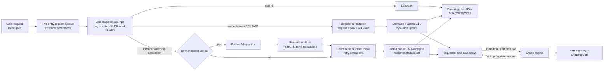

<!-- Specifies RV5Stage's data-cache protocol and blocking write-back L1D policy. -->

# RV5Stage data cache

This directory owns the core-facing data-cache protocol and the private L1D's
array, replacement, coherence-state, refill, writeback, snoop, and LR/SC
contracts. The [parent core guide](../README.md#memory-hierarchy) owns MMU/PMA
routing and architectural fence ordering; the [CHI guide](../../../chi/README.md)
owns the protocol vocabulary and fabric-wide rules.

Contributors changing the L1D implementation should read
[`DEVELOPING.md`](DEVELOPING.md).

## At a glance

| Property | Current contract |
|---|---|
| Organization | Physically indexed, physically tagged, set-associative, blocking, write-back, write-allocate |
| Geometry | Power-of-two set count of at least two, positive way count, fixed 64-byte lines |
| Core throughput | A two-entry structural request queue sustains one load hit per cycle after initial buffering; a mutation commit, miss, or ownership acquisition blocks queue drain |
| Core protocol | Ordered `Decoupled` requests and non-backpressurable `Valid` responses |
| Coherence states | Invalid, SharedClean, UniqueClean, and UniqueDirty |
| Allocation | Lowest invalid way, otherwise per-set round robin |
| CHI traffic | `ReadClean`, `ReadUnique`, retryable `WriteUniquePtl`, `CompAck`, `SnpResp`, and dirty `SnpRespData` |
| Prefetch | Demand-priority Valid event; read intent uses `ReadClean`, write intent uses `ReadUnique`, and neither responds or mutates data |

`RV5StageL1DCache(xlen, cache, ~chi: config)` accepts `XLen.X32` or
`XLen.X64`. The cache configuration supplies set/way geometry; the required
CHI configuration supplies flit geometry and the Home map. A separate
`node_id` input supplies the occurrence's RN-F identity. Core addresses use
XLEN, while emitted CHI requests use the configured CHI request-address width
and assert that the original physical address fits. Geometry validation also
requires XLEN to leave at least one tag bit above the line offset and set index.

## Core-facing protocol

[`protocol.rhdl`](protocol.rhdl) defines `RV5StageDataAccess(xlen)`:

| Direction | Member | Meaning |
|---|---|---|
| Requester → cache | `request: Decoupled(RV5StageDataReq)` | Original XLEN byte address; load/store/LR/SC/AMO kind; atomic function; scalar width; load signedness; XLEN source data; destination bank; five-bit `rd`; and FP precision metadata |
| MMU → cache | `prefetch: Valid(CachePrefetchReq)` | Best-effort aligned physical read/write hint; no acceptance or completion |
| Cache → requester | `response: Valid(RV5StageDataResp)` | Ordered XLEN load/atomic/SC result plus destination, `rd`, and FP precision metadata |
| Cache → requester | `request_fault`, `request_access_fault` | Always false in this physical cache; translation and PMA routing own architectural faults |
| Cache → requester | `drained` | Combinational quiescence observation used by architectural serialization |

The request is `Decoupled` because live Execute forwarding may change its
payload until acceptance. Responses cannot be backpressured. Loads and atomics
return normalized XLEN values; an RV64 word AMO result is sign extended.
Successful SC returns zero and failed SC returns one. Ordinary stores also
produce an ordered completion response, but its data and destination metadata
are not architectural results.

The pipeline checks architectural alignment. The cache owns XLEN-word
alignment within the line, byte masks, and load/store lane generation.
`drained` is true only when no request is accepted that cycle and no queued
request, core lookup, registered mutation, acquisition/refill, dirty-line drain,
gather, or refill installation remains active. It does not include the response pipe or an
independently serviced snoop; the parent serialization logic separately waits
for older deferred completions. It is an observation, not a separate fence
transaction.

## Data path and arrays

[`cache.rhdl`](cache.rhdl) keeps the hit path short and moves line transactions
into shared engines:

The tag and coherence-state arrays hold one entry per way and set. The
byte-masked data array has `sets * (64 / (XLEN / 8))` rows, each containing one
XLEN word per way. Parallel comparisons select the hit way; assertions reject
duplicate valid tags. An aligned scalar load, store, LR/SC, or AMO therefore
touches one data row even though coherent transfers operate on a whole line.

A two-entry, non-flow-through `Queue` makes core request readiness solely a
function of registered queue occupancy. Tag, state, and data results may decide
whether its egress drains, but cannot feed back combinationally into acceptance.
A one-stage `Pipe` carries issued request context alongside the synchronous SRAM
lookup. Once the queue is primed, consecutive load hits advance every cycle. A
mandatory one-stage `ValidPipe` registers the non-backpressurable response. A
store, SC, or AMO that already has Unique ownership first captures its request,
selected way, and old value in a one-entry mutation register. On the following
edge it updates the selected byte lanes and sets UniqueDirty without emitting
REQ or DAT traffic; an AMO returns the captured value from before that update.

The Valid prefetch path joins only at the lookup input and cannot backpressure
the MMU. A queued or same-cycle demand request wins. A read hint that misses
launches the ordinary clean refill; a write hint that misses or finds a shared
line launches `ReadUnique`, but installs UniqueClean and performs no data
mutation. A hit is consumed silently. A hint is discarded if the selected miss
victim is dirty, avoiding nonbinding writeback traffic.

## Miss, acquisition, and replacement flow

| Lookup outcome | Action | Installed or resulting state |
|---|---|---|
| Load or LR miss | Issue `ReadClean` | SharedClean or UniqueClean from the CHI response |
| Store/AMO miss | Allocate a way and issue `ReadUnique` | Merge the mutation while installing; UniqueDirty |
| Store/AMO hit in SharedClean | Retain the current way and issue `ReadUnique` | Merge the mutation while installing; UniqueDirty |
| Successful SC without Unique ownership | Use the same `ReadUnique` acquisition path | UniqueDirty |
| Failed SC | Return one without CHI traffic or a data-array update | Unchanged |
| Dirty allocation victim | Gather the line, complete writeback, then issue the refill | Victim invalidated before replacement installation |

The shared [refill engine](../chi/README.md#cache-line-refill) retains the aligned line address
and complete request context across retry, accepts unique `CompData` packets,
sends `CompAck`, and exposes the completed line only afterward. RV5Stage lines
are fixed at 64 bytes, and L1D rejects a refill carrying `PassDirty`. With the
repository's default 128-bit DAT width, four packets form a line. Installation
writes one XLEN word per cycle—eight writes for RV64 or sixteen for RV32—and
publishes the tag, coherence state, and valid bit only on the final word. A
mutating refill merges its selected bytes before that word is written.

For a dirty allocation victim, L1D first gathers all XLEN words into a line
buffer. The shared [writeback engine](../chi/README.md#writes-and-dirty-writeback) captures that buffer
and serializes eight retryable, 64-bit `WriteUniquePtl` transactions. The
replacement refill cannot start until all eight complete.

## Snoop ordering and responses

The shared [data-snoop engine](../chi/README.md#snoop-handling) owns each request's lifetime,
DVM pairing, lookup-result capture, stable CHI response, and dirty-data packet
sequence. A pending snoop prevents a new core lookup. It waits behind an active
lookup, registered mutation, line gather, or refill installation, but it may run while a captured
refill or writeback transaction is otherwise waiting on CHI. A snoop already
waiting when a refill completes wins the SRAM; once installation begins, the
refill keeps the ports through the final word.

| Cached result | CHI response | Local transition |
|---|---|---|
| Miss | `SnpResp` reporting Invalid | None |
| Clean hit, retained | `SnpResp` with the stored or requested shared state | Retain or downgrade to SharedClean |
| Clean hit, invalidating or `RetToSrc` | `SnpResp` reporting Invalid | Invalidate |
| Dirty hit | Complete-line `SnpRespData` with `PassDirty` and Invalid | Invalidate after the final data packet |
| Two-packet `SnpDVMOp` | One `SnpResp` after the second packet | No array access |

A dirty response first gathers every XLEN word from the selected way. Home then
receives the authoritative reconstructed line; L1D does not retain a dirty copy.
Reset clears lookup, pending mutation, refill installation, line gather,
reservation, valid-line, replacement, and child transaction-engine state.

## LR/SC reservation

LR records one exact byte address and scalar width in a cache-local reservation.
SC succeeds only while both still match. It obtains Unique ownership when
necessary, updates the cached word, returns zero, and leaves the line
UniqueDirty. A locally successful SC clears the reservation when its registered
mutation commits. A failed SC returns one without issuing CHI traffic or writing
the array and clears the reservation with its lookup; every SC attempt therefore
clears the reservation.

The reservation is also cleared by a same-line local store or AMO, an
invalidating snoop for that line, or replacement of the reserved line. A
downgrade that does not invalidate the line does not independently clear it.

## Replacement and deliberate limits

Allocation selects the lowest invalid way before using the set's round-robin
pointer. Installing a newly allocated line advances that pointer. Ownership
acquisition for an existing SharedClean line retains its way and does not
advance replacement state.

- Prefetches are not buffered, cannot run under a miss, and may delay a later
  demand once an admitted miss or ownership acquisition has launched.
- The cache has no hit-under-miss, autonomous prefetcher, or background writeback.
- L1D and L1I have no direct coherence connection; instruction coherence uses
  the parent core's fence/invalidation sequence and independent CHI snoops.
- Dirty replacement uses eight supported `WriteUniquePtl` transactions rather
  than CHI's `WriteBackFull` transaction family.
- The cache does not generate translation, alignment, PMA, or access faults;
  those belong to the parent memory hierarchy.
