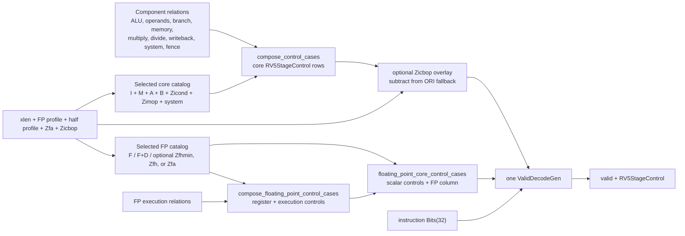

<!-- Explains how RV5Stage selects, composes, and validates its structured decode controls. -->

# RV5Stage decode

RV5Stage maps each selected instruction encoding directly to the structured
`RV5StageControl` consumed by the core. There is no intermediate
instruction-kind enum. Integer and floating-point rows are composed at host
elaboration time and emitted as one hardware decode relation for the selected
core profile. Pipeline behavior, hazards, and execution ordering belong to the
[parent RV5Stage contract](../README.md); this document owns the decode
composition and control-column boundaries.

Contributors changing decode ownership or instruction coverage should read
[`DEVELOPING.md`](DEVELOPING.md).

## Select a decode specialization

`RV5StageInstructionDecoder` accepts `xlen`, `profile`, `half_precision`, and
the default-disabled `zfa` and `zicbop` switches as host parameters. They
select the instruction catalogs before hardware is generated:

| Specialization | Selected rows |
|---|---|
| RV32, FP disabled | RV32I plus the RV32 forms of M, A, and B, followed by Zicond, Zimop, Zicsr, Zifencei, and the supported privileged instructions |
| RV64, FP disabled | RV64I plus the RV64 forms of M, A, and B, followed by Zicond, Zimop, Zicsr, Zifencei, and the supported privileged instructions |
| RV32F | The RV32 core rows plus the RV32F catalog |
| RV64D | The RV64 core rows plus the RV64F and RV64D catalogs |

Enabling Zicbop overlays its three prefetch rows on any of these selections.
The standard decode library subtracts those exact regions from the broad
`ORI` row, preserving one unordered decode relation. When disabled, the same
encodings retain their ordinary legal `ORI x0` hint meaning.

RV5Stage deliberately accepts only disabled FP, RV32F, or RV64D. A half-precision
profile requires FP to be enabled. `Zfhmin` adds its load, store, move, and
conversion catalog, plus the D-to-H and H-to-D conversions for RV64D. `Zfh`
adds the XLEN-selected full Zfh catalog and those D conversions when the base
profile is RV64D. Zfa adds the selected S and D format operations, plus H
operations only for full Zfh; RV32D pair moves remain cataloged but unsupported
because RV5Stage does not implement RV32D. These lists are assembled by
`rv5stage_floating_point_instructions`; the matching execution cases are
assembled separately and then checked against the same selected instruction
domain.

The selection is specialization, not runtime dispatch. Each enabled
configuration contains one `ValidDecodeGen` over the combined core and FP rows.
With FP disabled, the prebuilt RV32 or RV64 core relation is selected instead.

## Follow a row from catalog to hardware

For a core instruction, `compose_control_cases` converts its canonical
`InstructionSpec` to an instruction pattern, finds exactly one output in every
component relation with `component_output`, and nests those outputs into one
`RV5StageControl` row. The row sets `floating_point_valid` false and leaves the
entire FP sub-bundle unconstrained.

For an FP instruction, [`fp-ctrl.rhdl`](fp-ctrl.rhdl) derives integer/FPR source
use and destination-bank selection from the instruction's operand metadata,
then joins that register control to the selected execution control. The
`floating_point_core_control_cases` adapter in
[`core-ctrl.rhdl`](core-ctrl.rhdl) integrates the result into
`RV5StageControl`: it sets `floating_point_valid`, supplies the scalar operand
and address-generation controls needed by FP memory operations, disables
unrelated branch, scalar-writeback, system, and fence actions, and leaves the
unused multiply/divide columns free. FP decode is therefore part of the core
control relation, not an independent runtime decoder.

`fp-ctrl.rhdl` also exports a standalone FP decoder for focused use, but
`RV5StageInstructionDecoder` composes its case lists directly and does not
instantiate that circuit beside the core decoder.

## Change the owning control column

Control-column ownership and the instruction-extension workflow moved to
[`DEVELOPING.md`](DEVELOPING.md#control-column-ownership).

## Read care masks and don't-cares

Decode rows state only what downstream hardware observes. `partial_pattern`
and `_` preserve omitted fields as care-mask zeros, so they remain synthesis
don't-cares when the columns are nested into `RV5StageControl`. They are not
software defaults:

- A store constrains its memory action and width but not load extension.
- A non-writing scalar instruction constrains write enable but not the unused
  writeback source.
- An inactive branch constrains the resolver enable but not inactive resolver
  modes or its unused target source.
- An instruction that does not consume an ALU result may leave the complete ALU
  column unconstrained.
- A core row leaves the FP sub-bundle unconstrained behind
  `floating_point_valid == false`; an FP row leaves its multiply/divide columns
  and unused control subfields unconstrained.

`ValidDecodeGen` preserves those nested care masks while producing the single
hardware relation. Its separate `valid` output distinguishes selected rows from
unmatched encodings; consumers must not interpret an unmatched control value as
a default instruction.

Zicbop is the deliberate exception to exact catalog concatenation because its
instructions occupy subregions of `ORI`. Its override rows select the shared
adder, `rs1`, the descriptor-owned prefetch immediate, no scalar writeback or
ordinary memory operation, and a `CachePrefetchOperation`. No instruction-kind
decoder or row-priority mux is introduced.

## Find implementation and tests

Source ownership and contributor validation moved to
[`DEVELOPING.md`](DEVELOPING.md#implementation-map).
