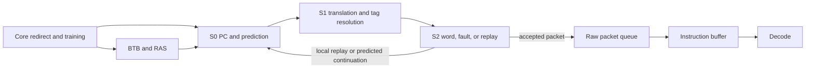

<!-- Defines RV5Stage fetch-pipeline and branch-predictor public entry points. -->
<!-- SPDX-License-Identifier: Apache-2.0 -->

# RV5Stage fetch

This package owns instruction acquisition from S0 request selection through
compressed instruction assembly at the Decode boundary. The integrated
[`RV5StageFrontend`](frontend.rhdl) presents fetch packets to the core; its
[`protocol.rhdl`](protocol.rhdl) defines the control and `FetchDecode` payloads.
The parent [microarchitecture guide](../README.md#microarchitecture) defines
observable stage timing, replay, fault, redirect, and reservation behavior. The sibling
[`icache/`](../icache/README.md) package owns instruction storage, refill, and
coherence. Contributors should read [DEVELOPING.md](DEVELOPING.md) for source
ownership, dependency direction, and focused validation.

## Fetch and prediction flow

The diagram illustrates the current fetch composition, not a promise about
internal predictor storage. S0 launches a virtual request; S1 correlates its
physical resolution, and S2 produces a word, fault, or replay. The frontend
queues raw packets, while the core's instruction buffer assembles compressed
and straddling instructions for Decode.

An accepted refill or uncached read drains through a speculative flush; a
replay retries the oldest failed PC. The [instruction cache](../icache/README.md)
owns refill and storage, not fetch sequencing.

Branch prediction uses the shared [`cores/bpred/`](../../bpred/README.md)
components. Their [`protocol.rhdl`](../../bpred/protocol.rhdl) defines prediction and training payloads,
while the parent [branch-prediction contract](../README.md#branch-prediction)
defines their observable policy and generator parameters.
