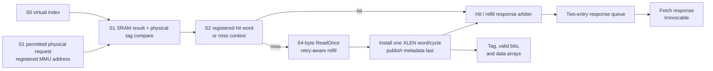

<!-- Specifies RV5Stage's instruction-cache protocol and software-synchronized snapshot contract. -->

# RV5Stage instruction cache

This directory owns the core-facing instruction-access protocol and the private
L1I's arrays, refill, replacement, response buffering, flush and architectural invalidation contracts. The [parent core guide](../README.md#memory-hierarchy) owns
address translation, Fetch correlation, and `FENCE.I` ordering; the
[CHI guide](../../../chi/README.md) owns protocol vocabulary and fabric-wide
rules.

Contributors changing the L1I implementation should read
[`DEVELOPING.md`](DEVELOPING.md).

## At a glance

| Property | Current contract |
|---|---|
| Organization | Non-aliasing VIPT, set-associative, read-only, nonsnooping instruction snapshots |
| Geometry | Power-of-two sets from 2 through 64, positive ways, fixed 64-byte lines; see [shared geometry](../README.md#memory-hierarchy) |
| Core throughput | Consecutive hits can enter and return one 32-bit instruction per cycle |
| Core protocol | Ordered `Decoupled` requests and backpressurable `Irrevocable` responses |
| Miss policy | One blocking, retry-aware `ReadOnce` line acquisition |
| Response capacity | At most two accepted requests, backed by a two-entry queue |
| Allocation | Lowest invalid way, otherwise per-set round robin |
| Prefetch | Demand-priority Valid event; a miss launches ordinary `ReadOnce` refill without a response |

`RV5StageL1ICache(xlen, cache, ~chi: config)` accepts physical resolutions only
for fetches whose PMA is cacheable; early virtual reads may precede that decision.
The parent hierarchy routes executable non-cacheable fetches through
its non-allocating RN-I path. The cache accepts `XLen.X32` or
`XLen.X64`. The cache configuration supplies set/way geometry; the required
CHI configuration supplies flit geometry and the Home map. A separate
`node_id` input supplies the occurrence's RN-I identity. Core addresses use
XLEN, while emitted CHI requests use the configured CHI request-address width
and assert that the original physical address fits. Geometry validation also
requires XLEN to leave at least one tag bit above the line offset and set index.

## Core-facing protocol

[`protocol.rhdl`](protocol.rhdl) defines `RV5StageInstructionAccess(xlen)`:

| Direction | Member | Meaning |
|---|---|---|
| Fetch → cache | `request: Decoupled(RV5StageInstructionReq)` | XLEN-wide physical byte address |
| MMU → cache | `virtual_lookup: Decoupled(Bits(XLEN))` | S0 virtual read with structural SRAM-port admission; physical resolution follows in S1 |
| MMU → cache | `prefetch: Valid(CachePrefetchReq)` | Best-effort aligned physical `PREFETCH.I`; no acceptance or response |
| Fetch → cache | `flush` | Discard speculative lookup and buffered-response state |
| Fetch → cache | `invalidate_all` | Perform the flush behavior and invalidate every resident line |
| Cache → Fetch | `response: Decoupled(RV5StageInstructionResp)` | Ordered 32-bit instruction plus page- and access-fault flags; a flush may withdraw a stalled response |

The cache itself returns both fault flags false; the MMU and parent fetch path
own translation and access faults. Fetch supplies aligned word addresses. The
cache selects the addressed 32-bit instruction from its XLEN-wide SRAM word.
The line size is a fixed RV5Stage constant rather than a cache parameter.

`virtual_lookup` is a separate cache port, not a member of the core/Fetch
instruction-access interface. It supplies the SRAM index without waiting for
ITLB/PMA resolution. A physical request accepted in S1 must have a preceding
accepted virtual lookup with identical bits `[11:0]`; assertions enforce both
conditions. The translated physical tag is compared with that SRAM result, and
the selected word/hit decision/refill context are registered into S2. A virtual
read without an accepted physical request is discarded, including on a TLB
miss, fault, uncached selection, or flush. Such reads cannot respond or allocate.
Physical prefetches use the same SRAM port and lose to a live virtual demand.

## Data path and arrays

[`cache.rhdl`](cache.rhdl) pipelines SRAM hits while keeping refill
transactions outside the core response path:

The tag array and valid bits hold one entry per way and set. There is no CHI ownership-state array. The
byte-masked data array has `sets * (64 / (XLEN / 8))` rows, each containing one
XLEN word per way. Parallel comparisons select the hit way; assertions reject
duplicate valid tags. RV32 returns the selected SRAM word directly. RV64 uses
address bit 2 to select its low or high 32-bit instruction.

An always-captured S1 token carries the virtual address and demand/prefetch tag
alongside the synchronous lookup. A second always-captured stage registers the
resolved hit word or miss context. S0 port admission does not wait for S1
translation or tag comparison. A blocked or unmatched physical resolution drops
that read; the MMU owns local retry. A hit can admit the next request immediately.
Hit and live-refill results merge before
a two-entry flow-through queue, which preserves ordered `Irrevocable` responses
under Fetch backpressure. Outstanding-request accounting reserves response
capacity and never exceeds two. A released slot becomes available to request
admission on the following cycle, keeping downstream response readiness out of
the request-ready timing path. A miss transfers its address into the refill
engine and blocks new requests until that transaction completes.

A prefetch lookup or refill never reserves response capacity and never reaches
the response queue. Demand wins a simultaneous lookup opportunity. Once an
admitted miss launches, it uses the same blocking refill and installation path
as a demand miss.

## Refill and replacement

Every miss issues one 64-byte `ReadOnce`. The [snapshot engine](../chi/README.md#instruction-snapshot-read)
retains its line address and context through retry, collects every `CompData`
packet, and sends `CompAck` before exposing the result. The response grants no
coherent ownership or dirty responsibility. With 128-bit DAT, four packets form
a line. A read error returns an instruction access fault without allocation;
prefetch errors are discarded without an architectural response.

Installation writes one XLEN word per cycle—eight writes for RV64 or sixteen
for RV32—and publishes the tag and valid bit only on the final
word. Allocation selects the lowest invalid way before using the set's
round-robin pointer; a successful installation advances that pointer.

## Flush and architectural invalidation

The two controls deliberately have different residency effects:

| Event | Lookup and response state | Active refill | Resident lines |
|---|---|---|---|
| `flush` | Kill the active lookup, clear buffered responses and outstanding accounting | Drain and install the line, but suppress its wrong-path response | Preserve |
| `invalidate_all` | Apply all flush behavior | Drain without installing or returning the pre-invalidation line | Invalidate all ways and reset replacement pointers |
| Reset | Clear lookup, response, refill-tracking, and installation state | Reset transaction state | Invalidate all ways and reset replacement pointers |

The parent core implements `FENCE.I` by first waiting for L1D quiescence, then
asserting this local `invalidate_all` control and redirecting Fetch. A
speculative redirect uses `flush` instead, so wrong-path activity does not
silently become architectural invalidation.

## Coherence and synchronization

L1I is an RN-I requester, not a coherent sharer. The Home services `ReadOnce`
through coherent D-cache intervention when needed, but does not track the
instruction snapshot. Outer-cache replacement cannot invalidate it. Local
replacement, reset, and `FENCE.I` can discard it.

`FENCE.I` first orders older accesses, invalidates the instruction cache and
fetch pipeline, and prevents all pre-fence refills from installing or returning
instructions. Accepted CHI requests drain normally; cancellation never abandons
a transaction. Post-fence refills consult dirty D-cache owners, so synchronization
does not require writing the whole D-cache back to RAM. Other harts synchronize
their own instruction streams separately.

## Deliberate limits

- Prefetches are not buffered, cannot run under a miss, and may delay a later
  demand once an admitted miss has launched its blocking refill.
- The cache has no hit-under-miss or autonomous prefetcher.
- Core-initiated invalidation is whole-cache only; there is no selective form.
- L1I and L1D have no direct connection. Coherent snapshot reads go through Home;
  instruction synchronization is owned by the parent core.
- Translation and alignment faults belong to the parent fetch/MMU path.
  The cache reports read-completion errors as instruction access faults.
