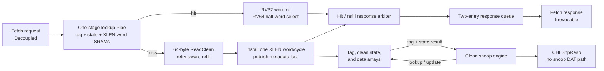

<!-- Specifies RV5Stage's instruction-cache protocol and clean-only L1I contract. -->

# RV5Stage instruction cache

This directory owns the core-facing instruction-access protocol and the private
L1I's arrays, refill, replacement, response buffering, flush, invalidation, and
snoop contracts. The [parent core guide](../README.md#memory-hierarchy) owns
address translation, Fetch correlation, and `FENCE.I` ordering; the
[CHI guide](../../../chi/README.md) owns protocol vocabulary and fabric-wide
rules.

Contributors changing the L1I implementation should read
[`DEVELOPING.md`](DEVELOPING.md).

## At a glance

| Property | Current contract |
|---|---|
| Organization | Physically indexed, physically tagged, set-associative, read-only and clean-only |
| Geometry | Power-of-two set count of at least two, positive way count, fixed 64-byte lines |
| Core throughput | Consecutive hits can enter and return one 32-bit instruction per cycle |
| Core protocol | Ordered `Decoupled` requests and backpressurable `Irrevocable` responses |
| Miss policy | One blocking, retry-aware `ReadClean` line acquisition |
| Response capacity | At most two accepted requests, backed by a two-entry queue |
| Allocation | Lowest invalid way, otherwise per-set round robin |
| Prefetch | Demand-priority Valid event; a miss launches ordinary `ReadClean` refill without a response |

`RV5StageL1ICache(xlen, cache, ~chi: config)` receives only fetches whose PMA is
cacheable; the parent hierarchy routes executable non-cacheable fetches through
its non-allocating RN-I path. The cache accepts `XLen.X32` or
`XLen.X64`. The cache configuration supplies set/way geometry; the required
CHI configuration supplies flit geometry and the Home map. A separate
`node_id` input supplies the occurrence's RN-F identity. Core addresses use
XLEN, while emitted CHI requests use the configured CHI request-address width
and assert that the original physical address fits. Geometry validation also
requires XLEN to leave at least one tag bit above the line offset and set index.

## Core-facing protocol

[`protocol.rhdl`](protocol.rhdl) defines `RV5StageInstructionAccess(xlen)`:

| Direction | Member | Meaning |
|---|---|---|
| Fetch → cache | `request: Decoupled(RV5StageInstructionReq)` | XLEN-wide physical byte address |
| MMU → cache | `prefetch: Valid(CachePrefetchReq)` | Best-effort aligned physical `PREFETCH.I`; no acceptance or response |
| Fetch → cache | `flush` | Discard speculative lookup and buffered-response state |
| Fetch → cache | `invalidate_all` | Perform the flush behavior and invalidate every resident line |
| Cache → Fetch | `response: Decoupled(RV5StageInstructionResp)` | Ordered 32-bit instruction plus page- and access-fault flags; a flush may withdraw a stalled response |

The cache itself returns both fault flags false; the MMU and parent fetch path
own translation and access faults. Fetch supplies aligned word addresses. The
cache selects the addressed 32-bit instruction from its XLEN-wide SRAM word.
The line size is a fixed RV5Stage constant rather than a cache parameter.

## Data path and arrays

[`cache.rhdl`](cache.rhdl) pipelines SRAM hits while keeping refill and snoop
transactions outside the core response path:

The tag and CHI response-state arrays hold one entry per way and set. The
byte-masked data array has `sets * (64 / (XLEN / 8))` rows, each containing one
XLEN word per way. Parallel comparisons select the hit way; assertions reject
duplicate valid tags. RV32 returns the selected SRAM word directly. RV64 uses
address bit 2 to select its low or high 32-bit instruction.

A one-stage `Pipe` carries the address and demand/prefetch tag alongside the
synchronous lookup. A hit can admit the next request immediately. Hit and live-refill results merge before
a two-entry flow-through queue, which preserves ordered `Irrevocable` responses
under Fetch backpressure. Outstanding-request accounting reserves response
capacity and never exceeds two. A released slot becomes available to request
admission on the following cycle, keeping downstream response readiness out of
the request-ready timing path. A miss transfers its address into the refill
engine and blocks new requests until that transaction completes.

A prefetch lookup or refill never reserves response capacity and never reaches
the response queue. Demand wins a simultaneous lookup opportunity. Once an
admitted miss launches, it uses the same blocking refill and installation path
as a demand miss.

## Refill and replacement

Every miss issues one 64-byte `ReadClean`. The shared
[refill engine](../chi/README.md#cache-line-refill) retains the aligned line address and selected
way across retry, accepts unique `CompData` packets, sends `CompAck`, and exposes
the complete clean line only afterward. `PassDirty` is rejected. With the
repository's default 128-bit DAT width, four packets form a line.

Installation writes one XLEN word per cycle—eight writes for RV64 or sixteen
for RV32—and publishes the tag, clean CHI state, and valid bit only on the final
word. Allocation selects the lowest invalid way before using the set's
round-robin pointer; a successful installation advances that pointer.

## Flush and architectural invalidation

The two controls deliberately have different residency effects:

| Event | Lookup and response state | Active refill | Resident lines |
|---|---|---|---|
| `flush` | Kill the active lookup, clear buffered responses and outstanding accounting | Drain and install the line, but suppress its wrong-path response | Preserve |
| `invalidate_all` | Apply all flush behavior | Drain without installing or returning the pre-invalidation line | Invalidate all ways and reset replacement pointers |
| Reset | Clear lookup, response, refill-tracking, installation, and snoop state | Reset transaction state | Invalidate all ways and reset replacement pointers |

The parent core implements `FENCE.I` by first waiting for L1D quiescence, then
asserting this local `invalidate_all` control and redirecting Fetch. A
speculative redirect uses `flush` instead, so wrong-path activity does not
silently become architectural invalidation.

## Clean snoop behavior

The shared [clean-snoop engine](../chi/README.md#snoop-handling) owns each request's lifetime,
DVM pairing, lookup-result capture, and stable response. A pending snoop blocks
new core lookups and waits for an active lookup or refill installation to
release the SRAM ports. It may inspect the resident cache while a captured
refill is otherwise waiting on CHI; a refill completion waits until the snoop
finishes before installation begins.

| Request outcome | Response | Local transition |
|---|---|---|
| Miss | `SnpResp` reporting Invalid | None |
| Clean hit, retained | `SnpResp` reporting the stored clean state | None |
| Clean hit, sharing request | `SnpResp` reporting SharedClean | Downgrade to SharedClean |
| Clean hit, invalidating request | `SnpResp` reporting Invalid | Invalidate |
| Forwarding request or any `RetToSrc` hit | `SnpResp` reporting Invalid | Silently invalidate so Home can source data elsewhere |
| `SnpQuery` | `SnpResp` reporting the precise stored state | None |
| Two-packet `SnpDVMOp` | One `SnpResp` after the matching second packet | No array access |

L1I has no snoop-data path and never emits DAT. Coherent agents may invalidate
it independently of the core's local invalidate-all operation.

## Deliberate limits

- Prefetches are not buffered, cannot run under a miss, and may delay a later
  demand once an admitted miss has launched its blocking refill.
- The cache has no hit-under-miss or autonomous prefetcher.
- Core-initiated invalidation is whole-cache only; there is no selective form.
- L1I never stores dirty state and cannot return clean data to a snoop source;
  forwarding and `RetToSrc` requests therefore evict a matching line.
- L1I and L1D have no direct coherence connection. The parent core owns the
  `FENCE.I` sequence, while CHI snoops independently maintain coherent state.
- The cache does not generate translation, alignment, or access faults; those
  belong to the parent fetch and memory hierarchy.
