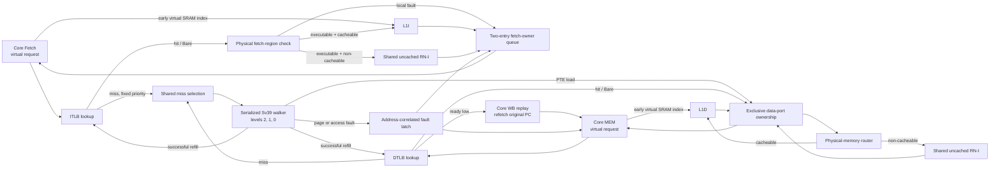

<!-- Specifies RV5Stage's Sv39 translation, TLB, page-walk, arbitration, and fault contracts. -->

# RV5Stage MMU

This directory owns the translation boundary between `RV5StageCore`'s virtual
instruction/data ports and RV5Stage's physical memory hierarchy. It contains
separate instruction and data TLBs, one shared Sv39 page-table walker, and the
composition logic that correlates faults and arbitrates page-table reads onto
the physical data path.

The [parent core guide](../README.md#memory-hierarchy) owns the wider pipeline,
privileged-state, and memory-hierarchy contract. The
[L1I guide](../icache/README.md) and [L1D guide](../dcache/README.md) own cache
arrays, misses, coherence, and response timing. This guide describes only what
the MMU adds in front of those components.

Contributors changing translation or page-walk integration should read
[`DEVELOPING.md`](DEVELOPING.md).

## At a glance

| Property | Current contract |
|---|---|
| Translation modes | RV64 Bare or Sv39; RV32 always Bare |
| Translation caches | Separate eight-entry, fully associative ITLB and DTLB |
| Page sizes | 4 KiB, 2 MiB, and 1 GiB Sv39 leaves |
| Miss service | One shared, serialized, non-speculative walk; instruction misses have priority |
| Page-table traffic | One 64-bit physical load at a time through the ordinary data-memory path |
| Data-miss recovery | A miss starts the walker and leaves the MEM request unaccepted; the core refetches it through ordered replay |
| Permission policy | Recheck access kind, current effective privilege, `SUM`, `MXR`, `A`, and `D` on every TLB hit |
| Prefetch policy | Bare or existing ITLB/DTLB hit only; any fetch/load/store PTE permission; ignore A/D; silently drop every rejection |
| Invalidation | Whole-ITLB and whole-DTLB invalidation; any active walk and correlated fault are canceled |
| Address-space identity | ASID zero only; no ASID-tagged lookup or selective invalidation |
| A/D policy | Svade: missing `A`, or missing `D` for a write-like access, causes a page fault |

## Request flow

[`RV5StageMmu`](mmu.rhdl) is composed between the core and physical hierarchy
in [`rv5stage.rhdl`](../rv5stage.rhdl). The data-side output first reaches the
[physical-memory router](../memory-router.rhdl), which selects L1D for cacheable
memory or the uncached engine for a non-cacheable region. Consequently, the walker's
arbitration point is the shared physical data port immediately before that
router; a cacheable PTE read follows the ordinary L1D path.

Separate `instruction_lookup` and `data_lookup` Valid outputs carry the early
virtual byte address directly to each cache, bypassing physical routers. Their
validity and index do not depend on a TLB hit, permission, or PMA classification.
The permitted physical request remains the resolution/acceptance path and is
paired with that virtual read at the same edge. On the data side, walker
ownership selects a physical PTE address on both paths. A rejected or unresolved
read cannot create a cache result or side effect; architectural fault and replay
timing is unchanged. See the cache guides for structural admission and buffering.

The diagram shows logical result paths. Only the TLB selected by the miss owner
receives a successful refill, and an access-fault completion never reaches
either TLB.

## Follow an instruction request

1. Translation is enabled only for RV64 Sv39 while the current privilege is
   Supervisor or User. Machine-mode instruction fetches and every RV32 fetch
   bypass translation.
2. A translated request performs a combinational ITLB lookup. A noncanonical
   virtual address cannot hit and therefore enters the miss path.
3. If no walk or unconsumed fault is active, an instruction miss claims the
   shared walker. A simultaneous data miss waits. The Fetch request itself is
   not accepted yet, so the requester must continue to hold the `Decoupled`
   request and address stable.
4. A successful walk fills the ITLB. The still-present request retries through
   the ordinary hit path. A page-table or PTE-permission failure is latched by
   original virtual address; a rejected PTE memory request is latched separately
   as an access fault.
5. Once a physical address is available, the MMU checks the complete four-byte
   fetch range against the physical map. A range that is not executable
   produces an instruction access fault. Cacheability is routing metadata, not
   execute permission.
6. Cacheable fetches enter L1I as before. Non-cacheable executable fetches issue
   aligned four-byte `ReadNoSnp` transactions through the shared RN-I engine and
   do not allocate in L1I. RV5Stage configuration rejects executable regions
   that do not permit idempotent reads, because Fetch may speculatively request
   an instruction word more than once.
7. Every accepted fetch, including a local fault, reserves an entry in a
   two-entry owner queue. The oldest entry selects the ordered physical-memory
   response or a locally generated zero word with its page/access-fault bit.
   This prevents a later local fault from passing an earlier memory response.

An instruction-path flush clears that owner queue and cancels an active
instruction walk. It does not cancel a data walk. Architectural invalidation
cancels either kind of walk and clears both TLBs and any correlated fault.

## Follow a data request

1. The effective data privilege is normally the current privilege. In Machine
   mode with `mstatus.MPRV` set, it instead comes from `mstatus.MPP`.
   Translation is enabled only when that effective privilege is not Machine
   and RV64 `satp.MODE` selects Sv39.
2. Ordinary loads and LR use an Sv39 load permission check. Stores, SC, and AMOs
   use a store check because their `MemoryOperation` requires unique ownership.
3. A DTLB miss keeps `request.ready` low. The core's feed-forward MEM stage does
   not hold the request: the attempt starts the walker, becomes an ordered replay
   token, squashes younger work, and is refetched from its original PC. A Fetch
   flush does not cancel the active data walk. If an instruction miss is also
   present when the walker is idle, that instruction miss has priority.
4. After a successful refill, a replayed request retries through the ordinary
   hit path with its translated physical address. A page fault or page-walk
   access fault makes the matching replayed request ready and reports the fault
   on that same attempt; no physical data operation is issued.
5. A legal translated or Bare request proceeds to the physical-memory router.
   The router owns mapped/readable/writable/atomic PMA checks and the choice
   between L1D and the uncached path.

The data side has no response-owner queue because its physical responses are
ordered and non-backpressurable. While any walk is active, normal data-request
forwarding is disabled, so a page-table response cannot be confused with a
core data response.

## Best-effort prefetch probes

The MMU accepts the core's nonbackpressured
`Valid(CachePrefetchReq(xlen.width))` event independently of demand instruction
and data requests. `PREFETCH.I` probes the ITLB; `PREFETCH.R` and `PREFETCH.W`
probe the DTLB. All three use the data-access effective privilege, including
`MPRV`/`MPP`, plus current `SUM` and `MXR` state.

The event passes through two nonbackpressured register stages: a virtual-address
stage before the TLB probe and a physical-address stage after translation and
PMA checks. A surviving hint appears at the physical output after two clock
edges, with one hint per cycle throughput. Address, operation, and validity all
cross both boundaries; cache readiness never propagates back into the core.

Instruction-path flush, whole-MMU invalidation, or a change to effective data
privilege, `satp`, `SUM`, or `MXR` clears both stages at the next clock edge.
Cancellation does not combinationally gate the physical output: a hint already
presented to a cache can still be accepted on that edge. Such hints remain
non-faulting and best-effort, and busy caches may drop them.

Bare translation bypasses the TLB but retains both stages. Under Sv39, only an
existing TLB entry can produce a physical prefetch; a miss never starts or waits for the
page-table walker. The probe accepts the union of legal fetch, load, and store
PTE permissions without checking `A` or `D`. Noncanonical addresses,
translation misses, permission failures, non-cacheable physical regions, and
PMA denial for the hint's intended instruction/read/write use all drop the
event without a cache or memory access and without an architectural fault.
Forwarded addresses are aligned to the fixed 64-byte cache line, and the PMA
lookup covers that complete line.

## Shared walker and L1D-side arbitration

A miss may be accepted by the walker as soon as it is idle, but that does not
immediately issue a PTE load. The MMU first observes
`data_memory.drained && !data_memory.response.valid` in two consecutive cycles.
This covers the physical router's cached and uncached paths and drains the
non-backpressurable response stage that is not included in L1D's `drained`
signal.

From miss acceptance through walk completion, the walker owns the physical
data port exclusively:

- ordinary data forwarding stops as soon as `walk_active` is set;
- each PTE request waits for the two-observation quiet condition and downstream
  readiness;
- an accepted PTE request without an immediate access fault sets the sole
  walker-response ownership bit;
- the next physical data response is routed to the walker while that bit is
  set, and otherwise to the core; and
- `data.drained` remains false while a walk or correlated fault is active.

This is serialization at the MMU data-port boundary, not a second cache
protocol. L1D's own blocking-miss and response rules remain in the
[L1D guide](../dcache/README.md#core-facing-protocol).

## TLB contract

[`tlb.rhdl`](tlb.rhdl) implements the same combinational lookup and synchronous
fill policy for the ITLB and DTLB:

- entries retain VPN, PPN, leaf level, `U/R/W/X/G/A/D`, and validity;
- a 4 KiB entry matches all 27 VPN bits, a 2 MiB entry ignores VPN[0], and a
  1 GiB entry ignores VPN[1:0];
- the leaf level reconstructs the correct page offset or lower VPN fields in
  the 56-bit physical address;
- a hit re-evaluates permissions using the current access kind, privilege,
  `SUM`, and `MXR` rather than caching a prior permission decision;
- a successful walk fills the next entry in a cyclic replacement sequence;
  page-fault and access-fault completions do not allocate; and
- `invalidate_all` clears every entry and resets replacement state, including
  entries whose accumulated `G` bit is set.

When translation is disabled, the TLB reports a bypass hit and the composition
uses the original XLEN address. Canonicality is checked only for enabled Sv39
lookups.

## Page-table-walker contract

[`walker.rhdl`](walker.rhdl) accepts one
[`RV5StageTranslationRequest`](protocol.rhdl) only while idle. It captures the
virtual address, root PPN, access kind, effective privilege, `SUM`, and `MXR`,
then visits Sv39 levels 2, 1, and 0. At each level it issues the physical
64-bit PTE address `table_ppn * 4096 + vpn[level] * 8` and waits for exactly one
irrevocable 64-bit response before continuing.

A walk succeeds at the first structurally valid, aligned leaf whose permission
check passes. Non-leaf `G` bits are accumulated into the result. The completion
retains the original virtual address so the composition can refill only the
owning TLB or correlate the fault with a later replayed request for that address.

The walk completes with a page fault for any of these conditions:

- a noncanonical virtual address;
- `V=0`, `W=1 && R=0`, or any nonzero reserved PTE bit;
- a leaf whose lower PPN fields are not aligned for its superpage level;
- a non-leaf at level 0, or a non-leaf with `D`, `A`, or `U` set;
- a privilege failure, including Supervisor fetch from a user page or a
  Supervisor data access to a user page without `SUM`;
- a fetch without `X`, a load without `R` or the `MXR && X` alternative, or a
  store-like access without `W`; or
- `A=0`, or `D=0` for a store-like access.

If the physical hierarchy rejects the PTE load at request acceptance, the
walker instead completes with an access fault. It does not reinterpret that
failure as an invalid PTE and does not wait for a memory response. `cancel`
returns the walker to Idle without publishing a completion.

## Fault ownership and classification

| Condition | Architectural class | Owner and disposition |
|---|---|---|
| Noncanonical VA, invalid PTE structure, misaligned superpage, permission failure, or Svade A/D failure | Instruction, load, or store/AMO page fault | Walker/TLB classify it; MMU correlates it with the original VA and suppresses the physical access |
| Physical PTE request rejected as unmapped or disallowed | Instruction, load, or store/AMO access fault | Physical router reports rejection; walker preserves access-fault classification for the original operation |
| Final fetch range is not executable | Instruction access fault | MMU physical-map check suppresses the physical request |
| Final data range is unmapped, lacks read/write/atomic permission, or its selected physical path reports an access fault | Load or store/AMO access fault | Physical-memory router or selected child path; MMU forwards the result |
| Misaligned instruction target or scalar data address | Address-misaligned fault | Parent [`core.rhdl`](../core.rhdl), outside the MMU |
| L1 cache hit, miss, refill, coherence, or replacement behavior | Not a translation fault source | The cache subsystem; both cache protocols leave translation and PMA faults to their callers |

The parent core converts the MMU's page/access signals in MEM into the exact
exception cause. `MemoryOperation.needs_unique()` selects store-class causes for
Store, SC, and AMO; Load and LR use load-class causes. Trap priority and
`stval`/`mtval` updates belong to the
[privileged-state contract](../README.md#privileged-and-architectural-state).

## Supported Sv39 behavior and deliberate limits

The implemented slice supports canonical Sv39 virtual addresses, all three
standard leaf sizes, accumulated global mappings, User/Supervisor permissions,
Machine data accesses modified by `MPRV`/`MPP`, `SUM`, `MXR`, and Svade fault
behavior. The CSR block accepts RV64 Bare and Sv39 `satp` modes, forces the ASID
field to zero, and requests a conservative whole-MMU invalidation after an
accepted `satp` write or legal `SFENCE.VMA`; that architectural sequencing is
owned by [`csr.rhdl`](../csr.rhdl) and the
[parent ordering contract](../README.md#control-hazards-and-ordering).

Deliberate limits are:

- RV32 translation, Sv48, and Sv57 are not implemented;
- nonzero ASIDs, ASID- or address-selective `SFENCE.VMA`, and retention of
  global entries across invalidation are not implemented;
- hardware A/D-bit updates are not implemented;
- PBMT, Svnapot/NAPOT translations, PMP, and multi-hart shootdown are outside
  this MMU;
- walks are neither speculative nor concurrent, and there is no independent
  page-table-memory port or page-walk cache; and
- a walk serializes ordinary data traffic for its full lifetime; and
- best-effort prefetch probes do not fill a TLB or initiate a background walk.

## Implementation map

Source ownership moved to
[`DEVELOPING.md`](DEVELOPING.md#implementation-map).

## Focused validation

Contributor test selection and coverage limits are documented in
[`DEVELOPING.md`](DEVELOPING.md#focused-validation).
