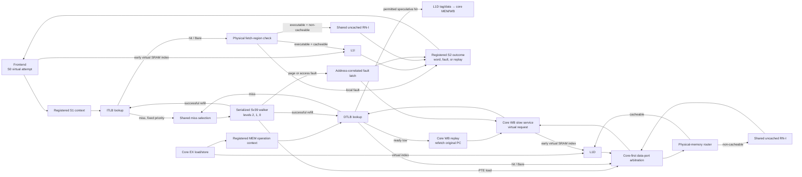

<!-- Specifies RV5Stage's host and experimental guest translation, walk, and fault contracts. -->
<!-- SPDX-License-Identifier: Apache-2.0 -->

# RV5Stage MMU

This directory owns the translation boundary between the frontend's virtual fetch attempts, the execution core's data
ports, and RV5Stage's physical memory hierarchy. It contains
separate instruction and data TLBs, one shared Sv39 page-table walker, and the
composition logic that correlates faults and offers page-table reads to the
core-first physical data-port arbiter.

The [parent core guide](../README.md#memory-hierarchy) owns the wider pipeline,
privileged-state, and memory-hierarchy contract. The
[L1I guide](../icache/README.md) and [L1D guide](../dcache/README.md) own cache
arrays, misses, coherence, and response timing. This guide describes only what
the MMU adds in front of those components.

Contributors changing translation or page-walk integration should read
[`DEVELOPING.md`](DEVELOPING.md).

## At a glance

Data translation preserves request locality independently of address and
permission resolution. Page-table walker reads use `Default` locality and
never inherit the target instruction's hint. A translation miss leaves the
request unaccepted; the core retains its hint across replay.

| Property | Current contract |
|---|---|
| Translation modes | RV64 Bare or Sv39; RV32 always Bare |
| Translation caches | Separate eight-entry, fully associative ITLB and DTLB |
| Page sizes | 4 KiB, 2 MiB, and 1 GiB Sv39 leaves; optional 64 KiB Svnapot mappings |
| Miss service | One shared, serialized walk; pending WB vector prechecks precede instruction misses, which precede ordinary data misses |
| Page-table traffic | One 64-bit physical load at a time through the ordinary data-memory path |
| Data-miss recovery | A miss starts the walker and leaves the WB request unaccepted; the core refetches it through ordered replay |
| Permission policy | Recheck access kind, current effective privilege, `SUM`, `MXR`, `A`, and `D` on every TLB hit |
| Prefetch policy | Bare or existing ITLB/DTLB hit only; any fetch/load/store PTE permission; ignore A/D; silently drop every rejection |
| Invalidation | Whole-ITLB and whole-DTLB invalidation; any active walk and correlated fault are canceled |
| Address-space identity | ASID zero only; no ASID-tagged lookup or selective invalidation |
| A/D policy | Svade: missing `A`, or missing `D` for a write-like access, causes a page fault |

`vector_precheck` certifies a nonspeculative macro's contiguous one- or two-page
range without accessing its data. A successful response retains its physical
page mappings and checked permissions separately from the DTLB until `release`.
A speculative, single-page `vector_fast` request shares the normal MEM DTLB
lookup and permission logic after higher-priority demand, precheck, and
pipeline requests. It starts no walk or data-cache lookup. MEM snapshots the
translated page, full-page PMA proof, and translation context with the scalar
pipeline token. WB validates the snapshot against the current context and
carries it in the accepted vector descriptor. Each certified vector request
carries its physical address with an owner-qualified physical sideband; no
shared-window installation is required. An occupied fallback window does not
delay its WB retirement or sequencing. A replaced DTLB entry cannot affect the captured or pinned page.
A miss, port conflict, unsuitable region, or changed context falls back to
`vector_precheck`, without reporting a speculative fault.
A free demand DTLB port checks the first page on precheck admission; a warm
translation can certify a one-page range for the following cycle. A DTLB miss
uses the same serialized walker as scalar translation. A covering superpage
needs one lookup; otherwise each page is checked once.
Only ordinary cacheable, read-idempotent, full-page PMA coverage is eligible.
Failure requests conservative element-wise execution, not an architectural
trap. This preserves masking and exact fault ownership.

The core must keep privilege, translation, and protection context unchanged
until release, drain before traps/interrupts or serialization, and use pinned
mappings only for the owning macro. The pipeline owner bit is captured alongside
each lookup; slow-service ownership uses the existing vector writeback tag.
DTLB replacement by scalar work does not invalidate the retained mappings.
The vector caller releases after final non-replayable acceptance, once every
accepted request owns its physical address. Delayed responses may outlive that
release; they must not consult a subsequent macro's window.

## Request flow

Ordinary loads and stores have a pipeline-aligned `pipeline` interface. EX launches
`pipeline_lookup` directly into L1D and registers the address and operation controls.
In MEM the DTLB resolves that captured request in parallel with SRAM outputs.
The MMU forwards only permitted cacheable, non-device physical requests to
`pipeline_memory`; loads must also be read-idempotent. MEM reports an explicit
load hit, store candidate, replay, slow-service need, or page/access fault.
WB store authorization passes through to the matching cache candidate.
This path never starts a speculative walk or device transaction.

Authorized WB accesses win DTLB contention. Invalidation and the router's
`ordered_busy` observation replay younger pipeline requests; a PTE read may
instead contend for L1D's SRAM port, where the cache reports an array-port
replay. Pending committed cache stores do not block translation: L1D checks
physical-byte hazards and actual SRAM availability. The core arbitrates FP
hit/deferred-result collisions at WB.
Demand permission checks include A and, for stores, D; the relaxed prefetch
probe cannot authorize either operation.

[`RV5StageMmu`](mmu.rhdl) is composed between the core and physical hierarchy
in [`rv5stage.rhdl`](../rv5stage.rhdl). Its separate core and walker outputs
meet at the [data-port arbiter](../data-port-arbiter.rhdl) before the
[physical-memory router](../memory-router.rhdl). The router selects L1D for
cacheable memory or the uncached engine for a non-cacheable region; a cacheable
PTE read follows the ordinary L1D path.

`instruction_lookup: Decoupled(Bits(XLEN))` launches S0 virtual reads directly
into L1I. An atomic fork couples each accepted `RV5StageFetchAccess.request`
to that lookup and the MMU's S1 context capture. The frontend independently
captures its complete attempt at the same request handshake. ITLB and PMA use
the MMU's registered address rather than the live S0 payload. The surviving S1
attempt either resolves physically or captures a local fault/replay. S2 reports
exactly one nonbackpressured outcome. The frontend reserves result capacity and
reissues the oldest failed PC; the MMU has no instruction request, retry, or
owner FIFO.
`s1_kill` cancels younger resolution and walk initiation without canceling an
older S2 outcome or an accepted walk. `flush` also detaches speculative fault
ownership. A request transferred together with `flush` belongs to the new
fetch epoch: it launches the virtual lookup immediately and replaces, rather
than clears, the MMU's S1 context.

For authorized fallback transactions, the arbiter selects the matching
`core_lookup` or `walker_lookup` Valid early index with the physical request.
An unresolved core lookup may still index L1D before physical admission.
Neither cache's S0 index depends on TLB/PMA results. A rejected or unresolved
read cannot create a cache result or side effect. See the cache guides for
structural admission and buffering.

```mermaid
flowchart LR
  FETCH["Frontend<br/>S0 virtual attempt"] --> IREQ["Registered S1 context"] --> ILOOKUP["ITLB lookup"]
  LSU["Core WB slow service<br/>virtual request"] --> DLOOKUP["DTLB lookup"]
  EXLOAD["Core EX load/store"] --> LREQ["Registered MEM operation context"] --> DLOOKUP
  EXLOAD -->|"virtual index"| L1D
  DLOOKUP -->|"permitted speculative hit"| MEMLOAD["L1D tag/data → core MEM/WB"]
  FETCH -->|"early virtual SRAM index"| L1I
  LSU -->|"early virtual SRAM index"| L1D

  ILOOKUP -->|"hit / Bare"| ICHECK["Physical fetch-region check"]
  ICHECK -->|"executable + cacheable"| L1I["L1I"]
  ICHECK -->|"executable + non-cacheable"| UNCACHED_I["Shared uncached RN-I"]
  ICHECK -->|"local fault"| IORDER["Registered S2 outcome<br/>word, fault, or replay"]
  L1I --> IORDER
  UNCACHED_I --> IORDER
  IORDER --> FETCH

  ILOOKUP -->|"miss, fixed priority"| SELECT["Shared miss selection"]
  DLOOKUP -->|"miss"| SELECT
  DLOOKUP -->|"ready low"| REPLAY["Core WB replay<br/>refetch original PC"]
  REPLAY --> LSU
  SELECT --> PTW["Serialized Sv39 walker<br/>levels 2, 1, 0"]
  PTW -->|"successful refill"| ILOOKUP
  PTW -->|"successful refill"| DLOOKUP
  PTW -->|"PTE load"| ARB["Core-first data-port arbitration"]

  DLOOKUP -->|"hit / Bare"| ARB
  ARB --> ROUTER["Physical-memory router"]
  ROUTER -->|"cacheable"| L1D["L1D"]
  ROUTER -->|"non-cacheable"| DEVICE["Shared uncached RN-I"]
  L1D --> ARB
  DEVICE --> ARB
  ARB --> LSU

  PTW -->|"page or access fault"| FAULT["Address-correlated fault latch"]
  FAULT --> IORDER
  FAULT --> LSU
```

The diagram illustrates logical result paths in the current MMU composition.
Only the TLB selected by the miss owner receives a successful refill, and an
access-fault completion never reaches either TLB.

## Follow an instruction request

1. Translation is enabled only for RV64 Sv39 while the current privilege is
   Supervisor or User. Machine-mode instruction fetches and every RV32 fetch
   bypass translation.
2. A translated request performs a combinational ITLB lookup. A noncanonical
   virtual address cannot hit and therefore enters the miss path.
3. If no walk or unconsumed fault is active, an instruction miss claims the
   shared walker. A simultaneous data miss waits. The already accepted fetch
   attempt returns S2 replay; the frontend retains its PC and retries.
4. A successful walk fills the ITLB. A later frontend attempt retries through
   the ordinary hit path. A page-table or PTE-permission failure is latched by
   original virtual address; a rejected PTE memory request is latched separately
   as an access fault.
5. Once a physical address is available, the MMU checks the complete four-byte
   fetch range against the physical map. A range that is not executable
   produces an instruction access fault. Cacheability is routing metadata, not
   execute permission.
6. Instruction-cacheable fetches enter L1I, including immutable ROM that opts
   in independently of data cacheability. Other executable fetches issue
   aligned four-byte `ReadNoSnp` transactions through the shared RN-I engine and
   do not allocate in L1I. RV5Stage configuration rejects executable regions
   that do not permit idempotent reads, because Fetch may speculatively request
   an instruction word more than once.
7. S2 selects its registered local fault/replay or the paired physical outcome.
   The frontend kills younger S1 attempts when an older S2 attempt replays,
   preserving program order without an MMU response-owner queue.

An instruction-path flush clears old attempt stages and discards the fetch's
interest in an active instruction walk, but does not cancel the accepted walk.
A simultaneous replacement request survives in S1 while the old S2 outcome is
still discarded.
The walk retains its PTE-response ownership and may still fill the ITLB, so
refetch does not repeatedly restart the same translation. A fault from the
discarded fetch is dropped rather than saved for replay. A flush does not cancel
a data walk. Architectural invalidation remains distinct: it cancels either
kind of walk and clears both TLBs and any correlated fault.

## Follow a data request

Explicit data, pipeline-lookup, and prefetch addresses arrive already normalized
by the core's pointer-masking policy. The MMU does not mask them again. Its
translation tags, miss/fault correlation, and PMA checks use that transformed
address; instruction fetch and walker-generated PTE addresses remain unmasked.

1. The effective data privilege is normally the current privilege. In Machine
   mode with `mstatus.MPRV` set, it instead comes from `mstatus.MPP`.
   Translation is enabled only when that effective privilege is not Machine
   and RV64 `satp.MODE` selects Sv39.
2. Ordinary loads and LR use an Sv39 load permission check. Stores, SC, and AMOs
   use a store check because their `RV5StageMemoryOperation` requires unique ownership.
3. A DTLB miss keeps `request.ready` low. The core's feed-forward WB stage does
   not hold the request: the attempt starts the walker, becomes an ordered replay
   token, squashes younger work, and is refetched from its original PC. A Fetch
   flush does not cancel the active data walk. If an instruction miss is also
   present when the walker is idle, that instruction miss has priority.
4. After a successful refill, a replayed request retries through the ordinary
   hit path with its translated physical address. A page fault or page-walk
   access fault makes the matching replayed request ready and reports the fault
   on that same attempt; no physical data operation is issued.
   `request_fault_address` accompanies that request's page/access-fault flags.
   It identifies the failing virtual portion: the original address for a
   first-fragment fault, or the next word/page boundary for a second-fragment
   translation or PMA fault. Scalar and vector retirement consume it only with
   their arbiter-qualified fault indication. Guest-fault provenance selects the
   same translation fragment, preserving the VA/GPA pair through trap entry.
5. A legal translated or Bare request proceeds to the physical-memory router.
   The router owns mapped/readable/writable/atomic PMA checks and the choice
   between L1D and the uncached path.

The data-port arbiter gives an offered core request priority over an offered
PTE read. It stamps an origin bit on each accepted physical request, and the
cache and uncached paths return that bit with the completion. Core requests may
therefore be accepted while a PTE reply is pending. The walker issues only one
PTE load at a time; accepted reads canceled by architectural invalidation
must finish and be discarded before a new walk can issue another PTE load.

## Best-effort prefetch probes

The MMU accepts the core's nonbackpressured
`Valid(CachePrefetchReq(xlen.width))` event independently of demand instruction
and data requests. `PREFETCH.I` probes the ITLB; `PREFETCH.R` and `PREFETCH.W`
probe the DTLB. All three use the data-access effective privilege, including
`MPRV`/`MPP`, plus current `SUM` and `MXR` state.

The event passes through two nonbackpressured register stages: a virtual-address
stage before the TLB probe and a physical-address stage after translation and
PMA checks. A surviving hint appears at the physical output after two clock
edges, with one hint per cycle throughput. Address, operation, and validity all
cross both boundaries; cache readiness never propagates back into the core.

Instruction-path flush, whole-MMU invalidation, or a change to effective data
privilege, `satp`, `SUM`, or `MXR` clears both stages at the next clock edge.
Cancellation does not combinationally gate the physical output: a hint already
presented to a cache can still be accepted on that edge. Such hints remain
non-faulting and best-effort, and busy caches may drop them.

Bare translation bypasses the TLB but retains both stages. Under Sv39, only an
existing TLB entry can produce a physical prefetch; a miss never starts or waits for the
page-table walker. The probe accepts the union of legal fetch, load, and store
PTE permissions without checking `A` or `D`. Noncanonical addresses,
translation misses, permission failures, non-cacheable physical regions, and
PMA denial for the hint's intended instruction/read/write use all drop the
event without a cache or memory access and without an architectural fault.
Forwarded addresses are aligned to the fixed 64-byte cache line, and the PMA
lookup covers that complete line.

## Shared walker and L1D-side arbitration

The walker and translated core independently offer physical requests to a
core-first arbiter. The MMU does not wait for the whole data path to drain
before offering a PTE read, and an accepted read does not reserve the arbiter
against later core requests. The physical router still enforces uncached
ordering. The arbiter selects the corresponding early L1D index without
depending on downstream readiness. Immediate admission faults return only to
the selected requester;
responses carry an explicit `Core` or `Walker` origin through the router,
L1D, or uncached engine. The architectural writeback tag has a separate job
and cannot identify a page-table response because ordinary core operations
also use `Ack`.

`data.drained` remains false while a walk or physical data operation is active.
A saved fault awaiting replay does not prevent draining; it remains correlated
with its address until consumed or invalidated. This lets WB take an interrupt
or trap without waiting for a speculative retry. L1D's own blocking-miss and
response rules remain in the [L1D guide](../dcache/README.md#core-facing-protocol).

## TLB contract

[`tlb.rhdl`](tlb.rhdl) implements the same combinational lookup and synchronous
fill policy for the ITLB and DTLB:

- entries retain VPN, normalized base PPN, `Sv39PageSize`, PBMT,
  `U/R/W/X/G/A/D`, and validity;
- a 4 KiB entry matches all 27 VPN bits; 64 KiB, 2 MiB, and 1 GiB entries
  ignore respectively the lowest 4, 9, and 18 VPN bits;
- the page size reconstructs the correct offset in the 56-bit physical address
  independently of the walker's page-table level;
- a hit re-evaluates permissions using the current access kind, privilege,
  `SUM`, and `MXR` rather than caching a prior permission decision;
- a successful walk updates a matching entry or fills the next entry in a cyclic replacement sequence;
  page-fault and access-fault completions do not allocate; and
- `invalidate_all` clears every entry and resets replacement state, including
  entries whose accumulated `G` bit is set.

When translation is disabled, the TLB reports a bypass hit and the composition
uses the original XLEN address. Canonicality is checked only for enabled Sv39
lookups.

## Page-table-walker contract

[`walker.rhdl`](walker.rhdl) accepts one
[`RV5StageTranslationRequest`](protocol.rhdl) only while idle. It captures the
virtual address, root PPN, access kind, effective privilege, `SUM`, and `MXR`,
then visits Sv39 levels 2, 1, and 0. At each level it issues the physical
64-bit PTE address `table_ppn * 4096 + vpn[level] * 8` and waits for exactly one
non-backpressured `Valid(Bits(64))` response before continuing. The response
may arrive on acceptance or in a later cycle while the walker owns it; there is no
response `ready` signal or buffering at this boundary. Cancellation may discard
a response arriving on the cancellation edge. Walk completions remain
irrevocable and may be backpressured.

A walk succeeds at the first structurally valid, aligned leaf whose permission
check passes. Non-leaf `G` bits are accumulated into the result. The completion
retains the original virtual address so the composition can refill only the
owning TLB or correlate the fault with a later replayed request for that address.

The walk completes with a page fault for any of these conditions:

- a noncanonical virtual address;
- `V=0`, `W=1 && R=0`, or any nonzero reserved PTE bit;
- a leaf whose lower PPN fields are not aligned for its superpage level;
- a non-leaf at level 0, or a non-leaf with `D`, `A`, or `U` set;
- a privilege failure, including Supervisor fetch from a user page or a
  Supervisor data access to a user page without `SUM`;
- a fetch without `X`, a load without `R` or the `MXR && X` alternative, or a
  store-like access without `W`; or
- `A=0`, or `D=0` for a store-like access.

If the physical hierarchy rejects the PTE load at request acceptance, the
walker instead completes with an access fault. It does not reinterpret that
failure as an invalid PTE and does not wait for a memory response. `cancel`
suppresses completion and returns the walker to Idle after any accepted PTE
response drains. Repeated cancellation does not forget that response owner.

## Fault ownership and classification

| Condition | Architectural class | Owner and disposition |
|---|---|---|
| Noncanonical VA, invalid PTE structure, misaligned superpage, permission failure, or Svade A/D failure | Instruction, load, or store/AMO page fault | Walker/TLB classify it; MMU correlates it with the original VA and suppresses the physical access |
| Physical PTE request rejected as unmapped or disallowed | Instruction, load, or store/AMO access fault | Physical router reports rejection; walker preserves access-fault classification for the original operation |
| Final fetch range is not executable | Instruction access fault | MMU physical-map check suppresses the physical request |
| Final data range is unmapped, lacks read/write/atomic permission, or its selected physical path reports an access fault | Load or store/AMO access fault | Physical-memory router or selected child path; MMU forwards the result |
| Misaligned instruction target or atomic/LRSC address | Address-misaligned fault | Parent [`core.rhdl`](../core.rhdl), outside the MMU |
| Misaligned ordinary load/store in cacheable main memory | Successful slow access, or page/access fault before fragments issue | WB slow owner in [`mmu.rhdl`](mmu.rhdl); it prechecks every touched page and physical word, then issues one fragment if contained in a word or two if crossing words |
| L1 cache hit, miss, refill, coherence, or replacement behavior | Not a translation fault source | The cache subsystem; both cache protocols leave translation and PMA faults to their callers |

The parent core converts the MMU's page/access signals at WB into the exact
exception cause. `RV5StageMemoryOperation.store_fault_class()` selects store-class causes
for stores, atomics, and cache-block operations; Load and LR use load-class causes.
Management requests use `Sv39Access.CacheManagement` rather than the Store
access class: they require A, ignore D, and admit read or write permission.
Trap priority and
`stval`/`mtval` updates belong to the
[privileged-state contract](../README.md#privileged-and-architectural-state).

## Supported Sv39 behavior and deliberate limits

`RV5StageExtensions(~svnapot: #true)` opts an RV64 Sv39 core into 64 KiB
Svnapot mappings; standalone defaults remain disabled, while the shared RVA23
SoC preset enables and advertises Svnapot and Svpbmt. The walker accepts N=1 only
for level-zero leaves with PPN[3:0]=8. One fetched PTE fills one compact TLB
entry covering all sixteen 4 KiB subpages; it does not read the other fifteen
PTEs. Software must maintain consistent aliases and follow Svnapot fencing
rules. The fetched PTE supplies permissions and A/D state: existing Svade
fault behavior remains, with no hardware A/D updates or alias aggregation.
Whole-TLB invalidation removes every alias together. Vector authorization
still certifies at most two 4 KiB pages and independently checks their PMAs,
but reuses one mapping when both lie within the same 64 KiB region.

The standalone walker and TLB retain Svpbmt page types. The walker captures
`request.bits.pbmte` with each accepted request; successful completion, TLB
refill, demand lookup, and prefetch probe preserve the leaf type. Bare lookup
returns PMA. Page/access faults do not populate the TLB, and invalidation wins
over a simultaneous fill.

`RV5StageExtensions(~svpbmt: #true)` enables RV64 Sv39 access attributes in the
composed MMU. `menvcfg.PBMTE` gates host/G-stage PTE interpretation and masks
`henvcfg.PBMTE`, which gates VS-stage interpretation. Non-default VS attributes
override G attributes; Bare stages contribute PMA. Implicit VS PTE reads carry
their own G-stage attribute, while physical G PTE reads retain PMA.
Demand, fetch and prefetch routing consume the shared attribute resolver.
NC/IO loads and stores bypass speculative cache hits and use WB-authorized
non-allocating transactions. Prefetches to NC/IO pages drop; vector certificates
reject them and fall back to ordinary element-owned requests. Maintenance still
visits physically cacheable aliases, independently of the access's PBMT.
The physical-request payload retains PBMT through core/PTE arbitration; the
uncached slot captures effective ordering. Physical permissions, Home selection
and coherence domains do not change. Atomic operations remain unsupported on
the uncached path and report access faults before admission.
CSR changes conservatively invalidate translations and vector certificates;
accepted work drains under existing context-change rules. Firmware must still
follow architectural fence/cache-maintenance rules. ISA and UDB publication
follow the selected extension flags; enabling support does not set PBMTE at reset.

The implemented slice supports canonical Sv39 virtual addresses, all three
standard leaf sizes, accumulated global mappings, User/Supervisor permissions,
Machine data accesses modified by `MPRV`/`MPP`, `SUM`, `MXR`, and Svade fault
behavior. The CSR block accepts RV64 Bare and Sv39 `satp` modes, forces the ASID
field to zero, and requests a conservative whole-MMU invalidation after an
accepted `satp` write or legal `SFENCE.VMA`; that architectural sequencing is
owned by [`csr.rhdl`](../csr.rhdl) and the
[parent ordering contract](../README.md#control-hazards-and-ordering).

Deliberate limits are:

- RV32 translation, Sv48, and Sv57 are not implemented;
- nonzero ASIDs, ASID- or address-selective `SFENCE.VMA`, and retention of
  global entries across invalidation are not implemented;
- hardware A/D-bit updates are not implemented;
- PMP and multi-hart
  shootdown remain outside this MMU;
- walks are neither speculative nor concurrent, and there is no independent
  page-table-memory port or page-walk cache; and
- best-effort prefetch probes do not fill a TLB or initiate a background walk.

## Shared host and guest translation

The design follows Rocket's organization: separate instruction/data TLB
instances for concurrent lookup, but **one TLB implementation and one shared
walker implementation**, not separate host/guest or VS/G translation engines.
The production MMU supplies host context by default and selects guest context
when the core profile enables H. The standalone MMU retains an explicit
`~hypervisor: #true` parameter; the RVA23 SoC composition derives it from its profile.

[`tlb.rhdl`](tlb.rhdl) provides `RV5StageTranslationTlb`. Lookup is
combinational, with one power-of-two associative entry bank shared by host and
guest mappings. Host entries retain Sv39 superpage and Svnapot reach. Guest
entries cache composed GVA-to-physical mappings at 4 KiB granularity, retaining
the guest physical page and independent VS/G leaf permissions and PBMT.
The same virtual address can coexist in host and guest contexts. Tags include
virtualization, both modes/roots, PBMTE, and HS MXR. Current privilege, VS SUM/MXR,
access class, and A/D permissions are rechecked at lookup; VS denial takes
priority over final G denial. HS MXR changes conservatively rewalk because an
entry does not retain the leaves authorizing implicit VS PTE reads.
Probes ignore A/D but require at least one access class allowed by both stages.
Their PBMT applies the G override followed by a non-PMA stage-one override,
as specified by [Svpbmt](https://docs.riscv.org/reference/isa/v20240411/priv/svpbmt.html).

[`walker.rhdl`](walker.rhdl) provides `RV5StageTranslationWalker`.
One state machine and PTE datapath handle ordinary Sv39 and nested VS Sv39 /
G Sv39x4 walks. Host walks read their PTEs directly. Guest walks retain a VS
continuation while the same datapath translates each VS PTE address through
G-stage, then translate the final GPA. Sv39x4 uses a 16 KiB root and 41-bit GPA.
Both stages can be Bare. G permission checks use U-mode semantics; HS MXR
applies at both stages, VS MXR/SUM only to stage one. A/D handling remains
Svade. `~svnapot` enables the existing 64 KiB leaf rules.

Shared contracts live in [`translation.rhdl`](translation.rhdl):
`RV5StageTlbLookup`, `RV5StageTlbMapping`, and `RV5StageTlbFill`.
The context's `vs_*` fields describe stage one: SATP/S-mode controls for host
requests, VSATP/VS controls for guest requests. Host requests disable G-stage.
Results distinguish page, guest-page, and physical access faults and retain
original VA/access, precise GPA, and implicit-PTE-read provenance.
`rv5stage_translation_fault_cause` converts a faulting result to its
architectural instruction/load/store cause; cache management uses store causes.
Consumers resolve effective memory attributes and final PMA/PMP authorization.

`RV5StageTlb` and `RV5StagePageTableWalker` are host-port adapters for standalone
host consumers and fixtures; they contain no independent translation storage
or sequencing. The production MMU uses the shared components directly.
ITLB/DTLB hit, probe, and replay paths remain direct.
There is no serialized translation service on the hit path.

The memory interface accepts at most one PTE read. Its service checks address
and PBMT; translated VS PTE reads carry the G leaf's PBMT, and G PTE reads use
PMA. Rejection returns `request_access_fault` on acceptance and owes no reply.
Accepted reads return one Valid response on that edge or later. Cancellation
suppresses architectural results, but the walker retains and drains an accepted
read before admitting another walk. The MMU must forward replies even after
invalidation. Reset requires the memory service to discard pre-reset responses.

Whole-bank invalidation discards all entries, including global mappings, and
wins over refill. The integrating MMU must also cancel outstanding walks and
order prior PTE stores. Plain cancellation does not invalidate successful
entries. The production MMU directly instantiates these banks and walker;
it does not serialize hits through the test service. Its opt-in `~hypervisor`
specialization accepts CSR-owned `guest_translation` state and selects separate
instruction and effective MPRV/MPV data contexts. Guest fetch faults carry their
class/provenance in the S2 result. HLV/HLVX/HSV wrap virtual requests with
`RiscvGuestMemoryAccess`; the MMU consumes it before the physical boundary.
Explicit guest accesses use SPVP permissions independently of live V/MPRV.
HLVX checks X at both stages and physical R+X, but keeps load faults and ordinary
PTE-read permission checks. Warm entries recheck the current access intent.
Data faults publish paired request/MEM metadata for the core to retain through
WB. Vector certificates include the complete VS/G context and invalidation
epoch. Page-wise guest authorization uses composed 4 KiB mappings; failed
prechecks fall back to element-owned precise faults rather than raising a
speculative exception. Accepted vector ownership holds context stable until
its effects drain. ASID/VMID tagging, selective HFENCE, and page-walk caches
remain later work.

Invalidation wins over fills at the clock edge; demand hit/readiness does not
depend combinationally on WB invalidation. The MMU relinquishes the walk owner
at that edge and registers the walker cancellation notification. A PTE read
accepted on that edge is still drained, and cannot refill after invalidation.
This keeps architectural cancellation out of WB's physical-arbiter ready loop.

The test-only [translation service](../tests/translation-service.rhdl)
serializes commands for behavioral qualification of the shared components;
it is not a production MMU path. See the
[implementation plan](../HYPERVISOR_PLAN.md) for the remaining integration.

## Event residency

`mmu/walk` spans an accepted translation through accepted completion or walker
cancellation, including PTE requests/responses and held completion. It captures
the virtual address, access kind, and privilege. Its retained Flow contract
parents the existing `mmu/pte.request` events. An ordinary frontend redirect
does not end a walk that continues to warm the ITLB; architectural invalidation
does. A request discarded on the cancellation edge does not start a residency.
This interval measures walker ownership, not the lifetime of a saved fault or
of a TLB entry. Upstream gaps remain explicitly partial where the MMU's
request-selection logic has no Flow contract.
