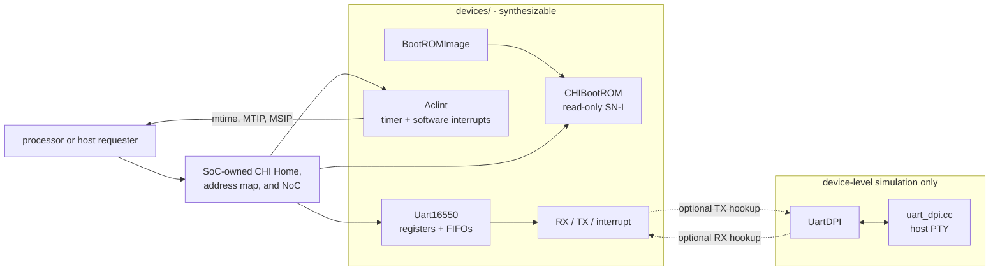

<!-- Describes reusable platform devices and their integration contracts. -->

# Platform devices

`devices/` owns reusable peripheral behavior, register maps, device-specific
CHI service profiles, and device-level simulation models. It does not choose a
system address map, route interrupts into a processor, or select simulator
policy. Those integration decisions belong to the
[`socs/`](../socs/README.md#common-host-and-platform-contract) and
[`sims/`](../sims/README.md#ownership-and-execution-boundary) packages.

Contributors changing a device or model should read
[`DEVELOPING.md`](DEVELOPING.md).

## Choose a component

The synthesizable components are independent of any processor core or fixed
SoC address map:

| Component | Purpose | External contract | Main specialization |
| --- | --- | --- | --- |
| `CHIBootROM` | Immutable boot storage | One-outstanding CHI SN-I; `ReadNoSnp`, 1--64 bytes | CHI flits, power-of-two window, and `BootROMImage` |
| `Aclint` | Per-hart machine software and timer interrupts | One-outstanding CHI SN-I; `ReadNoSnp`, `WriteNoSnpFull`, and `WriteNoSnpPtl`, 1--8 bytes; explicit `tick` | CHI flits and 1--4095 harts |
| `Uart8N1Transmitter` / `Uart8N1Receiver` | Reusable serial engines | Byte flow plus serial pins and a 16x oversample tick | Fixed 8-N-1 framing |
| `Uart16550` | Byte-addressed UART registers, FIFOs, and interrupts | One-outstanding CHI SN-I; one-byte `ReadNoSnp`, `WriteNoSnpFull`, and `WriteNoSnpPtl`; RX/TX pins | CHI flits and FIFO depth 1--16 |

`UartDPI` and [`dpi/uart_dpi.cc`](dpi/uart_dpi.cc) are simulation-only. They
bridge serial pins to a host pseudo-terminal (PTY); they are not a
synthesizable peripheral or part of the CHI register path.

## Integrate synthesizable devices

Every CHI device follows the same split between reusable behavior and
platform occurrence data:

- A device `Config` fixes the CHI flit shape and behavior-changing parameters.
- A device `Params` value derives its node capabilities and subordinate
  service from a chosen name, NodeID, base address, and `Config`.
- A device `Identity` bundle carries occurrence-specific NodeID and base-address
  wires into the circuit.

Each `Params` constructor rejects an unaligned service base, an address window
that does not fit the CHI request-address width, or a NodeID that does not fit
the physical NodeID width.

The device modules own the accepted opcodes, transfer sizes, register offsets,
window-size constraints, and parameter validation. The generic meanings of
CHI flits, capabilities, and subordinate services remain owned by
[`chi/`](../chi/README.md#services-and-system-address-maps). A containing
platform owns the concrete base addresses and NodeIDs, Home and subordinate
maps, PMA attributes, reset entry, timer tick policy, interrupt routing, and
external pins.

The solid paths match the current SoC integrations. `SimpleSoC` and `MiniSoC`
instantiate all three devices through the shared
[`SoCPlatformParams`](../socs/peripherals.rhdl); `TiledSoC` colocates its
BootROM with the device Home and places the other devices in dedicated
[`AclintTile`](../socs/tiled-soc/tiles/aclint.rhdl) and
[`UartTile`](../socs/tiled-soc/tiles/uart.rhdl) wrappers. Follow the
[SoC guide](../socs/README.md) for their addresses, NodeIDs, routes, and
processor connections rather than duplicating those system contracts here.

All current SoCs instantiate `CHIBootROM`. The current simulator harnesses pass
the synthesizable UART pins through and do not instantiate `UartDPI`; the
[simulation guide](../sims/README.md) owns that executable boundary.

## Build a BootROM image

[`bootrom-image.rhm`](bootrom-image.rhm) owns `BootROMImage` validation,
zero-padding, and the XLEN-independent RISC-V reset-program generator. The
default 28-byte program:

1. reads the Zicsr `mhartid` CSR into `a0`;
2. leaves hart zero with `a1 = 0` and jumps to the configured payload through
   an `AUIPC`/`JALR` trampoline; and
3. parks every nonzero hart in a `WFI` loop.

`riscv_bootrom_image` requires four-byte-aligned reset and payload addresses
within the trampoline's PC-relative range. `BootROMImage` requires a nonempty
list of bytes, and `CHIBootROMConfig` requires that the image fit its
power-of-two window. Platforms that need a device-tree pointer, secondary-hart
release protocol, or different reset policy must provide another image and
own that policy themselves.

[`bootrom.rhdl`](bootrom.rhdl) pads the unused portion of the configured window
with zero and returns native multi-beat data for transfers through 64 bytes.
It is immutable: writes and unsupported, misaligned, out-of-window, or
wrong-target requests assert rather than changing storage. The default window
is 4 KiB and the default parameter base is the reset address, but an integrating
platform still owns the actual reset vector and mapped occurrence.

## Integrate ACLINT

[`aclint.rhdl`](aclint.rhdl) implements only the machine timer (MTIMER) and
machine software interrupt (MSWI) portions of ACLINT in a fixed 64 KiB window:

| Offset | Register | Behavior |
| ---: | --- | --- |
| `0x0000 + 4 * hart` | `msip[hart]` | Bit 0 drives that hart's machine software interrupt level |
| `0x4000 + 8 * hart` | `mtimecmp[hart]` | MTIP is high while the shared `mtime` is greater than or equal to this value |
| `0xbff8` | `mtime` | Shared 64-bit time counter and `time_counter` output |

The registers honor byte enables, including RV32-style accesses to either
half of a 64-bit timer register. A write to `mtime` has priority over `tick`;
otherwise `mtime` increments only on an asserted `tick`. Clock division and
the relationship between ticks and real time are deliberately platform-owned.
The valid-only `time_update` interface emits the resulting next `mtime` value
exactly when a tick or an `mtime` MMIO write changes the timer; idle cycles
produce no update event.
The device provides one MSIP and MTIP level per configured hart; it does not
provide an external interrupt controller or supervisor interrupt block.

## Integrate the 16550-style UART

[`uart.rhdl`](uart.rhdl) owns fixed-format 8-N-1 transmit and receive engines.
Both consume a 16x oversample tick, and the receiver includes asynchronous
input synchronization. After a bad stop bit it reports a framing error and
waits for the line to return idle before accepting another frame.

[`uart16550.rhdl`](uart16550.rhdl) supplies the divisor counter, two reusable
queues, interrupt/status logic, and this eight-byte register window:

| Offset | DLAB = 0 | DLAB = 1 | Implemented behavior |
| ---: | --- | --- | --- |
| `0` | RBR / THR | DLL | Receive/read and transmit/write data, or divisor low byte |
| `1` | IER | DLM | RX-data and TX-empty enables, or divisor high byte |
| `2` | IIR / FCR | IIR / FCR | Interrupt identification; FIFO enable and RX/TX clear |
| `3` | LCR | LCR | DLAB plus enforced 8-N-1 format |
| `4` | MCR | MCR | Software readback only; no modem-control pins |
| `5` | LSR | LSR | RX ready, overrun, framing, THR empty, and transmitter empty |
| `6` | MSR | MSR | Reads zero; no modem-status pins |
| `7` | SCR | SCR | Scratch register |

The 16-bit divisor controls the 16x oversample tick; zero behaves as one.
FIFO-disabled mode has an effective depth of one, while FIFO-enabled mode uses
the configured depth. Receive data has interrupt priority over transmitter
empty. Overrun is sticky until LSR is read, framing status is reported by the
serial receiver, FIFO clears are synchronous, and CHI responses remain stable
under backpressure.

This is intentionally a compatibility subset, not a claim of complete 16550
hardware. Only 8-N-1 is implemented; unsupported LCR formats assert. Only RX
data and TX empty interrupt causes exist, and the hardware boundary exposes
only `rx`, `tx`, and `interrupt`. Current SoCs expose the UART interrupt but do
not route it into RV5Stage because they do not yet contain an external
interrupt controller.

## Attach the PTY UART model

[`uart-dpi.rhdl`](uart-dpi.rhdl) reuses the 8-N-1 engines to deserialize a
device's `tx` pin and serialize PTY input onto its `rx` pin. Instantiate
`UartDPI(model_id, oversample_divisor)`, connect `uart_tx` from the device and
`uart_rx` back to it, and program the same divisor into `Uart16550`. Model IDs
range from 0 through `0xffffffff`; the oversample divisor ranges from 1 through
`0xffff`.

The C++ companion creates one nonblocking raw PTY per model ID, prints its
slave path on first use, and exposes that path through `uart_pty_path`. It
queues host input across hardware reset but suppresses transfers while reset
is active. A received byte with a bad stop bit still reaches the PTY because
the terminal stream has no framing-error sideband; the model logs and counts
the error for diagnostics.

This model is currently exercised only by device/backend fixtures. Connecting
it to a complete executable harness is future simulator integration, not a
device or SoC requirement.

## Find the implementation

Source ownership moved to the contributor
[`DEVELOPING.md`](DEVELOPING.md#implementation-map). This heading remains for
existing links.

## Run focused validation

Contributor host checks, standalone C++ coverage, and CIRCT/Verilator fixtures
are documented in [`DEVELOPING.md`](DEVELOPING.md#focused-validation).
