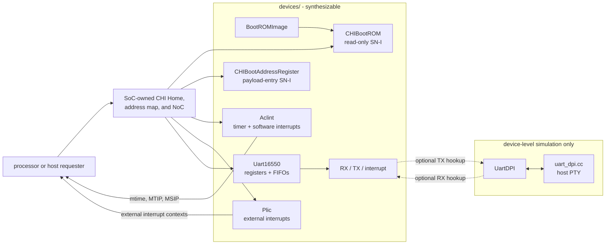

<!-- Describes reusable platform devices and their integration contracts. -->
<!-- SPDX-License-Identifier: Apache-2.0 -->

# Platform devices

`devices/` owns reusable peripheral behavior, register maps, device-specific
CHI service profiles, and device-level simulation models. It does not choose a
system address map, route interrupts into a processor, or select simulator
policy. Those integration decisions belong to the
[`socs/`](../socs/README.md#common-host-and-platform-contract) and
[`sims/`](../sims/README.md#ownership-and-execution-boundary) packages.

Contributors changing a device or model should read
[`DEVELOPING.md`](DEVELOPING.md).

## Choose a component

The synthesizable components are independent of any processor core or fixed
SoC address map:

| Component | Purpose | External contract | Main specialization |
| --- | --- | --- | --- |
| `CHIBootAddressRegister` | Mutable 64-bit payload entry | One-outstanding CHI SN-I; aligned 4/8-byte reads and writes with byte enables | CHI flits and reset value |
| `CHIBootROM` | Immutable boot storage | One-outstanding CHI SN-I; `ReadNoSnp`, 1--64 bytes | CHI flits, power-of-two window, and `BootROMImage` |
| `Aclint` | Per-hart machine software and timer interrupts | One-outstanding CHI SN-I; `ReadNoSnp`, `WriteNoSnpFull`, and `WriteNoSnpPtl`, 1--8 bytes; explicit `tick` | CHI flits and 1--4095 harts |
| `Plic` | Prioritized external interrupt delivery | One-outstanding CHI SN-I; 32-bit `ReadNoSnp`, `WriteNoSnpFull`, and `WriteNoSnpPtl`; level-sensitive source inputs and per-context interrupt outputs | CHI flits, sources, contexts, and priority width |
| `Uart8N1Transmitter` / `Uart8N1Receiver` | Reusable serial engines | Byte flow plus serial pins and a 16x oversample tick | Fixed 8-N-1 framing |
| `Uart16550` | Byte-addressed UART registers, FIFOs, and interrupts | One-outstanding CHI SN-I; one-byte `ReadNoSnp`, `WriteNoSnpFull`, and `WriteNoSnpPtl`; RX/TX pins | CHI flits and FIFO depth 1--16 |
| `HDMIFrameReader` | Ordered fixed-frame fetches with video-row markers | Retryable nonallocating CHI RN-I `ReadOnce`; irrevocable 64-byte lines | Fixed framebuffer mode, outstanding slots, and TxnID range |
| `HDMIScanout` | SRAM-buffered fixed-cadence RGB scanout | CHI RN-I, pixel enable, RGB888, HS/VS, and data enable | Frame reader configuration and row-buffer count |
| `TMDSChannelEncoder` / `TMDSVideoEncoder` | DVI-compatible TMDS encoding | Valid-only input samples and registered 10-bit symbols | One channel or three RGB channels |

`UartDPI` and [`uart/dpi/uart_dpi.cc`](uart/dpi/uart_dpi.cc) are simulation-only. They
bridge serial pins to a host pseudo-terminal (PTY); they are not a
synthesizable peripheral or part of the CHI register path.

## Prepare fixed HDMI scanout

[`display/hdmi.rhdl`](display/hdmi.rhdl) defines the first HDMI bring-up contract and its
CHI-backed frame reader. `HDMI720p60Timing` describes a 74.25 MHz,
1280-by-720 progressive mode with 1650 total horizontal clocks, 750 total
lines, positive synchronization pulses, and an exact 60 Hz frame rate.
`HDMI720p60X8R8G8B8` combines that timing with four-byte `x8r8g8b8` pixels and
derives a 5120-byte pitch, a 3686400-byte frame, 80 64-byte fetch lines per
row, and 57600 fetch lines per frame.

The initial contract deliberately describes a contiguous framebuffer whose
pitch is exactly active width times bytes per pixel. Its base must be aligned
to the 64-byte fetch line. `HDMIFrameReader` accepts one physical framebuffer
base, PAS, and QoS value, then drives `CHIReadStream` for exactly one frame.
Every request is a cacheable, nonallocating `ReadOnce`. Returned lines remain
ordered despite retry and out-of-order CHI completion, and each carries row-
and frame-end markers plus error and poison state. The reader exposes the
stream's active, completion, starvation, and underflow state and retains a
sticky fetch-failure flag until the next command.

[`display/hdmi-scanout.rhdl`](display/hdmi-scanout.rhdl) composes the frame reader with
`HDMIPixelScanout(mode, ~rows: 2)`. Each of the two or more row buffers is a
single-port synchronous SRAM containing one complete row (two rows consume
10 KiB at 720p). A row becomes readable only after its final fetch line is
stored and becomes writable after its last pixel is read. Full buffers
backpressure memory delivery. Pixels are unpacked from low to high addresses;
each little-endian X8R8G8B8 word emits bits 23:0 as RGB888.

`HDMIScanout(config, ~rows: 2)` takes `enable`, `pixel_enable`, a physical
`framebuffer` command, and CHI `identity`. All ports use one clock. Each
asserted `pixel_enable` launches one video sample; `pixel_valid` and its
RGB/HS/VS/data-enable result appear after that rising edge, aligned with the
one-cycle SRAM read. Video is meaningful only when `pixel_valid` is true.
Timing advances solely on pixel enables, including while disabled or starved;
RGB is black during blanking and while disabled. Reset begins at the start of
vertical blanking. The platform supplies the pixel cadence and keeps node
identity stable while transactions are outstanding.

At the start of every vertical blank, an enabled scanout captures the
framebuffer command, restarts the reader, and clears row ownership to prefill
the next frame. Late CHI completions retain their transaction slots until they
retire and cannot become pixels in the new frame. Enabling mid-frame waits
until the next vertical blank. Base/PAS/QoS changes take effect there too.
The standalone pixel component exposes this cancellation boundary as
`restart`; its line producer must discard the old frame on that pulse.

If a complete row is unavailable at its first pixel, scanout latches
`underflow`, emits black for the remainder of that frame, and drains returned
lines. A response error or poison similarly latches `fetch_failed` and blacks
the remaining frame. Recovery is attempted at the next vertical blank;
status remains sticky until disable or reset. These flags describe display
failures, separately from the frame reader's demand-based starvation status.
MMIO control remains a later component.

[`display/tmds.rhdl`](display/tmds.rhdl) supplies the portable TMDS encoding stage, following
[DVI 1.0 sections 3.2.1--3.2.3](https://glenwing.github.io/docs/DVI-1.0.pdf).
`TMDSChannelEncoder()` accepts `valid`, an eight-bit `data` value,
`data_enable`, and two-bit `control` (C1 in bit 1, C0 in bit 0). Each valid
sample produces a registered ten-bit `symbol` and `symbol_valid` after the
sampling edge. It accepts one sample per cycle without backpressure.
Active samples update running disparity; accepted blanking samples emit a
control symbol and reset disparity. Invalid cycles hold the previous symbol
and disparity and deassert `symbol_valid`. Synchronous reset clears valid and
disparity and initializes the held symbol to control 00.

`TMDSVideoEncoder()` accepts `pixel_valid`, RGB888, `hsync`, `vsync`, and
`data_enable`. Connect these directly to `HDMIScanout.pixel_valid` and its
`video` fields. The encoder adds one system-clock cycle to the scanout output.
`symbols.blue`, `.green`, and `.red` are the three independently balanced
TMDS lanes (physical channels 0, 1, and 2). During blanking, blue carries
C0=HS and C1=VS; green and red carry control 00. The encoder must receive the
blanking samples as well as active pixels. Each symbol is serialized bit 0
first. These outputs are parallel words; a board-specific serializer and
forwarded pixel clock are still required to drive the connector.

The first physical profile is DVI-compatible video carried by TMDS through an
HDMI connector. Audio, auxiliary data islands and infoframes, HDCP, DDC/EDID,
hot-plug detection, independent display clock domains, padded pitch, and
runtime mode selection are not part of this bring-up contract. Target-specific
PLL, serializer, differential-output, and pin-constraint logic remains outside
the reusable device package.

## Integrate synthesizable devices

Every CHI device follows the same split between reusable behavior and
platform occurrence data:

- A device `Config` fixes the CHI flit shape and behavior-changing parameters.
- A device `Params` value derives its node capabilities and subordinate
  service from a chosen name, NodeID, base address, and `Config`.
- A device `Identity` bundle carries occurrence-specific NodeID and base-address
  wires into the circuit.

Each `Params` constructor rejects an unaligned service base, an address window
that does not fit the CHI request-address width, or a NodeID that does not fit
the physical NodeID width.

The device modules own the accepted opcodes, transfer sizes, register offsets,
window-size constraints, and parameter validation. The generic meanings of
CHI flits, capabilities, and subordinate services remain owned by
[`chi/`](../chi/README.md#services-and-system-address-maps). A containing
platform owns the concrete base addresses and NodeIDs, Home and subordinate
maps, PMA attributes, reset entry, timer tick policy, interrupt routing, and
external pins.

`SingleCoreRV5StageSoC` and `MiniRV5StageSoC` instantiate the devices through the shared
[`SoCPlatformParams`](../socs/platform/peripherals.rhdl); `TiledSoC` colocates its
BootROM and boot-address register with the device Home and places the other
devices in dedicated [`AclintTile`](../socs/tiled-soc/tiles/aclint.rhdl),
[`PlicTile`](../socs/tiled-soc/tiles/plic.rhdl), and
[`UartTile`](../socs/tiled-soc/tiles/uart.rhdl) wrappers. Follow the
[SoC guide](../socs/README.md) for their addresses, NodeIDs, routes, and
processor connections rather than duplicating those system contracts here.

All current SoCs instantiate `CHIBootROM`. The simulator harnesses connect
the synthesizable UART pins to `UartDPI`; the
[simulation guide](../sims/README.md) owns that executable boundary.

## Build a BootROM image

[`boot/bootrom-image.rhm`](boot/bootrom-image.rhm) owns `BootROMImage` validation,
zero-padding, and the XLEN-independent RISC-V reset-program generator. The
default 32-byte program:

1. reads the Zicsr `mhartid` CSR into `a0`;
2. loads a configurable, eight-byte-aligned device-tree address into hart zero's
   `a1` through an `AUIPC`/`ADDI` pair;
3. jumps to the configured payload through an `AUIPC`/`JALR` trampoline; and
4. parks every nonzero hart in a `WFI` loop.

`riscv_bootrom_image` requires four-byte-aligned reset and payload addresses,
an eight-byte-aligned device-tree address, and PC-relative targets within the
trampolines' range. `BootROMImage` requires a nonempty
list of bytes. `CHIBootROMLayout` owns the stable CHI transfer and window
contract used by address maps, while `CHIBootROMConfig` combines that layout
with an image that fits the window. Platforms own the pointed-to device-tree
bytes, secondary-hart release protocol, and any different reset policy.

[`boot/bootrom.rhdl`](boot/bootrom.rhdl) pads the unused portion of the configured window
with zero and returns native multi-beat data for transfers through 64 bytes.
It is immutable: writes and unsupported, misaligned, out-of-window, or
wrong-target requests assert rather than changing storage. The default window
is 8 KiB and the default parameter base is the reset address, but an integrating
platform still owns the actual reset vector and mapped occurrence.

## Integrate the boot-address register

[`boot/boot-address.rhdl`](boot/boot-address.rhdl) implements `CHIBootAddressRegister`.
Its 4 KiB service window contains one 64-bit read/write register at offset zero:
aligned four-byte accesses select the low or high half, and eight-byte accesses
select the whole register. Other offsets and sizes assert. `BootAddressConfig`
takes the CHI flits and a 64-bit reset value; `BootAddressParams` supplies
the occurrence's name, NodeID, and page-aligned base address.

Reads are side-effect-free and captured when the request is accepted.
`WriteNoSnpPtl` honors any subset of the requested byte lanes, including an
empty mask; `WriteNoSnpFull` requires all requested lanes. Enabled lanes outside
the transfer, incorrect write-data identity, or unsupported requests assert
and are not accepted. Writes become visible when their data transfers;
completion and read responses remain stable under backpressure.

The boot-address register itself has no start command, interrupt, lock, or
per-hart state. The platform can reset it to zero and publish a nonzero entry
in one complete eight-byte write after payload loading finishes. The device does not validate the stored value as an
executable address or provide a warm-reboot protocol.

`riscv_bootrom_image(~boot_address_register: address, ~xlen: xlen)` generates the host-released
trampoline instead of the default immediate trampoline. Every hart enables
MSIP only as a `WFI` wake source while global interrupt delivery remains
disabled. On wake it reads the shared entry with `LW` for RV32 or `LD` for
RV64; a zero value returns to `WFI`, allowing spurious wakeups. A nonzero entry
causes the hart to clear its own ACLINT MSIP, disable the wake source, set
`a0 = mhartid` and `a1 = embedded DTB address`, and jump. The register must be
eight-byte aligned; it and the fixed ACLINT base must be reachable by the ROM's
PC-relative sequences. The concrete SoCs use
this trampoline and reset the register and MSIP state to zero.

## Integrate ACLINT

[`interrupt/aclint.rhdl`](interrupt/aclint.rhdl) implements only the machine timer
(MTIMER) and machine software interrupt (MSWI) portions of ACLINT in the fixed
`0x02000000..0x0200ffff` window:

| Offset | Register | Behavior |
| ---: | --- | --- |
| `0x0000 + 4 * hart` | `msip[hart]` | Bit 0 drives that hart's machine software interrupt level |
| `0x4000 + 8 * hart` | `mtimecmp[hart]` | MTIP is high while the shared `mtime` is greater than or equal to this value |
| `0xbff8` | `mtime` | Shared 64-bit time counter and `time_counter` output |

The registers honor byte enables, including RV32-style accesses to either
half of a 64-bit timer register. A write to `mtime` has priority over `tick`;
otherwise `mtime` increments only on an asserted `tick`. Clock division and
the relationship between ticks and real time are deliberately platform-owned.
The valid-only `time_update` interface emits the resulting next `mtime` value
exactly when a tick or an `mtime` MMIO write changes the timer; idle cycles
produce no update event.
The device provides one MSIP and MTIP level per configured hart; it does not
provide an external interrupt controller or supervisor interrupt block.

## Integrate the PLIC

[`interrupt/plic.rhdl`](interrupt/plic.rhdl) implements a SiFive-compatible platform-level
interrupt controller in a fixed 64 MiB window. Source ID 0 is reserved;
configured level-sensitive inputs map to IDs 1 through `source_count`. Priority
zero disables a source, higher numeric priorities win, and equal priorities
select the lower source ID. Each context has an independent enable mask and
threshold, while pending and gateway-busy state are global to the source.

| Offset | Register | Behavior |
| ---: | --- | --- |
| `0x000000 + 4 * source` | priority | WARL priority, truncated to the configured width |
| `0x001000 + 4 * word` | pending | Read-only pending bits, indexed by architectural source ID |
| `0x002000 + 0x80 * context + 4 * word` | enable | Per-context source enables |
| `0x200000 + 0x1000 * context` | threshold | Context delivery threshold |
| `0x200004 + 0x1000 * context` | claim/complete | Read claims the best pending source; write completes an enabled source |

Claims ignore the threshold, atomically return and clear the selected global
pending bit, and return zero when no enabled nonzero-priority source is
pending. Completion is silently ignored for source zero, an out-of-range
source, or a source disabled in that context. A level that remains asserted is
forwarded again only after a valid completion releases its gateway; removing a
level after forwarding does not retract an already-pending request.

The first implementation deliberately accepts only aligned four-byte MMIO
transactions and level-sensitive sources. It does not yet provide edge-trigger
gateways, MSI injection, virtualization, or SoC interrupt routing. The
containing platform still owns the PLIC base address, NodeID, source numbering,
context-to-hart privilege mapping, and reset wiring.

## Integrate the 16550-style UART

[`uart/uart.rhdl`](uart/uart.rhdl) owns fixed-format 8-N-1 transmit and receive engines.
Both consume a 16x oversample tick, and the receiver includes asynchronous
input synchronization. After a bad stop bit it reports a framing error and
waits for the line to return idle before accepting another frame.

[`uart/uart16550.rhdl`](uart/uart16550.rhdl) supplies the divisor counter, two reusable
queues, interrupt/status logic, and this eight-byte register window:

| Offset | DLAB = 0 | DLAB = 1 | Implemented behavior |
| ---: | --- | --- | --- |
| `0` | RBR / THR | DLL | Receive/read and transmit/write data, or divisor low byte |
| `1` | IER | DLM | RX-data and TX-empty enables, or divisor high byte |
| `2` | IIR / FCR | IIR / FCR | Interrupt identification; FIFO enable and RX/TX clear |
| `3` | LCR | LCR | DLAB plus enforced 8-N-1 format when DLAB is clear |
| `4` | MCR | MCR | Software readback only; no modem-control pins |
| `5` | LSR | LSR | RX ready, overrun, framing, THR empty, and transmitter empty |
| `6` | MSR | MSR | Reads zero; no modem-status pins |
| `7` | SCR | SCR | Scratch register |

The 16-bit divisor controls the 16x oversample tick; zero behaves as one.
FIFO-disabled mode has an effective depth of one, while FIFO-enabled mode uses
the configured depth. Receive data has interrupt priority over transmitter
empty. Overrun is sticky until LSR is read, framing status is reported by the
serial receiver, FIFO clears are synchronous, and CHI responses remain stable
under backpressure.

This is intentionally a compatibility subset, not a claim of complete 16550
hardware. Only 8-N-1 is implemented; unsupported LCR formats assert when DLAB
is clear. Standard divisor programming may temporarily set LCR to `0x80` while
DLAB is active. Only RX data and TX empty interrupt causes exist, and the
hardware boundary exposes only `rx`, `tx`, and `interrupt`. Current SoCs route
the UART interrupt through their PLIC to RV5Stage's external interrupt inputs.

## Attach the PTY UART model

[`uart/uart-dpi.rhdl`](uart/uart-dpi.rhdl) reuses the 8-N-1 engines to deserialize a
device's `tx` pin and serialize PTY input onto its `rx` pin. Instantiate
`UartDPI(model_id, oversample_divisor)`, connect `uart_tx` from the device and
`uart_rx` back to it, and program the same divisor into `Uart16550`. Model IDs
range from 0 through `0xffffffff`; the oversample divisor ranges from 1 through
`0xffff`.

The C++ companion creates one nonblocking raw PTY per model ID, prints its
slave path on first use, and exposes that path through `uart_pty_path`. It
queues host input across hardware reset but suppresses transfers while reset
is active. A received byte with a bad stop bit still reaches the PTY because
the terminal stream has no framing-error sideband; the model logs and counts
the error for diagnostics.

The [SoC simulator harnesses](../sims/README.md#use-the-uart-terminal) attach
this model without adding DPI or host policy to synthesizable SoCs. Standalone
device/backend fixtures also exercise it independently of processor software.

## Find the implementation

Source ownership moved to the contributor
[`DEVELOPING.md`](DEVELOPING.md#implementation-map). This heading remains for
existing links.

## Run focused validation

Contributor host checks, standalone C++ coverage, and CIRCT/Verilator fixtures
are documented in [`DEVELOPING.md`](DEVELOPING.md#focused-validation).
