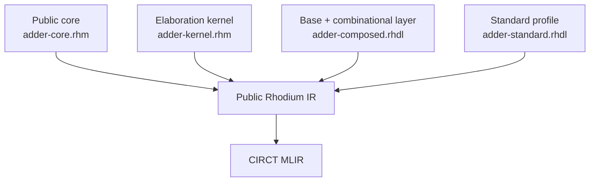

<!-- Presents the executable Rhodium and RFPL walkthroughs and canonical feature examples. -->

# Rhodium and RFPL examples

This guide is the executable learning path and complete example catalog for
Rhodium and RFPL. Start with a task below, then use the ownership indexes to
find every runnable example. Language architecture and component contracts stay
with their owning packages; this guide links to them instead of repeating them.
Contributors adding examples or maintaining generated references should read
[`DEVELOPING.md`](DEVELOPING.md).

- [Choose a learning path](#choose-a-learning-path)
- [Run the examples](#run-the-examples)
- [Compare the authoring layers](#compare-the-authoring-layers)
- [Browse the complete catalog](#complete-catalog)
- [Check generated Verilog](#generated-verilog)

## Choose a learning path

| Goal | Suggested path | Owning guide |
|---|---|---|
| Write a first combinational circuit | [`rtl/full-adder.rhdl`](rtl/full-adder.rhdl) → [`rtl/adder4.rhdl`](rtl/adder4.rhdl) → [`rtl/alu.rhdl`](rtl/alu.rhdl) | [Frontend](../rhodium/frontend/README.md) |
| Add state and memory | [`rtl/sync-counter.rhdl`](rtl/sync-counter.rhdl) → [`rtl/register-forms.rhdl`](rtl/register-forms.rhdl) → [`rtl/sync-memory.rhdl`](rtl/sync-memory.rhdl) | [Frontend layers](../rhodium/frontend/layers/README.md) |
| Generate and reuse hierarchy | [`rtl/generated-adder.rhdl`](rtl/generated-adder.rhdl) → [`rtl/hierarchy.rhdl`](rtl/hierarchy.rhdl) → [`rtl/host-parameters.rhdl`](rtl/host-parameters.rhdl) | [Frontend](../rhodium/frontend/README.md) |
| Work with aggregate types | [`rtl/bundle.rhdl`](rtl/bundle.rhdl) → [`rtl/vector.rhdl`](rtl/vector.rhdl) → [`rtl/tagged-union.rhdl`](rtl/tagged-union.rhdl) | [Frontend layers](../rhodium/frontend/layers/README.md) |
| Connect typed interfaces | [`rtl/interface.rhdl`](rtl/interface.rhdl) → [`rtl/interface-array.rhdl`](rtl/interface-array.rhdl) → [`std/flow-topology.rhdl`](std/flow-topology.rhdl) | [Standard library](../rhodium/std/README.md) |
| Understand the language stack | [`lop/adder-core.rhm`](lop/adder-core.rhm) → [`lop/adder-kernel.rhm`](lop/adder-kernel.rhm) → [`lop/adder-composed.rhdl`](lop/adder-composed.rhdl) → [`lop/adder-standard.rhdl`](lop/adder-standard.rhdl) | [Frontend profiles](../rhodium/frontend/README.md#choose-a-language-profile) |
| Declare and verify clock crossings | [`clocking/frontend-environment.rhdl`](clocking/frontend-environment.rhdl) → [`clocking/sync-level.rhdl`](clocking/sync-level.rhdl) → [`clocking/missing-crossings.rhdl`](clocking/missing-crossings.rhdl) | [Clocking analysis](../rhodium/analysis/README.md#clocking-analysis) |
| Explore a domain library | [NoC](#noc), [RISC-V](#risc-v), [CHI](#chi), or [processor cores](#processor-cores) | [NoC](../noc/README.md), [RISC-V](../riscv/README.md), [CHI](../chi/README.md), [cores](../cores/README.md) |
| Add physical views | [`rfpl/circuit-pair.rhdl`](rfpl/circuit-pair.rhdl) → [`rfpl/circuit-pair.rfpl`](rfpl/circuit-pair.rfpl) | [RFPL](../rfpl/README.md) |
| Prove behavioral equivalence | [`formal/equivalence.rhm`](formal/equivalence.rhm) | [Formal verification](../rhodium/formal/README.md) |

## Run the examples

Run every non-formal example and validate the exact Verilog references selected
for compact lowering examples:

```sh
make examples
```

Use an ownership target for a focused run:

| Target | Directory |
|---|---|
| `make examples-rhodium` | [`rtl/`](rtl/) |
| `make examples-clocking` | [`clocking/`](clocking/) |
| `make examples-std` | [`std/`](std/) |
| `make examples-noc` | [`noc/`](noc/) |
| `make examples-lop` | [`lop/`](lop/) |
| `make examples-rfpl` | [`rfpl/`](rfpl/) |
| `make examples-riscv` | [`riscv/`](riscv/) |
| `make examples-chi` | [`chi/`](chi/) |
| `make examples-cores` | [`cores/`](cores/) |
| `make examples-rv5stage` | [`rv5stage/`](rv5stage/) |

The Rosette-backed formal example is intentionally separate so ordinary use
does not require Rosette:

```sh
make examples-formal
```

## Compare the authoring layers

Four versions of the same 8-bit adder show how progressively richer authoring
surfaces construct the same public Rhodium IR and CIRCT MLIR:

| Surface | Example | What it makes explicit |
|---|---|---|
| Public core | [`lop/adder-core.rhm`](lop/adder-core.rhm) | `Design`, `Builder`, and verification APIs |
| Elaboration kernel | [`lop/adder-kernel.rhm`](lop/adder-kernel.rhm) | Active-context construction functions |
| Composed language | [`lop/adder-composed.rhdl`](lop/adder-composed.rhdl) | `#lang rhodium/base` plus the combinational layer |
| Standard profile | [`lop/adder-standard.rhdl`](lop/adder-standard.rhdl) | Curated `#lang rhodium` syntax |



Check their structural equivalence with:

```sh
make lop-test
```

The remaining layer-of-programming examples compare specific surfaces:

| Comparison | Examples |
|---|---|
| Explicit record construction and bundle syntax | [`lop/bundle-kernel.rhdl`](lop/bundle-kernel.rhdl), [`lop/bundle-standard.rhdl`](lop/bundle-standard.rhdl) |
| Directional records and role-based interfaces | [`lop/interface-records.rhdl`](lop/interface-records.rhdl), [`rtl/interface.rhdl`](rtl/interface.rhdl) |
| Kernel width operations and concise indexing | [`lop/width-ops-kernel.rhm`](lop/width-ops-kernel.rhm), [`rtl/width-ops.rhdl`](rtl/width-ops.rhdl) |
| Explicit sequential layers and the standard profile | [`lop/counter-composed.rhdl`](lop/counter-composed.rhdl), [`rtl/sync-counter.rhdl`](rtl/sync-counter.rhdl) |
| Public-IR inspection without CIRCT | [`lop/inspect-ir.rhm`](lop/inspect-ir.rhm) |

See the [frontend guide](../rhodium/frontend/README.md) for profile and
elaboration contracts and the [layer guide](../rhodium/frontend/layers/README.md)
for the feature inventory.

## Complete catalog

### Rhodium language and RTL

These examples use built-in language features under [`rtl/`](rtl/).

#### Combinational logic and numeric types

| Example | Primary lesson |
|---|---|
| [`rtl/full-adder.rhdl`](rtl/full-adder.rhdl) | Nominal Boolean ports and carry logic |
| [`rtl/adder4.rhdl`](rtl/adder4.rhdl) | Ripple-carry hierarchy and pack-aware concatenation |
| [`rtl/alu.rhdl`](rtl/alu.rhdl) | Boolean, bitwise, arithmetic, equality, and N-way selection |
| [`rtl/unsigned-comparisons.rhdl`](rtl/unsigned-comparisons.rhdl) | Unsigned ordering derived from one core comparison |
| [`rtl/signed-integers.rhdl`](rtl/signed-integers.rhdl) | Explicit-width signed arithmetic, ordering, shifts, and resizing |
| [`rtl/one-hot.rhdl`](rtl/one-hot.rhdl) | One-hot literals, selector-owned selection, equality, and representation casts |
| [`rtl/one-hot-enum.rhdl`](rtl/one-hot-enum.rhdl) | Nominal one-hot enums selecting named datapath result families |
| [`rtl/masks.rhdl`](rtl/masks.rhdl) | Non-numeric lane sets, bitwise set operations, and explicit selector widening |
| [`rtl/shifts.rhdl`](rtl/shifts.rhdl) | Logical shifts with host constants and independent hardware amount widths |
| [`rtl/multiply.rhdl`](rtl/multiply.rhdl) | Modular same-width unsigned multiplication |
| [`rtl/expanding-arithmetic.rhdl`](rtl/expanding-arithmetic.rhdl) | Lossless unsigned addition plus signed and unsigned multiplication |
| [`rtl/fir-filter.rhdl`](rtl/fir-filter.rhdl) | Signed direct-form FIR filtering with generated taps, explicit widths, and balanced summation |
| [`rtl/priority-encoder.rhdl`](rtl/priority-encoder.rhdl) | Lower-index-first binary and native `MaybeOneHot` selection over packed and aggregate inputs |
| [`rtl/bit-utilities.rhdl`](rtl/bit-utilities.rhdl) | Negation, reductions, membership predicates, and enum validity |
| [`rtl/width-ops.rhdl`](rtl/width-ops.rhdl) | Concatenation, slicing, and explicit width changes |

#### Aggregate data and control

| Example | Primary lesson |
|---|---|
| [`rtl/enum-state.rhdl`](rtl/enum-state.rhdl) | Equivalent enum mux/switch forms, explicit encodings, and invalid recovery |
| [`rtl/tagged-union.rhdl`](rtl/tagged-union.rhdl) | Nullary and payload variants with `.tag`, `.is(...)`, and `.view(...)` inspection |
| [`rtl/nested-tagged-union.rhdl`](rtl/nested-tagged-union.rhdl) | Nested tagged-union literals, chained payload views, and runtime reconstruction |
| [`rtl/bundle.rhdl`](rtl/bundle.rhdl) | Fixed and conditional bundles, recursive literals, muxes, casts, and state |
| [`rtl/vector.rhdl`](rtl/vector.rhdl) | Fixed vectors, mapping, selection, representation changes, aggregate drives, and state |
| [`rtl/vector-update.rhdl`](rtl/vector-update.rhdl) | Functional replacement and dynamic vector-register writes |
| [`rtl/table.rhdl`](rtl/table.rhdl) | Host-generated combinational vector table |

#### State, storage, and effects

| Example | Primary lesson |
|---|---|
| [`rtl/counter.rhdl`](rtl/counter.rhdl) | Host helper functions accepting and returning hardware |
| [`rtl/sync-counter.rhdl`](rtl/sync-counter.rhdl) | Ambient clock/reset policy and explicit override |
| [`rtl/enable-shift-register.rhdl`](rtl/enable-shift-register.rhdl) | Hardware conditionals, register hold, and synchronous reset |
| [`rtl/reset-shift-register.rhdl`](rtl/reset-shift-register.rhdl) | Generic enabled shift register with ambient synchronous reset |
| [`rtl/register-forms.rhdl`](rtl/register-forms.rhdl) | Inferred register types, immediate next values, reset values, and direct drives |
| [`rtl/stack.rhdl`](rtl/stack.rhdl) | Memory, guarded writes, nested hardware control, and bounds checks |
| [`rtl/async-read-memory.rhdl`](rtl/async-read-memory.rhdl) | Asynchronous reads and synchronous writes |
| [`rtl/sync-memory.rhdl`](rtl/sync-memory.rhdl) | Circuit-shaped synchronous memory with explicit read and write ports |
| [`rtl/sync-memory-1rw.rhdl`](rtl/sync-memory-1rw.rhdl) | One shared synchronous read-write physical port |
| [`rtl/sync-memory-masked.rhdl`](rtl/sync-memory-masked.rhdl) | Byte-masked writes through a shared synchronous memory port |
| [`rtl/multi-write-memory.rhdl`](rtl/multi-write-memory.rhdl) | Independent same-clock physical write ports |
| [`rtl/vec-search.rhdl`](rtl/vec-search.rhdl) | Registered traversal of a host-defined vector pattern |
| [`rtl/vec-shift-register.rhdl`](rtl/vec-shift-register.rhdl) | Priority aggregate load and shift updates |
| [`rtl/vec-shift-register-param.rhdl`](rtl/vec-shift-register-param.rhdl) | Host-parameterized vector pipeline |
| [`rtl/clocked-dpi.rhdl`](rtl/clocked-dpi.rhdl) | DPI procedure effects plus single- and multi-result DPI register state |
| [`rtl/assertions.rhdl`](rtl/assertions.rhdl) | Reset-suppressed assertions with branch-derived activation guards |
| [`rtl/wire.rhdl`](rtl/wire.rhdl) | Forward-readable aggregate wire driven later by element |

#### Generation and hierarchy

| Example | Primary lesson |
|---|---|
| [`rtl/add-pair.rhm`](rtl/add-pair.rhm) | Ordinary Rhombus library composition without a reader or macro |
| [`rtl/generated-adder.rhdl`](rtl/generated-adder.rhdl) | Host `InstanceArray` generation plus runtime vector wiring |
| [`rtl/hierarchy.rhdl`](rtl/hierarchy.rhdl) | Reused module definitions and child-port access |
| [`rtl/nested-circuit.rhdl`](rtl/nested-circuit.rhdl) | Lexically private child generators with explicit hardware boundaries |
| [`rtl/layered-adder.rhdl`](rtl/layered-adder.rhdl) | Ordinary imported library plus generated structure |
| [`rtl/fresh-generators.rhdl`](rtl/fresh-generators.rhdl) | Automatic reuse of equivalent module specializations |
| [`rtl/host-parameters.rhdl`](rtl/host-parameters.rhdl) | `StableCircuitParam` reuse and hardware-type parameters |
| [`rtl/generator-parameters.rhdl`](rtl/generator-parameters.rhdl) | Positional, keyword, typed, defaulted, and synchronous generator parameters |
| [`rtl/predicate-filter.rhdl`](rtl/predicate-filter.rhdl) | Stable predicate policies elaborated inline through a `Valid` interface |
| [`rtl/tiny-simd.rhdl`](rtl/tiny-simd.rhdl) | Integrated host-specialized SIMD, bundles, enums, memory, vectors, and state |

#### Interfaces

| Example | Primary lesson |
|---|---|
| [`rtl/interface.rhdl`](rtl/interface.rhdl) | Ready-valid fields, bulk connection, and instance reconstruction |
| [`rtl/interface-specialization.rhdl`](rtl/interface-specialization.rhdl) | Directional compatibility, nesting, operand reversal, and explicit width adaptation |
| [`rtl/interface-array.rhdl`](rtl/interface-array.rhdl) | Endpoint arrays, generic links, handles, and terminated sinks |
| [`rtl/nested-interface.rhdl`](rtl/nested-interface.rhdl) | Recursive interface composition and orientation |
| [`rtl/interface-monitor.rhdl`](rtl/interface-monitor.rhdl) | Read-only endpoint observations and explicit protocol assertions |
| [`rtl/interface-transform.rhdl`](rtl/interface-transform.rhdl) | Typed custom interface transforms, fanout, and detached terminals |

The [frontend layer guide](../rhodium/frontend/layers/README.md) owns the exact
syntax and semantic contracts demonstrated here.

### Standard library

These examples exercise reusable components imported from `rhodium/std`. See
the [standard-library guide](../rhodium/std/README.md) for component contracts
and the authoritative source-module map.

#### Utilities, decode, and storage

| Example | Primary lesson |
|---|---|
| [`std/standard-counter.rhdl`](std/standard-counter.rhdl) | Reusable bounded counter with wrap indication |
| [`std/sync-ram.rhdl`](std/sync-ram.rhdl) | Lane-masked `Valid` requests over a fixed-latency shared 1RW RAM |
| [`std/dont-care.rhdl`](std/dont-care.rhdl) | Typed synthesis freedom and Pattern-selected fixed bits |
| [`std/decode.rhdl`](std/decode.rhdl) | Callable typed decode relation with aggregate fields and semantic enum values |
| [`std/decode-composition.rhdl`](std/decode-composition.rhdl) | Pattern-set algebra and independent decode expansion across rows and fields |
| [`std/scoreboard.rhdl`](std/scoreboard.rhdl) | Set/clear occupancy tracking with range and state assertions |

#### Protocols and flow composition

| Example | Primary lesson |
|---|---|
| [`std/ready-valid-compatibility.rhdl`](std/ready-valid-compatibility.rhdl) | Safe protocol weakening and refinement merge/split |
| [`std/flow-control.rhdl`](std/flow-control.rhdl) | Pipe, queue, fixed-priority arbiter, and typed endpoint chaining |
| [`std/packet-arbitration.rhdl`](std/packet-arbitration.rhdl) | Round-robin arbitration that retains ownership through each packet's final flit |
| [`std/valid-pipe.rhdl`](std/valid-pipe.rhdl) | Fixed-latency Valid-only pipelining without a readiness channel |
| [`std/flow-topology.rhdl`](std/flow-topology.rhdl) | Endpoint-first and precomposed map, filter, zip, arbitration, buffering, fork, and routing topologies |
| [`std/ctrl-flow.rhdl`](std/ctrl-flow.rhdl) | Payloadless token-flow versions of pipe, queue, arbitration, routing, join, and broadcast |
| [`std/valid-flow.rhdl`](std/valid-flow.rhdl) | Valid-only map, filter, fanout, and conversion from accepted flow |
| [`std/completion-queue.rhdl`](std/completion-queue.rhdl) | Response-capacity reservation before nonstallable issue |
| [`std/credited-transport.rhdl`](std/credited-transport.rhdl) | Monitored sender/buffer composition with explicit credit return |
| [`std/flit-formats.rhdl`](std/flit-formats.rhdl) | Transfer-counted framing for fixed-length ready-valid packets |
| [`std/state-flow.rhdl`](std/state-flow.rhdl) | Fair changed-state emission and always-ready local state replication over aggregate data |

### Clocking and CDC

The clocking examples combine frontend environment declarations with
backend-independent temporal-provenance analysis over completed Rhodium IR.
The [analysis guide](../rhodium/analysis/README.md#clocking-analysis) owns the
report and CDC contracts.

| Example | Primary lesson |
|---|---|
| [`clocking/frontend-environment.rhdl`](clocking/frontend-environment.rhdl) | Root input-timing declarations and a resolved elaboration report |
| [`clocking/sync-level.rhdl`](clocking/sync-level.rhdl) | Strict CDC elaboration, retained `SyncLevel` evidence, and synchronizer attributes |
| [`clocking/reconvergence.rhdl`](clocking/reconvergence.rhdl) | Structured diagnostics for convergence after individually legal crossings |
| [`clocking/missing-crossings.rhdl`](clocking/missing-crossings.rhdl) | Hierarchical missing-crossing reports and a corrected synchronized design |
| [`clocking/single-clock.rhm`](clocking/single-clock.rhm) | Top-level synchronous input contracts applied to an existing shift register |
| [`clocking/relationships.rhm`](clocking/relationships.rhm) | Exact, identical, derived, asynchronous, and unknown clock relationships |
| [`clocking/hierarchy.rhm`](clocking/hierarchy.rhm) | One child reused with two clock bindings and classified per instance |
| [`clocking/report.rhm`](clocking/report.rhm) | Hierarchy-aware temporal-provenance reporting for a sync counter |

### NoC

These examples consume graph-validated NoC plans. See the [pure NoC model](../noc/README.md)
and [NoC RTL guide](../noc/rtl/README.md) for proof and hardware contracts.

| Example | Primary lesson |
|---|---|
| [`noc/noc-route-computer.rhdl`](noc/noc-route-computer.rhdl) | Validated route rows lowered into an exhaustively checked combinational decoder |
| [`noc/noc-router.rhdl`](noc/noc-router.rhdl) | One-beat routing with per-origin buffers, one-to-one allocation, ejection, and backpressure |
| [`noc/noc-network.rhdl`](noc/noc-network.rhdl) | Three router subsystems assembled from pure router and VC wiring plans |
| [`noc/noc-crossbar.rhdl`](noc/noc-crossbar.rhdl) | Linkless one-router NoC used as a generalized crossbar |
| [`noc/wormhole-router-diagram.rhdl`](noc/wormhole-router-diagram.rhdl) | Flow-aware diagram of a packet-retaining phased-XY router |

### RISC-V

See the [RISC-V instruction model](../riscv/README.md) for descriptor and adapter
contracts.

| Example | Primary lesson |
|---|---|
| [`riscv/instruction-pattern.rhdl`](riscv/instruction-pattern.rhdl) | RV32I and RV64I descriptors materialized as typed patterns |
| [`riscv/instruction-fields.rhdl`](riscv/instruction-fields.rhdl) | Descriptor-generated instruction fields and sign-extended immediates |

### CHI

See the [CHI domain guide](../chi/README.md) for the implemented protocol profile
and endpoint contracts.

| Example | Primary lesson |
|---|---|
| [`chi/ram.rhdl`](chi/ram.rhdl) | Finite initial-profile non-coherent CHI backing RAM |
| [`chi/home.rhdl`](chi/home.rhdl) | Decoupled HN-I translation between requester and subordinate flows |

### Processor cores

The [processor-component guide](../cores/README.md) owns reusable datapath
boundaries, and the [RV5Stage guide](../cores/rv5stage/README.md) owns the
integrated core architecture.

| Example | Primary lesson |
|---|---|
| [`cores/decoded-alu.rhdl`](cores/decoded-alu.rhdl) | RV64I decode connected directly to the reusable integer ALU |
| [`cores/rv5stage.rhdl`](cores/rv5stage.rhdl) | Complete RV64 RV5Stage core with private instruction and data caches |
| [`rv5stage/core-diagram.rhdl`](rv5stage/core-diagram.rhdl) | Logical diagram extraction for RV5Stage blocks and interface channels |

The [diagram guide](../rhodium/diagram/README.md) documents logical extraction.

### RFPL physical views

[`rfpl/circuit-pair.rhdl`](rfpl/circuit-pair.rhdl) defines the logical
hierarchy; [`rfpl/circuit-pair.rfpl`](rfpl/circuit-pair.rfpl) adds its physical
views. See the [RFPL guide](../rfpl/README.md) for annotation, placement, and
hardware-preservation contracts.

### Formal verification

[`formal/equivalence.rhm`](formal/equivalence.rhm) uses the optional Rosette
consumer to prove that standard-profile and explicitly composed adders are
behaviorally equivalent. See the [formal guide](../rhodium/formal/README.md)
for supported properties, solver setup, and limits.

## Generated Verilog

Compact examples may colocate generated-Verilog references so their readable
output acts as part of the example. Integration-scale examples instead rely on
elaboration, CIRCT lowering, and behavioral tests without carrying large exact
snapshots. `make examples` checks manifest coverage and validates the references
explicitly selected by the backend fixture manifest; it does not run CIRCT or
Verilator.

Reference naming, catalog maintenance, and the validation workflow are in the
[example contributor guide](DEVELOPING.md#maintain-generated-verilog). The
[backend test developer guide](../tests/backend/DEVELOPING.md#verilog-references)
owns exact comparison and update mechanics.
