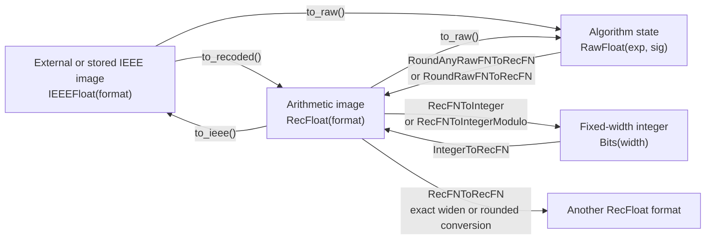
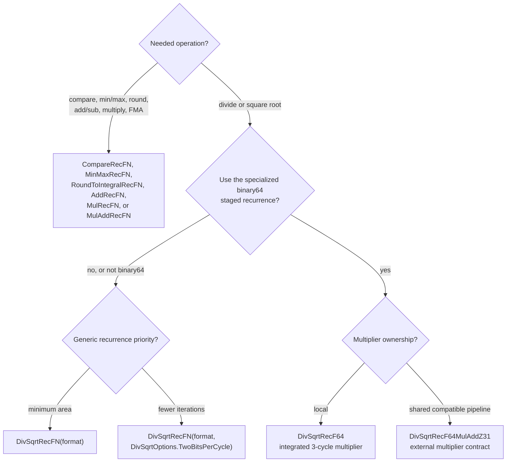

<!-- Guides users through selecting, integrating, and validating the Rhodium Berkeley HardFloat port. -->
<!-- SPDX-License-Identifier: BSD-3-Clause -->

# HardFloat for Rhodium

This directory is a Rhodium port of the
[Berkeley HardFloat](https://github.com/ucb-bar/berkeley-hardfloat) Chisel
source, pinned to upstream commit
[`c1105e6ac6a0dd90fc80893efc4830ab609005d3`](https://github.com/ucb-bar/berkeley-hardfloat/commit/c1105e6ac6a0dd90fc80893efc4830ab609005d3).
The Regents of the University of California and SiFive retain copyright in
the derived algorithms. See [`LICENSE.md`](LICENSE.md) for the applicable
upstream BSD-style licenses. This project is not endorsed by the University
of California, SiFive, or the upstream contributors.

The port is ordinary Rhodium: it elaborates into the public core IR and lowers
through the existing CIRCT backend. It neither adds floating-point operations
to Rhodium core nor imports Chisel or wraps generated Verilog.

Contributors maintaining the port should read
[`DEVELOPING.md`](DEVELOPING.md).

## Start here

Import the public facade rather than individual implementation files:

```rhombus
import:
  lib("hardfloat/main.rhdl") open
```

Then choose a path by task:

| Task | Use |
|---|---|
| Enter or leave an IEEE-encoded boundary | `IEEEFloat(format).to_recoded()` and `RecFloat(format).to_ieee()` |
| Inspect special cases or build an internal algorithm | `.to_raw()`, `.is_signaling_nan()`, and `.classify()` |
| Convert an integer to floating point | `IntegerToRecFN(integer_width, format)` |
| Convert floating point to a saturating or modulo integer | `RecFNToInteger(format, integer_width)` or `RecFNToIntegerModulo(format, integer_width)` |
| Widen or narrow between floating-point formats | `RecFNToRecFN(input_format, output_format)` |
| Compare or select an IEEE minimum/maximum variant | `CompareRecFN` or `MinMaxRecFN` |
| Round to an integral value in the same format | `RoundToIntegralRecFN` |
| Add/subtract, multiply, or fuse multiply-add | `AddRecFN`, `MulRecFN`, or `MulAddRecFN` |
| Divide or take square root for any supported format | `DivSqrtRecFN(format, options)` |
| Prioritize binary64 throughput over a small iterative unit | `DivSqrtRecF64()` |
| Share an existing compatible binary64 multiplier pipeline | `DivSqrtRecF64MulAddZ31()` |

The public arithmetic circuits consume and produce `RecFloat`; convert only at
system boundaries. `RawFloat` is an algorithm-facing bundle, not an
architectural storage encoding.

## Representations and conversions

`FloatFormat(exponent_width, significand_width)` follows HardFloat's convention:
the significand width includes the implicit leading bit. An IEEE image therefore
has `exponent_width + significand_width` bits; its recoded image has one extra
exponent bit.



`IEEEFloat(format)` and `RecFloat(format)` are distinct nominal scalar types.
Their format is part of connection checking, so equal-width encodings such as
binary16 and bfloat16 cannot be connected accidentally. Both lower to integer
signals. Use `.as_bits()` only for representation-level work or an explicitly
untyped external boundary.

`RawFloat` exposes special-case tags, sign, a signed exponent, and an extended
significand. `resize_raw_float` adjusts exponent bias, saturates an exponent
that must shrink, and preserves discarded significand information in a sticky
bit. The rounders consume raw values and produce `ExceptionFlags` alongside a
recoded result.

### Supported configurations

A `FloatFormat` is accepted when:

- `exponent_width >= 3`;
- `significand_width >= 3`; and
- `significand_width <= 2^(exponent_width - 2) + 3`.

These are the upstream HardFloat parameter limits. All generic representation,
conversion, comparison, arithmetic, rounding, and iterative divide/square-root
components accept any format in this domain. BF16 retains IEEE-style subnormal
support, as in upstream HardFloat.

| Name | Exponent | Significand | IEEE width | Recoded width |
|---|---:|---:|---:|---:|
| `FloatFormat.F16` | 5 | 11 | 16 | 17 |
| `FloatFormat.BF16` | 8 | 8 | 16 | 17 |
| `FloatFormat.F32` | 8 | 24 | 32 | 33 |
| `FloatFormat.F64` | 11 | 53 | 64 | 65 |

`IntegerToRecFN` requires `integer_width >= 2`; `RecFNToInteger` requires
`integer_width >= 3`. Integer signedness is a hardware control input, not a
different packed type.

The six encoded rounding modes are `NearEven`, `MinMagnitude`, `Minimum`,
`Maximum`, `NearMaximumMagnitude`, and `Odd`. `TininessMode` selects detection
before or after rounding. `RoundingOptions` contains compile-time invariants for
specialized internal clients; it does not create hardware control ports.
`ExceptionFlags` packs invalid, infinite, overflow, underflow, and inexact.
`IntegerExceptionFlags` packs invalid, overflow, and inexact.

## Select an arithmetic component



| Component | Format | Interface | Internal latency/state | Select it when |
|---|---|---|---|---|
| `CompareRecFN` | Any supported | `a`, `b`, `signaling` -> `lt`, `eq`, `gt`, flags | Combinational | Ordered comparison and signaling/quiet NaN policy |
| `MinMaxRecFN` | Any supported | `a`, `b`, `MinMaxOperation` -> result, flags | Combinational | IEEE minimum, maximum, minimumNumber, or maximumNumber selection |
| `RoundToIntegralRecFN` | Any supported | value, rounding mode, inexact-enable -> same-format result, flags | Combinational | Round without changing the floating-point format |
| `AddRecFN` | Any supported | `subtract`, `a`, `b`, rounding, tininess -> result, flags | Combinational | Addition or subtraction |
| `MulRecFN` | Any supported | `a`, `b`, rounding, tininess -> result, flags | Combinational | Rounded multiplication |
| `MulAddRecFN` | Any supported | operation, `a`, `b`, `c`, rounding, tininess -> result, flags | Combinational, one final rounding | IEEE-style fused multiply-add/subtract variants |
| `DivSqrtRecFN` | Any supported | one shared ready/valid request; separate divide/sqrt completion pulses | Iterative, one active recurrence; variable by operation, format, and special case | Small general unit |
| `DivSqrtRecFN(...TwoBitsPerCycle)` | Any supported | Same as generic | Iterative, up to two recurrence bits per busy cycle | Lower normal-operation latency for more logic |
| `DivSqrtRecF64` | F64 only | operation-specific ready and completion pulses | Multi-cycle A/B/C/E pipeline; integrated three-cycle 54x54+105 multiplier; can overlap work | Higher-throughput standalone binary64 |
| `DivSqrtRecF64MulAddZ31` | F64 only | Same arithmetic protocol plus multiplier usage/latch/operand/result ports | Same staged recurrence; external multiplier defines the integration timing | A compatible multiplier pipeline is already shared |

“Combinational” means the circuit contains no clocked state; register placement
and cycle latency belong to its caller. The generic divide/square-root unit
accepts a request only when `input_ready` is asserted. Normal division starts a
counter at `significand_width + 2`; normal square root starts at
`significand_width` or `significand_width + 1` according to exponent parity.
The default recurrence advances one bit per busy cycle, with an upstream
data-dependent final-cycle shortcut, while `TwoBitsPerCycle` advances two when
possible. Special values take the short exception path. Treat completion as a
protocol event rather than assuming one constant latency.

`MulAddOperation` selects `a*b+c`, `a*b-c`, `-a*b+c`, or `-a*b-c`; all four use
one rounding step. `FloatClass` is a ten-bit one-hot result.
`MultiplyAddPipelineUsage` names four independently occupied stages and is not
one-hot.

### Sequential divide/square-root protocols

For `DivSqrtRecFN`, assert `input_valid` with stable operation and operand
inputs when `input_ready` is high. Division computes `a / b`; square root
consumes `a`. Observe `division_valid` or `square_root_valid` to distinguish the
completion.

The specialized binary64 units preserve their upstream operand convention:
division computes `a / b`, while square root consumes `b`. Admission is selected
with `division_ready` or `square_root_ready`; the matching completion output
identifies the returned result. Requests may overlap, so keep any caller-owned
metadata in matching order.

`DivSqrtRecF64` contains the required multiplier. With
`DivSqrtRecF64MulAddZ31`, the caller must honor `using_multiply_add`,
`latch_multiply_a`, and `latch_multiply_b`, calculate the 105-bit
`multiply_a * multiply_b + multiply_c`, and return it on
`multiply_add_result` with the same three-cycle stage timing as the integrated
implementation. Use the integrated form unless that external contract is
deliberately being shared.

## Example

```rhombus
#lang rhodium

import:
  lib("hardfloat/main.rhdl") open

circuit CompareF32():
  input a: IEEEFloat(FloatFormat.F32)
  input b: IEEEFloat(FloatFormat.F32)
  input signaling: Bool
  output less: Bool

  inst compare(CompareRecFN(FloatFormat.F32))
  compare.a <== a.to_recoded()
  compare.b <== b.to_recoded()
  compare.signaling <== signaling
  less <== compare.lt
```

## Status and deliberate limits

The facade exports the supported format and packed types, representation and
raw helpers, rounders, saturating and modulo integer conversions, format
conversions, classification, comparison, the four IEEE minimum/maximum
variants, same-format integral rounding, add/subtract, multiply, fused
multiply-add, both generic iterative divide/square-root configurations, and
both specialized binary64 forms. The arithmetic components planned from the
pinned upstream slice are implemented; unported auxiliary wrappers are omitted
rather than exposed as stubs.

`MinMaxRecFN` distinguishes the NaN-propagating `Minimum` and `Maximum`
operations from `MinimumNumber` and `MaximumNumber`, which select the numeric
operand when exactly one input is NaN. All four operations use IEEE signed-zero
ordering and raise invalid only for a signaling NaN. `RoundToIntegralRecFN`
supports every package rounding mode and lets clients independently request or
suppress the inexact flag. `RecFNToIntegerModulo` returns the rounded integer
modulo its output width while retaining the ordinary saturating converter's
invalid, overflow, and inexact classification. These three components are
Rhodium extensions over the HardFloat representations; they do not encode any
RISC-V instruction policy.

HardFloat owns floating-point representation and arithmetic behavior. It does
not own ISA decoding, architectural register storage, NaN boxing, canonical-NaN
policy, CSR state, instruction scheduling, retirement, or architectural
exception accrual.
Reusable RISC-V policy lives in the
[`riscv/rtl` floating-point layer](../riscv/rtl/README.md#floating-point-policy),
and RV5Stage integration belongs to the
[`RV5Stage execution and completion`](../cores/rv5stage/README.md#execution-and-completion)
contract. Keeping those boundaries separate also lets non-RISC-V clients use
this package directly.

The current tests are implementation and directed-behavior checks, not a proof
of equivalence to every upstream configuration. Differential vector suites
from Berkeley TestFloat and SoftFloat and comparative area/timing measurements
against the pinned Chisel implementation remain follow-up work. No internal
temporary name or netlist shape is a compatibility promise.

## Implementation map

Source ownership and package dependencies are documented in
[`DEVELOPING.md`](DEVELOPING.md#implementation-map).

## Translation and provenance policy

The pinned upstream commit and applicable licenses are part of the public
provenance of this package. The detailed translation rules and update workflow
are documented in
[`DEVELOPING.md`](DEVELOPING.md#translation-and-provenance-policy).

## Focused validation

From the repository root, run the complete focused package validation with:

```sh
make hardfloat-test
```

This target requires the CIRCT and Verilator tools used by the repository test
harness. Host-only and backend-specific slices, their exact coverage, and the
fresh-bytecode requirements are documented in
[`DEVELOPING.md`](DEVELOPING.md#focused-validation).

## Follow-up work

Maintenance work that does not change the supported public surface is tracked
in [`DEVELOPING.md`](DEVELOPING.md#follow-up-work).
