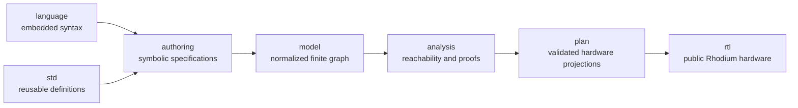

<!-- Guides contributors through extending the pure NoC model, proofs, and hardware plans. -->

# Developing the pure NoC stack

Read the package [README](README.md) for symbolic authoring, normalized model,
proof semantics, and hardware-plan contracts. This guide owns implementation
layers, dependency enforcement, extension workflow, and focused validation.

## Architecture and dependency boundary

Keep the stack directional:



The pure `model`, `authoring`, `analysis`, `language`, `plan`, and `std`
directories use ordinary Rhombus and must not import Rhodium, `flow/`, or CIRCT. Core
layers must not import `noc/std`; reusable definitions depend on abstractions,
never the reverse. Only `noc/rtl` may import public Rhodium libraries, and it
must consume opaque validated plans rather than unchecked routing relations.
[`check-boundaries.sh`](check-boundaries.sh) enforces these rules.

## Implementation map

| Layer | Ownership |
|---|---|
| [`model/`](model/) | Nominal graph identities, topology, and routing relations |
| [`authoring/`](authoring/) | Symbolic names, composition, terminal placement, topology and routing lowering |
| [`language/`](language/) | `topology:` and `routing:` embedded forms |
| [`std/`](std/) | Reusable topology, traffic, and routing-policy definitions |
| [`analysis/`](analysis/) | Materialization, reachability, hop distance, dependency graphs, acyclicity, and escape validation |
| [`plan/`](plan/) | Diagnostics, opaque validated routing, route tables, network plans, and router-family projections |
| [`rtl/DEVELOPING.md`](rtl/DEVELOPING.md) | Rhodium realization of validated plans |
| [`tests/`](tests/) | Pure model, authoring, language, proof, plan, example, and equivalence coverage |

## Extend the pure stack

1. Put new graph vocabulary and invariants in `model/` only when every upper
   layer needs them.
2. Put symbolic composition and deterministic name-to-ID lowering in
   `authoring/`; keep embedded syntax as a thin expansion into that public API.
3. Put reusable topology, traffic, or routing policies in `std/` so the core
   model and validators remain definition-independent.
4. Materialize caller callbacks exactly once before analysis. Preserve stable
   ordering and provenance so diagnostics and route tables do not depend on
   declaration order.
5. Add a proof regime only with explicit assumptions, deterministic failure
   witnesses, an opaque success certificate, and a plan projection that cannot
   re-evaluate untrusted policy.
6. Update [README.md](README.md) when author-visible semantics, proof claims,
   supported definitions, or deliberate limits change.

Changes crossing multiple layers should be tested first at the lowest owning
layer, then through `compile_routing`, and finally through the relevant
hardware consumer. Preserve the three-way equivalence
tests when ordinary authoring, embedded syntax, and reusable composition are
intended to denote the same network.

## Focused validation

From the repository root, run:

```sh
make noc-test
```

This target checks package boundaries, the pure model, authoring and embedded
language, standard definitions, analysis, proof regimes, plans, diagnostics,
equivalence cases, and host-side RTL construction. It also runs the intentional
invalid language cases.

For one host file, use the repository wrapper so it receives a fresh compiled
root, for example:

```sh
tools/run-racket-tests.sh noc/tests/plan/router-family-plan-test.rhm
```

Use [`rtl/DEVELOPING.md`](rtl/DEVELOPING.md#focused-validation) when a change
also affects CIRCT or Verilator hardware fixtures.
