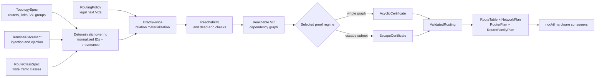

<!-- Defines the pure host-side NoC model and analysis contract and their separation from Rhodium. -->
<!-- SPDX-License-Identifier: Apache-2.0 -->

# Pure NoC model and analysis

This package defines the host-side graph vocabulary used for routing-relation
materialization, virtual-channel dependency validation, route-table generation,
and validated hardware plans. Its pure model is intentionally independent of
Rhodium hardware construction and CIRCT.

Contributors extending the NoC model, proofs, or plans should read
[`DEVELOPING.md`](DEVELOPING.md).

## At a glance

The package has one directional workflow: describe a network symbolically,
lower it into a deterministic finite model, prove the materialized routing
relation, and only then project plans that hardware is allowed to consume.



The implemented surface is organized into six capabilities:

- **Symbolic authoring.** Hierarchical topology, terminal, link, VC-group, and
  route-class names support deterministic prefixing, composition, lowering,
  and diagnostic provenance. Optional `topology:` and `routing:` forms expand
  into the same public authoring API as ordinary host code.
- **Finite routing model.** Nominal node, link, VC, terminal, and route-class
  identities describe explicit directed multigraphs with positive,
  heterogeneous VC counts. Parallel links and self-loops are legal.
- **Reusable definitions.** Lines, rectangular meshes, all-pairs traffic, XY
  and YX dimension order, topology-independent minimal adaptation,
  deterministic up*/down*, and irreversible adaptive-to-escape composition
  are clients of the generic model rather than privileged compiler concepts.
- **Deterministic analysis.** Routing callbacks are evaluated exactly once;
  reachability, dead-end detection, hop distances, and dependency graphs then
  operate on an immutable snapshot and retain route provenance.
- **Explicit proofs.** Compilation either proves the complete reachable VC
  dependency graph acyclic or validates escape closure, entry, progress, and
  projected acyclicity. Failures carry deterministic witnesses that authored
  diagnostics project back to symbolic names.
- **Hardware-safe planning.** Only opaque `ValidatedRouting` can produce route
  tables, router-local encodings, whole-network connection assignments, and
  uniform router-family plans.

Topology construction rejects duplicate identities, missing link endpoints,
and nonpositive VC counts. The proof contracts cover routing deadlock under
their documented VC acquisition assumptions; they do not imply fairness,
starvation freedom, livelock freedom, or protocol correctness.

## Reading paths

| Goal | Start here |
| --- | --- |
| Describe or compose a topology | [Topology authoring](#topology-authoring) |
| Use the embedded authoring syntax | [`topology:`](#embedded-topology-syntax) and [`routing:`](#embedded-routing-syntax) |
| Select a reusable topology | [Reusable topology definitions](#reusable-topology-definitions) |
| Author traffic classes or routing policy | [Traffic and routing authoring](#traffic-and-routing-authoring) |
| Understand normalization and proof semantics | [Normalized model and validation](#normalized-model-and-validation) |
| Generate route tables or router plans | [Validated routing and hardware plans](#validated-routing-and-hardware-plans) |
| Build hardware from a validated plan | [`noc/rtl`](rtl/README.md) |

## Dependency boundary

| Package | May depend on | Must not depend on |
| --- | --- | --- |
| `noc/model`, `authoring`, `analysis`, `language`, `plan`, `std` | `#lang rhombus` and pure NoC modules | Rhodium core, frontend, backend, hardware standard library, or CIRCT integration |
| Core model, authoring, analysis, and planning | Lower pure NoC layers | `noc/std`; reusable definitions depend on core abstractions, never the reverse |
| [`noc/rtl`](rtl/README.md) | Public `#lang rhodium`, reusable Rhodium primitives, and pure NoC model and plans | Rhodium implementation modules or CIRCT integration |

No Rhodium dependency flows back into the pure layers. The pure packages do
not lower route tables or generate RTL. `noc/rtl` accepts only `RouterPlan`
values derived from `ValidatedRouting`, while the system owner uses pure
`NetworkPlan` mappings to place routers and connect physical VC boundaries.

Neither hardware path grants hardware code access to unvalidated relations or
proof construction.

Dependency enforcement, source ownership, extension workflow, and focused
validation are documented in
[`DEVELOPING.md`](DEVELOPING.md#architecture-and-dependency-boundary).

## Authoring

### Topology authoring

The authoring layer lets users name topology objects without allocating the
numeric identities used by graph analysis. A `NamePath` is a nonempty list of
path segments; `NodeRef` and `LinkRef` are nominal handles containing those
paths. Topology composition can therefore qualify a fragment beneath a new
path without relying on globally meaningful numeric IDs.

A `TopologyLink` remains directed and owns one or more named `VCGroup` values.
Groups are sorted by name during construction, then each group's VCs are
assigned increasing local indices. Nodes and links are likewise sorted by
their full paths before lowering. The same complete `TopologySpec` therefore
always produces the same normalized IDs regardless of declaration order.

`lower_topology` returns a `LoweredTopology` containing the normalized
`Topology` and bidirectional bindings for every node, link, and VC. Routing
authoring and diagnostics can use meaningful names such as
`mesh/router[0]` and `mesh/east/escape[0]`, while all existing analysis
continues to consume `NodeId`, `LinkId`, and `VCId` values.

`prefix_topology` qualifies every node, link, endpoint, and derived VC beneath
one hierarchical name. `compose_topologies` combines already qualified
fragments and optional cross-fragment directed links, with `TopologySpec`
validation rejecting any remaining collisions. Composition order cannot
change normalized identities because complete symbolic paths determine the
canonical order.

`directed_link` preserves the normalized model's directed-edge semantics, and
`bidirectional_link` expands to two separately named directed links. These
composition operations make no assumptions about topology families,
coordinates, directions, or routing metrics. A user-defined topology view only
needs to contain an ordinary `TopologySpec`; it can expose any additional
domain queries without modifying core authoring or analysis modules.

For integrations that need protocol-independent physical structure,
`TerminalPlacement` names injection and ejection terminals and attaches each
one to a `NodeRef` separately from the router-and-link `TopologySpec`.
`compile_network` accepts that physical topology, placement, route-class list,
and routing policy as peer inputs. It attaches the terminals transiently for
the existing normalization and validation pipeline, then returns a
`NetworkCompilation` containing the symbolic inputs, their normalized
bindings, the `ValidatedRouting`, and the resulting `NetworkPlan`. The physical
topology supplied to this path must not already contain terminals.

The embedded topology syntax below can still describe a complete
`TopologySpec`, including terminals, for compact standalone examples. It is an
authoring convenience rather than a requirement that physical topology own
protocol endpoint placement.

### Embedded topology syntax

The optional `noc/language` package provides a structural `topology:`
expression for explicit graphs:

```rhombus
def network = topology:
  vc_group adaptive: 2
  vc_group escape: 1
  node a
  node b
  injection request at a
  ejection response at b
  bidirectional (a_to_b, b_to_a):
    a <-> b
    vcs [adaptive, escape]
```

The form resolves its node, terminal, link, and VC-group identifiers lexically within
the declaration and returns an ordinary `TopologySpec`. Declarations may
appear in any order. `TopologySpec.node` and `TopologySpec.link` recover named
handles without exposing macro-generated local bindings. Duplicate and unknown
names are rejected during expansion at the relevant identifier; host values
such as VC counts remain subject to the public constructors' runtime checks.

Every accepted clause expands only into `NodeRef`, `LinkRef`, `VCGroup`,
`InjectionTerminalSpec`, `EjectionTerminalSpec`, `TopologyLink`, and
`TopologySpec`. It does not lower numeric identities,
define topology families, materialize routing, invoke validation, or construct
hardware. Generated lines, meshes, and user topology views remain ordinary
functions in `std` or user modules.

### Embedded routing syntax

The same optional package provides a `routing:` expression whose named rules
form an unordered legal-routing relation:

```rhombus
def policy = routing:
  rule inject_adaptive:
    origin injection
    routes [request_route]
    candidate_vcs [adaptive]
    use adaptive_policy
  rule enter_escape:
    origin forwarding
    current_vcs [adaptive]
    candidate_vcs [escape]
    use escape_policy
```

Each rule lowers to `routing_phase(name,
policy_intersection(constraints))`; the complete form lowers to
`policy_union(rules)`. Both public combinators sort their children by stable
description, so rule and constraint order cannot imply preference or
arbitration priority. A rule name is inspectable diagnostic metadata, not
hidden packet state.

The initial constraints are `use`, `origin injection`, `origin forwarding`,
`routes`, `current_vcs`, `candidate_vcs`, and `candidate_links`. VC-group
identifiers become ordinary group-name strings. Route classes, candidate
links, and `use` policies remain host expressions, allowing hierarchical
lookups and user-defined abstractions without adding macro-only semantics.
Empty rules and selections, duplicate rule or group names, malformed origins,
and unknown clauses are rejected during expansion with source locations.
Unknown topology objects and non-policy runtime values remain errors of the
existing public authoring and lowering APIs.

Standard routing algorithms have no dedicated syntax. Dimension order,
minimal adaptation, up*/down*, and `with_escape` remain ordinary policies
passed through `use`. Consequently the syntax cannot construct a routing
relation, certificate, route table, or validated artifact by another path;
all decisions still pass through `lower_routing_policy`, finite
materialization, reachability, dependency analysis, and the selected proof
regime.

### Authored diagnostics and equivalence gate

`compile_authored_routing` is a pure host-side facade over the ordinary
authoring and validation APIs. Policy lowering records a
`LoweredRoutingDecision` beside each Boolean relation result during the same
evaluation that materialization requested. Reading or formatting the resulting
provenance never invokes the routing policy again. The normalized
`RoutingProblem`, `ValidatedRouting`, dependency graph, certificate, and route
table remain unchanged.

When whole-graph validation finds a cycle, the authored compilation attaches
an `AuthoredDependencyCycle`. Its edges use `VCRef` names and its causes retain
the originating `RouteClassRef`, symbolic origin and candidate VC, and the
matching `routing_phase` names. Escape closure, missing-entry, and
missing-route failures receive the same symbolic projection where their
normalized evidence permits it. Raw-model clients continue to use
`compile_routing` directly and do not depend on authoring types.

The pre-hardware equivalence tests independently cover an irregular directed
topology with explicit VC phases, a coordinate-bearing 2x2 mesh with XY
routing, adaptive-minimal routing under both whole-graph and escape proofs,
and prefixed topology-fragment composition. Each raw, builder, and embedded
form is reduced to a `RoutingSemantics` fingerprint containing the normalized
topology and route classes, materialized and reachable decisions, dependency
graph, proof result, route-table rows, assumptions, and validator version.
Hardware emission remains outside this package.

## Reusable topology definitions

Standard topology packages are ordinary authoring-layer clients. They do not
add topology families to the normalized model, analysis, or proof machinery.

### Standard topology definitions

Reusable topology families live under `noc/std/topology/`, outside the core
authoring API. `directed_line` and `bidirectional_line` use stable `node[N]`,
`forward[N]`, and `reverse[N]` local names and can be instantiated multiple
times through generic prefixing.

A `RectangularMesh` is a typed view over an ordinary `TopologySpec`. It names
routers by coordinate and records each link's source coordinate, destination
coordinate, direction, and the declared VC groups. Positive x is east and
positive y is north. Queries such as `node_at`, `coordinate_of`,
`direction_of`, `outgoing_link`, and
`inverse_link` let future routing policies use topology semantics without
parsing names or inspecting normalized IDs. Prefixing a mesh qualifies its
symbolic handles while preserving the same coordinates and directions.

Line and mesh definitions are examples of libraries built on the authoring
contract, not concepts understood by the finite model, graph analysis, or
validated-routing artifact. User packages can define alternative topology
views in exactly the same way.

Concrete network choices belong under `noc/examples/` or in user packages.
The mesh-topology example selects one mesh size and VC-group configuration by
importing only the public authoring and standard-topology APIs; reusable
packages do not import that instance.

## Traffic and routing authoring

Route classes define the finite traffic domain, while routing policies define
the legal next resources for each route and origin. Reusable traffic generators
and algorithms build on those two generic authoring contracts.

### Route-class authoring

`RouteClassRef` gives a finite route class a hierarchical symbolic name, while
`RouteClassSpec` names an `InjectionRef` source and `EjectionRef` destination.
Each terminal is independently attached to a `NodeRef`, so any router can own
zero, one, or many injection and ejection terminals. The generic
`lower_route_classes` operation resolves those terminals through one exact
`LoweredTopology`, assigns route-class IDs by canonical symbolic-name order,
and retains bidirectional provenance.

This layer defines only explicit route-class semantics. Reusable traffic sets
such as all ordered source/destination pairs belong under `noc/std/traffic/`,
and concrete selections belong under `noc/examples/` or in user packages.

### Standard traffic definitions

`all_pairs` generates ordinary `RouteClassSpec` values for every ordered
injection/ejection-terminal pair in a `TopologySpec`. Pairs attached to the
same router are excluded by default and can be included explicitly. Route
names encode marked terminal path segments, so hierarchical terminal names
remain deterministic and unambiguous without depending on normalized IDs.
`with_router_terminals` is an optional authoring convenience that attaches one
same-named injection and ejection terminal to every router; topology-family
definitions themselves remain terminal-independent.

The definition performs no lowering or routing analysis. The mesh-traffic
example independently selects the reusable example mesh, applies `all_pairs`,
and lowers the result through that mesh's `LoweredTopology`.

### Routing-policy authoring

A `RoutingPolicy` is an inspectable host-side predicate expression over a
symbolic `RoutingContext`. Each context contains the original `RouteClassSpec`,
a symbolic injection or forwarding origin, the current `NodeRef`, source and
destination router references, and the candidate `VCRef`. Topology-specific
user libraries can therefore inspect terminal attachments and candidate links
without parsing normalized IDs.

The initial policy algebra can match route classes, distinguish injection from
forwarding, select candidate links, restrict named VC groups, and combine
predicates through unordered union or intersection. Composite children are
stored in deterministic description order; their order never implies routing
preference or arbitration priority. A labeled custom predicate is the explicit
escape hatch for semantics not yet represented by standard policy nodes.

`lower_routing_policy` validates symbolic route, link, and VC-group references
against one `LoweredRouteClasses` value, then returns an ordinary
`RoutingRelation`. Its callback translates each normalized materialization
query back into a symbolic context. It does not evaluate the finite query
domain itself, construct route tables, or bypass the existing materializer and
validation pipeline.

Routing phases use the held VC group as explicit resource-visible history.
`match_current_vc_groups` selects forwarding origins by that group,
`inject_into_vc_groups` defines initial acquisition, and
`transition_vc_groups` relates held and candidate groups. `routing_phase`
attaches an inspectable name to a policy branch without changing its Boolean
relation semantics. Lowering validates group references recursively through
named phases and ordinary policy composition.

This phase model deliberately adds no mutable phase field to a packet or route
class. A phase change is a VC acquisition visible to the existing finite
routing state and dependency graph. Unreachable phase branches are handled by
the existing reachability pass, while a missing reachable transition remains
a reachable-dead-end error.

`with_escape` composes independent adaptive and escape `RoutingPolicy` values
with explicit, nonempty, disjoint VC-group sets. Injection may enter either
set, forwarding from an adaptive VC may remain adaptive or enter escape, and
forwarding from an escape VC may only remain in escape. A held VC outside both
sets has no legal transition. The child policies still decide which physical
links are legal within their class; the combinator contributes only the
resource-visible, irreversible group transition. It lowers through the normal
`RoutingRelation` path and grants no special authority to validation.

### Standard routing policies

Reusable topology-specific policies live under `noc/std/routing/`, outside
core authoring and analysis. `DimensionOrderPolicy` is an inspectable client of
the generic `RoutingPolicy` interface for `RectangularMesh`. XY routing fully
consumes x displacement before y displacement; YX reverses that order. An
optional named VC-group restriction selects which VCs on the required link are
legal, while omission permits every declared group.

The policy uses mesh coordinates and typed link directions from the topology
view. It does not parse symbolic names, inspect normalized IDs, materialize the
relation, or construct route tables. The mesh-XY example applies escape-only
XY routing to the existing concrete mesh and all-pairs traffic examples, then
runs the ordinary validation pipeline to produce `ValidatedRouting`.

`MinimalAdaptivePolicy` is topology-independent. It translates symbolic
routing contexts through one exact `LoweredTopology` and admits every candidate
in an explicitly selected VC group whose physical link reduces the precomputed
hop distance to the destination by one. The caller supplies the
`HopDistances`, keeping shortest-path analysis separate from policy authoring
and avoiding repeated graph traversal during materialization. Equal-cost
branches, parallel links, injection, and forwarding all use the same rule.
The policy does not choose an escape subnetwork or imply that its complete VC
dependency graph is acyclic.

The mesh-phased-XY example is a user-level composition rather than another
core policy primitive. It uses `x-phase` VCs while consuming x displacement,
irreversibly enters `y-phase` on the first y hop, and remains there. The example
demonstrates phase inspection, raw-relation equivalence, reachable-dead-end
diagnostics, and pruning of unreachable phase transitions under the current
acyclic dependency proof.

`AdaptiveMinimalEscapePolicy` preserves the earlier mesh-specific API as a
thin compatibility wrapper. It composes generic `MinimalAdaptivePolicy`, XY
`DimensionOrderPolicy`, and `with_escape`; it no longer implements separate
Manhattan or phase-transition logic. Adaptive and escape group sets remain
explicit, nonempty, disjoint, and validated against the mesh view.

The mesh-adaptive-escape example shows both proof modes over the same full
policy. Default whole-graph acyclicity reports a stable cycle containing only
adaptive VCs. An explicit request classifying the XY VCs as escape produces an
`EscapeCertificate` and `ValidatedRouting` whose table still contains every
adaptive choice. The independently authored raw callback, reversed route
declarations, and prefixed topology produce equivalent materialized decisions,
proof graphs, certificates, and route tables. Escape-only XY remains a valid
whole-graph-acyclic comparison.

The irregular-adaptive-escape example applies the same generic pieces to a
five-node bidirectional ring with an attached leaf. Minimal adaptation derives
its choices solely from hop distances and produces an adaptive-only dependency
cycle. A user-defined tree view independently selects escape links; it is
ordinary example code rather than a core topology or routing primitive. The
escape certificate accepts the full relation and retains its adaptive choices.
Raw callback, reversed-declaration, and prefixed forms produce equivalent
materialized relations, cycle witnesses, proof graphs, orderings, and tables.

`UpDownPolicy` synthesizes a reusable escape policy for a connected
bidirectional topology. The caller supplies one exact `LoweredTopology`, an
explicit root, and the VC groups reserved for up*/down*. A deterministic BFS
rooted at that node assigns every node a unique rank using canonical symbolic
node order to break ties. Every directed link toward a lower rank is `up` and
every link toward a higher rank is `down`; self-loops and links without a
reverse direction are rejected.

The policy permits only an up* followed by down* turn sequence and precomputes
which `(node, destination, phase)` states can still reach the destination.
This viability filter prevents an allowed down turn from entering a branch
that would require a later forbidden up turn. Entering the selected groups
from injection or a non-up*/down* VC starts a fresh up phase, while a held
up*/down* VC carries the phase through its physical-link orientation. The
node order, link directions, and viable states remain inspectable ordinary
host data.

Synthesis grants no proof authority. Users compose the resulting policy with
`with_escape`, materialize the complete relation, and explicitly submit its
VCs through `EscapeValidationRequest`. The standard-policy tests exercise
that independent path on the irregular adaptive example and reject unsuitable
disconnected, one-way, self-loop, and incompletely provisioned topologies.

## Normalized model and validation

The normalized model is the finite, deterministic boundary beneath symbolic
authoring. Validation consumes only this model and its exactly-once routing
snapshot; it never calls back into topology or policy authoring during later
analysis stages.

### Model

`NodeId`, `LinkId`, `VCId`, and `RouteClassId` are nominal identities backed by
nonnegative host integers. A `VCId` consists of a physical link identity and a
zero-based local VC index.

`compute_hop_distances` performs reverse breadth-first search from every
destination in a normalized directed topology. Its immutable `HopDistances`
result reports finite unit-hop distances, unreachable pairs, whether a link
strictly realizes the shortest-distance recurrence, and every minimal outgoing
link. It does not select one path or enumerate complete paths, so equal-length
alternatives and parallel physical links remain available to later adaptive
routing policies. Self-loops are never minimal because they cannot reduce the
remaining distance.

A `PhysicalLink` is a directed edge:

```text
PhysicalLink(id, source, destination, vc_count)
```

`Topology` sorts nodes and links by identity. VC enumeration follows sorted
link identity and then increasing local VC index, making subsequent graph and
table construction deterministic.

A `RouteClass` identifies one `InjectionTerminal` and one `EjectionTerminal`
within a single independently transported protocol-level channel. Each
terminal carries a stable identity and router attachment. Protocol-channel,
opcode, QoS, and other payload distinctions are not part of the routing model.

Routing origins are either:

```text
Injection(injection_terminal)
HeldVC(vc)
```

For an injection, physically legal candidates are all VCs on links leaving its
terminal's router. For a held VC, candidates are all VCs on links leaving the
current link's destination. Once an origin reaches the destination terminal's
router, `RoutingProblem.candidates` returns an empty list. The validated route
row then names that exact ejection terminal without another routing-relation
query.

The user policy is wrapped as:

```text
RoutingRelation(allows)

allows(route_class, origin, candidate_vc) -> Boolean
```

`materialize_routing` is the only analysis operation that invokes this
callback. In stable route-class, origin, and candidate order, it evaluates each
finite query once, requires a Boolean result, and returns `MaterializedRouting`.
The snapshot deliberately does not retain the callback. Its decision and
allowed-candidate methods therefore cannot re-evaluate user code.

### Reachability

`analyze_reachability` starts each route class at its injection origin and
traverses only allowed decisions stored in `MaterializedRouting`. Arrival at
the destination is automatic ejection and is terminal. The traversal rejects
every reachable non-destination origin with no allowed continuation, even when
another branch reaches the destination, and separately rejects cycles or other
subgraphs from which the destination is unreachable.

Successful analysis returns an opaque `ReachableRouting`. Each
`RouteReachability` contains VCs in deterministic discovery order and the
original `MaterializedDecision` values for reachable transitions. Decisions
in disconnected or otherwise unreachable routing states are excluded, so the
next dependency-graph pass will not report false cycles from unreachable
relation entries.

### VC dependency graph

`build_dependency_graph` projects each reachable decision of the form
`HeldVC(A) -> B` into the resource dependency edge `A -> B`. Injection
decisions are excluded because a packet holds no VC before its first
acquisition, and destination ejection acquires no resource.

The resulting opaque `VCDependencyGraph` includes all reachable VC vertices in
stable identity order. Duplicate edges are merged while retaining the original
`MaterializedDecision` values and all contributing route classes. This
provenance is the evidence that the acyclicity pass attaches to a cycle
witness. `graph.project(selected_vertices)` can retain an explicit subset of those
vertices and their induced edges without changing the originating reachable
routing evidence; escape validation uses this operation after classifying VCs.

### Acyclicity proof

`check_dependency_acyclicity` applies the initial deliberately narrow deadlock
criterion to the union of reachable VC dependencies. It returns one of two
opaque results:

- `AcyclicCertificate` contains a deterministic topological order. Its index is
  the VC rank, and every dependency edge points from a lower rank to a higher
  rank.
- `DependencyCycle` contains a closed, directed sequence of the original graph
  edges. Each edge still exposes the route classes and materialized routing
  decisions responsible for it.

Ties in the topological order and cycle search are resolved by stable VC
identity. This makes certificates and failure witnesses reproducible. The
criterion proves routing deadlock freedom only under the documented VC
hold-and-request model; it does not prove fairness, starvation freedom,
livelock freedom, or correctness of a future RTL implementation.

### Escape-subnetwork validation

`EscapeValidationRequest(topology, escape_vcs)` binds a nonempty, normalized
set of VC identities to one exact topology. Authored topologies can lower
named groups with `LoweredTopology.vc_ids_in_groups`, while raw-model clients
can supply `VCId` values directly. The request contains no routing callback and
does not infer proof authority from the class of an authored policy.

`validate_escape_subnetwork` consumes the already materialized relation, its
full reachability result, and its full dependency graph. It checks that every
reachable transition from an escape-held VC remains in escape, computes
escape-only backward viability to the destination, requires a viable escape
entry from every reachable non-destination injection or non-escape-held state,
and proves the reachable escape dependency projection acyclic. Success retains
opaque closure, per-route entry and progress evidence. Failure returns the
first deterministic `EscapeClosureViolation`, `MissingEscapeEntry`,
`MissingEscapeRoute`, or escape-projected `DependencyCycle`.

The escape theorem requires an implementation to let a packet continuously
request an available escape transition and eventually grant that persistent
request. It does not claim general arbitration fairness, starvation freedom,
or livelock freedom.

## Validated routing and hardware plans

`compile_routing` is the single validation gate from `RoutingProblem` to
hardware-consumable domain data. It runs materialization, reachability,
and dependency-graph construction exactly once. By default it applies
whole-graph acyclicity as before. Passing
`~escape: EscapeValidationRequest(...)` explicitly selects escape-subnetwork
validation. An accepted request produces an opaque `EscapeCertificate` with
the escape reachability and closure evidence, projected dependency graph,
topological ordering, validator version, and implementation assumptions.
Reachability and model errors remain explicit failures.

Only the validation module can construct `ValidatedRouting`. The artifact
retains the normalized topology, route classes, materialized and reachable
relations, full dependency graph, selected certificate, proof assumptions,
validator version, and deterministic `RouteTable`.

There is one table row for each route class's legal injection terminal and each
reachable held VC. A row records its router node, its exact ejection terminal
when at the destination, and the allowed output VCs copied from the exact
materialized snapshot that passed validation. Unreachable materialized origins are omitted so routing decisions
excluded from the dependency proof cannot leak into generated hardware. No
route-table operation can reach or re-run the user callback. Escape-certified
tables are still projected from the complete materialized relation, so legal
adaptive choices outside the escape proof graph are retained exactly.

`RouterPlan(validated_routing, node)` is the only per-node projection consumed
by route-computer RTL. It retains the validated artifact, uses the global
stable route encoding, and assigns dense local origin and target indices.
Local origins consist of every injection terminal attached to the router plus
every VC on its incoming physical links. Local targets consist of outgoing VCs
followed by every local ejection terminal. Multiple terminals therefore remain
independently addressable even when they share one router.

Each `RouterPlanRow` points back to its validated `RouteTableRow` and records
the global route key, local origin key, unified target mask, and certified
fallback subset. Under whole-graph acyclicity every legal target is fallback.
Under escape validation the subset contains certified escape VCs and exact
local ejection targets; it is projected from the same materialized row rather
than re-evaluating routing policy. An ejection row selects one exact local
terminal in both masks; there is no singular ejection sideband. A linkless one-router topology can
therefore elaborate directly as a generalized crossbar with arbitrary ingress
and ejection counts, while its VC dependency graph remains empty.

`RouterFamilyPlan(NetworkPlan(...))` is the topology-independent projection
used when several physical sites should stamp one shared router module. It
assigns a dense `site_key` in the network plan's deterministic node order and
computes maxima separately for injection terminals, incoming VCs, outgoing
VCs, and ejection terminals. Those four categories keep stable regions in the
uniform input and target arrays, so a router with fewer ports merely leaves
some family slots unused instead of changing another category's meaning.

Every family route row includes the site key and remaps its local origin,
target mask, and fallback mask into the uniform shape. External terminal ports, per-VC
connections, and physical-link connection groups are projected through the
same mapping. The family is derived from one `NetworkPlan`, so all selected
rows still come from the same globally validated routing relation. No mesh
coordinate, dimension, direction, or other topology-specific concept is part
of this API.

Each `RouterFamilySitePlan` projects one member's injection and ejection ports,
incoming and outgoing VC/link connections, and uniform padding slots. Its used
and unused indices partition the complete family arrays, letting the subsystem
that owns a stamped router bind local endpoints and physical links while tying
off only slots that the member does not possess.
