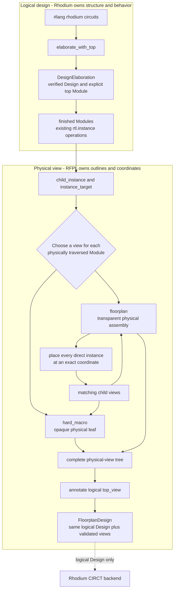

<!-- Documents RFPL's public physical-view language, validation rules, and limits. -->
<!-- SPDX-License-Identifier: Apache-2.0 -->

# RFPL physical views

RFPL adds rectangular physical views to an already elaborated Rhodium design.
It reads finished modules and existing instance operations; it does not author
hardware, mutate the logical IR, or participate in CIRCT lowering. The result is
a `FloorplanDesign` that retains the original `DesignElaboration` alongside a
validated physical-view tree.

Use `#lang rfpl` for the annotation file. The language provides ordinary
Rhombus plus the RFPL forms documented here. Define the logical hierarchy in
`#lang rhodium`, finish it with `elaborate_with_top`, and import that result into
the annotation.
Contributors changing RFPL should read [`DEVELOPING.md`](DEVELOPING.md).

## Follow the annotation workflow

1. Elaborate the logical top with `elaborate_with_top`, which supplies the
   verified `Design` and explicit top `Module` required by RFPL.
2. Select existing direct instances with `child_instance(module, name)` and
   inspect their target modules with `instance_target(instance)`. RFPL never
   reconstructs the logical hierarchy from names or module-list order.
3. Give each physically traversed module either an opaque `hard_macro` view or
   a transparent `floorplan` view. A floorplan places all of its direct
   instances, so this choice repeats for each child view.
4. Call `annotate(logical, top_view)` to validate the physical tree against the
   logical design.

The executable
[`circuit-pair.rfpl`](../examples/rfpl/circuit-pair.rfpl) annotation and its
separate [`circuit-pair.rhdl`](../examples/rfpl/circuit-pair.rhdl) logical
design show the complete split.

## Choose and compose views

### Treat logic as an opaque hard macro

`hard_macro(module, width: ..., height: ...)` gives a finished module a
positive rectangular outline and ends physical traversal at that module. The
module may contain arbitrary valid Rhodium logic and logical descendants; none
of those descendants needs a separate RFPL view below this physical leaf.
Physical opacity does not turn the module into an RTL black box or change its
logical contents.

### Describe a transparent floorplan

`floorplan(module, width: ..., height: ..., placements: [...])` describes a
wiring-only hierarchical assembly. Its finished module may contain only
`rtl.input_port`, `rtl.output_port`, `rtl.instance`, `rtl.drive`, and `rtl.wire`
operations. Every direct `rtl.instance` must appear in exactly one placement.
Use a hard macro instead when the module itself contains an operator, register,
memory, assertion, simulation effect, or other logic.

A `CompositeFloorplan` is a view of a module definition, not one occurrence.
Reusing the same view for multiple instances of that module stamps the same
internal arrangement at each occurrence; each occurrence still receives its
own coordinate in its parent.

### Place existing child instances

`place(instance, child_view, at: (x, y))` binds one existing direct
`rtl.instance` to the physical view of its actual target module. The placement
records the parent module, child view, instance identity, and coordinate; it
does not create or reconnect an instance. The child rectangle must fit within
the parent outline at that coordinate.

Coordinates and dimensions are `Length` values stored as exact integer
picometers. `nm(n)` multiplies a nonnegative integer by 1,000 and `um(n)` by
1,000,000, without floating-point conversion. Widths and heights must be
positive. Placement coordinates may be zero but cannot be negative, and raw
unitless integers are rejected where a `Length` is required. The `(x, y)` pair
is the child rectangle's origin in its parent; containment checks its right and
top edges against the parent outline.

RFPL currently checks containment, not sibling overlap. Two individually
contained child rectangles may overlap without an RFPL error.

### Validate and retain the physical tree

`annotate(logical, top_view)` requires a `DesignElaboration` and a physical
view of its exact top module. It recursively validates only views reached from
that top through composite placements, requires every reached module to belong
to the same logical `Design`, and returns a `FloorplanDesign` with:

- `logical`: the original `DesignElaboration`;
- `design`: the same logical `Design` reference;
- `top` and `top_module`: the physical root and its module; and
- flattened `views` and `placements` lists for the validated physical tree.

Within one result, a logical module may have only one physical-view object.
Multiple placements may reuse that same object, but two distinct views of the
same module are rejected even if their outlines match.

The authoring forms above are the checked construction path. Their exported
objects make the result inspectable without introducing a second logical IR:

| Object | Meaning |
|---|---|
| `Length` | Exact nonnegative distance stored in picometers |
| `RectOutline` | Positive width and height for one view |
| `Coordinate` | Nonnegative `x` and `y` lengths for one placement |
| `PhysicalView` | Common validated-view interface |
| `HardMacro` | Opaque leaf view of a finished module |
| `CompositeFloorplan` | Transparent module view with direct-child placements |
| `FloorplanPlacement` | Existing parent-local instance, matching child view, and coordinate |
| `FloorplanDesign` | Original logical elaboration plus the validated physical tree |

## Understand hierarchy completeness

Completeness is defined by physical transparency:

- At a composite floorplan, every direct logical instance has exactly one
  placement and a matching child view.
- At a hard macro, physical traversal stops. Its logical descendants remain
  part of Rhodium's design but do not require RFPL views.
- A view constructed separately but not reached from the annotated top is not
  included in the returned `FloorplanDesign`.

This makes the selected top the only physical root and prevents an unplaced
direct child inside a transparent assembly, without claiming that every module
owned by the logical `Design` is physically expanded.

## Know which layer rejects an error

Rhodium remains authoritative for logical types, ownership, complete driving,
instance hierarchy, combinational cycles, and all hardware behavior. See the
[`rhodium/core`](../rhodium/core/README.md) contract rather than treating RFPL
as a second logical verifier.

RFPL rejects local physical errors while views and placements are constructed:
unfinished modules, nonpositive outlines, non-instance placement targets,
child-view target mismatches, invalid composite contents, missing or duplicate
direct-instance placements, wrong-parent placements, invalid coordinates, and
out-of-bounds rectangles. `annotate` then checks the cross-view boundary: top
identity, common logical-design ownership, repeated validation, and conflicting
views of one module.

RFPL deliberately does not verify orientation, halos, placement grids, sibling
overlap, routing, congestion, timing, power delivery, DRC/LVS, GDS assembly, or
automatic placement. It also has no physical exporter or place-and-route
backend, and the current public surface has no view variants or strap-pin
specialization. Deferred RFPL design belongs in [`PLAN.md`](PLAN.md).
Repository physical-flow experiments and their proof limits are owned by the
[`vlsi`](../vlsi/README.md) guide; CIRCT lowering is owned by the
[`rhodium/backend`](../rhodium/backend/README.md) guide.

## Package and CIRCT boundary

Production RFPL annotation code imports only the backend-independent public
Rhodium core IR. Rhodium core, frontend, libraries, and backend do not import
RFPL. The authoritative package dependency table is in
[`rhodium/DEVELOPING.md`](../rhodium/DEVELOPING.md#package-responsibilities).

`FloorplanDesign.design` is the original logical design, so the existing CIRCT
backend sees no RFPL objects. RFPL outlines, coordinates, and view choices do
not become ports, constants, operations, attributes, or SystemVerilog. The
structural test emits that retained design and checks both stable logical
hierarchy and the absence of RFPL metadata in CIRCT text.

Implementation enforcement and the contributor workflow are in
[`DEVELOPING.md`](DEVELOPING.md#architecture-and-package-boundary).

## Find the implementation

Source ownership moved to
[`DEVELOPING.md`](DEVELOPING.md#implementation-map).

## Run focused validation

Contributor test selection moved to
[`DEVELOPING.md`](DEVELOPING.md#focused-validation).
