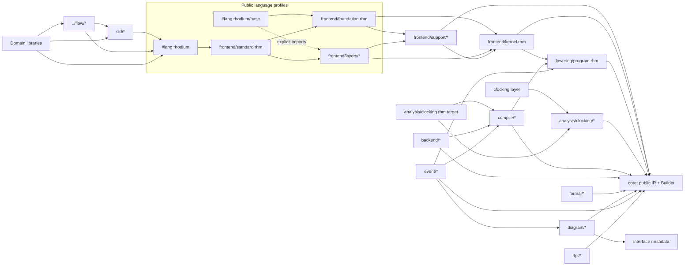

<!-- Defines the Rhodium implementation package graph and contributor dependency contract. -->
<!-- SPDX-License-Identifier: Apache-2.0 -->

# Developing Rhodium

Read the package [`README.md`](README.md) first for its public profiles,
interfaces, and consumer-facing package map. This guide owns Rhodium's
implementation boundaries and direct-dependency contract. For repository-wide
development setup and workflow, see the project [`DEVELOPING.md`](../DEVELOPING.md).

Rhodium has one backend-independent hardware model and several authoring
profiles. Every frontend path elaborates into the same public core IR; frontend
syntax is not a second IR.

## Implementation architecture

Arrows mean "may depend directly on." They point inward toward the public IR;
no reverse dependency is allowed.

```mermaid
flowchart LR
  subgraph Profiles[Public language profiles]
    Rhodium["#lang rhodium"] --> Standard["frontend/standard.rhm"]
    Base["#lang rhodium/base"] --> Foundation["frontend/foundation.rhm"]
    Base -.->|explicit imports| Layers["frontend/layers/*"]
    Standard --> Foundation
    Standard --> Layers
  end

  Foundation --> Support["frontend/support/*"]
  Foundation --> Kernel["frontend/kernel.rhm"]
  Layers --> Support
  Layers --> Kernel
  Support --> Kernel
  Support --> Core["core: public IR + Builder"]
  Kernel --> Core
  Kernel --> Lowering["lowering/program.rhm"]
  Lowering --> Core

  Clocking["clocking layer"] --> Analysis["analysis/clocking/*"]
  Analysis --> Core
  ClockTarget["analysis/clocking.rhm target"] --> Analysis
  ClockTarget --> Compile

  Compile["compile/*"] --> Core
  Compile --> Lowering
  Backend["backend/*"] --> Core
  Backend --> Compile
  Formal["formal/*"] --> Core
  Diagram["diagram/*"] --> Core
  Diagram --> InterfaceMeta["interface metadata"]
  EventGraph["event/*"] --> Diagram
  EventGraph --> Core
  EventGraph --> Lowering
  EventGraph --> Compile

  RFPL["rfpl/*"] --> Core
  Std["std/*"] --> Rhodium
  Flow["../flow/*"] --> Std
  Flow --> Rhodium
  Libraries["Domain libraries"] --> Flow
  Libraries --> Std
  Libraries --> Rhodium
```

`#lang rhodium` is the curated language. `#lang rhodium/base` is the composition
profile: it exposes the foundation and allows a program to import only the
language layers it wants. The word *base* names the public profile; the
internal module implementing its shared frontend forms is called the
*foundation*. The frontend guide explains
[profile selection and elaboration](frontend/README.md).
Remaining named-domain, reset-domain, and semantic-transfer work is tracked in
the [clocking plan](CLOCKING_PLAN.md).

## Dependency rules

- Core never imports compilation, lowering, analysis, frontend, backend, or RFPL code.
- Graph materialization depends only on core. It owns program materialization;
  backend selection and frontend construction remain outside that package.
- Compilation depends only on core and graph materialization. Targets are explicit
  objects supplied by callers; compilation never imports a backend registry.
- Internal analysis consumes completed core IR and does not import authoring,
  compilation, or lowering packages. Only `analysis/clocking.rhm`, the public
  target adapter, imports neutral compile contracts and RTL preparation.
- Frontend code never imports a backend. Frontend layers do not import sibling
  layers; reusable cross-layer machinery belongs in `frontend/support/`.
- Backend emitters and formal tools consume verified core IR without importing
  frontend syntax or elaboration. Optional backend target adapters may import
  neutral compile contracts and preparation helpers; they do not import lowering
  directly.
- Standard, flow, and domain libraries use the public language rather than
  Rhodium implementation modules. Flow may depend on std, but std and Rhodium
  implementation packages must not import flow. Flow must not import downstream
  domain libraries.
- RFPL and diagram generation are downstream views. They inspect public IR but
  do not participate in hardware construction.
- SoCs do not depend on simulators. Simulation and VLSI integration depend
  inward on public SoC, backend, SRAM, and harness surfaces.
- SRAM mapping consumes post-CIRCT MLIR. Rhodium implementation packages and
  SoCs do not import it, and generic mapping code owns no foundry policy.

## Package responsibilities

| Area | Responsibility | May depend directly on |
|---|---|---|
| [`../support/annotations.rhm`](../support/annotations.rhm) | Dependency-neutral Rhombus refinement annotations | Rhombus only |
| [`core/`](core/README.md) | Types, IR, Builder, verification, and printing | Other core modules, `../support/annotations.rhm`, and Rhombus libraries |
| [`lowering/`](lowering/README.md) | Reachable graph copying and extension certification after verification | Core IR, Builder, verifier; local graph copier |
| [`compile/`](compile/README.md) | Explicit target orchestration, concrete RTL inspection target, in-memory artifacts, and physical boundary manifests | Core IR/signatures and verifier; graph materialization; neutral local contracts |
| [`analysis/`](analysis/README.md) | Clock compile target plus internal certification, provenance, and diagnostics | Core and analysis modules; only `clocking.rhm` imports neutral compile contracts and RTL preparation |
| [`frontend/kernel.rhm`](frontend/kernel.rhm) | Context-sensitive elaboration, signature-bearing definition references and layer-owned boundary declarations, checked concrete materialization, and deferred hardware values | Core IR, signatures, Builder; `lowering/program.rhm` |
| [`frontend/support/`](frontend/support/) | Shared cross-layer protocols, macros, static-information machinery, and policy certification; not a language profile | Kernel, approved core APIs, approved analyses, other support modules |
| [`frontend/foundation.rhm`](frontend/foundation.rhm) | Circuits, ports, connections, elaboration, basic types including `Bool`, extension-defined hardware type declarations and protocols, receiver-owned scalar membership and width extension, selection, and representation methods | Kernel, support, approved core type APIs |
| [`frontend/layers/`](frontend/layers/README.md) | Independently selectable notation and abstractions over existing semantics | Kernel, support, approved core APIs and analyses |
| [`frontend/standard.rhm`](frontend/standard.rhm) | Aggregation only; defines no feature behavior | Foundation and all standard layers |
| [`language.rhm`](language.rhm), [`base/language.rhm`](base/language.rhm) | Compose ordinary Rhombus host control with one public Rhodium profile | Standard or foundation |
| [`../rfpl/`](../rfpl/README.md) | Physical views over existing modules: opaque hard macros and wiring-only composite floorplans with contained child coordinates | Public core IR only |
| [`diagram/`](diagram/README.md) | Read-only logical block, hierarchy, compound-interface, and flow visualization with JSON and DOT output | Core IR and interface-owned nonsemantic metadata |
| [`event/`](event/README.md) | Static dependency inference, immutable metadata/DPI instrumentation, and manifest/descriptor generation | Core IR, Builder, verifier, portable IR remapper and metadata certification, neutral compile contracts and RTL pipeline in `trace-pass.rhm`, logical diagrams, interface-owned instance-context metadata, other event modules, and Racket JSON string encoding |
| [`../rheg/`](../rheg/README.md) | Independent C++ event collector, manifest-bound snapshots, and streaming/standalone Perfetto export | Runtime: C++ standard library only; exporter: runtime and private nlohmann JSON dependency |
| [`std/`](std/README.md) | Optional host utilities, protocols, and circuit generators written in ordinary Rhodium | Public `#lang rhodium` authoring surface only |
| [`../flow/`](../flow/README.md) | Streaming buffers, arbitration, routing, packet adapters, and configured topology stages | Public `#lang rhodium`; focused `std/` modules; other flow modules |
| [`backend/`](backend/README.md) | Consume verified public IR; independent CIRCT, direct SystemVerilog, and typed C++ simulation targets | Core; neutral compile contracts and RTL preparation only in target adapters |
| [`formal/`](formal/README.md) | Optional Rosette-backed behavioral equivalence, output reachability, and combinational output properties over verified public IR | Core only; Rosette through one Racket interoperability module |
| [`../chi/`](../chi/README.md) | AMBA CHI flits, links, monitors, fabric metadata, coherent Homes, shared memory control, single-beat subordinate transactions, and cache maintenance | Public `#lang rhodium`; protocol-neutral `std/` libraries and root-level `flow/`, including `std/ready-valid.rhdl` for Home snoop-target tracking and the single-beat subordinate engine, `std/bits.rhdl` and `flow/main.rhdl` for service matching, shared memory control, and maintenance, and `std/read-write.rhdl` and `std/sync-ram.rhdl` only for the concrete RAM backend within the memory stack |
| [`../socs/`](../socs/README.md) | Concrete system composition and end-to-end integration | Public domain-library and core surfaces only |
| [`../cores/cache/`](../cores/cache/README.md) | Shared physical L1I/L1D, cache protocols, geometry, and cache-side CHI engines | Public Rhodium/Flow, shared execution components, CHI, and RISC-V physical-operation/map vocabulary; no named core |
| [`../cores/csr/`](../cores/csr/README.md) | Shared CSR/trap, privilege, counter, FP, vector, and optional guest state | Public Rhodium/Flow, architectural RISC-V descriptors/adapters, and passive core observation declarations; no named core |
| [`../cores/mmu/`](../cores/mmu/README.md) | Shared host/guest translation contracts, TLB storage, and page-table walking | Public Rhodium/Flow and architectural RISC-V descriptors/adapters; no named core or cache arbitration |
| [`../cores/fp/`](../cores/fp/README.md) | Shared FP controls/decode, opaque-tag operand execution, and register-file storage | Public Rhodium/Flow, architectural RISC-V descriptors/helpers, and HardFloat; no named core |
| [`../cores/bpred/`](../cores/bpred/README.md) | Shared branch-target, direction-table, and return-address prediction state and payloads | Public Rhodium/Flow, XLEN and RISC-V instruction-field helpers; no named core or fetch consumer |
| [`../sims/`](../sims/README.md) | Executable SoC harnesses, FESVR host model, target payloads, and simulator bindings | Public SoC, RISC-V PMA descriptors, CHI, flow, device (`devices/uart/uart-dpi.rhdl`), and Rhodium surfaces; explicit compilation targets; optional event instrumentation and RHEG export; external C++ libraries |
| [`../sram/`](../sram/README.md) | Technology-independent post-CIRCT memory-site selection, macro-interface adaptation, tiling, and manifests | CIRCT/MLIR libraries; technology catalogs beneath `sram/` |
| [`../riscv/rtl/`](../riscv/rtl/README.md) | Converts RISC-V instruction encodings into generic typed decode patterns | Pure RISC-V model; public `#lang rhodium` libraries |
| [`../hardfloat/`](../hardfloat/README.md) | Rhodium port of Berkeley HardFloat representations and floating-point units | Public `#lang rhodium` authoring surface only |
| [`../vlsi/`](../vlsi/README.md) | Physical-design integration, design/technology policy, and mapped simulation | Public authoring/compilation surfaces; `sram/`; `sims/`; external VLSI tools and harnesses |

`compile/program.rhm` imports compile contracts and core `DesignElaboration`;
`compile/rtl.rhm` alone adds the graph materializer to ordinary RTL preparation.
The `backend/rsim-target.rhm` adapter imports compile contracts and shared `RTLTarget` preparation,
and its local scheduler, scalar CSE and array-update passes, and emitter.
`backend/rsim/plan.rhm` imports core IR/types and dependency identity lookup. `backend/rsim/cse.rhm`
imports core types and local schedule descriptors for exact expression sharing
and value remapping. `backend/rsim/array-updates.rhm` imports core types, local
schedule descriptors, and evaluation dependencies for exact update recognition
and removal of unused value cones. `backend/rsim/evaluation.rhm` imports the
local schedule and register-array assignment descriptors for value/storage
dependencies and evaluation planning. `backend/rsim/register-arrays.rhm` imports
core types and local schedule descriptors to fold exclusive array update trees
into register destinations.
`backend/rsim/regions.rhm` imports core types and local schedule/evaluation
descriptors for cost-based partitioning and boundary liveness.
`backend/rsim/conditional.rhm` imports local schedule/evaluation descriptors
and the region step-cost estimator for bounded conditional value and consumer evaluation.
`backend/rsim/layout.rhm` imports core types, local schedule/region descriptors,
and the C++ type helper for backing and scratch planning.
`backend/rsim/arrays.rhm` imports only the local layout descriptors and scratch
lookup helper for constructor-run recognition.
`backend/rsim/cache.rhm` imports local schedule/evaluation/region/layout
descriptors for owned-result eligibility and resource invalidation.
`backend/rsim/emit.rhm` imports core types, local schedule/evaluation/region,
layout/array/conditional/cache modules, and `backend/rsim/types.rhm`. It also uses Rhombus runtime
paths and Racket file/base primitives to read its local C++ support header at
emission time. The type helper imports core types
for C++ representation and packing. `backend/rsim/sv-binding.rhm` imports core
IR/types, detached module signatures, and the local schedule/type helpers for clocked-boundary validation
and SV/C++ binding emission. These implementations import no other
backend, portable lowering, frontend, or domain libraries.

The event compiler and RHEG exchange generated descriptors and fixed DPI calls;
neither imports the other's implementation. Event inference consumes generic
interface metadata, not `flow` library implementation modules.

CHI consumers in cores, devices, SoCs, and simulators depend directly on the
defining CHI modules and on `std/interconnect.rhdl` for generic address/transfer
types. The compatibility facade is not a production dependency boundary; the
[CHI import guide](../chi/README.md#package-boundary-and-import) and its
developer implementation map identify the owners.
CHI's `protocol/`, `transactions/`, `home/`, `subordinate/`, `adapters/`, and
`noc/` directories refine that source ownership without changing package
dependency direction. The CHI boundary checker audits nested production files;
the pure `chi/noc/noc-authoring.rhm` bridge still imports only host NoC/support
modules, not Rhodium or CIRCT.

HardFloat is representative of an external domain library over the public
language: Rhodium implementation packages do not depend on it, while its tests
may consume a backend to validate ordinary lowering.

## Design commitments

- Keep one public hardware IR until a concrete feature requires another.
- Keep frontend conveniences out of core when existing hardware semantics are
  sufficient.
- Keep optional reports and policy analyses outside the core API when they can
  derive their facts from completed IR.
- Keep backends independent of frontend syntax and metadata.
- Keep portable materialization separate from target emission. CIRCT is the
  current production target; alternative targets must preserve public semantics.
- Keep widths explicit and elaboration deterministic.
- Keep generator parameters stable and immutable in the host language and runtime data in hardware.
- Specify and test implicit conversion, connection, priority, or reset behavior
  before adding it.

## Auditable direct-dependency inventories

The architecture above is the implementation contract. The tables below are
its review surface: keep them exact when modules or layer imports change. They list
direct Rhodium dependencies, not the full transitive closure.

The reusable packed execution module `cores/simd-alu.rhdl` directly imports
`std/bits.rhdl` for bit reversal and leading-zero count, and `riscv/isa/xlen.rhm`
for the closed RV32/RV64 host configuration. Its remaining hardware operations
use the public language; it imports no instruction catalog or named core.
Its explicit `XLen` specialization prunes datapath width and element cases.
`cores/vector-layout.rhm` is pure host physical-row geometry over
`riscv/isa/vector.rhm`, with XLEN-derived word geometry from `riscv/isa/xlen.rhm`.
RV5Stage storage, sequencing, packing, scanning, and completion consumers import
that layout explicitly and select `xlen.width` rows; architectural vector
descriptors own no physical rows.

The reusable `cores/*-decode.rhdl` mappings directly import `std/decode.rhdl` to map
pure RISC-V instruction catalogs onto root processor-component controls.
`cores/cache/` owns shared cache hardware, not architectural completion policy.
Its protocols use public ready-valid and Bits helpers, XLEN, memory-width,
atomic, and locality types. `config.rhm` uses core index-width calculation and
the stable generator-parameter contract. L1D uses Flow, `std/bits.rhdl`,
`std/plru.rhdl`, and `std/read-write.rhdl`; arrays additionally use
`std/sync-ram.rhdl`, and the store buffer uses `std/reduction.rhdl`.
L1I uses the same Flow, Bits, PLRU, read-write, and SyncRam APIs, plus shared
prefetch types. Its physical block result contains data/access-fault/replay,
never named-core translation metadata. The RV5Stage instruction-memory router
adapts it to the core's 32-bit fetch result using ordinary combinational Flow.
The shared line-read engine owns coherent RAM/immutable-ROM snapshot transport.
Cache-side CHI engines consume shared flits, retry control, and the neutral
`cores/chi-hart.rhdl` map, never named-core code. Nonallocating CHI uses
the shared LoadGen/StoreGen components; IO retention uses the same physical
payload and uninterpreted context. RV5Stage defines only destination/origin in
`memory-context.rhdl` and directly specializes these shared services. Its
uncached attachment uses Flow arbitration/mapping for fetch/data ownership;
fetch cancellation and cached/IO ordering stay named-core policy. RV2Wide's cache
adapter imports the same cache, physical-map contract, Flow, and Bits helpers,
plus shared `cache/io-mshr.rhdl` and `cache/chi/uncached.rhdl` for ordered physical
IO. It owns PMA routing and cached/uncached exclusion; the shared engines remain
independent of RV2Wide retirement. Its request bundles additionally import the
shared `MemoryWidth`, and its decode imports the pure Zifencei, Zicboz, Zicbom,
Zicbop, Zawrs, Zihintpause, and Zihintntl catalogs;
its `rv2wide.rhdl` composition uses Flow to connect the frontend, execution slice,
and shared L1I/L1D. `frontend.rhdl` consumes the neutral L1I protocol and hart
physical map, RISC-V trap causes, `std/bits.rhdl` alignment helpers, and Flow
pipes and forks; it imports no other named-core implementation.
Its `instruction-assembler.rhdl` uses Flow's ShiftQueue for returned blocks,
the shared `riscv/rtl/compressed.rhdl` expander, pure XLEN descriptors, and public
Bits helpers. Canonical decode remains RV2Wide-owned. Its core, bundles, decoder,
and MMU import `riscv/rtl/zihintntl.rhdl` for architectural locality metadata.
Its core, bundles, decoder, MMU, cache adapter, and top consume the neutral `cores/cache-prefetch.rhdl`
operation/request contract for WB-authorized, nonfaulting I/D hints. Its profile and UDB
projection publish optional Zawrs; the core uses architectural CSR-field and
privilege helpers for its WB reservation-wait timeout policy. Its profile and UDB
projection import the pure `riscv/isa/c.rhm` compressed-extension descriptors;
the profile supplies the same selected C/Zcb/Zcmop list to the assembler and
shared CSR bank, preserving IALIGN and architectural publication consistency.
`cores/rv2wide/mmu.rhdl` imports the shared `cores/mmu/` TLB/walker,
shared cache protocol/operation/geometry and hart CHI-map definitions, and architectural
CSR, privilege, Sv39, and XLEN helpers. Its MMU and physical cache adapter use
`riscv/rtl/cmo.rhdl` for read-or-write whole-block maintenance permissions.
It owns EX/MEM translation alignment and
WB/split/PTE arbitration; the cache package has no reverse dependency. Its MMU
and core also consume `cores/misaligned-access.rhdl`: the neutral split
request/result contract and retained fragment engine. This shared module imports
the physical cache protocol, cache operations, load/store shaping, architectural
XLEN/guest-fault types, Bits helpers, and Flow, never a named core's payload.
RV2Wide bundles
also consume the architectural privilege type, and its core selects Sv39 through
the shared hart MMU-type descriptor.
`cores/rv2wide/decode/` also imports `std/decode.rhdl` for exact-pattern column
composition and one hardware decoder per issue slot, plus the architectural
XLEN descriptor to select the shared F/D/Zfa instruction/control relations.
`cores/rv2wide/core.rhdl`
imports it to consume the combined decoder, `std/scoreboard.rhdl` for committed
load destinations, and `flow/main.rhdl` for typed endpoints, feed-forward
pipeline storage, and fault retention. `bundles.rhdl`, `issue-window.rhdl`, and
`load-response.rhdl` import the same Flow facade for stream contracts, owner
storage, and atomic response/context joining.
RV2Wide's `decode/long-ctrl.rhdl` consumes the reusable RISC-V multiply/divide
relations and pure M/Zmmul catalogs; the composed decoder retains unused-field
care masks. `long-execution.rhdl` directly instantiates the shared pipelined
multiplier and iterative divider with Flow owner storage. Its core consumes
the shared request types and arbitrates all deferred results through Flow.
The RV2Wide decoder also consumes the pure B/Zba/Zbb/Zbs catalogs and joins
the existing shared `RV64BAluCases` relation; operand and inactive memory/system
columns remain named-core policy. No additional ALU or named-core dependency is introduced.
Its decoder imports the pure Zicond/Zimop catalogs, joins the shared
`ZicondAluCases`, and selects constant-zero operands for MOPs; operand-use,
writeback, and nonserializing system policy remain RV2Wide-owned.
RV2Wide's decoder also imports the pure A catalog and architectural atomic
operation type. Its memory controls and request bundles use shared
`cache/operation.rhdl`; the core owns WB authorization/order and the response
unit distinguishes raw ordinary beats from already-normalized atomic values.
Reservation and RMW implementation remain in the shared L1D.
The slice uses public language register/vector operations and shared execution
components; it imports no named core or compiler implementation.
`cores/writeback-calendar.rhdl` owns the shared fixed-return reservation calendar
and directly imports Flow. RV5Stage scalar/vector and RV2Wide consumers own
port policy and latency selection. RV2Wide's `fp.rhdl` directly imports the
shared FP execution, timing, register-file, and load-boxing APIs plus Flow,
pure FP/XLEN descriptors, and that calendar. Its composed decoder imports the
shared FP control relation and pure register-bank metadata. No dependency on
RV5Stage is introduced.
RV2Wide's `profile.rhm` imports the stable generator-parameter contract and
shared cache geometry alongside pure ISA/hart descriptors and the shared CSR
configuration used by both RTL and WARL metadata. `hart.rhdl` uses
Flow and CHI channels to adapt its reset-started processor to the neutral SoC
ports. Its UDB projection imports only pure RISC-V and support descriptors.
The shared `cores/cache/chi/attachment.rhdl` describes the three cache endpoints
using CHI protocol/transaction capabilities and the neutral hart identities.
RV5Stage's CHI facade and the RV2Wide SoC binding consume it; there is no
dependency between the named cores.
`sims/cosim/events/hooks.rhdl` uses public language DPI, bundles, and enums plus
architectural privilege types; its host receiver lives in `sims/cosim/`, with
no reverse simulator import or dependency on tracing metadata.
`cores/cosim-source.rhm` bridges source declarations to public core metadata
and frontend `kernel`/`support/clocking` read/domain APIs. Its descriptors remap
live taps and instance views while retaining versioned contract identities and
detached host configuration. It stores no observer functions.
RV5Stage's MMU imports that bridge to describe translated physical-address taps;
`rv5stage.rhdl` imports it to bind the sibling MMU to the child core observer.
Neither import realizes hardware or introduces a simulator dependency.
The scalar `fp/pipeline.rhdl` also imports that bridge for passive, post-boxing
architectural load-write taps. It does not import the observer or host runtime.
`cores/rv5stage/vector.rhdl` and `vector/pipeline.rhdl` import the same bridge
for nested admission, retained-owner, and physical VRF-write observations.
`vector/instructions.rhdl` uses it for actual owner reclamation, including
faults that drain without successful retirement.
`sims/cosim/rv5stage/vector.rhdl` consumes those typed taps through frontend `kernel.input`,
the vector register-write/token/completion bundles, shared physical request/response and
writeback-tag protocols and fixed-lane widening.
It declares RV5Stage-specific passive DPI events without observer registers or
ownership queues. `sims/cosim/rv5stage/vector.*` interprets those events in C++,
as a child of the common native `rv5stage/adapter.*` hart adapter;
the generic DPI binding owns its lifetime and settled-sample flush, without
depending on a named core. The native adapter consumes generic collector types,
not Sail or generated RTL. Its separate native library is linked by simulator
consumers; no core source imports `sims/`.
`sims/cosim/rv5stage/capture.rhdl` and `sims/cosim/rv2wide/capture.rhdl`
use `compile/program.rhm` and `compile/rtl.rhm` to compile their separately
elaborated observer programs with `rtl_target` before the instrumentation pass
imports the resulting graph. `sims/cosim/rv5stage/capture.rhdl` uses frontend `kernel.input` for deferred, typed tap
ports and public authoring APIs for the observer, plus `riscv/rtl/interrupt.rhdl`
for architectural pin encoding, and the FP issue/completion bundles and destination
controls for passive scalar capture. It also consumes the MMU's virtual split-outcome
contract from `cores/misaligned-access.rhdl`. RV5Stage's MMU, core, and
`vector/memory.rhdl` specialize it with `RV5StageMemoryContext` through
`mmu/protocol.rhdl`; guest fault details come from the existing
RISC-V hypervisor adapter. Physical cache protocols remain unchanged.
`cores/rv5stage/observation.rhdl` declares `rv5stage.v1` without imports. `sims/cosim/events/transport.rhdl`
owns DPI lane widening through the base frontend. Neither capture module imports
generic architectural hooks, Flow ownership queues, or an atomic datapath.
The native hart adapter owns identities, retained requests, scalar/FP completion
owners, instruction FP flag contributions, and AMO effect normalization. It supplies the vector
adapter's allocation identity before resolving vector events in the same sample.
The core declares its contract identity, configuration, and semantic taps;
only the optional `sims/cosim/pass.rhm` selects and realizes its adapter. That
pass imports the simulation-owned RV5Stage capture adapter and core observation
identity for its default registry, alongside neutral compile contracts, core
IR/Builder/types, the event occurrence copier, source descriptors, and JSON
string encoding. Callers can supply a different contract-to-adapter map. No observer signal drives
functional handshakes, and no named core imports the simulator receiver.

RV2Wide's core, MMU, and composition import the same passive metadata bridge
for dual WB slots, CSR command context, deferred return ownership, and physical
request/fragment provenance. `cores/rv2wide/observation.rhdl` declares `rv2wide.v2`
without imports. `sims/cosim/rv2wide/capture.rhdl` imports frontend `kernel.input`,
RV2Wide bundles/profile, shared FP bundles/types/timing/load-boxing helpers,
architectural privilege/interrupt/XLEN/FP-profile descriptors,
and the common transport widening helper; it adds no observer state or outputs.
Its native adapter depends only on generic event/DPI contracts. The cosim pass
imports both named-core observation identities and simulation-owned capture
adapters for its default registry. Both native adapters share
`events/atomic.h` for observed physical AMO write-byte normalization, not
reference execution. The event package retains no named-core dependency.
`cores/chi-hart.rhdl` imports `std/bits.rhdl` for power-of-two cache-line
configuration and NodeID-width checks. These modules import no named core.
The Spike-backed core's `profile.rhm` imports `frontend/foundation.rhm` only for
the stable generator-parameter contract. Its public core and typed transaction
ABI import the implementation-neutral RISC-V hart/interrupt/PMA descriptions,
public ready-valid and Flow surfaces, and CHI protocol, transaction, and channel
modules. Spike-owned CHI adapters do not import RV5Stage. Its C++ DPI runtime
reuses immutable physical-attribute grants issued by the core's direct PMA-map
lookup; no native copy of the SoC address map is introduced. `spike.rhdl` directly
imports `protocol.rhdl` for the grant response and `riscv/rtl/pma.rhdl` for its
typed map contract. The runtime
depends on the pinned Spike/FESVR installation built by `sims/fesvr/install.sh`.
In `riscv/rtl/`, `decode.rhdl` imports
`std/decode.rhdl`, while `atomic.rhdl` and `interrupt.rhdl` import
`std/bits.rhdl`; these modules materialize reusable architectural values and
policy without importing a concrete processor.

`riscv/rtl/hpm-counter.rhdl` imports pure CSR/XLEN descriptors, the CSR and
privilege adapters, and `std/ready-valid.rhdl`. It owns reusable single-counter
filtering and overflow state; event selection, CSR access control, and local
interrupt-pending storage remain with the integrating core.
`cores/csr/file.rhdl` consumes that adapter for its optional Sscofpmf
counter. The shared CSR package uses existing ISA/RTL CSR, trap, interrupt,
privilege, timer, vector, and feature descriptors, plus `std/bits.rhdl`,
`std/ready-valid.rhdl`, the stable generator-parameter contract, and the passive
`cores/cosim-source.rhm` metadata bridge. It imports no named core.
`cores/rv5stage/csr.rhdl` projects named configuration/decode controls into its
neutral configuration and command; `core.rhdl` owns retirement authorization.
`socs/configs/metadata.rhm` consumes that static specialization and Spike's
implementation-owned WARL projection for reference configuration. No live CSR
state or simulator dependency crosses back into the core packages.
`cores/rv2wide/core.rhdl` also consumes this shared bank, architectural ISA/CSR/
interrupt descriptors, and the neutral command/action protocol. Its composed
system decode remains in `cores/rv2wide/decode/`; single-slot serialization,
dual retirement counts, deferred-memory drain, and precise interrupt boundaries
remain RV2Wide policy, without imports from another named core.

`riscv/rtl/svpbmt.rhdl` imports pure CSR fields and XLEN,
plus the public CSR and PMA adapters; it adds no direct Rhodium-library import.
`sv39.rhdl` imports its page-memory-type representation and retains its existing
`std/bits.rhdl` dependency. Shared CSR storage and RV5Stage translation components
consume these adapters without moving implementation policy into `riscv/`.
`riscv/rtl/hypervisor.rhdl` imports pure CSR/trap descriptors and the CSR
and privilege adapters; it adds no direct Rhodium-library import. The optional
RV5Stage CSR specialization consumes its execution, substitution, delegation,
and fault-provenance contracts. Hypervisor state remains core-owned.
`riscv/rtl/timer.rhdl` imports the privilege adapter for stateless Sstc access
and comparison policy. RV5Stage's CSR module consumes it and owns timer state;
the adapter adds no direct Rhodium-library imports.
`riscv/rtl/state-enable.rhdl` imports pure CSR descriptors and the CSR/privilege
adapters for stateless hierarchical access decisions. RV5Stage CSR storage
consumes it; neither module adds a direct Rhodium-library dependency.
The core, fetch protocols/assembly, and instruction-response protocol import
the same public adapter for optional guest metadata. `vector.rhdl` and
`vector/memory.rhdl` also import it for conditional retirement provenance;
they add no new direct Rhodium-library dependency. The production MMU imports
it and the shared translation contract directly; decode additionally imports
the pure `riscv/isa/h.rhm` and `riscv/isa/svinval.rhm` instruction descriptors and the public hypervisor
RTL access-mode enum. `mmu/protocol.rhdl` imports that enum,
shared physical protocols, named memory context, and `std/bits.rhdl` to define virtual guest request wrappers.
These edges stay within the
existing core-to-architecture dependency direction.
The CSR specialization reads MISA from the existing RV5Stage profile projection,
which owns the pure `riscv/isa/profile.rhm` catalog dependency.
Shared `cores/mmu/protocol.rhdl` imports the public Sv39/privilege adapters
and `std/ready-valid.rhdl`, without named-core or cache payloads.
`cores/mmu/translation.rhdl` imports that host protocol, public hypervisor,
privilege, Sv39 and trap adapters, pure exception descriptors, and
`std/ready-valid.rhdl`. Shared `cores/mmu/tlb.rhdl` and `walker.rhdl`
consume these contracts and `std/bits.rhdl` / `flow/main.rhdl`.
Both host adapters are wiring-only; entry storage, permission checking, and
walker continuation/response ownership belong to those shared implementations.
The serialized composition lives under `cores/mmu/tests/translation-service.rhdl`;
production never imports it. PTE reads retain the G-stage memory attribute for
implicit VS reads. No implementation state moves into the RISC-V architecture package.
RV5Stage's MMU imports the shared protocol, translation projections, TLB, and
walker directly. Its local protocol imports only the shared host result shape
for vector page probes; virtual request wrappers and completion ownership remain
named-core policy. No compatibility module or reverse dependency is introduced.
The translation projection, TLB probes, MMU and physical router also import
the public Svpbmt adapter for one attribute composition/resolution policy.
`mmu/vector-window.rhdl` uses its enum to exclude overridden pages from fast
certificates. `uncached-protocol.rhdl` defines the physical request wrapper
carrying PBMT alongside the shared physical request; the physical arbiter
imports that wrapper and the router consumes it. No dependency direction changes.
`riscv/rtl/pointer-masking.rhdl` imports the pure CSR fields and XLEN plus
the CSR and privilege adapters and the hypervisor explicit-access enum. Its PMM encoding belongs to its hardware enum,
not a duplicate host enum and integer converter.

The `cores/rv5stage/vector/` package imports public `std/bits.rhdl` for
mask expansion/merging, `std/ready-valid.rhdl` for authorized CSR events, and
`flow/main.rhdl` for backpressured read requests, synchronous Valid read
transactions, operand-fetch context storage, and credited issue buffering. Its pure geometry
dependency is `riscv/isa/vector.rhm`; that module imports Rhombus metadata only
and has no Rhodium dependency. `riscv/rtl/vector.rhdl` imports public
`std/bits.rhdl`; `cores/rv5stage/decode/vector-ctrl.rhdl` imports public
`std/decode.rhdl`, pure ISA descriptors, RISC-V adapters, the shared SIMD ALU,
and the named vector mask-scan controls. `vector/mask.rhdl` imports public
`std/bits.rhdl` for bit reversal and first-set counting; it has no decode dependency.
The parent `cores/rv5stage/vector.rhdl` imports `flow/main.rhdl` for WB allocation,
compute/memory demultiplexing, fixed-cycle local acceptance, and macro outcomes.
`vector/pipeline.rhdl` imports Flow for atomic issue fanout, operand storage,
and accepted shared-service request queues; it additionally imports the shared
writeback calendar, integer
register-write and FP contracts, vector mask-scan controls, pointer normalization,
and pure FP profiles.
`vector/slots.rhdl` and
`vector/load-response.rhdl` import Flow for ownership and completion events.
`vector/sequencer.rhdl` imports vector bundles, destination-group dependency helpers, named decode controls,
pure ISA geometry and instruction fields, the RISC-V
vector and pointer-normalization RTL adapters, bit helpers, and Flow. `vector/operand-fetch.rhdl` additionally
imports vector packing, shared SIMD contracts, the RISC-V FP unboxing adapter, and HardFloat formats;
the sequencer does not depend on operand fetch. Both import the inline
`vector/geometry.rhdl` helpers for beat geometry and operand requirements. Those
helpers import descriptor and named decode/FP types, pure ISA geometry and
instruction fields, the instruction-field RTL adapter, and bit helpers; they
introduce no payload or state. Their shared phase-specific types
live in `vector/bundles.rhdl`. `vector/instructions.rhdl` imports those types,
`vector/dependencies.rhdl`, pure XLEN/vector geometry, bit-width helpers, and
Flow for instruction lifetime and row hazards. `vector/completion.rhdl` imports
the slot tracker, mul/div result adapters,
register-write and FP contracts, pure profiles, bit helpers, and Flow for
persistent completion ownership and architectural result streams.
`vector/sequencer.rhdl` also imports `vector/packed-prepare.rhdl` and the
packed layout contracts. The preparation helper imports vector bundles,
footprint arithmetic, vector decode/ISA geometry, public bit helpers, and Flow;
the sequencer owns its cursor and preparation phase. Vector bundles import the
dependency-neutral packed layout contracts. `vector/packed-load.rhdl` imports shared
`vector/packed-bundles.rhdl` layouts, the load-response adapter, VRF contracts,
pure geometry, bit helpers, and Flow.
The packed-load and vector-memory owners also import `cores/cosim-source.rhm`
for passive write-owner and accepted-memory metadata; no simulator dependency is introduced.
Packed layouts depend only on pure XLEN/vector geometry and bit-width helpers. `vector/pipeline.rhdl` composes the
common sequencer and operand-fetch path with independently retained packed response assembly
and imports physical word geometry and the reusable load/store byte-mask helper. `vector/execute.rhdl`
imports public ready-valid types for its shared SIMD alignment client.
`vector/dependencies.rhdl` imports vector bundles, named decode controls, and
the pure vector/XLEN models plus the RISC-V vector RTL adapter; the execution
instruction tracker consumes its destination-group mask for pending row hazards.
`vector/memory.rhdl` imports Flow for fixed-cycle attempts and acceptance, the
shared cache protocols and memory operations, named completion context, and RISC-V trap/pointer-masking
adapters. `cores/rv5stage/memory-arbiter.rhdl` imports Flow for shared LSU
arbitration and tagged response routing, plus public `std/bits.rhdl` for
completion geometry. No memory adapter imports a cache implementation.
`vector/precheck.rhdl` imports vector descriptor/control types, the named MMU
precheck protocol, pure vector/XLEN geometry, and the public pointer-mask
adapter. `mmu/vector-window.rhdl` imports that MMU protocol, public RISC-V PMA
descriptors, Sv39 mapping geometry, and Flow; it imports no vector implementation. The MMU protocol
owns the range/probe interfaces, keeping dependency direction from vector to
translation contracts rather than from translation into vector execution.
`vector/fp.rhdl` imports the shared `cores/fp/` operand bundles and control
types plus RISC-V FP boxing helpers and HardFloat types to adapt packed
elements, without adding a reverse dependency from FP to vector. Scalar
pipeline bundles do not import the vector package or carry its packed data.
The vector pipeline and its bundles, scalar pipeline bundles, data/uncached
protocols, and data IO-MSHR directly import `std/bits.rhdl` for the `Pow2Int`
completion-depth annotation. Tag widths derive from the public `index_width`
operation; memory engines retain the specialized union opaquely.

`cores/rv5stage/integer-execution.rhdl` imports the reusable multiplier/divider
and `flow/main.rhdl` for typed, owner-retaining execution services. Scalar
`multiply.rhdl` and `divide.rhdl` use Flow queues for WB admission reservations;
the core uses Flow arbitration and stable demultiplexing to share those services.
`vector/muldiv.rhdl` imports the integer contracts, pure ISA geometry/XLEN, and
`std/bits.rhdl` for `Pow2Int`, without depending on sibling decode columns.

`cores/fp/execute.rhdl` directly imports `flow/main.rhdl` for
operand routing, scheduled fixed-latency returns, standalone elastic completion
buffering, and completion arbitration. Shared types and operand bundles import
RISC-V/HardFloat representation contracts, not instruction catalogs or named-core
configuration. `cores/fp/decode.rhdl` imports canonical FP catalogs, the public
RISC-V decode adapter, and `std/decode.rhdl` for partial component relations.
`cores/fp/load-store.rhdl` imports shared precision types and architectural
boxing/HardFloat representation helpers without LSU policy. Named FP wrappers
consume that value adapter rather than defining their own boxing/shaping.
The shared `profile.rhm` owns current component capability checks; RV5Stage's
profile delegates that check while retaining named-core policy. The scalar
`cores/rv5stage/fp/pipeline.rhdl`
imports that service, `flow/main.rhdl`, `std/bits.rhdl`, and
`std/scoreboard.rhdl`; FPR state and architectural destinations stay in this
wrapper, using shared `cores/fp/register-file.rhdl` storage.
`cores/fp/div-sqrt.rhdl` directly imports `std/ready-valid.rhdl` and Flow's
`rr-arbiter`, `demux`, and `gate` modules. No FP
implementation depends on the vector package or on test/backend code.
`cores/rv5stage/core.rhdl` imports its named `fp/service.rhdl` and HardFloat
rounding types. The named service imports shared FP bundles, execution, timing,
and controls, the reusable writeback calendar, architectural XLEN/FP profiles,
and Flow to arbitrate scalar/vector clients and reserve fixed returns.
Generic request/result retagging remains in the FP bundles.
`cores/fp/timing.rhdl` imports only shared FP control types. The execution
service, scalar FP wrapper, core, and vector composition/pipeline import it to
share fixed return delays without introducing a named-core dependency into FP.

Shared `cores/bpred/protocol.rhdl` imports architectural XLEN only.
`bht.rhdl` consumes that protocol and `flow/main.rhdl` for banked counter
training and clear inputs; PC/history hashing stays with its caller.
`btb.rhdl` and `ras.rhdl` consume that protocol, XLEN, `std/bits.rhdl`, and
`flow/main.rhdl`; RAS hint classification also imports pure RISC-V formats and
the public instruction-field adapter. RV5Stage's fetch and execution consume
the shared protocols and RAS classifiers; `fetch/source.rhdl` instantiates the
shared BTB/RAS. Fetch sequencing and architectural recovery remain named-core
policy, with no dependency back from predictors to their consumers.
RV2Wide's bundles and execution consume the same protocol, its assembler and
core use the shared prediction payloads, and its frontend instantiates eight-byte
BTB lookup, BHT, and RAS. Its shared `predecode.rhdl` consumes the named decode
catalog, compressed expander, RAS classifier, pure formats/XLEN, and public
immediate adapter. The assembler and fresh-S2 `direction.rhdl` consume that
predecode; direction also uses Bits alignment helpers. No RV5Stage fetch module
is imported. Frontend history and core recovery remain RV2Wide-owned.

### Standard-library dependencies

Standard-library modules depend only on the public authoring surface and
other standard modules. Paths beginning with `std/` are relative to `rhodium/`.

Show standard-library dependency rows

| Module | Provides | Direct Rhodium dependencies |
|---|---|---|
| `std/counter.rhdl` | Enabled bounded `Counter` | None |
| `std/shift-register.rhdl` | Generic named ambient-clock delay line with optional initialization and enable | None |
| `std/reduction.rhdl` | Generic ordered balanced reduction with a caller-supplied binary function | None |
| `std/cdc/level.rhdl` | Resetless two-stage stable one-bit `SyncLevel` synchronizer | None |
| `std/cdc.rhdl` | Public CDC circuit facade | `std/cdc/level.rhdl` |
| `std/bits.rhdl` | Host `Pow2Int` refinement plus bit reversal, leading-zero count, alignment, transfer-byte-mask, lane-mask expansion, and masked-merge operations for `Bits` | None |
| `std/plru.rhdl` | Invalid-first padded tree-PLRU selection and state update for arbitrary positive associativity | `std/bits.rhdl` |
| `std/scoreboard.rhdl` | Positive-sized single-set, single-clear registered occupancy `Scoreboard` plus total indexed lookup | `std/bits.rhdl`, `std/ready-valid.rhdl` |
| `std/interconnect.rhdl` | Protocol-neutral ID ranges, masked address sets, transfer-size sets, overflow-safe transfer containment, and striped host/hardware address projection | `std/bits.rhdl` |
| `std/decode/pattern.rhdl` | Typed host-side `Pattern` cubes and disjoint `PatternSet` algebra, exact-literal normalization, partial records, and recursive aggregate construction | None |
| `std/decode/pattern-value.rhdl` | Partially specified hardware values from `Pattern` cubes | `std/decode/pattern.rhdl` |
| `std/decode/table.rhdl` | Validated unordered typed decode relations, PatternSet row expansion, grouped sparse record cases, input lifting, and row-aligned output products | `std/decode/pattern.rhdl` |
| `std/decode/generator.rhdl` | Callable `DecodeGen` and valid-tagged partial mappings that elaborate relational `rtl.decode` operations | `std/decode/pattern.rhdl`, `std/decode/table.rhdl` |
| `std/decode.rhdl` | Public decode facade | `std/decode/pattern.rhdl`, `std/decode/table.rhdl`, `std/decode/generator.rhdl` |
| `std/ready-valid.rhdl` | `Pulse`, `Valid`, `DecoupledCtrl`, `IrrevocableCtrl`, payload-bearing protocols, `fire`, and nominal endpoint/protocol introspection | None |
| `std/credited.rhdl` | Protocol-neutral bounded credited payload transport, monitoring, and nominal protocol introspection | None |
| `std/flit.rhdl` | Protocol-neutral variable, framed-fixed, and implicit fixed flit payload shapes | None |
| `std/read-write.rhdl` | Generic addressed `Valid` read-or-write request flow over lane-replicated data and masks | `std/ready-valid.rhdl` |
| `std/sync-ram.rhdl` | Fixed-latency lane-masked shared 1RW RAM | `std/read-write.rhdl` |

### Flow-library dependencies

Flow paths are relative to the repository root; `std/` dependencies remain
relative to `rhodium/`. The public facade only aggregates existing bindings.

Show flow-library dependency rows

| Module | Provides | Direct library dependencies |
|---|---|---|
| `flow/ready-valid-support.rhdl` | Ready-valid protocol normalization, payload inference, and contract-preserving payload replacement for flow stages | `std/ready-valid.rhdl` |
| `flow/event.rhdl` | Transparent ready-valid/Valid checkpoints and explicit ready-valid ancestry cuts | `std/ready-valid.rhdl`, `flow/ready-valid-support.rhdl` |
| `flow/pipe.rhdl` | Registered fixed-latency `ValidPipe`, elastic `Pipe`/`CtrlPipe`, and configured unary stages | `std/ready-valid.rhdl`, `std/shift-register.rhdl`, `flow/ready-valid-support.rhdl` |
| `flow/queue.rhdl` | Configurable FIFO `Queue`/`CtrlQueue` and configured unary stages | `std/ready-valid.rhdl`, `std/counter.rhdl`, `flow/ready-valid-support.rhdl` |
| `flow/shift-queue.rhdl` | Fixed-head shift FIFO with registered occupancy mask and configured unary stage | `std/ready-valid.rhdl`, `std/reduction.rhdl`, `flow/ready-valid-support.rhdl` |
| `flow/completion-queue.rhdl` | Reserved response buffering between ready-valid requests and nonstallable issues/completions | `std/ready-valid.rhdl`, `flow/queue.rhdl` |
| `flow/credit.rhdl` | Credited sender and receiver adapters, bounded accounting, and configured unary stages | `std/ready-valid.rhdl`, `std/credited.rhdl`, `flow/ready-valid-support.rhdl`, `flow/queue.rhdl` |
| `flow/arbiter.rhdl` | Fixed-priority `Arbiter`/`CtrlArbiter` | `std/ready-valid.rhdl`, `flow/ready-valid-support.rhdl` |
| `flow/circular-priority.rhdl` | Combinational circular-priority optional-one-hot selection with a shared valid, grant, and index result | None |
| `flow/rr-arbiter.rhdl` | Direct-state round-robin `RRArbiter`/`CtrlRRArbiter` plus configured Array-to-endpoint arbitration | `std/ready-valid.rhdl`, `flow/ready-valid-support.rhdl`, `flow/circular-priority.rhdl` |
| `flow/packet-rr-arbiter.rhdl` | Packet-locked round-robin arbitration and inline final-flit predicate syntax | `std/ready-valid.rhdl`, `flow/ready-valid-support.rhdl`, `flow/circular-priority.rhdl` |
| `flow/vc.rhdl` | Typed physical VC links plus tagged multiplexing of independently backpressured virtual-channel flows | `std/ready-valid.rhdl`, `flow/demux.rhdl`, `flow/gate.rhdl`, `flow/map.rhdl`, `flow/rr-arbiter.rhdl` |
| `flow/state.rhdl` | Fair irrevocable changed-state emission and always-ready local state replication | `std/ready-valid.rhdl`, `flow/circular-priority.rhdl` |
| `flow/demux.rhdl` | Selected one-to-many `Demux`/`CtrlDemux` plus configured payload-selected routing | `std/ready-valid.rhdl`, `flow/ready-valid-support.rhdl` |
| `flow/matcher.rhdl` | Fixed-priority and explicitly output-greedy transfer-rotating one-to-one request-matrix matchers | `flow/circular-priority.rhdl` |
| `flow/grant.rhdl` | Optional-one-hot ready-valid grant routing and merging primitives | `std/ready-valid.rhdl` |
| `flow/crossbar.rhdl` | Configured grant-controlled one-to-one ready-valid crossbar stage | `std/ready-valid.rhdl`, `flow/ready-valid-support.rhdl`, `flow/grant.rhdl` |
| `flow/join.rhdl` | Full and selection-token atomic joins plus meaningful-lane result types and control-only rendezvous | `std/ready-valid.rhdl`, `flow/ready-valid-support.rhdl`, `flow/reduction.rhdl` |
| `flow/zip.rhdl` | Configured inline binary heterogeneous atomic `zip_flow` stage | `std/ready-valid.rhdl`, `flow/ready-valid-support.rhdl` |
| `flow/broadcast.rhdl` | Exactly-once buffered `Broadcast`/`CtrlBroadcast` and configured `broadcast` | `std/ready-valid.rhdl`, `flow/ready-valid-support.rhdl` |
| `flow/atomic-fork.rhdl` | Combinational all-or-none full and payload-selected `AtomicFork` variants plus control-only fanout and configured stages | `std/ready-valid.rhdl`, `flow/ready-valid-support.rhdl`, `flow/reduction.rhdl` |
| `flow/reduction.rhdl` | Shared balanced full and all-except-one Boolean reduction helper | `std/reduction.rhdl` |
| `flow/map.rhdl` | Configured inline payload substitution with conservative `Decoupled` output and explicit stable-contract preservation | `std/ready-valid.rhdl`, `flow/ready-valid-support.rhdl` |
| `flow/map-valid.rhdl` | Configured inline payload substitution for nonbackpressured `Valid` | `std/ready-valid.rhdl`, `flow/ready-valid-support.rhdl` |
| `flow/flit.rhdl` | Packet serialization, reassembly, and transfer-counted conversion among standard flit formats | `std/flit.rhdl`, `std/ready-valid.rhdl`, `std/counter.rhdl`, `flow/queue.rhdl`, `flow/ready-valid-support.rhdl` |
| `flow/fork-valid.rhdl` | Configured inline one-to-many fanout for nonbackpressured `Valid` | `std/ready-valid.rhdl`, `flow/ready-valid-support.rhdl` |
| `flow/filter-valid.rhdl` | Configured inline predicate filtering for nonbackpressured `Valid` | `std/ready-valid.rhdl`, `flow/ready-valid-support.rhdl` |
| `flow/to-valid.rhdl` | Explicit always-ready conversion from ready-valid transfers to `Valid` events | `std/ready-valid.rhdl`, `flow/ready-valid-support.rhdl` |
| `flow/to-decoupled.rhdl` | Checked conversion from nonbackpressured `Valid` events to `Decoupled` transfers | `std/ready-valid.rhdl`, `flow/ready-valid-support.rhdl` |
| `flow/offer-decoupled.rhdl` | Best-effort same-cycle conversion from `Valid` occurrences to rejectable `Decoupled` offers | `std/ready-valid.rhdl`, `flow/ready-valid-support.rhdl` |
| `flow/offer-register.rhdl` | One-entry offer register for decoupling a nonstallable producer from ready-valid backpressure | `std/ready-valid.rhdl` |
| `flow/filter.rhdl` | Configured inline predicate filtering for ready-valid flows | `std/ready-valid.rhdl`, `flow/ready-valid-support.rhdl` |
| `flow/gate.rhdl` | Configured combinational enable gating for ready-valid flows | `std/ready-valid.rhdl`, `flow/ready-valid-support.rhdl` |
| `flow/parallel.rhdl` | Configured parallel composition over generic interface handles and terminated sinks | `flow/ready-valid-support.rhdl` |
| `flow/main.rhdl` | Protocol re-exports and flow-control convenience aggregate; no component semantics | `std/ready-valid.rhdl`, `std/credited.rhdl`, `std/flit.rhdl`, `flow/ready-valid-support.rhdl`, `flow/pipe.rhdl`, `flow/offer-register.rhdl`, `flow/queue.rhdl`, `flow/shift-queue.rhdl`, `flow/completion-queue.rhdl`, `flow/credit.rhdl`, `flow/arbiter.rhdl`, `flow/circular-priority.rhdl`, `flow/rr-arbiter.rhdl`, `flow/packet-rr-arbiter.rhdl`, `flow/vc.rhdl`, `flow/state.rhdl`, `flow/demux.rhdl`, `flow/matcher.rhdl`, `flow/grant.rhdl`, `flow/crossbar.rhdl`, `flow/join.rhdl`, `flow/zip.rhdl`, `flow/broadcast.rhdl`, `flow/atomic-fork.rhdl`, `flow/reduction.rhdl`, `flow/map.rhdl`, `flow/map-valid.rhdl`, `flow/flit.rhdl`, `flow/fork-valid.rhdl`, `flow/filter-valid.rhdl`, `flow/to-valid.rhdl`, `flow/to-decoupled.rhdl`, `flow/offer-decoupled.rhdl`, `flow/filter.rhdl`, `flow/gate.rhdl`, `flow/parallel.rhdl`, `flow/event.rhdl` |

### Frontend layer dependencies

This table is the authoritative inventory of bundled frontend layers. Update
it when adding, removing, or changing a layer's direct dependencies.

Show all 20 frontend-layer dependency rows

| Layer | Provides | Direct Rhodium dependencies |
|---|---|---|
| `comb.rhm` | Static packed literals, typed synthesis don't-cares, decode relations, modular arithmetic, bitwise operations, muxes, extraction, and bit-vector truncation | core types and IR, kernel, field support, hardware-literal support, mux-lookup support |
| `signed.rhm` | Explicit-width `SInt`, two's-complement literals, signed truncation, and signed operator participation | core types and IR, kernel, field support, hardware-literal support |
| `expanding-arithmetic.rhm` | Lossless unsigned addition plus signed and unsigned multiplication with `+&` and `*&` sugar | core types, kernel, field support |
| `bool.rhm` | Non-numeric lane `Mask`, compact `MaybeOneHot`, packed reductions, lower-index-first priority encoders, total optional-one-hot selection, equality, enum validity, signed and unsigned ordering, binary `mux`, and ordered `priority_mux` | core types and IR, kernel, finite-enum support, field support, hardware-literal support, mask-type support, one-hot-selection support |
| `enum.rhm` | Nominal sequential, explicit, and one-hot encoded hardware enums plus host name/value enumeration, member literals, and typed-key one-hot selection | kernel, field support, hardware-method support, variant-schema support, one-hot-selection support |
| `tagged-union.rhm` | Nominal tagged unions, shared enum tags, typed payload construction, and `.tag`/`.is(...)`/`.view(...)` inspection | core IR, kernel, field support, hardware-literal support, variant-schema support |
| `one-hot.rhm` | One-hot selector types, literals, total `Bits` index conversion, typed mux keys, and selector-owned muxing | core IR, kernel, field support, mux-lookup support, one-hot-selection support |
| `bundle.rhm` | Bundle declarations, type-named construction, family identity and generator-argument reflection, generic runtime records, recursive literal shadows, and field access | core IR, kernel, field support, hardware-literal support |
| `vector.rhm` | `Vec` types, runtime vector construction, elaboration-time element mapping, and recursive vector literal shadows | core types, kernel, field support, hardware-literal support |
| `memory.rhm` | Binding-derived memories, async reads, synchronous writes, and address-width helpers | core IR, kernel, clocking support, field support |
| `sync-memory.rhm` | Circuit-shaped synchronous memories with fixed read, write, and shared read-write ports plus optional packed-lane write masks | core IR, kernel, clocking support, field support |
| `assertion.rhm` | Reset-suppressed clocked assertions with branch-derived guards and optional labels | kernel, clocking support |
| `dpi.rhm` | Design-level DPI-C imports, result-less procedure calls, and explicit named DPI result registers | core IR, kernel, clocking support, field support |
| `interface.rhm` | Roles, directional interfaces, refinement, endpoint shapes, local links, N-to-M transforms, typed trace routes and named event captures, linear callable handles and sinks, topology static information, generic circuit boundaries, annotations, and compatible bulk connection | core IR, kernel, field support, instance-member support, variant-schema support, dependency-neutral `support/annotations.rhm` |
| `wire.rhm` | Binding-derived forward-readable single-driver connections | kernel, field support |
| `sequential.rhm` | Binding-derived explicit and ambient registers | kernel, clocking support, field support |
| `conditional.rhm` | Flat hardware `when`/`elsewhen` priority chains where omitted register updates hold, plus exact-key `switch`, memory-write, and assertion effects | core IR, kernel, mux-lookup support |
| `hierarchy.rhm` | Binding-derived concrete/retained instances, child-member access, and sync-child propagation | core IR and construct bindings, clocking support, instance-member support |
| `sync.rhm` | Sync circuits with ambient clock and synchronous reset | kernel, clocking support, generator-parameter support |
| `clocking.rhm` | Root-owned timing metadata, clock relationships, and durable sync-level evidence | core IR, kernel, clocking data types and declaration metadata, clocking support |

### Shared frontend support

Support modules implement shared mechanisms without becoming selectable
language profiles:

Show shared support-module responsibilities

- `hardware-types.rhm` generates an extension-defined scalar descriptor and
  exact hardware-value annotation from one declaration, using core's
  `HardwareType` contract and default `ScalarDataType` capability.
- `hardware-literal.rhm` validates reusable packed host images, exposes their
  hardware type and packed width to ordinary libraries, and materializes them
  as a `Bits` constant followed by an explicit equal-width cast.
- `hardware-methods.rhm` attaches exact receiver-owned method declarations and
  anchors their dispatch ahead of conservative value surfaces.
- `fields.rhm` owns `Bool`, the shared implementation behind exact and generic
  hardware method providers, receiver-owned scalar membership and width extension,
  extension-method resolution, exact hardware annotations, public
  hardware-value type discovery, shared canonical packing, and readable and
  driveable field static information.
- `instance-members.rhm` lets layers contribute virtual instance members
  without creating sibling-layer dependencies.
- `clocking.rhm` expands frontend sync policy into explicit ports, register
  operands, instance inputs, and drives, then certifies that every locally
  owned clocked effect uses the ambient clock. Resetless and locally reset
  state remain legal and are inventoried separately.
- `generator-parameters.rhm` extracts runtime bindings from the ordinary
  Rhombus parameter forms shared by circuit generators.
- `mux-lookup.rhm` lets independent layers contribute typed static keys,
  lookup selector behavior, and one-hot selector types without importing one
  another.
- `mask-type.rhm` lets independent layers require nominal lane-set semantics
  without importing the Boolean layer that owns `Mask` and its `Bool` indexing
  surface.
- `variants.rhm` centralizes nominal variant identity, automatic and explicit
  tag encodings, enum tag types, and exact member literals for enum and tagged-
  union layers.
- `one-hot-selection.rhm` defines the optional-selector protocol and keeps the
  partial exact-one-hot and total optional-one-hot lowering paths available to
  independent layers without sibling imports.

Domain libraries and adapters such as `chi/` and `riscv/rtl` consume the
public language and standard libraries. They do not become frontend layers and
cannot import Rhodium implementation packages.

The kernel's deferred-value protocol retains authoring metadata until an
operation consumes it. Reusable host descriptions remain distinct from
objects already owned by an elaborated circuit. These protocols do not add
frontend types or operations to the public core IR.

## Enforcement and file roles

[`../tools/check-boundaries.sh`](../tools/check-boundaries.sh) enforces these
directions, prevents sibling-layer imports, keeps `standard.rhm` aggregation
only, and restricts reader shims and `.rhdl` files to their intended
locations. Run `make check-boundaries` after moving or adding modules.

`.rhdl` is reserved for Rhodium-profile programs, public adapters, concrete core
designs, simulation adapters, physical-design integration fixtures, and
frontend or FESVR fixtures. `.rhm` contains Rhombus implementation and library
modules.
`.rkt` is restricted to reader shims and the Rosette engine whose solver-aided
language requires a Racket module boundary.

The equivalence tests under [`frontend/tests/`](frontend/tests/) and
[`backend/tests/`](backend/tests/) check that direct core construction,
kernel construction, explicit layer composition, and the standard language
produce the same public IR and CIRCT representation.
