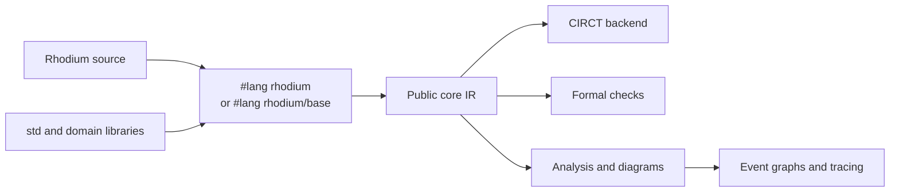

<!-- Introduces Rhodium's public language profiles, semantic core, and consumer-facing package map. -->

# Rhodium language and libraries

Rhodium is a hardware-construction language with one backend-independent core
IR and two public authoring profiles. Most designs use `#lang rhodium`; code
that intentionally selects individual language layers uses
`#lang rhodium/base`.

Start with the repository [quick start](../README.md#quick-start), then use the
[executable examples](../examples/README.md) and
[frontend layer reference](frontend/layers/README.md) as the language guide.
Contributors changing Rhodium itself should read
[`DEVELOPING.md`](DEVELOPING.md).

## Choose an authoring profile

| Profile | Use it when | Surface |
|---|---|---|
| `#lang rhodium` | You want the supported batteries-included language | Foundation plus every standard frontend layer |
| `#lang rhodium/base` | You want explicit control over available notation and abstractions | Foundation; import selected modules from `frontend/layers/` |

Both profiles elaborate to the same [public core IR](core/README.md). The base
profile is not a second IR or a lower-level backend path. The word *base* names
the public composition profile; the shared frontend forms that both profiles
use are implemented by the foundation. See the
[frontend guide](frontend/README.md) for profile selection, elaboration, and
the boundary between host computation and hardware values.

## Public package map

| Package | Use it for |
|---|---|
| [`frontend/`](frontend/README.md) | Language profiles, elaboration behavior, and the host/hardware boundary |
| [`frontend/layers/`](frontend/layers/README.md) | Independently selectable language features and their public semantics |
| [`core/`](core/README.md) | Direct construction or inspection of types, IR, `Builder`, and verification results |
| [`std/`](std/README.md) | Reusable components, interfaces, flows, memories, and circuit generators |
| [`analysis/`](analysis/README.md) | Optional reports and certification over a completed design |
| [`backend/`](backend/README.md) | CIRCT lowering and emitted hardware |
| [`formal/`](formal/README.md) | Rosette-backed equivalence, reachability, and combinational properties |
| [`diagram/`](diagram/README.md) | Logical hierarchy, interface, and flow views |
| [`event/`](event/README.md) | Compiler-inferred event dependencies and opt-in linear DPI instrumentation |

Domain libraries such as [CHI](../chi/README.md), [RISC-V RTL](../riscv/rtl/README.md),
and [HardFloat](../hardfloat/README.md) use the same public language surface.
They are libraries rather than frontend layers.

## Stable public contracts

- Every authoring profile produces the same public, typed core IR.
- Hardware widths are explicit and elaboration is deterministic.
- Generator parameters are stable host values; runtime data is hardware.
- Backends consume verified core IR independently of frontend syntax.
- Libraries use the public language instead of importing implementation
  modules.

For the exact core data model and supported operations, see the
[core reference](core/README.md). Component-specific protocols and limitations
belong to the nearest package guide.

## Dependency rules

The contributor-facing dependency rules moved to
[`DEVELOPING.md`](DEVELOPING.md#dependency-rules). This heading remains here so
existing links continue to lead to the owning contract.

## Package responsibilities

The implementation ownership and allowed direct dependencies moved to
[`DEVELOPING.md`](DEVELOPING.md#package-responsibilities).

## Frontend layer dependencies

The authoritative direct-dependency inventory for bundled layers moved to
[`DEVELOPING.md`](DEVELOPING.md#frontend-layer-dependencies).
