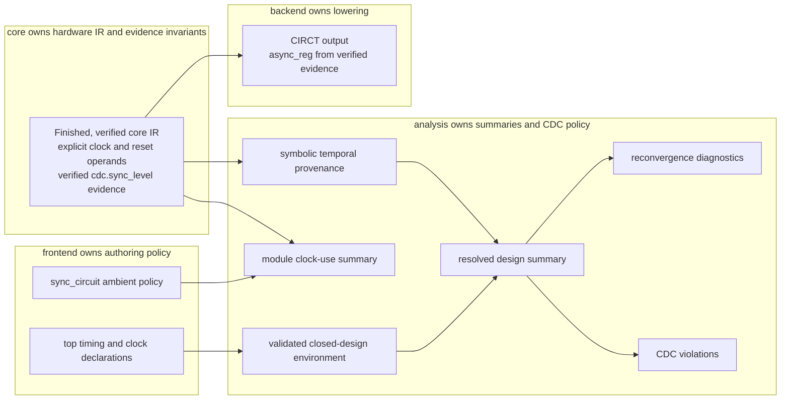

<!-- Documents optional backend-independent analyses over Rhodium core IR. -->
<!-- SPDX-License-Identifier: Apache-2.0 -->

# Rhodium analysis

Analysis packages inspect finished, verified public core IR without changing the
hardware, authoring syntax, or backend output. They may depend on
[`rhodium/core/`](../core/); core does not depend on analysis. Frontends and
downstream tools opt into an analysis when they need its policy or reports.
Contributors changing analysis implementation or policy should read
[`DEVELOPING.md`](DEVELOPING.md).

## Clocking analysis

Import [`clocking.rhm`](clocking.rhm), the stable public entry point, and choose
the narrowest operation that answers the question:

| Question | API | Result or behavior |
|---|---|---|
| Which clocks and resets does one module use? | `summarize_module_clocking` | `Combinational`, `SingleClock`, or `MultiClock`, plus a separate reset-use inventory |
| Does one module obey an expected ambient clock? | `verify_single_clock` | The same clock-use summary, or an error naming the first mismatched clocked operation |
| Where can each output and clocked sink input originate? | `summarize_module_temporal` | Reusable, hierarchy-aware `ModuleTemporalSummary` with symbolic top inputs |
| What does that provenance mean at a closed design boundary? | `summarize_design_temporal` | Report-only `DesignTemporalSummary` resolved against a validated `TemporalEnvironment` |
| Must every sampled data leaf satisfy the current CDC policy? | `verify_design_cdc` | The design summary, or one aggregate error containing every `CdcViolation` |
| Is readable deterministic text sufficient? | `dump_temporal_report` or `dump_design_temporal_report` | A report derived from the corresponding structured summary |

The stages are related, but they answer different questions and have different
owners:

The CIRCT path is deliberately independent of an analysis report: the backend
consumes core-verified crossing evidence, not a frontend declaration or a
`DesignTemporalSummary`.

## Inventory module clock use

Call `summarize_module_clocking(module_def, ambient_reset)` when the task is to
inventory explicit clocked effects in one finished module. The result separates
two dimensions:

- `Combinational`, `SingleClock`, and `MultiClock` describe clock use. A
  `MultiClock` groups operations by clock; a `SingleClock` retains its complete
  clocked-operation list.
- `NoReset`, `AmbientReset`, and `LocalReset` group those operations by reset
  use. Reset inventory does not imply reset-domain analysis.

`verify_single_clock(module_def, expected_clock, ambient_reset)` applies only
the expected-clock policy. The frontend's ambient `sync_circuit` support uses
it to certify the ordinary clock operands that the frontend emitted.

Clock identity follows transparent `rtl.wire` aliases. An equal-width cast to
`Clock` remains a distinct identity; `same_clock_value` exposes this same rule
to callers. Start with
[`report.rhm`](../../examples/clocking/report.rhm) for clock-use and temporal
reports over an existing design.

## Trace reusable temporal provenance

Call `summarize_module_temporal(module_def)` to trace one finished module and
its completed instance hierarchy without assuming how the top-level inputs are
timed. The analysis is leaf-sensitive for records and vectors. It records:

- output-leaf origins in `output_leaves`;
- every supported clocked sink and its sampled input leaves in `sinks`;
- structural crossing reconvergence in `reconvergences`.

Origins are `StaticProvenance`, symbolic `ExternalProvenance`,
`StateProvenance` tied to an operation, instance path, clock, and optional
reset, or `CrossedProvenance` that retains its `cdc.sync_level` identity,
source lineage, and destination clock. Child input origins are substituted at
each instance, so one module definition can be reused under different clocks
without specialization or flattening. See
[`hierarchy.rhm`](../../examples/clocking/hierarchy.rhm).

The module summary is policy-neutral. Its classifications can identify static,
same-clock, foreign-clock, unknown-input, unknown-clock, or multi-clock fan-in
conditions, but symbolic external inputs are not CDC violations by themselves.

## Close the design with an environment

Call `summarize_design_temporal(elaboration, environment)` when the top module
and its external timing context are known. The explicit `DesignElaboration`
selects the top; a `TemporalEnvironment` adds only boundary facts:

- `TopInputContract` assigns `UnknownInputTiming`, `SynchronousInputTiming`, or
  `AsynchronousInputTiming` to a top data-input leaf or aggregate subtree.
- `IdenticalClockRelationship`, `DerivedClockRelationship`,
  `AsynchronousClockRelationship`, and `ExclusiveClockRelationship` describe
  concrete top `Clock` inputs.

The resolver validates ownership, data and clock types, aggregate paths,
overlapping contracts, duplicate relationships, and contradictions before
classifying sinks. Exact signal identity remains distinct from declared clock
equivalence. Identical clocks form an equivalence relation; derived,
asynchronous, and exclusive relationships are reported distinctly rather than
being treated as raw safe sampling.

[`single-clock.rhm`](../../examples/clocking/single-clock.rhm) shows direct
construction of an environment, while
[`relationships.rhm`](../../examples/clocking/relationships.rhm) compares the
relationship classifications. Most authors should use the root-owned
declarations and elaboration wrappers in the
[frontend clocking layer](../frontend/layers/README.md#clock-domains-and-cdc-analysis);
[`frontend-environment.rhdl`](../../examples/clocking/frontend-environment.rhdl)
is the smallest complete example.

## Review or enforce CDC violations

Every `DesignTemporalSummary` contains a deterministic `cdc_violations` list.
Each `CdcViolation` identifies the hierarchy path, clocked operation and sink
kind, sampled input leaf, resolved classification, original provenance, and a
reason. This makes `summarize_design_temporal` suitable for report-only tools.

`verify_design_cdc` runs the same analysis and then enforces the current
conservative policy:

- static, exact same-clock, and declared-identical sampling are safe;
- raw incompatible-clock and asynchronous-input sampling require recognized
  crossing evidence;
- structurally verified `cdc.sync_level` evidence can approve one timing source
  at the first destination stage while preserving the source lineage;
- multi-source fan-in and unknown external timing remain violations;
- reset and reset-value sink inputs remain inventory-only until RDC semantics
  exist.

Strict verification reports the complete violation set in one error rather
than stopping at the first unsafe leaf. Use
[`missing-crossings.rhdl`](../../examples/clocking/missing-crossings.rhdl) to
compare report-only findings with a corrected strict design, and
[`sync-level.rhdl`](../../examples/clocking/sync-level.rhdl) for the standard
stable-level synchronizer path.

Crossing evidence is not a generic waiver. Core verification owns the
structural contract for `cdc.sync_level`: a stable `Bits(1)` source, one
destination clock, at least two distinct resetless direct register stages, no
functional fanout from intermediate stages, and exclusive ownership of every
stage by one crossing. The [core guide](../core/README.md#stable-level-crossing-evidence)
owns that operation contract.

## Inspect reconvergence separately

`CrossingReconvergence` is a diagnostic, not a `CdcViolation`. A finding is
created when two or more distinct verified crossing identities reach one
clocked sink. It preserves the sink, sampled input-leaf paths, crossing
hierarchy paths, and original source lineage. Repeated fanout from one crossing
identity does not create a finding.

Independently synchronized controls can legitimately meet, so reconvergence
does not make `verify_design_cdc` reject an otherwise legal design. Consumers
must apply any protocol-specific coherency policy themselves. See
[`reconvergence.rhdl`](../../examples/clocking/reconvergence.rhdl).

## Public API and ownership

Use the re-exports from [`clocking.rhm`](clocking.rhm); files under
[`clocking/`](clocking/) are implementation units, not alternate import paths.
The public surface is organized as follows:

| Surface | Stable entry points and result families |
|---|---|
| Clock-use certification | `summarize_module_clocking`, `verify_single_clock`, `same_clock_value`; `ModuleClockingSummary`, `ClockUse`, `ClockGroup`, and reset-use results |
| Reusable provenance | `summarize_module_temporal`, `dump_temporal_report`; provenance, sink, crossing, reconvergence, and `ModuleTemporalSummary` objects |
| Closed-design analysis | `summarize_design_temporal`, `dump_design_temporal_report`; timing contracts, clock relationships, classifications, and `DesignTemporalSummary` |
| Strict policy | `verify_design_cdc`; structured `CdcViolation` results remain available on successful and report-only summaries |

Ownership stays narrow:

The public entry point owns analysis results and policy; frontend declarations,
core crossing evidence, and backend attributes remain separate contracts. The
detailed source ownership is in
[`DEVELOPING.md`](DEVELOPING.md#implementation-map).

## Deliberate limits

This analysis does not infer clocks from names, treat `sync_circuit` metadata
as temporal provenance, mutate core IR, insert synchronizers, or prove protocol
coherency. `cdc.sync_level` applies only to stable one-bit level transfers; it
does not certify pulses, buses, transactions, handshakes, or FIFO correctness.

Reset use is inventoried, but reset-domain crossing semantics, reset epochs,
and asynchronous-reset handling are not implemented. Physical constraints such
as synchronizer placement, mean-time-between-failure targets, and Gray-bus
max-skew are also downstream concerns.

## Focused validation

Contributor test ownership and commands moved to
[`DEVELOPING.md`](DEVELOPING.md#focused-validation).
