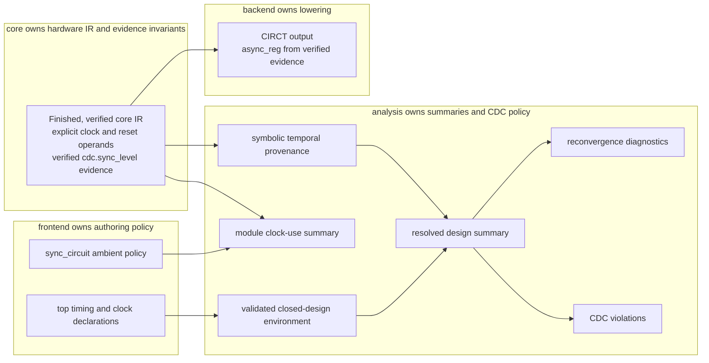

<!-- Documents clock-analysis compilation, timing declarations, findings, and CDC policy. -->
<!-- SPDX-License-Identifier: Apache-2.0 -->

# Rhodium analysis

Clock analysis runs through `compile_program` with an explicit `clocking_target`.
The target prepares fresh concrete RTL, resolves timing declarations, and returns
structured findings plus a deterministic text report. It does not change the
source or emit hardware. Contributors should read [DEVELOPING.md](DEVELOPING.md).

## Clocking analysis

```rhombus
#lang rhodium
import:
  lib("rhodium/compile/program.rhm").compile_program
  lib("rhodium/analysis/clocking.rhm").clocking_target

circuit Sample():
  input clock: Clock
  input data: Bits(8)
  output result: Bits(8)
  reg sampled(Bits(8), ~clock: clock)
  sampled <== data
  result <== sampled
  synchronous_input(data, clock)

def program = elaborate(Sample())
def compiled = compile_program(program, clocking_target())
def findings = compiled.report
def text = compiled.artifacts[0].content
// A verification workflow can save/display findings before stopping dependent work.
if compiled.has_errors
| error("clock analysis found CDC errors")
| #void
```

`clocking_target()` always returns the complete findings when analysis finishes.
CDC violations become error diagnostics; reconvergence findings become warnings.
Verification workflows check `compiled.has_errors` before dependent work.
Inspection workflows use the same result without rerunning analysis.
Ordinary elaboration records declarations without executing this analysis.
There are no separate public analysis runners or clock-aware elaboration wrappers.

The target expands reachable retained constructs using their portable providers.
Clock-use contracts alone do not establish interior sampling provenance or CDC
correctness. Source preservation, expansion limits, occurrence reports, and
artifact failure behavior follow the [compilation contract](../compile/README.md).

The returned `ClockingReport` in `compiled.report` contains:

| Field | Meaning |
|---|---|
| `clocks` | Module clock/reset inventories in prepared module order |
| `summary` | `DesignTemporalSummary` with output origins, classified sinks, CDC violations, and reconvergence diagnostics |
| `elaboration`, `design`, `top` | The fresh verified concrete graph referenced by the findings |
| `environment` | Validated timing contracts bound to that graph |

The single `<top>.clocking.txt` artifact contains the readable temporal report.
It remains available when `compiled.has_errors` is true. `compiled.diagnostics`
contains one `clocking.cdc-violation` error per violation, followed by one
`clocking.reconvergence` warning per reconvergence finding. Each group preserves
analysis traversal order, including distinct occurrences of shared modules and
aggregate input leaves. Diagnostic messages include sink attribution; `.path`
contains instance names and `.location` is the copied source location when known.
Invalid IR, timing environments, or failed preparation still raise exceptions
without a partial result.

The stages are related, but they answer different questions and have different
owners:


```mermaid
flowchart LR
  subgraph Core["core owns hardware IR and evidence invariants"]
    IR["Finished, verified core IR<br/>explicit clock and reset operands<br/>verified cdc.sync_level evidence"]
  end

  subgraph Frontend["frontend owns authoring policy"]
    Sync["sync_circuit ambient policy"]
    Decls["top timing and clock declarations"]
  end

  subgraph Analysis["analysis owns summaries and CDC policy"]
    Use["module clock-use summary"]
    Provenance["symbolic temporal provenance"]
    Environment["validated closed-design environment"]
    Closed["resolved design summary"]
    Violations["CDC violations"]
    Reconvergence["reconvergence diagnostics"]
  end

  subgraph Backend["backend owns lowering"]
    CIRCT["CIRCT output<br/>async_reg from verified evidence"]
  end

  IR --> Use
  Sync --> Use
  IR --> Provenance
  Decls --> Environment
  Provenance --> Closed
  Environment --> Closed
  Closed --> Violations
  Closed --> Reconvergence
  IR --> CIRCT
```

The CIRCT path is deliberately independent of an analysis report: the backend
consumes core-verified crossing evidence, not a frontend declaration or a
`DesignTemporalSummary`.

## Inventory module clock use

The target inventories explicit clocked effects for every prepared module in
`compiled.report.clocks`. Each result separates two dimensions:

- `Combinational`, `SingleClock`, and `MultiClock` describe clock use. A
  `MultiClock` groups operations by clock; a `SingleClock` retains its complete
  clocked-operation list.
- `NoReset`, `AmbientReset`, and `LocalReset` group those operations by reset
  use. Reset inventory does not imply reset-domain analysis.

The frontend independently certifies the ambient clock of `sync_circuit` during
construction and after retained materialization. This is an internal hardware
validation step, not a public analysis execution path.

Clock identity follows transparent `rtl.wire` aliases. An equal-width cast to
`Clock` remains a distinct identity. Start with
[`report.rhm`](../../examples/clocking/report.rhm) for clock-use and temporal
reports over an existing design.

## Trace reusable temporal provenance

The target first traces the completed hierarchy without assuming how top-level
inputs are timed. The analysis is leaf-sensitive for records and vectors. It records:

- output-leaf origins in `output_leaves`;
- every supported clocked sink and its sampled input leaves in `sinks`;
- structural crossing reconvergence in `reconvergences`.

Origins are `StaticProvenance`, symbolic `ExternalProvenance`,
`StateProvenance` tied to an operation, instance path, clock, and optional
reset, or `CrossedProvenance` that retains its `cdc.sync_level` identity,
source lineage, and destination clock. Child input origins are substituted at
each instance, so one module definition can be reused under different clocks
without specialization or flattening. See
[`hierarchy.rhm`](../../examples/clocking/hierarchy.rhm).

The module summary is policy-neutral. Its classifications can identify static,
same-clock, foreign-clock, unknown-input, unknown-clock, or multi-clock fan-in
conditions, but symbolic external inputs are not CDC violations by themselves.

## Close the design with an environment

The selected program top supplies the design boundary. Frontend declarations
are stored as remappable metadata and must belong to that top; declarations in
reachable children are rejected by the target. Builder clients can attach a
`TemporalEnvironment` with `declare_clocking_environment(top, environment)`
before finishing the module.

For an already built program, pass
`clocking_target(~environment: fun (prepared_top): TemporalEnvironment(...))`.
The factory runs on the fresh prepared top; obtain its inputs using
`prepared_top.find_input(name).value`. Captured source values are rejected by
ownership validation. Factory declarations augment program declarations;
overlap and conflicting relationships are errors. An environment adds only
boundary facts:

- `TopInputContract` assigns `UnknownInputTiming`, `SynchronousInputTiming`, or
  `AsynchronousInputTiming` to a top data-input leaf or aggregate subtree.
- `IdenticalClockRelationship`, `DerivedClockRelationship`,
  `AsynchronousClockRelationship`, and `ExclusiveClockRelationship` describe
  concrete top `Clock` inputs.

The resolver validates ownership, data and clock types, aggregate paths,
overlapping contracts, duplicate relationships, and contradictions before
classifying sinks. Exact signal identity remains distinct from declared clock
equivalence. Identical clocks form an equivalence relation; derived,
asynchronous, and exclusive relationships are reported distinctly rather than
being treated as raw safe sampling.

[`single-clock.rhm`](../../examples/clocking/single-clock.rhm) shows direct
construction of an environment, while
[`relationships.rhm`](../../examples/clocking/relationships.rhm) compares the
relationship classifications. Most authors should use the root-owned
declarations in the
[frontend clocking layer](../frontend/layers/README.md#clock-domains-and-cdc-analysis);
[`frontend-environment.rhdl`](../../examples/clocking/frontend-environment.rhdl)
is the smallest complete example.

## Review or enforce CDC violations

Every `DesignTemporalSummary` contains a deterministic `cdc_violations` list.
Each `CdcViolation` identifies the hierarchy path, clocked operation and sink
kind, sampled input leaf, resolved classification, original provenance, and a
reason. These findings are available in every completed clock-analysis result.

`clocking_target()` classifies CDC errors under the current conservative policy:

- static, exact same-clock, and declared-identical sampling are safe;
- raw incompatible-clock and asynchronous-input sampling require recognized
  crossing evidence;
- structurally verified `cdc.sync_level` evidence can approve one timing source
  at the first destination stage while preserving the source lineage;
- multi-source fan-in and unknown external timing remain violations;
- reset and reset-value sink inputs remain inventory-only until RDC semantics
  exist.

The result retains the complete violation set and report even when errors exist.
A verification workflow stops dependent emission, simulation, or publication when
`compiled.has_errors` is true. Use
[`missing-crossings.rhdl`](../../examples/clocking/missing-crossings.rhdl) to
compare erroneous findings with a corrected synchronized design, and
[`sync-level.rhdl`](../../examples/clocking/sync-level.rhdl) for the standard
stable-level synchronizer path.

Crossing evidence is not a generic waiver. Core verification owns the
structural contract for `cdc.sync_level`: a stable `Bits(1)` source, one
destination clock, at least two distinct resetless direct register stages, no
functional fanout from intermediate stages, and exclusive ownership of every
stage by one crossing. The [core guide](../core/README.md#stable-level-crossing-evidence)
owns that operation contract.

## Inspect reconvergence separately

`CrossingReconvergence` is a diagnostic, not a `CdcViolation`. A finding is
created when two or more distinct verified crossing identities reach one
clocked sink. It preserves the sink, sampled input-leaf paths, crossing
hierarchy paths, and original source lineage. Repeated fanout from one crossing
identity does not create a finding.

Independently synchronized controls can legitimately meet, so reconvergence
produces warnings without setting `has_errors` on an otherwise clean result. Consumers
must apply any protocol-specific coherency policy themselves. See
[`reconvergence.rhdl`](../../examples/clocking/reconvergence.rhdl).

## Public API and ownership

[`clocking.rhm`](clocking.rhm) exports the target factory, `ClockingReport`,
`declare_clocking_environment`, and the data types used to express environments
and inspect findings. `compile_program` is the only public analysis execution
entry point. Files under `clocking/` implement algorithms and metadata storage;
they are not alternate public execution APIs.

Ownership stays narrow:

The public entry point owns analysis results and policy; frontend declarations,
core crossing evidence, and backend attributes remain separate contracts. The
detailed source ownership is in
[`DEVELOPING.md`](DEVELOPING.md#implementation-map).

## Deliberate limits

This analysis does not infer clocks from names, treat `sync_circuit` metadata
as temporal provenance, mutate core IR, insert synchronizers, or prove protocol
coherency. `cdc.sync_level` applies only to stable one-bit level transfers; it
does not certify pulses, buses, transactions, handshakes, or FIFO correctness.

Reset use is inventoried, but reset-domain crossing semantics, reset epochs,
and asynchronous-reset handling are not implemented. Physical constraints such
as synchronizer placement, mean-time-between-failure targets, and Gray-bus
max-skew are also downstream concerns.

## Focused validation

Contributor test ownership and commands moved to
[`DEVELOPING.md`](DEVELOPING.md#focused-validation).
