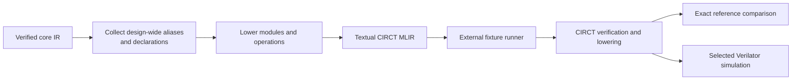

<!-- Explains how to extend, maintain, and validate Rhodium's CIRCT backend. -->
<!-- SPDX-License-Identifier: Apache-2.0 -->

# Developing the CIRCT backend

Read the backend [README](README.md) for the public emission API, type
representation, and supported lowering contract. This guide owns the
implementation workflow behind that contract.

## Architecture and ownership

[`circt.rhm`](circt.rhm) is the backend implementation. It verifies whole
designs, assigns deterministic CIRCT names, collects design-wide record aliases
and DPI declarations, lowers each public IR operation, and prints textual MLIR.
It may import public core modules but never frontend syntax, elaboration, or
analysis policy.



CIRCT owns pass behavior and SystemVerilog generation. The backend test runner
owns tool discovery, fixture selection, exact references, and simulations.
Do not add frontend-aware shortcuts or an Rhodium-owned Verilog emitter here.

## Add or change a lowering

1. Confirm the operation or type is part of the verified public core contract.
   If its meaning is unclear, fix the core schema and verifier first.
2. Add its deterministic textual lowering in `circt.rhm`, reusing the existing
   type, value, place, resource, and naming helpers.
3. Preserve Rhodium semantics across CIRCT representation differences, such as
   explicit shift-width normalization, packed aggregate order, reset polarity,
   memory masks, or simulation-effect enables.
4. Reject unsupported verified input explicitly. Do not print a pseudo-op to
   postpone the decision.
5. Add or update the narrow backend host test. Add a CIRCT fixture when parser,
   verifier, pass-pipeline, generated-text, or runtime evidence is required.
6. Update the public lowering table in [README.md](README.md) when supported
   behavior changes.

Frontend-defined flat types should normally lower through core capabilities
and physical width rather than a frontend-name special case. An operation that
is intentionally metadata-only must still have a verified ownership contract
before the backend omits it.

## Determinism and generated output

Keep module, SSA, record-alias, instance, and declaration naming deterministic.
Record preferred names are non-semantic and may require stable suffixes when
different shapes request one name. Whole-design collection must happen before
module text when a declaration or alias has design-wide scope.

Generated SystemVerilog references are owned by canonical examples and the
[backend test maintenance guide](../../tests/backend/DEVELOPING.md#verilog-references).
Never update a reference before explaining the backend change that produced
the diff.

## Validation

Backend host tests cover textual lowering, naming, unsupported inputs, and
backend-specific policy without invoking external tools:

```sh
make backend-test
```

Use the [backend test guide](../../tests/backend/README.md) to select the
smallest CIRCT or Verilator fixture when external behavior can change. Fixture,
bench, DPI companion, and exact-reference changes follow
[`tests/backend/DEVELOPING.md`](../../tests/backend/DEVELOPING.md).

Run `make check-boundaries` after import or file-ownership changes. Every direct
Racket or Rhombus invocation must use a fresh `PLTCOMPILEDROOTS`; repository
wrappers supply one when the caller does not.
