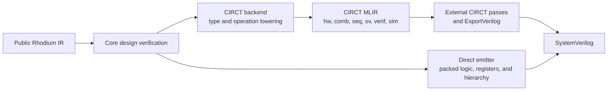

<!-- Documents RTL emission and direct typed C++ simulation targets over verified Rhodium IR. -->
<!-- SPDX-License-Identifier: Apache-2.0 -->

# Hardware backends

The CIRCT compile target lowers a selected hardware program to textual CIRCT
MLIR. Use `compile_program(program, circt_target)` for both frontend programs
and Builder-created hardware. Compilation verifies the source and prepares a
fresh concrete graph containing the selected top and its reachable hierarchy.
The independent `verilog_target` emits typed RTL with hierarchy, registers,
asynchronous- and synchronous-read memories, and clocked assertions directly as SystemVerilog.
The initial `rsim_target` emits a standalone typed C++ simulator for small
combinational and single-clock circuits with registers and asynchronous- or synchronous-read memories.
`rsim_sv_target` adds a clocked SV/DPI wrapper for hosting that model under an HDL testbench.
This directory owns target-specific representation, naming, and operation dispatch.
Contributors changing lowering or backend coverage should read
[`DEVELOPING.md`](DEVELOPING.md).



The CIRCT route stops at MLIR; CIRCT's lowering passes and `ExportVerilog` own
its SystemVerilog generation. Direct emission uses no CIRCT import or executable.

## Compilation API

```rhombus
import:
  lib("rhodium/compile/program.rhm").compile_program
  lib("rhodium/backend/circt-target.rhm").circt_target
  lib("rhodium/lowering/program.rhm").ElaboratedProgram

// design and top are finished Builder-created hardware.
def result = compile_program(ElaboratedProgram(design, top), circt_target)
def mlir = result.artifacts[0].content
```

Frontend callers supply `elaborate(Top())` as the program. The result
contains one `<top>.mlir` artifact, the physical port signature, and a report
of portable expansions per instance occurrence. The source graph remains
unchanged; unrelated modules and unused providers do not enter the output.
See the [compiler contract](../compile/README.md) for options and failures.

The selected top defines compilation scope. To compile independent roots, make
one explicit request for each root. There is no whole-inventory program mode.

All emission targets implement `PreparedRTLConsumer`. CIRCT and direct SV use
`RTLTarget`; rsim owns its preparation and currently uses the same portable RTL
expansion. A composing compilation target can call
`circt_target.plan(prepared)`, `verilog_target.plan(prepared)`, or
`rsim_target.plan(prepared)` or `rsim_sv_target.plan(prepared)` with verified
`PreparedRTL` to reuse its graph and manifest without another preparation pass.
See the [prepared-RTL contract](../compile/README.md#targets-and-compatibility)
for ownership and provenance requirements.

An unsupported verified type or opcode is a backend error. The backend does not
add pseudo-CIRCT operations to avoid an explicit lowering decision.

## Direct C++ simulation

```rhombus
import:
  lib("rhodium/compile/program.rhm").compile_program
  lib("rhodium/backend/rsim-target.rhm").rsim_target

def result = compile_program(program, rsim_target)
```

`rsim_target` returns `<top>.hpp` and `<top>.cpp` artifacts, plus `rsim-bits.hpp`
when wide storage is needed. Write all returned artifacts into the
same directory and compile the implementation with a harness using C++17, for
example `c++ -std=c++17 Counter.cpp harness.cpp -o counter`. Emission and native
execution require neither CIRCT nor Verilator. The target does not run a compiler
or write files. Portable retained implementations expand through normal preparation.

Choose helper partitioning when constructing an rsim target:

```rhombus
import:
  lib("rhodium/backend/rsim-target.rhm").RsimTarget

def native = RsimTarget(~partitioning: "module")
def sv_hosted = RsimTarget(~bind_sv: #true, ~partitioning: "module")
def result = compile_program(program, native)
```

`~partitioning` accepts `"cost"` (the default) or `"module"`. Both preserve
evaluation order and use the same helper cost budget. `"module"` prefers cuts at
instance boundaries: large instances can span helpers and small instances can
share one. It changes C++ organization while preserving simulation behavior;
performance depends on the circuit and native compiler. An unknown strategy is
rejected when the target is constructed.

The same selection applies to `.plan(prepared)` and `rtl_pipeline_target`
composition. Compilation result identities are `rsim`/`rsim-sv` for `"cost"`
and `rsim-module`/`rsim-sv-module` for `"module"`; artifact names and the logical
manifest stay unchanged. `rsim_target` and `rsim_sv_target` select `"cost"`.
The standard SoC build continues to use that default. Partitioning is independent
of cross-tick caching, which remains an internal experiment.

The generated class is `rsim_<encoded-top>::Model`. Authored names are encoded by
prefixing `p` and replacing every `_` with `_u`; for example `Counter` becomes
`pCounter`, `data` becomes `pdata`, and `first_left` becomes `pfirst_uleft`.
This mapping avoids C++ keywords and reserved identifiers. Logical names in the
compilation manifest remain unchanged.

```cpp
#include "Counter.hpp"

int main() {
  rsim_pCounter::Model model;
  model.inputs.preset = 1;
  model.eval();  // Settle outputs without advancing state.
  model.tick();  // Apply one rising edge and settle outputs afterward.
  model.inputs.preset = 0;
  model.tick();  // No preceding eval() is required.
  const auto& outputs = model.outputs();
  (void)outputs;
}
```

This illustrates the API for a circuit named `Counter` with a `reset` input.
Scalar data/reset inputs up to 64 bits are public `std::uint64_t` fields; only
their declared low bits are consumed. Wider scalar data uses
`rhodium_rsim::WideBits<W>` with public `words`, a fixed-size array of 32-bit
unsigned words, least-significant word first. Fill `model.inputs.pdata.words[i]`
to drive a wide input. Input padding is ignored and output padding is zero.
There is no implicit conversion from a wide carrier to an integer or Boolean.
Records use C++ structs with encoded field names, and vectors use `std::array`
with the same logical indices as the hardware. These representations nest
recursively. Scalar leaves inside records and vectors use the smallest of
`std::uint8_t`, `std::uint16_t`, `std::uint32_t`, and `std::uint64_t` that holds
their hardware width; wider leaves use `WideBits<W>`. A one-bit leaf uses
`uint8_t`, so only its low bit is consumed, even if the supplied byte is nonzero.
These are ordinary structs and arrays with native alignment, not packed C++ bit
fields. Cast byte leaves to an integer when printing them through C++ streams.
Standalone scalar ports retain the carriers described above. For example, a record input `packet` with a vector
field `lanes` is accessed as `model.inputs.ppacket.planes[0]`. Generated record
type names are implementation details; access them through ports or `decltype`.
Static field/index projections through constructors and lookup/one-hot muxes
support field-wise acyclic feedback across module boundaries. Other computed aggregates, including
packing casts, retain conservative whole-value scheduling.
Outputs use the same representations and are available through a const reference. Changing an input requires `eval()` or `tick()` to refresh
outputs. `eval()` may be repeated freely without changing stored state.
`tick()` samples register next-state values, synchronous reads, pending memory
writes, and foreign-call operands from the same pre-edge state. It checks
assertions, invokes enabled foreign calls, commits state, and returns with outputs
settled. Synchronous reset takes effect only on `tick()`. The sole root clock is represented by `tick()`, not a
Boolean input field. A purely combinational model also accepts `tick()`, with
the same observable effect as `eval()`.

Each model and hierarchy occurrence owns independent state. Construction zeros
storage and input/output carriers without evaluating the circuit or performing
a hardware reset. Zero startup state is this backend's choice for unspecified
RTL state, not a portable circuit guarantee; reset before relying on initialized
behavior across backends.

Widths 1–64 support the operations below. Wider scalars currently support ports,
structural connections, constants, `dont_care`, bitwise `not`/`and`/`or`/`xor`,
modular `add`/`sub`/`mul`, `eq`/`ult`/`slt`, `mux_lookup`, `onehot_mux`, `decode`,
scalar and aggregate packing casts, `concat`/`extract`/`trunc`/`zext`/`sext`,
`shl`/`shru`/`shrs`, and registers with or without synchronous reset.
Arithmetic discards bits above the declared result width before any subsequent
operation or widening. Signed comparison interprets that width's two's-complement
sign bit; storage and arithmetic use unsigned bit patterns.
Concatenation puts the first operand in the highest bits and supports mixed
narrow/wide operands. Shift counts may be wide even when the shifted value is
narrow.
Lookup keys and decode value/care masks preserve the selector's full width.
One-hot selection can address choices above bit 63. Wide selectors also work
with scalar and aggregate results; decode can produce wide scalars from
narrow inputs. Uncared decode bits and invalid one-hot encodings retain their
existing partial-value semantics.
Records and vectors support wide leaves through ports, construction, projection,
selection, dynamic vector operations, registers, and memories. Packing casts support
equal total widths above 64 bits as well. Functional DPI supports wide scalar
inputs and `out` results using explicit packed-word buffers.

The supported operation set is deliberately bounded:

| Area | Supported behavior |
|---|---|
| Data | Protocol-defined fixed-width scalar leaves, nested records and fixed-size vectors; active-high `Reset` controls |
| Structure | Ports, wires, forward connections, nested and repeated instances |
| Combinational | Constants; `not`, `and`, `or`, `xor`; modular `add`, `sub`, `mul`; `eq`, `ult`, `slt`; scalar/aggregate `mux_lookup`; equal-width packing casts except clocks |
| Partial values and selection | `dont_care`, typed `onehot_mux`, and `decode` relations with input/output care masks, including wide aggregate inputs and outputs |
| Bit manipulation | `concat`, inclusive `extract`; `zext`, `sext`, `trunc`; `shl`, `shru`, `shrs` |
| Aggregates | `record_create`, `record_get`, `vector_create`, `vector_get`; dynamic `vector_index`, `vector_inject`, and `vector_write_set` |
| State | Scalar and aggregate registers with synchronous reset or no reset, driven by one root `Clock` through structural aliases |
| Memory | `memory`, `memory_read_async`, `memory_write`; narrow or wide typed elements, multiple asynchronous readers, and enabled writes on the root clock |
| Synchronous memory | `sync_memory` with typed 1R, 1W, 1R1W, or shared 1RW ports on the root clock; narrow or wide elements and optional write masks |
| Verification | Clocked `verif.assert`, with sampled guard/reset suppression and occurrence/source diagnostics |

External inputs are normalized leaf by leaf. Scalar intermediates are masked to
their declared widths; aggregate construction and copying preserve those normalized
leaves. Explicit packing casts follow the canonical hardware layout: the first
record field occupies the most-significant bits, and vector index zero occupies
the least-significant element bits. Packing never depends on C++ padding or object
layout.

Dynamic vector operations preserve the element's scalar or aggregate type.
Injection and write sets produce new vector values. Enabled write-set indices
must be in range and pairwise distinct; disabled ports have no effect. Invalid
read indices leave the selected element unconstrained, while invalid injection
indices or write sets leave the entire result vector unconstrained. Rsim guards
C++ array accesses even for partial operations behind unselected mux branches.
Its choices for unconstrained results do not establish a portable value or
write-port priority. See the [core selection contract](../core/README.md#selection-and-partial-values).

One-hot selection returns the chosen typed value when exactly one selector bit
is set. Zero-hot and multi-hot results remain unspecified. Decode tables preserve
their non-overlapping input patterns, explicit default, and per-bit output care
masks. Typed comparisons and constants support aggregate inputs and outputs wider
than 64 bits, without whole-value packing. `dont_care` and uncared decode output bits use zero
in this simulator; that choice creates no portable guarantee or four-state logic.

Asynchronous memory reads reflect current contents. Registers sampling those
reads on a write edge capture pre-write data; post-`tick()` reads see the committed
contents. Every write's enable, address, and data is sampled before any register
or memory changes, including when those operands depend on registers or other
memory reads. Register reset does not clear memory or suppress its writes.
Each memory occurrence and model object owns independent storage. Initial
contents, invalid addresses, and conflicting writes have no portable value or
priority guarantee; array accesses remain guarded in C++.

Synchronous memory reads sample their address on `tick()` and publish the result
after that edge. A downstream register captures the preceding read result on
the same edge. `eval()` leaves read results unchanged, regardless of changes to
the address, enable, or shared-port mode. A shared port selects read or write on
each enabled edge. Read results have no implicit reset. Disabled read results,
shared-port results after writes, and separate-port read/write collisions remain
unspecified; see the [core memory contract](../core/README.md#synchronous-memories).

Write masks preserve disabled granules. Mask bit zero selects the least-significant
granule in the canonical packed layout, including granules that cross record fields
or vector elements. Mask granularity must divide the element's packed width.
Masks and element leaves may exceed 64 bits. Masks are sampled with the other
write operands before state changes.
An all-zero mask preserves storage but remains a write-mode cycle on a shared port;
it does not produce a defined read result.

Clocked assertions run only on `tick()`, sampling the condition, guard, and reset
from the same pre-edge state. A check fires when its guard is true, reset is false,
and condition is false. Checks apply independently to every instance, including
modules with no outputs. Failure throws `std::runtime_error` identifying the top
and instance path, the label (or `<unlabeled>`), and the source location.
All checks precede the state commit: a failed tick leaves registers, memories,
stored read results, held foreign results, and cached outputs unchanged. It also
suppresses all foreign calls for that edge. The caller may correct inputs
and retry. `eval()` never fires assertions. Assertions are always enabled in rsim,
including builds with C++ `NDEBUG`; there is no assertion-disable option.

Foreign procedures (`sim.dpi_call`) and functions (`sim.dpi_register`)
run once per enabled `tick()`. Functions support ordered `out` results followed
by one return result. Core Builder callers declare the signature with
`dpi_import_results` and bind its results with `dpi_register_results`.
Inputs and `out` results support positive fixed scalar widths, using the
same width-based C ABI as [direct SV](#verification-and-simulation-effects). Native widths 1/8/16/32/64 use
`unsigned char` (the `svBit` carrier), `char`, `short`, `int`, and `long long`.
Signed hardware types use the same ABI and preserve their declared-width bit patterns. Link ordinary `extern "C"`
implementations with the generated source; no Verilator headers or runtime are
required. External names must be valid C++17 function identifiers. The generated
source checks the host's native integer sizes at compile time.

Other widths use packed arrays of `std::uint32_t` words, matching `svBitVecVal`:
inputs receive `const std::uint32_t*`, and `out` parameters receive
`std::uint32_t*`. Word zero holds the least-significant 32 bits. The array has
`ceil(width / 32)` words; unused high input bits are zero, and unused high result
bits are discarded. Packed returns through 32 bits
use a single `std::uint32_t`; larger non-native results must use an `out`
parameter. Width 64 retains its native `long long` return ABI.

Every `out` parameter follows the input arguments in declaration order. Native
outs use a pointer to the native type; packed outs use the word array above.
Host functions must assign every declared result bit before returning and must
not retain argument or result pointers after the call.

Every call's enable and arguments sample pre-edge values. All assertions run
before any foreign calls; then enabled calls run once and all their `out` and
return results commit together with ordinary state. A same-edge consumer observes
the preceding results. Disabled functions hold every previous result; results
have no implicit reset.
Each occurrence and model object has independent result storage, while state
inside linked host functions remains owned by those functions. `eval()` never
invokes them. Relative ordering between independent calls is unspecified; host
implementations must not rely on it. Host functions must return normally and
must not reenter or mutate the model. External side effects cannot be rolled back
once a call has run. Initial result bits are unspecified across backends.

Stable-level crossing evidence (`cdc.sync_level`) leaves the verified register
chain intact. Rsim models its clocked register latency; it does not model
metastability or analog clock-domain behavior.

Signed operations interpret the declared-width two's-complement bit pattern
while retaining unsigned C++ carriers. Shifts consume the full unsigned count:
counts at least the operand width produce zero for logical shifts and sign fill
for arithmetic right shifts.
All scheduled computations are evaluated unconditionally in dependency order.
There is no activity tracking or specialized retained-construct interpretation.
SystemVerilog scope/context APIs, event tracing, and multiple clocks
remain unsupported.
Unsupported operations or types in the reachable hierarchy produce
source/occurrence-qualified errors before compilation returns artifacts. See the
contributor guide for
[native and differential validation](DEVELOPING.md#validation).

### SystemVerilog-hosted rsim

Select the clocked SV binding when an HDL testbench should drive an rsim model:

```rhombus
import:
  lib("rhodium/compile/program.rhm").compile_program
  lib("rhodium/backend/rsim-target.rhm").rsim_sv_target

def result = compile_program(program, rsim_sv_target)
```

This target returns `<top>.hpp`, `<top>.cpp`, `<top>.sv`, and
`<top>_bridge.cpp`, plus `rsim-bits.hpp` when ports or internal storage need wide values.
The first two are the ordinary rsim model. The SV artifact
preserves the top module and port names; the bridge links that wrapper to the
model through DPI-C. Compile both C++ implementations with the SV testbench and
wrapper, and link any functional foreign implementations used by the circuit.
For a top named `Counter` instantiated by an authored `TestBench`:

```sh
verilator --binary --timing --vpi --assert --top-module TestBench \
  TestBench.sv Counter.sv Counter.cpp Counter_bridge.cpp -CFLAGS "-std=c++17"
```

The binding requires exactly one root `Clock` input, positive fixed-width scalar
data ports, and scalar reset ports. Outputs must structurally depend only on stored state and constants;
combinations of those values are allowed. Input dependencies terminate at
registers, synchronous reads, and held foreign results. An asynchronous memory
read is allowed when its address also satisfies this rule. The check follows
scheduled dependencies through hierarchy without simplifying expressions; even
an input dependence hidden behind a constant mux is rejected. Aggregates may
remain inside the model, but aggregate boundary ports require a different binding.
Invalid boundaries fail during target planning, before any artifacts are returned.

Ports through 64 bits retain the unsigned 64-bit DPI carrier. Wider ports use
two-state packed DPI vectors with `ceil(width / 32)` low-word-first words.
The bridge explicitly copies words, discards incoming padding, and clears
outgoing padding. This wrapper ABI is separate from functional DPI signatures.

Each SV instance owns its own model. Initialization evaluates constants and
initial stored state without performing a reset or calling foreign functions.
Every rising edge samples all non-clock inputs, calls `tick()` once, and publishes
outputs with nonblocking assignments. Inputs must be stable at the sampled edge;
changes between edges do not update outputs. Caught C++ exceptions become SV
`$fatal` diagnostics, and normal SV finalization destroys the model. The model's
existing two-state startup and reset contract still applies.

The tick import supplies DPI context, so callbacks can use the host simulator's
scope and VPI facilities. That scope names the wrapper instance, not rsim's
internal children. The wrapper does not expose internal signals through VPI or
HDL waveforms. This target adds no general combinational scheduling across the
SV/C++ boundary. The simulator build offers an experimental
[`RTL_BACKEND=rsim`](../../sims/README.md#select-rtl-emission) route. Simple
RV5Stage RVA23 passes the existing smoke workload with `OPT_FAST=-O2`, the real
FESVR loader, and unchanged `TestDriver.v`. The simulator guide records the
qualified native compiler settings and workload limits. One production `CHIDPIMemory`
with its 512-bit DPI ABI is qualified against direct SV for reset registration,
byte masks, stalls, and response timing. Multiple internal memory instances
still need a separate ownership policy because their callbacks share the
wrapper scope.

## Direct SystemVerilog

```rhombus
import:
  lib("rhodium/compile/program.rhm").compile_program
  lib("rhodium/backend/verilog-target.rhm").verilog_target
  lib("rhodium/lowering/program.rhm").ElaboratedProgram

def result = compile_program(ElaboratedProgram(design, top), verilog_target)
def sv = result.artifacts[0].content
```

This target returns one `<top>.sv` artifact (`text/x-systemverilog`) using the
same fresh preparation and source-preservation contract. Emission requires no
external executable. The manifest preserves logical module and port names,
directions, types, and order; SV escaped identifiers preserve even keyword names.
Internal net names are deterministic and independent of global IR IDs.
The artifact includes each reachable module definition once; repeated instances
have separate named port connections. Instance names are preserved unless they
collide with a port in the same module, in which case a deterministic `_instance`
suffix (and numeric suffix when needed) disambiguates the emitted name. Manifest
occurrence paths continue to identify the original source instances.

| Supported subset | Behavior |
|---|---|
| Scalar, record, vector, Clock, and Reset ports and nets | Unsigned scalar types, packed structs, and packed arrays, recursively using core layout |
| Input/output, wire, drive | Single-driver continuous assignments, including forward wire references |
| `rtl.instance` | Nested and repeated children with data and control ports, with named input/output connections |
| `rtl.register`, `rtl.register_reset` | Scalar or packed aggregate state, rising-edge updates, optional active-high synchronous reset |
| `rtl.memory`, `rtl.memory_read_async`, `rtl.memory_write` | Uninitialized typed storage, combinational reads, and enabled synchronous writes sharing one clock |
| `rtl.sync_memory` | Typed 1R/1W/1R1W/1RW storage, one-cycle reads, and optional granule masks |
| `verif.assert` | Rising-edge checks gated by sampled activation guard and active-high reset |
| `cdc.sync_level` | Verified stage registers receive `async_reg = "TRUE"`; the evidence adds no hardware |
| `sim.dpi_call`, `sim.dpi_register` | Enabled clocked foreign procedures and functions with held result state |
| `rtl.constant`, `rtl.cast` | Width-sized literals and explicit destination-type casts preserving equal-width representations |
| `rtl.record_create`, `rtl.vector_create` | Typed construction with named record fields and ordered vector elements |
| `rtl.record_get`, `rtl.vector_get` | Named field access and host-static array indexing |
| `rtl.vector_index`, `rtl.vector_inject` | Dynamic element selection and single-element replacement, preserving packed array types |
| `rtl.vector_write_set` | Unordered enabled replacements at distinct, in-range indices; disabled ports have no effect |
| `rtl.not`, `rtl.and`, `rtl.or`, `rtl.xor` | Fixed-width bitwise operations |
| `rtl.add`, `rtl.sub`, `rtl.mul` | Modular arithmetic at each result's declared width |
| `rtl.eq`, `rtl.ult`, `rtl.slt` | Equality, unsigned less-than, explicitly signed less-than |
| `rtl.shl`, `rtl.shru`, `rtl.shrs` | Fixed-width left, logical right, and arithmetic right shifts with the complete unsigned count |
| `rtl.concat`, `rtl.extract`, `rtl.trunc` | MSB-first concatenation, inclusive static bit ranges, and low-bit truncation |
| `rtl.zext`, `rtl.sext` | Explicit zero or sign extension to the result width |
| `rtl.mux_lookup` | Sized key comparison with explicit default for scalar or aggregate results |
| `rtl.onehot_mux` | Selector-bit gating and OR combination for scalar or packed aggregate choices |
| `rtl.decode` | Non-overlapping input cubes with explicit default and per-bit output care masks |
| `rtl.dont_care` | Unconstrained Bits values encoded as synthesis freedom |

### Data layout and expression semantics

Scalar results are constrained to their declared width before any later
operation consumes them. Multiplication returns the low result-width bits for
both signed and unsigned operands. Shifts preserve the complete unsigned count,
including counts wider than the data. Counts at least as large as the data width
produce zero for left/logical-right shifts and sign fill for arithmetic-right
shifts. Sign extension repeats the source sign bit; zero extension inserts zeros.

Records place the first declared field at the most-significant end. Vectors
place element zero at the least-significant end. Both rules apply recursively,
without padding. Records use `typedef struct packed` and vectors use packed array
typedefs, including at ports and registers. Field accesses retain their names;
vector accesses retain their logical indices. The packed representation remains
compatible with equal-width bit-vector connections and explicit casts. The
manifest retains the original logical types and order. Whole-value and separately driven
field/element connections have the same layout, including on child ports.
Incomplete projected drives and overlapping whole/partial drives remain errors.

Dynamic vector selectors use the exact core index width, including one bit for
singleton vectors. An in-range injection produces a new vector with only the
selected element replaced; it does not mutate its source. Scalar and nested
aggregate elements follow the same rule. Out-of-range reads are unconstrained;
out-of-range injections leave the entire result vector unconstrained. There is
no clamping, wrapping, or promised simulation value for these encodings. Runtime
indices are not validated as compile-time errors; selector-width and element-type
mismatches remain errors.

A vector write set applies all enabled replacements together, preserving every
unwritten element. All-disabled write sets return the base vector. Enabled
indices must be in range and pairwise distinct; violating that precondition
leaves the result undefined, with no write-port priority guarantee. Disabled
indices and data have no effect, including out-of-range disabled indices.
The number of write ports may exceed the vector length as long as enabled
writes meet the precondition. These are combinational values; register updates
remain explicit connections to next-state places.

One-hot selection requires exactly one set selector bit and one choice per bit.
Bit zero selects the first choice. Zero or multiple set bits have no promised
result, priority, or fallback behavior. Choices retain their scalar or aggregate
types.

Decode matches unordered, non-overlapping input cubes and uses the explicit
default when none matches. Input care bits constrain matching; output care bits
constrain the result, including the default. Uncared output bits and `dont_care`
sources are synthesis freedom, represented using SV `x` bits. They do not define
runtime X propagation or add four-state semantics to the language. Consumers
may constrain those bits further through ordinary operations.

The artifact declares a shared type package before its modules, with nested
types before their users. Identical physical shapes share a typedef across the
hierarchy, independently of record preferred names. The first encountered shape
uses its preferred record name when available; anonymous types receive generated
names. Collisions receive deterministic suffixes. All module references are
package-prefixed, so local port names do not hide type names. The package name
is derived from the first prepared module and disambiguated against names in the
artifact. Typedef and package names are generated implementation details;
logical module and port identities remain unchanged.

### State and memories

Clock and Reset use one-bit ports and nets while retaining their logical types
in the manifest. Each register samples its next-state driver on its explicit
clock's rising edge. Nonblocking assignments preserve simultaneous updates from
pre-edge values. Reset is active-high and synchronous: it samples the explicit
reset value on that edge and takes priority over the next-state driver. Enables
and holds are ordinary mux feedback; emission adds no implicit initialization.
Resetless state becomes defined only through its driven updates.

Asynchronous-read memories use unpacked arrays of packed element types. Read
outputs follow the current address and stored contents without a clock edge.
Enabled writes sample address and data on the common write clock's rising edge;
multiple enabled ports at distinct addresses update independently. Registers
sampling a read on that same edge observe the pre-write contents, and live reads
then reflect the updated storage. Every child occurrence owns separate storage.
Memories have no implicit initialization or reset. Register reset neither clears
memory nor suppresses its writes; write enables are explicit. No write-port
priority or defined invalid-address behavior is promised. Read values remain
unconstrained until the addressed location has been written.

Synchronous memories support the existing 1R, 1W, 1R1W, and shared 1RW
interfaces with scalar or packed aggregate elements. Enabled reads sample the
address on a rising edge and publish the result after that edge; a downstream
register on the same edge still sees the preceding read result. Writes use the
same explicit clock. Write masks preserve disabled granules, with mask bit zero
controlling the least-significant packed granule, including across aggregate
field boundaries. A shared port selects either read or write per enabled cycle.
An all-zero write mask preserves storage but remains a write-mode cycle.

Storage and read results have no implicit initialization or reset. Disabled
read results, shared-port read results after writes, initial contents, invalid
addresses, and separate-port collisions remain unspecified, as in the
[core memory contract](../core/README.md#synchronous-memories). Each instance
owns its storage. Emission uses typed arrays and clocked logic; physical SRAM
mapping remains a separate concern.

### Verification and simulation effects

Stable-level crossing evidence marks only its verified resetless register stages
with `(* async_reg = "TRUE" *)`. Stage count, destination clock, and register
connections remain unchanged. Ordinary registers remain unmarked; each child
instance retains independent state. Clocking analysis remains a separate compile
target. This attribute preserves synthesis intent and does not model metastability.

Clocked assertions sample their condition, activation guard, and reset together
on the explicit clock's rising edge, before nonblocking register updates. A
check fires only when its sampled guard is true and sampled reset is false.
Reset changes after that edge do not cancel the sampled check. Each instance
checks independently. Authored labels appear in failure diagnostics; statement
names are escaped and disambiguated against other names in the module. Unlabeled
checks receive generated statement names. Verification collateral is enclosed
in `ifndef SYNTHESIS`; define `SYNTHESIS` to omit it for synthesis, and enable
assertion evaluation when simulating (Verilator: `--assert`).

DPI operations call their imported C symbol once per enabled rising edge, using
pre-update input values. Functions publish all ordered `out` results and the
return value together as register state; disabled results hold. Results start
uninitialized, and there is no implicit reset. Calls in separate instances use
that instance's DPI context. Independent calls on the same edge have no promised
relative execution order. Link the corresponding C/C++ definitions into the
simulator; module-local SV aliases preserve the authored external symbol names.

DPI signatures use the same width-based ABI as CIRCT, with two-state values:

| Width | SV import type | C input / return type |
|---|---|---|
| 1 | `bit` | `svBit` |
| 8 | `byte` | `char` |
| 16 | `shortint` | `short` |
| 32 | `int` | `int` |
| 64 | `longint` | `long long` |
| Other widths | `bit [W-1:0]` | Input: `const svBitVecVal*`; return through 32 bits: `svBitVecVal` |

Native `out` arguments use pointers to the native type; packed-vector `out`
arguments use `svBitVecVal*`, with the least-significant 32-bit word first.
Inputs and `out` results support arbitrary positive widths. Packed returns wider
than 32 bits are rejected, except the native 64-bit return; use a wide `out`
result and a supported return type instead. Signed authoring types use the same
physical-width ABI. Signatures contain flat scalar data; aggregate payloads need
explicit packing at this boundary. Use the simulator-generated DPI header when
implementing C/C++ functions to verify signatures.

DPI is simulation-only. Any emitted module with live DPI operations produces an
explicit compilation error when `SYNTHESIS` is defined; neither foreign effects
nor result state is silently removed. Unused imports do not impose this policy
on a selected program. Ordinary RTL remains synthesizable and assertion
collateral retains its separate synthesis-exclusion policy.

### Compatibility and scope

This target emits SystemVerilog, not Verilog-2005. Opaque data remains outside
the supported representation. Unsupported verified types or operations raise
before any compilation result is returned;
there is no fallback to CIRCT. Portable retained expansion still occurs during
preparation, and its resulting RTL must fit this subset. This target does not
yet directly interpret retained constructs.

The opcode coverage inventory classifies the current 47 core operations: 46 are
handled by direct emission (including CDC attributes), `construct.instance` is
expanded during target preparation. No current core opcode is deferred.
All emitted data types must still
fit the supported physical representation above.

## CIRCT type representation

| Rhodium type | CIRCT representation |
|---|---|
| `ScalarDataType` | Signless integer with the type's physical width |
| `Clock`, `Reset` | `i1` in clock and reset positions |
| Anonymous `RecordType` | Recursive packed `hw.struct`, preserving field names and order |
| Named record shape | `hw.typedecl` plus `hw.typealias` in `@rhodium_types` |
| `VectorType` | Recursive `hw.array` |

Frontend-defined flat types therefore need no backend-specific case. A
representation cast whose lowered source and destination types are identical
is an SSA alias; another equal-width packed cast becomes `hw.bitcast`.

A record's preferred name is non-semantic metadata. The whole-design emitter
collects concrete named shapes into one type scope, reuses an alias for an
identical shape, and assigns stable numeric suffixes when distinct shapes ask
for the same name. Anonymous records remain inline structs.

## Lowering by concept

### Structure and state

| Rhodium IR | CIRCT lowering |
|---|---|
| `rtl.input_port`, `rtl.output_port`, `rtl.drive` | `hw.module` signature and `hw.output` |
| `rtl.instance` | `hw.instance` |
| `rtl.wire` | SSA alias to its verified driver |
| `rtl.cast` | SSA alias or `hw.bitcast`, according to lowered type equality |
| `rtl.register` | `seq.firreg` after `seq.to_clock` |
| `rtl.register_reset` | `seq.firreg` with active-high synchronous reset |

Inputs, outputs, drives, and wires need no standalone operation after their
connections have been incorporated into the module signature, `hw.output`, or
the consuming SSA reference.

### Primitive dataflow

| Rhodium IR | CIRCT lowering |
|---|---|
| `rtl.constant` | `hw.constant` |
| `rtl.dont_care` | `sv.constantX` |
| `rtl.not` | `comb.xor` with an all-ones constant |
| `rtl.and`, `rtl.or`, `rtl.xor` | Matching `comb` operation |
| `rtl.add`, `rtl.sub`, `rtl.mul` | Matching `comb` operation |
| `rtl.shl`, `rtl.shru`, `rtl.shrs` | Matching `comb` shift after operand-width normalization |
| `rtl.eq`, `rtl.ult`, `rtl.slt` | `comb.icmp` with `eq`, `ult`, or `slt` predicate |
| `rtl.concat` | `comb.concat` |
| `rtl.extract`, `rtl.trunc` | `comb.extract` |
| `rtl.zext`, `rtl.sext` | Zero/sign materialization plus `comb.concat` |

CIRCT shifts require equal-width operands, while Rhodium permits an
independently sized amount. A narrower amount is zero-extended to the value
width. With a wider amount, the value is widened, shifted at the amount width,
and truncated to its declared result width; signed right-shift values are
sign-extended and other values are zero-extended. This retains Rhodium's
fixed-width overflow and overshift behavior.

`sv.constantX` is a synthesis-freedom carrier, not four-state Rhodium value
semantics. Downstream RTL simulation can display or propagate X, but the public
Rhodium operations continue to use the ordinary two-state hardware model.

### Selection and relations

| Rhodium IR | CIRCT lowering |
|---|---|
| `rtl.mux_lookup` | Key comparisons and a `comb.mux` tree; a one-bit key-1 case is one `comb.mux` |
| `rtl.onehot_mux` | Selector-bit gating and a balanced `comb.or` tree |
| `rtl.decode` | `sv.alwayscomb` containing one sparse `sv.case casez` |
| `rtl.vector_write_set` | Symmetric per-element decode, gated data, balanced OR merge, and old-element fallback |

A one-hot mux intentionally adds no validity detector: zero-hot and multi-hot
selectors are outside its result contract. Choices are packed when necessary,
gated by their selector bits, OR-reduced, and cast back to the result type.

Vector write sets compare every enabled port with every destination element.
The lowering OR-merges same-element data and keeps the old element when no port
matches. It has neither priority nor collision detection; enabled writes to the
same index are outside the operation's contract.

Decode relations stay relational until this backend. Input-care masks become
`z` wildcard positions in `casez`; partially specified outputs use
`sv.constantX` for uncared bits. Core verification establishes non-overlapping
rows, so source row order is irrelevant. CIRCT and downstream synthesis choose
the resulting gate implementation; Rhodium runs no backend-side minimizer.

### Aggregates

| Rhodium IR | CIRCT lowering |
|---|---|
| `rtl.record_create`, `rtl.record_get` | `hw.struct_create`, `hw.struct_extract` |
| `rtl.vector_create` | `hw.array_create`, reversing operands to preserve Rhodium element numbering |
| `rtl.vector_get` | `hw.array_get` with a host-static index |
| `rtl.vector_index`, `rtl.vector_inject` | Dynamic `hw.array_get`, `hw.array_inject` |

### Storage

| Rhodium resource | CIRCT lowering |
|---|---|
| `rtl.memory` | `seq.hlmem` |
| `rtl.memory_read_async` | Latency-zero `seq.read` |
| `rtl.memory_write` | Latency-one `seq.write` |
| `rtl.sync_memory` | `seq.firmem` with native read, write, or shared read-write ports |

The older asynchronous-read `Memory` resource stays on `seq.hlmem`.
Synchronous-memory elements are packed to the integer width required by
`seq.firmem` and bitcast back at aggregate port boundaries. A declared mask
granularity determines the FIR memory's mask width, and write and shared
read-write ports carry that mask. Whole-word masks also gate the effective
write enable, preserving masked-off writes through the pinned CIRCT lowering.
The CIRCT generated-memory flow then preserves the declared port topology, enables, and packed-lane masks while
producing its simulation SystemVerilog module.

### Verification, CDC evidence, and simulation effects

| Rhodium IR | CIRCT lowering |
|---|---|
| `cdc.sync_level` | No emitted operation; verified stage registers receive `async_reg = "TRUE"` SV attributes |
| `verif.assert` | Reset-suppressed, guard-enabled, rising-edge `verif.clocked_assert` |
| `sim.dpi_call` | Enabled, clocked, result-less `sim.func.dpi.call` |
| `sim.dpi_register` | Enabled, clocked, result-bearing `sim.func.dpi.call` |

`cdc.sync_level` is durable analysis evidence rather than hardware. Core
verification proves that it identifies a resetless, direct, one-bit register
chain on one destination clock. The backend omits the evidence operation and
marks only those verified stage registers.

For `verif.assert`, the backend ANDs the activation guard with the inverse of
active-high reset and uses that value as CIRCT's assertion enable. The external
test pipeline lowers the operation to a SystemVerilog concurrent assertion,
preserves its optional label, places non-synthesizable output behind a
`SYNTHESIS` guard, and runs Verilator with assertion evaluation enabled.

DPI imports become module-level `sim.func.dpi` declarations. Both DPI operation
forms convert the Rhodium clock with `seq.to_clock`, pass the explicit enable,
and differ only in whether the CIRCT call returns SSA results.

## Validation ownership

Contributor ownership and the backend change workflow are in
[`DEVELOPING.md`](DEVELOPING.md#validation). Commands and fixture selection are
in the [backend test guide](../../tools/testing/circt/README.md); exact-reference and
fixture maintenance are in its
[`DEVELOPING.md`](../../tools/testing/circt/DEVELOPING.md).
