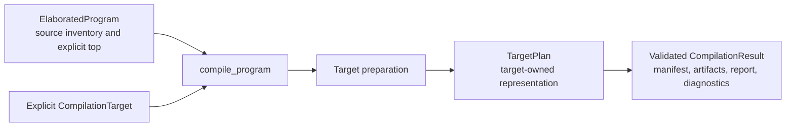

<!-- Documents explicit target compilation, immutable artifacts, and occurrence-level lowering reports. -->
<!-- SPDX-License-Identifier: Apache-2.0 -->

# Compile a program

This package compiles an elaborated program through an explicitly supplied
target. CIRCT, direct SystemVerilog, and clock analysis supply targets.
Compilation returns in-memory artifacts, a manifest, diagnostics, and optional structured findings; it does not
write files or run external tools. Contributors should
read [DEVELOPING.md](DEVELOPING.md).

```rhombus
#lang rhombus
import:
  lib("rhodium/core/main.rhm") open
  lib("rhodium/lowering/program.rhm").ElaboratedProgram
  lib("rhodium/compile/program.rhm").compile_program
  lib("rhodium/backend/circt-target.rhm").circt_target

def design = Design()
def builder = Builder(design)
def top = builder.module("Identity")
def source = builder.input(top, "source", Bits(8))
builder.drive(builder.output(top, "result", Bits(8)), source)
builder.finish(top)
def compiled = compile_program(ElaboratedProgram(design, top), circt_target)
def mlir = compiled.artifacts[0].content
```

Direct Builder clients pass an
[`ElaboratedProgram`](../lowering/README.md) without using the frontend.
Targets are explicit objects, not names resolved through a global registry.
Importing the compiler does not load any backend.

The public compilation contract is:



Preparation owns any expansion or lowering. The compiler collects the plan's
projections and returns them together only after artifact validation succeeds.

## Results and source lifetime

`compile_program(program, target, ~options: CompileOptions())` returns a
`CompilationResult` only after preparation and complete artifact emission
succeed. The default expansion limit is 256; `CompileOptions(limit)` selects
another positive limit. Provider, verification, and emitter exceptions propagate
without a silent fallback or a partial result. Artifact names must be unique
within the nonempty returned set.

The result contains:

- `target`: the selected target's name.
- `diagnostics`: ordered immutable `Diagnostic(code, severity, message, location, path)`
  findings. Codes are stable and target-qualified; severity is `error`, `warning`,
  or `note`. Messages are human-readable. Optional locations and occurrence paths
  carry source attribution without live IR; missing locations are `#false`.
- `has_errors`: derived from error-severity diagnostics. A returned result means
  compilation completed, not that its findings permit a dependent workflow step.
- `artifacts`: immutable `Artifact(name, media_type, content)` values. CIRCT
  returns one `<top>.mlir` artifact with media type `text/x-mlir`.
- `report`: an optional target-owned `CompilationReport`. Clock analysis returns
  a `ClockingReport`; CIRCT returns `#false`. Findings reference the target
  prepared graph, never source IR.
- `manifest.top`, `.modules`, and `.signature`: the emitted top name, ordered
  module names, and physical top ports. CIRCT preserves port names, directions,
  types, and order, so this signature is its public port map.
- `manifest.lowerings`: ordered `LoweringDecision` values containing source
  instance path, detached construct definition (identity, revision, parameters,
  and contract), action, reason, emitted implementation name, location, and
  origin. Paths are relative to the selected top. A retained top has the empty
  path and no instance location. Shared expansions still have separate entries
  for each occurrence.

The CIRCT target creates a fresh, verified concrete graph, including for an
already concrete program. It does not seal or modify the input design. Its
module inventory is the selected top's reachable hierarchy. Unused providers
are not called, and unused modules and DPI declarations are not emitted.
The entire source design still receives structural verification, so malformed
unused modules remain errors. Retained provider bodies receive the existing
signature, dependency, state, and metadata checks.

Metadata must be remappable within the selected closure. A live metadata
reference outside that closure is diagnosed rather than silently discarded.
Target preparation and expansion caches are local to each invocation.

Error diagnostics do not suppress a completed result or its artifacts. For example,
unsafe CDC still produces a complete analysis report. A verification caller checks
`result.has_errors` before dependent work; inspection callers can display the same
findings. Invalid IR, invalid timing assumptions, provider failures, and failed
projections or emission still raise exceptions without returning a partial result.
CIRCT returns no diagnostics; this does not certify unrequested clock analysis.

## Targets and compatibility

[`contracts.rhm`](contracts.rhm) defines `CompilationTarget(name, prepare)` and
`TargetPlan`. A target's preparation function receives `(program, options)` and
returns a plan implementing `manifest()` and `emit()`. Its optional `report()`
method returns structured findings and defaults to `#false`. `diagnostics()` returns
ordered findings and defaults to `[]`. The compiler reads each projection once;
projection failures propagate. The target owns its
prepared representation and must validate it before returning artifacts.
These are trusted extension interfaces: target implementations must preserve
the source and keep emission free of publication side effects.

[`rtl.rhm`](rtl.rhm) supplies `prepare_rtl(program, options, reason)` for targets
requiring concrete RTL and re-exports `ElaboratedProgram` for target input
annotations. It returns a `PreparedRTL` containing `.rtl` and
`.manifest`. CIRCT and direct SystemVerilog use this helper and expand every
reachable retained construct through its portable implementation. A future target can supply
its own plan without first erasing retained constructs.

For concrete emission, `rtl.rhm` also supplies
`RTLTarget(name, expansion_reason, build_plan)`, a specialization of
`CompilationTarget`. Its ordinary `.prepare(program, options)` calls
`prepare_rtl` once and passes the result to `build_plan`. Its `.plan(prepared)`
entry point constructs a `TargetPlan` directly from an existing `PreparedRTL`,
without materializing another graph or invoking providers again. Both CIRCT and
direct SystemVerilog targets expose this entry point:

```rhombus
def prepared = prepare_rtl(program, CompileOptions(), "selected concrete implementation")
def circt_plan = circt_target.plan(prepared)
def verilog_plan = verilog_target.plan(prepared)
```

Import `prepare_rtl` from `rtl.rhm`, `CompileOptions` from `contracts.rhm`, and
each backend target from its owning module. Plan construction does not emit
text; `plan.emit()` returns in-memory artifacts. The backend plan retains the
supplied graph and manifest, including occurrence paths, source attribution,
and lowering reasons. Callers remain responsible for supplying verified RTL
and a matching manifest; a graph transformation must update physical names,
ports, and module inventory while preserving its lowering provenance. Ordinary
drivers continue to use `compile_program`; composed targets can use `.plan`
inside preparation and return that plan through the same compilation contract.
The generic target contract and `CompileOptions` impose no RTL or instrumentation
policy on other targets.

## Ordered RTL instrumentation

Import `rtl_pipeline_target`, `RTLPass`, and `RTLPassResult` from
[`pipeline.rhm`](pipeline.rhm) to compose concrete RTL instrumentation before
one backend emission:

```rhombus
// observation_pass and checking_pass are configured RTLPass values.
def target = rtl_pipeline_target(verilog_target, [observation_pass, checking_pass])
def result = compile_program(program, target)
```

The pipeline prepares the source once, applies passes in list order, and calls
`backend.plan(final_prepared)` once. It returns the backend artifact followed by
each pass's sidecars in order. An empty pass list returns the original backend.
The composed target name is the backend name followed by `+<pass-name>` for each
pass; this identifies the selected sequence, not a fingerprint of its settings.

`RTLPass(name, transform)` captures owner-specific configuration in its callback.
Names must be unique and nonempty so findings identify their owner. The supplied
list is the complete execution order; any semantic prerequisites belong to the
pass's own validation.

Each callback receives the current `PreparedRTL` and returns
`RTLPassResult(rtl, artifacts, report, diagnostics)`; the last three arguments
default to `[]`, `#false`, and `[]`. The output must be a complete, concrete
reachable `DesignElaboration`. The coordinator verifies it and requires the
original top's ordered port names, directions, and types.

Existing instance paths must survive each pass, including observers introduced
by an earlier pass. New instances may be added, and shared module definitions
may be specialized independently per occurrence. This supports additive
instrumentation while keeping source paths and descriptor references stable.
Passes also own preservation of functional behavior, prior instrumentation, and
all other owners' metadata through the existing IR-remapping protocol. Structural
verification alone cannot prove those semantic obligations.

The coordinator rebuilds each physical manifest. Lowering decisions retain their
original source paths, definitions, reasons, locations, and origins, while their
implementation names identify the final modules at those same paths.
`RTLPipelineReport.stages` contains ordered `RTLPassReport(name, findings)`
values; each finding belongs to that stage's graph. `.backend` contains the
backend report.
Reports with live IR are never implicitly rebound to a later graph. Sidecar
artifacts must be detached from live IR, and later passes must preserve the
instrumentation they describe.

Diagnostics are returned in pass order followed by backend diagnostics. The
ordinary compilation rules still apply: duplicate artifact names and failures
raise without returning a partial result; error diagnostics accompany completed
artifacts. This interface currently supplies orchestration only. Flow tracing
and co-simulation have not been migrated into passes.

This is an optional concrete-RTL helper. General `CompilationTarget` plans remain
free to consume retained high-level constructs directly. Language layers and
libraries declare semantics through existing constructs and metadata; their
owning passes interpret those declarations. Compilation contains no Flow,
co-simulation, or frontend policy. Analysis targets remain independent, and
backend choice is separate from the instrumentation list.

## Other targets and future work

Use the [clock-analysis target](../analysis/README.md) for temporal reports or
CDC diagnostics; it expands retained constructs for concrete provenance. The
[direct SystemVerilog target](../backend/README.md#direct-systemverilog) emits
its documented scalar combinational subset without CIRCT.

All public program compilation goes through `compile_program` with an explicit
target. Materialization and textual emission are implementation steps owned by
the target. Direct construct adapters, capability negotiation, and force-expansion
selection are subsequent work.
