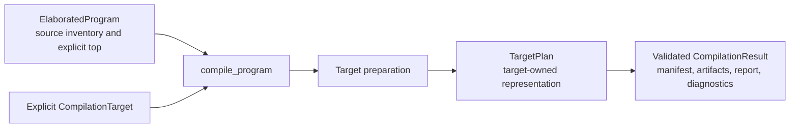

<!-- Documents explicit target compilation, in-memory artifacts, and physical boundary manifests. -->
<!-- SPDX-License-Identifier: Apache-2.0 -->

# Compile a program

This package compiles an elaborated program through an explicitly supplied
target. RTL inspection, CIRCT, direct SystemVerilog, Rsim, and clock analysis supply targets.
Compilation returns in-memory artifacts, a manifest, diagnostics, and optional structured findings; it does not
write files or run external tools. Contributors should
read [DEVELOPING.md](DEVELOPING.md).

```rhombus
#lang rhodium
import:
  lib("rhodium/compile/program.rhm").compile_program
  lib("rhodium/backend/circt-target.rhm").circt_target

circuit Identity():
  input source: Bits(8)
  output result: Bits(8)
  result <== source

def program = elaborate(Identity())
def compiled = compile_program(program, circt_target)
def mlir = compiled.artifacts[0].content
```

Elaboration runs the source generators once. Compilation prepares the selected
target representation. Reuse the same
program with another target; ordinary callers do not invoke `prepare_rtl` or
backend emitters themselves.

Direct Builder clients pass an
[`ElaboratedProgram(design, top)`](../lowering/README.md) without using the frontend.
Targets are explicit objects, not names resolved through a global registry.
Importing the compiler does not load any backend.

The public compilation contract is:



Preparation owns verification and target lowering. The compiler collects the plan's
projections and returns them together only after artifact validation succeeds.

## Results and source lifetime

`compile_program(program, target)` returns a
`CompilationResult` only after preparation and complete artifact emission
succeed. Structured-only targets need not emit text artifacts. Preparation,
verification, and emitter exceptions propagate
without a silent fallback or a partial result. Artifact names must be unique
within the returned set. A target must return artifacts, a structured report, or both.

The result contains:

- `target`: the selected target's name.
- `diagnostics`: ordered immutable `Diagnostic(code, severity, message, location, path)`
  findings. Codes are stable and target-scoped; severity is `error`, `warning`,
  or `note`. Messages are human-readable. Optional locations and occurrence paths
  carry source attribution without live IR; missing locations are `#false`.
- `has_errors`: derived from error-severity diagnostics. A returned result means
  compilation completed, not that its findings permit a dependent workflow step.
- `artifacts`: immutable `Artifact(name, media_type, content)` values. CIRCT
  returns one `<top>.mlir` artifact with media type `text/x-mlir`.
- `report`: an optional target-owned `CompilationReport`. Clock analysis returns
  a `ClockingReport`; RTL inspection returns an `RTLReport`; CIRCT returns `#false`. Findings reference the target
  prepared graph, never source IR.
- `manifest.top`, `.modules`, and `.signature`: the emitted top name, ordered
  module names, and physical top ports. CIRCT preserves port names, directions,
  types, and order, so this signature is its public port map.

The CIRCT target creates a fresh, verified concrete graph, including for an
already concrete program. It does not seal or modify the input design. Its
module inventory is the selected top's reachable hierarchy. Unused modules and DPI declarations are not emitted.
The entire source design still receives structural verification, so malformed
unused modules remain errors.

Metadata must be remappable within the selected closure. A live metadata
reference outside that closure is diagnosed rather than silently discarded.
Target preparation and copying caches are local to each invocation.

Error diagnostics do not suppress a completed result or its artifacts. For example,
unsafe CDC still produces a complete analysis report. A verification caller checks
`result.has_errors` before dependent work; inspection callers can display the same
findings. Invalid IR, invalid timing assumptions, and failed
projections or emission still raise exceptions without returning a partial result.
CIRCT returns no diagnostics; this does not certify unrequested clock analysis.

## Targets and compatibility

[`contracts.rhm`](contracts.rhm) defines `CompilationTarget(name, prepare)` and
`TargetPlan`. A target's preparation function receives `program` and
returns a plan implementing `manifest()` and `emit()`. Its optional `report()`
method returns structured findings and defaults to `#false`. `diagnostics()` returns
ordered findings and defaults to `[]`. The compiler reads each projection once;
projection failures propagate. The target owns its
prepared representation and must validate it before returning artifacts.
These are trusted extension interfaces: target implementations must preserve
the source and keep emission free of publication side effects.

Graph consumers select `rtl_target` through the same compilation API:

```rhombus
import:
  lib("rhodium/compile/program.rhm").compile_program
  lib("rhodium/compile/rtl.rhm").rtl_target

def compiled = compile_program(program, rtl_target)
def rtl = compiled.report
def design = rtl.design
def top = rtl.top
```

`RTLReport.design` and `.top` refer to a fresh, verified concrete graph.
`.elaboration` supplies the corresponding `DesignElaboration` for tools that
accept that pair. The target preserves hierarchy and metadata while leaving
the source untouched. Its artifact list is empty: inspection does
not serialize the graph. Static clients can bind `compiled.report` with the
exported `RTLReport` annotation.

Emission callers pass the original program directly to their emission target. `rtl_target` also supports
`rtl_pipeline_target`; its graph report then appears in the pipeline report's
`.backend`, alongside the stage reports and any instrumentation artifacts.

For target implementations, [`rtl.rhm`](rtl.rhm) supplies `prepare_rtl(program)`
and re-exports `ElaboratedProgram` for input annotations. Preparation returns
`PreparedRTL(rtl, manifest)` with a fresh verified `DesignElaboration` and its
matching physical boundary manifest.

`PreparedRTLConsumer` provides `.plan(prepared)` to reuse a verified graph.
Pipeline backends implement both this interface and `CompilationTarget`.
`RTLTarget(name, build_plan)` implements ordinary preparation by calling
`prepare_rtl` once, then the same plan factory used by `.plan(prepared)`.
CIRCT and direct SystemVerilog use this class. `RsimTarget` owns its preparation
and implements the same prepared-graph interface.

```rhombus
// Inside a target implementation or composition helper:
def prepared = prepare_rtl(program)
def circt_plan = circt_target.plan(prepared)
def verilog_plan = verilog_target.plan(prepared)
```

Import `prepare_rtl` from `rtl.rhm` and backend targets from their owning modules.
Plan construction does not emit text or repeat graph copying and certification.
A transformation must supply a verified graph and a matching manifest. Ordinary
callers continue to use `compile_program(program, target)`. Target configuration
belongs in each target's constructor or captured preparation callback.

## Ordered RTL instrumentation

Import `rtl_pipeline_target`, `RTLPass`, and `RTLPassResult` from
[`pipeline.rhm`](pipeline.rhm) to compose concrete RTL instrumentation before
one backend emission:

```rhombus
// observation_pass and checking_pass are configured RTLPass values.
def target = rtl_pipeline_target(verilog_target, [observation_pass, checking_pass])
def result = compile_program(program, target)
```

The pipeline accepts any compilation target implementing `PreparedRTLConsumer`,
including both rsim targets. It prepares the source as concrete RTL once, applies
passes in list order, and calls `backend.plan(final_prepared)` once. It returns the backend artifact followed by
each pass's sidecars in order. An empty pass list returns the original backend.
The composed target name is the backend name followed by `+<pass-name>` for each
pass; this identifies the selected sequence, not a fingerprint of its settings.

`RTLPass(name, transform)` captures owner-specific configuration in its callback.
Names must be unique and nonempty so findings identify their owner. The supplied
list is the complete execution order; any semantic prerequisites belong to the
pass's own validation.

Each callback receives the current `PreparedRTL` and returns
`RTLPassResult(rtl, artifacts, report, diagnostics)`; the last three arguments
default to `[]`, `#false`, and `[]`. The output must be a complete, concrete
reachable `DesignElaboration`. The coordinator verifies it and requires the
original top's ordered port names, directions, and types.

Existing instance paths must survive each pass, including observers introduced
by an earlier pass. New instances may be added, and shared module definitions
may be specialized independently per occurrence. This supports additive
instrumentation while keeping source paths and descriptor references stable.
Passes also own preservation of functional behavior, prior instrumentation, and
all other owners' metadata through the existing IR-remapping protocol. Structural
verification alone cannot prove those semantic obligations.

The coordinator rebuilds the physical manifest from each resulting graph.
`RTLPipelineReport.stages` contains ordered `RTLPassReport(name, findings)`
values; each finding belongs to that stage's graph. `.backend` contains the
backend report.
Reports with live IR are never implicitly rebound to a later graph. Sidecar
artifacts must be detached from live IR, and later passes must preserve the
instrumentation they describe.

Diagnostics are returned in pass order followed by backend diagnostics. The
ordinary compilation rules still apply: duplicate artifact names and failures
raise without returning a partial result; error diagnostics accompany completed
artifacts. Flow tracing uses the event package's `event_trace_pass`; see its
[public contract](../event/README.md).

This is an optional concrete-RTL helper. General `CompilationTarget` plans remain
independent of this pipeline. Language layers and
libraries declare semantics through existing constructs and metadata; their
owning passes interpret those declarations. Compilation contains no Flow,
co-simulation, or frontend policy. Analysis targets remain independent, and
backend choice is separate from the instrumentation list.

## Other targets

Use the [clock-analysis target](../analysis/README.md) for temporal reports or
CDC diagnostics over the prepared graph. The
[direct SystemVerilog target](../backend/README.md#direct-systemverilog) emits
its documented RTL subset without CIRCT.

All public program compilation goes through `compile_program` with an explicit
target. Materialization and textual emission are implementation steps owned by
the target.
