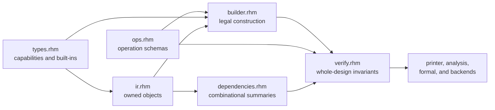

<!-- Explains how to change, extend, and validate Rhodium's backend-independent core. -->
<!-- SPDX-License-Identifier: Apache-2.0 -->

# Developing the Rhodium core

Read the core [`README.md`](README.md) first for the public semantic model,
operation reference, `Builder` API, and verification contract. This guide maps
those contracts to their implementation and explains how to change them.
Package-wide dependency rules are owned by
[`../DEVELOPING.md`](../DEVELOPING.md).

## Architecture and ownership

Core is the shared boundary between elaboration and downstream consumers. It
must remain independent of frontend syntax, analysis policy, and backend
lowering. A change to core semantics normally has four coordinated parts:

`Builder` rejects locally impossible construction. `verify_design` owns checks
that need a completed module or the whole design. `dependencies.rhm` owns
leaf-sensitive combinational reasoning, including hierarchy. `printer.rhm`
provides deterministic inspection; backend syntax does not belong there.

## Making a semantic change

### Add or change a hardware type

1. Put open capability behavior, built-in types, type equality, packing, and
   selector-width rules in [`types.rhm`](types.rhm).
2. Keep frontend-only types out of core. A frontend type should implement the
   public core capabilities without adding a core special case.
3. Update Builder checks and operation type rules that consume the capability.
4. Add focused type tests and exercise any affected operation or verifier
   boundary.

Do not add an implicit conversion to solve an authoring convenience. Core
representation changes remain explicit operations, and frontend composition
owns author-facing sugar.

### Add or change an operation

1. Add or update its [`OperationSchema`](ops.rhm), including semantic category,
   operand/result/place arity, required attributes, verifier type-rule name,
   and printer form.
2. Add the legal construction path in [`builder.rhm`](builder.rhm). Preserve
   module/design ownership, stable IDs, deterministic naming, use lists, and
   result definition links.
3. Implement schema-specific structural and type checks in
   [`verify.rhm`](verify.rhm). Checks requiring complete binding or hierarchy
   belong at verification time rather than being approximated in Builder.
4. Update [`dependencies.rhm`](dependencies.rhm) if the operation is
   combinational or changes how aggregate leaves, state boundaries, or
   hierarchy propagate dependencies.
5. Update [`printer.rhm`](printer.rhm) only when the registered printer form is
   insufficient, then update each downstream consumer that handles the opcode.
6. Add valid construction and invalid-use coverage in the closest
   operation-specific test.

An operation is not complete merely because the Builder can emit it. Its
verification, dependency behavior, deterministic text, and downstream
interpretation must agree with the public contract.

### Change verification

Keep checks at the narrowest layer that has enough information:

- Builder checks construction-local facts and keeps partially built modules
  usable.
- `verify_module` checks completed module structure and bindings.
- `verify_design` checks design ownership, cross-module references, unique
  identities, and hierarchical cycles.
- Optional policy or reporting that can be derived from verified IR belongs in
  `analysis/`, not in the mandatory core verifier.

Diagnostics should identify the owned operation, value, place, resource, or
module responsible for the violation. When dependency behavior changes, cover
both true cycles and independent aggregate leaves so conservatism does not
become a false positive.

## Implementation map

| File | Owns | Focused evidence |
|---|---|---|
| [`types.rhm`](types.rhm) | Open type capabilities, built-in types, equality, packing, and selector widths | [`types-test.rhm`](../../tests/core/types-test.rhm), [`signed-test.rhm`](../../tests/core/signed-test.rhm), [`shift-test.rhm`](../../tests/core/shift-test.rhm) |
| [`ir.rhm`](ir.rhm) | Public objects, collections, ownership indexes, lookup, and `DesignElaboration` | [`verify-test.rhm`](../../tests/core/verify-test.rhm), [`dpi-test.rhm`](../../tests/core/dpi-test.rhm) |
| [`builder.rhm`](builder.rhm) | Legal construction, naming, aggregate-drive canonicalization, state, resources, and hierarchy | [`wire-test.rhm`](../../tests/core/wire-test.rhm), [`memory-test.rhm`](../../tests/core/memory-test.rhm), [`sync-memory-test.rhm`](../../tests/core/sync-memory-test.rhm) |
| [`ops.rhm`](ops.rhm) | Opcode registry, categories, arities, type-rule names, and printer forms | Operation-specific tests under [`tests/core`](../../tests/core/) |
| [`verify.rhm`](verify.rhm) | Schema, ownership, use-def, driver, resource, state, instance, assertion, DPI, and crossing checks | [`verify-test.rhm`](../../tests/core/verify-test.rhm), [`assert-test.rhm`](../../tests/core/assert-test.rhm), [`cdc-test.rhm`](../../tests/core/cdc-test.rhm) |
| [`dependencies.rhm`](dependencies.rhm) | Leaf-sensitive combinational dependencies and hierarchical cycle detection | Hierarchy and aggregate-cycle cases in [`verify-test.rhm`](../../tests/core/verify-test.rhm) |
| [`printer.rhm`](printer.rhm) | Deterministic textual IR | Exact operation-form checks across [`tests/core`](../../tests/core/) |
| [`main.rhm`](main.rhm) | Public core re-exports | Import coverage through all core tests |

## Focused validation

Choose the smallest test file or files matching the contract changed:

- Value/place ownership, aggregate drives, or hierarchy: `wire-test.rhm`,
  `types-test.rhm`, and the relevant cases in `verify-test.rhm`.
- An opcode or type rule: its operation-specific test plus `types-test.rhm` or
  `verify-test.rhm` when the shared verifier changes.
- State or resource behavior: `memory-test.rhm`, `sync-memory-test.rhm`,
  `assert-test.rhm`, `cdc-test.rhm`, or `dpi-test.rhm` as applicable.
- Package imports or module movement: `make check-boundaries` in addition to
  the focused semantic test.

Run Rhombus tests with the repository test runner and a fresh
`PLTCOMPILEDROOTS`, as described by the owning [test guide](../../tests/README.md).
Reserve frontend, backend, and full-suite validation for changes that actually
cross those boundaries.
