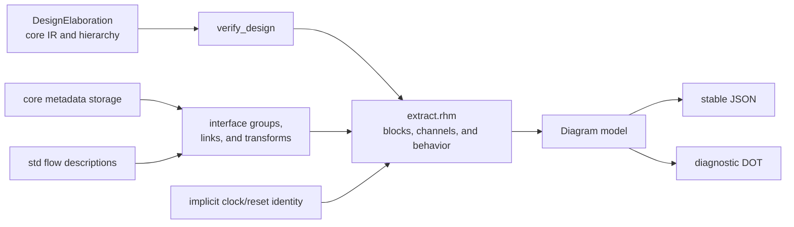

<!-- Explains the implementation, metadata ownership, and validation of Rhodium logical diagrams. -->

# Developing logical diagrams

Read the diagram [README](README.md) for extraction APIs, the public model and
JSON schema, DOT presentation, and deliberate limits. This guide owns the
implementation and change workflow.

## Architecture and metadata ownership

The logical model combines verified IR facts with optional authoring intent.
Metadata enriches the view but never replaces the IR as the source of hardware
connectivity.



- Core owns namespace-keyed `ModuleMetadata` storage without assigning diagram
  semantics to a namespace.
- The interface layer owns groups, arrays, connections, links, event sites, and
  transform descriptions; standard flow modules attach transform kind,
  properties, and optional typed trace routes.
- Frontend clocking support identifies implicit synchronous ports.
- Diagram extraction alone interprets those facts as a view and follows
  verified IR drivers for ordinary connectivity.
- Backends ignore inspection metadata.

## Implementation map

| File | Responsibility |
|---|---|
| [`model.rhm`](model.rhm) | Tool-neutral model, module lookup, and retained typed event/trace metadata for compiler consumers |
| [`extract.rhm`](extract.rhm) | Verification, hierarchy traversal, block extraction, channel tracing, and behavior classification |
| [`json.rhm`](json.rhm) | Deterministic stable JSON serialization |
| [`dot.rhm`](dot.rhm) | Port-anchored diagnostic DOT rendering |
| [`main.rhm`](main.rhm) | Public re-export surface |
| [`../../tests/frontend/diagram-test.rhm`](../../tests/frontend/diagram-test.rhm) | Model, hierarchy, JSON, DOT, protocol, implicit-control, and transparent-link coverage |
| [`../../tests/backend/diagram-metadata-test.rhm`](../../tests/backend/diagram-metadata-test.rhm) | Proof that inspection metadata is absent from CIRCT output |

## Change extraction or formats

Treat the model and JSON as the stable consumer boundary. Preserve deterministic
array order and map keys, opaque reference IDs, compound interface identity,
and the distinction between protocol channels and data dependencies. Add a
schema-version field before making an incompatible JSON change.

Keep DOT diagnostic and derived from the model. Presentation changes must not
alter extraction or become the only representation of a fact. New metadata
must have one authoring owner, remain non-semantic to core and backends, and be
validated against an IR-backed object before extraction uses it.

Update the public README whenever model fields, JSON, DOT behavior, extraction
rules, or deliberate limits change. Update [`PLAN.md`](PLAN.md) only for
non-contract future work.

## Validation

Run the focused diagram target:

```sh
make diagram-test
```

When metadata ownership or backend isolation changes, also run:

```sh
diagram_compiled_root="$(mktemp -d)"
trap 'rm -rf "$diagram_compiled_root"' EXIT
PLTCOMPILEDROOTS="$diagram_compiled_root" \
  tools/run-racket-tests.sh tests/backend/diagram-metadata-test.rhm
```

The focused target covers extraction, model, JSON, DOT, and package boundaries.
Use a fresh compiled root for every direct Racket or Rhombus validation batch.
