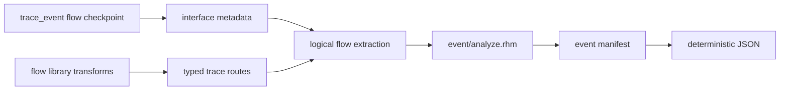

<!-- Explains compiler event inference, instrumentation ownership, and validation. -->

# Developing event graphs

Read the public [`README.md`](README.md) first. This package owns the
compiler-side static event model, occurrence-aware dependency inference,
manifest serialization, and immutable instrumentation. It
does not own ready-valid hardware behavior, core IR semantics, or CIRCT lowering.

## Architecture and ownership



- `flow/event.rhdl` owns the ready-valid convenience annotation and
  transparent wiring.
- `rhodium/frontend/layers/interface.rhm` owns the generic event and typed
  trace-route metadata because it owns interface topology.
- `rhodium/diagram/` resolves metadata against verified IR connectivity and
  exposes the logical blocks and channels reused here.
- `model.rhm` owns event sites, dependencies, manifests, and IR-backed metadata
  stage plans.
- `analyze.rhm` expands module definitions per concrete instance occurrence and
  infers nearest annotated predecessors.
- `json.rhm` projects the structured manifest into JSON and a matching C++
  descriptor, not a second analysis. Use the standard JSON string encoder so
  arbitrary labels and source locations remain valid JSON. Raw C++ literals
  preserve that JSON verbatim with a content-checked delimiter.
- `main.rhm` is the public re-export surface.
- `copy.rhm` remaps values, places, memories, DPI declarations, and instance
  bindings into another design; it leaves extension metadata on the original.
- `instrument.rhm` validates the dynamic subset, selectively specializes
  module occurrences, memoizes unchanged imports, threads hidden references,
  and constructs ordinary core state and DPI operations.
- [`../../rheg/`](../../rheg/DEVELOPING.md) independently owns the C++
  collector and Perfetto exporter; the generated descriptor and DPI ABI are
  the handoff, not a source dependency.

The event package may consume core elaborations, logical diagrams, and
interface-owned metadata. Core, frontend, standard and flow libraries, diagrams, and
backends must not depend on this optional compiler consumer. Hardware
instrumentation constructs ordinary verified IR and continues to use the
existing backend rather than introducing event cases into CIRCT lowering.

### Selective hierarchy rebuilding

Mark event-bearing occurrences, storage control-source occurrences, and their
ancestors before rebuilding. Ancestors must retarget changed children
and forward hidden metadata even when they contain no local annotation.
Only occurrences with local sites get event counters and node/edge emission;
the root also owns the reset callback.

Import each unmarked module definition once, memoized by original object
identity, recursively preserving its child-definition sharing. Parent instance
operations and bindings are still recreated: core ownership forbids referencing
an original-design module from the derived design. Reserve all original module
names when allocating specialization names so lazy imports cannot collide.
Original extension metadata remains on the original elaboration, including for
unchanged imported definitions.

Copying therefore scales with distinct unchanged definitions plus modified
occurrences; analysis remains occurrence-aware. Validate clock/reset lineage
for occurrences that own event sites or observed storage/selection controls,
following their bindings through ancestors. Untouched opaque subtrees may have
private reset domains; they are not part of the traced epoch. Explicit roots
allow observation of such outputs without asserting lineage inside them.
Fixed-latency paths compose their certified cycle counts during inference and
place a reference delay line in the consumer's module. Each stage samples the
entire upstream reference unconditionally and resets to invalid. This placement
is exact for unconditional delay even across hierarchy, maps, and dropping
filters, because the consuming annotation's transfer predicate controls emission.
It does not require specializing the functional pipeline implementation.
For elastic pipes, preserve the exact ordered `EventTraceStage` plan rather than
summing delays. Export the declared advance and input-valid signals from each
concrete pipe occurrence through hidden observation ports. Route these signals
to the consuming annotation and use them to load, clear, or hold the matching
shadow reference register. Reset takes priority over holding. No observed
signal is reconstructed by name, and no metadata signal drives functional RTL.
Controls are deduplicated by occurrence path and original value ID; unchanged
occurrences of the same pipeline definition remain shared imports. This first
implementation may forward unused observation outputs to higher ancestors;
pruning these ports is an independent optimization.

`EventTraceQueue` is an ordered stage alongside `EventTraceStage`. Its original
IR values identify actual writes, removals, read/write addresses, resident-head
validity, and bypass selection. Observation routing preserves packed widths,
including multi-bit addresses. At the consumer, allocate ordinary async-read
reference memory at the declared depth; reuse functional pointers instead of
building a shadow queue controller. Writes are reset-suppressed. Gate the
resident reference with functional occupancy, then select the live incoming
reference on bypass. Nonblocking memory writes preserve old-head identity on
simultaneous full replacement. Assert parent presence on storage removal as
well as at annotated consumers. Reset invalidates occupancy, so stale memory
cannot become a parent in a new epoch without a new write. This contract does
not describe synchronous-read memories, reordering, or control-only queues.

### Selection expressions

Keep static `EventDependency` paths for possible-parent reporting, and construct
the dynamic `EventTracePlan` at flow vertices with memoized identity. A source
leaf stops at the nearest annotation; a pipeline node wraps its upstream plan;
a selection node holds the ordered input plans and original instance-qualified
grants. Never lower arbitration as independently delayed parent paths: that
would duplicate shared output storage or apply the current grant to an older
transaction. Linear `trace_stages` remain available for compatibility, but are
false across selection; instrumentation consumes `trace_plans` instead.

Collect controls recursively and route grants through the same passive ports
as queue and pipeline controls. Lower plans recursively at each consuming
annotation, memoizing constructed plan values to share common storage. Grant
muxes default to invalid and assert pairwise exclusion using an accumulated
seen-grant bit. Downstream storage wraps the mux result exactly once. Each
occurrence emits edges for the valid parent slots of the selected lineage.
Reject partial annotated ancestry across selectable or joined inputs, uncertified fanout,
uncertified merges, and terminal ancestors. An all-unannotated path establishes
a root checkpoint instead of requiring fabricated parent identities.

`EventTraceRouting` wraps its input before branch-local storage and carries the
concrete flow occurrence ID, ordered predicates, and selected output index.
Observe the original inline predicate values in their owning module; never
rebuild the selector decoder. Default the reference to invalid and assert
mutual exclusion, just as for grants. For each parent with multiple children,
enumerate source-to-child alternatives through the plan. Every pair targeting
different child sites must diverge at some shared certified routing or atomic
replication occurrence. Distinct transforms or a common branch do not authorize
fanout. For routing the proof concerns each
transaction's routing decision, not simultaneous completion cycles: buffered
branches may emit descendants of different parents concurrently. Static latency
is zero at routing, while linear `trace_stages` are false across it.

`EventTraceReplication` preserves a concrete atomic-fork occurrence ID and
output index around one upstream plan. Keep this node during inference so the
fanout check can distinguish certified replication from an unexplained split.
The same pairwise path check accepts distinct outputs of a common replicator,
without claiming they are mutually exclusive. During lowering, recurse into
its input unchanged: the fork has no storage and all output transfers coincide
with input acceptance. Branch-local storage must wrap the replicated reference,
and its actual controls determine capture. Replication itself adds no observed
controls or state, so functional fork definitions remain shareable imports.
Static latency is zero; linear `trace_stages` remain false across replication.

`EventTraceBroadcast` preserves an independently accepted replication point.
Observe its original input-acceptance and selected recipient's pending signals
in their concrete owning occurrence. Lower one reference register per broadcast
within each consuming site's plan, shared when branches reconverge into that
plan. Capture on acceptance, otherwise hold; synchronous reset invalidates it.
Gate each branch with its functional pending bit. Never bypass with the incoming
reference: old deliveries and replacement capture may occur on the same edge.
The same certified-divergence check accepts distinct recipients. Both latency
and linear `trace_stages` are false; branch-local storage wraps this plan node.

## Extend trace coverage

Explicit root checkpoints cut dependency traversal at their own inputs in both
static inference and dynamic plans. Keep their output identity registered in the
normal event map so downstream lineage remains exact. Default checkpoints must
continue to reject opaque/disconnected ancestry; never infer root intent from a
failed traversal. Root is metadata only and does not alter functional wiring.

`EventTraceJoin` concatenates the contributing input lineages without adding a
visible node. Lower plans to a record containing transaction validity and a
`VectorType(P, EventRef)`. Capacity is computed from the plan, not from payload
width or the number of distinct static sites: sum at joins, maximum at selection,
one at a source annotation. Preserve each slot's validity when padding selection
inputs. The separate transaction-valid bit is the conjunction at joins and is
selected, stored, or gated together with the vector everywhere else.

Storage must use the incoming lineage type and a matching invalid reset value;
never fall back to single-reference memory/registers after a join. Broadcast
reconvergence still shares storage within a consuming plan. Hidden annotation
ports stay singleton `EventRef` because every annotation replaces its incoming
lineage with its own identity. At emission, assert transaction completeness and
call the existing edge DPI for each valid slot. Keep duplicate references in
hardware; the runtime edge set removes duplicate occurrence pairs. Do not
deduplicate by site alone or flatten an arbiter into the union of possible inputs.

Attach an `InterfaceTraceModel` only when a transform can state its possible
top-level endpoint routes exactly. Route indices refer to the transform's
flattened endpoint-array inputs and outputs. Do not infer routes from transform
labels or signal names.

Static routes are necessary but not sufficient authority for dynamic
instrumentation. The current optional `InterfaceTraceCombinational` contract
certifies one-to-one, zero-storage, non-inventing transfers. Its optional guard
retains the functional predicate, while event handshakes determine actual
transfer and parent-reference validity. Before traversing state, extend the
model with the transfer, ordering, and storage semantics needed for exact
lineage. `InterfaceTraceFixedLatency` additionally certifies unconditional,
one-to-one cycle delay with synchronous reset flushing. `valid_pipe` supplies
this contract; `InterfaceTraceModel.latency_cycles()` returns its positive
delay, zero for combinational contracts, and false for elastic, queue, or route-only models.
`InterfaceTraceElastic` binds an instance to an ordered list of actual
stage-advance and input-valid values declared by that pipeline implementation.
The frontend validates local one-bit controls, matching nonempty lists, and
that the contract's instance matches the transform implementation. The event
model keeps an IR-backed stage plan in addition to the JSON latency summary;
false latency alone does not authorize runtime traversal.
`InterfaceTraceQueue` similarly binds a declared storage contract to its exact
implementation instance. Validate signal ownership, depth-dependent address
widths, one-bit controls, and the single-input/single-output route. Its latency
is variable; inference retains one queue stage rather than converting capacity
into delay. The standard payload-bearing queue supplies the contract for every
flow/pipe configuration, including the single-entry register implementation.
`InterfaceTraceSelection` certifies N-to-one combinational routing using grants
declared by the implementation, including its actual arbitration policy.
The contract validates complete ordered input routes, one output, local one-bit
grants, and exact implementation binding. Ready-valid fixed-priority and
round-robin wrappers supply it; the compiler never recreates priority rotation.
`InterfaceTraceRouting` certifies inline one-to-N exclusive routing with actual
output predicates, complete ordered routes, local one-bit controls, and blocking
when no predicate is true. `demux_flow` reuses those same predicates in functional
valid/ready wiring; the compiler does not infer this contract for direct instances.
`InterfaceTraceAtomicFork` certifies zero-storage all-or-none replication, not
independent delivery. Validate a positive output count, one input, and the exact
ordered output routes. `atomic_fork` supplies this contract without changing
functional wiring. Like combinational passthrough, this is a trusted adapter
contract, not a proof of arbitrary RTL. Selective and control-only forks keep
their route-only models until their specific semantics are supported.
`InterfaceTraceBufferedBroadcast` binds one-slot storage to the exact instance,
with actual acceptance and ordered pending controls. Validate one input, complete
ordered output routes, one-bit ownership, and one declaration. `broadcast(n)`
supplies the adapter; `CtrlBroadcast` does not. The contract promises no bypass,
exactly-once independent delivery, reset flushing, and old-item observation on
simultaneous completion/replacement. Do not reconstruct pending logic or infer
these guarantees from the transform's name or one-to-many route list.
Inference adds these typed delays across flow arcs; it never parses display
labels or transform properties for timing. The manifest retains unknown latency
as false rather than interpreting it as zero. Never upgrade route-only metadata
to dynamic passthrough merely because its endpoint cardinality is one-to-one.

An unmodeled transform is a supported boundary: inference reports the concrete
transform occurrence and stops with an error when a downstream annotation
requires traversal through it.

`InterfaceTraceAtomicJoin` certifies zero-storage all-input rendezvous: every
input transfers exactly when the single output transfers. Validate positive
input count and complete ordered routes. `zip_flow` supplies this contract;
route-only merge metadata is not upgraded implicitly. There are no new observed
controls for the join itself. Static latency is zero and linear `trace_stages`
are false across it; inference constructs `EventTraceJoin` instead.

## Focused validation

Named observations are normalized by the interface layer to an ordered selected
record plus field descriptors. Ordinary scalar projections retain original IR
ownership; only that selected record reaches word instrumentation. Analysis
derives field widths and offsets from canonical record packing, independently
of lineage plans. Emit both JSON schema and C++ tables from the same manifest.
The graph fixture covers nested/computed captures and rejection; the runtime
fixture captures 38 selected bits from a 65-bit input and checks exact words,
unchanged output transfers, and parent identities. Keep `use_static` coverage
for capture binders in the configured-flow static test.

Standalone collector and exporter contracts live in
[`rheg/tests/`](../../rheg/DEVELOPING.md#focused-validation).
The `event-runtime` simulation runner includes the collector contract test. The
`event-join` emitter exports its descriptor from the same instrumented result
as RTL, and its simulator binds that generated header before reset. Every cycle
then receives manifest validation as well as independent transfer checks.

Run:

```sh
make event-test
make event-runtime-test
```

The focused test covers linear transforms, hierarchy occurrence expansion,
forks, merges, JSON parsing, and opaque-transform rejection. Run
`make diagram-test` after changing the shared logical model or extraction, and
`make check-boundaries` after changing package placement or dependencies.

The runtime fixture covers same-cycle edges, repeated definitions, parent/child
hidden ports, map/filter/gate behavior, ready-valid stalls, Valid pulses, 65-bit
payloads, reset epochs, callback ordering, and edge deduplication. Host tests
also compare original CIRCT emission before and after instrumentation, check
unchanged nested/diamond definition sharing, and distinguish metadata-only
wrappers from event-bearing specializations. The runtime scoreboard exercises
functional logic in shared imported children as well as traced descendants.
The `event-pipeline` fixture adds one- and two-stage Valid pipes composed across
hierarchy, filters before and after storage, bursts, bubbles, drain, and reset
with transactions in flight. Its independent C++ transfer scoreboard checks
both functional outputs and exact node payloads, timestamps, and parent edges.
The `event-elastic` fixture uses independently stalled repeated instances,
filters on both sides of storage, an in-order transaction scoreboard, and
unannotated reference lanes. It checks functional ready/valid/payload agreement,
exact occurrence edges, bubbles, simultaneous transfers, draining, and reset
while full. Coverage assertions ensure these scenarios actually occur.
The `event-queue` fixture covers all four flow/pipe combinations at depths one
and three, repeated occurrences of one definition, and a depth-five queue
composed with elastic pipes, filters, and another queue across hierarchy.
Public-transfer scoreboards check exact graph contents independently of storage
controls, and unannotated lanes check functional equivalence. Coverage requires
empty bypass, full replacement, enough storage writes for pointer wraparound,
bubbles, stalls, draining, and reset with pending transactions.
The `event-arbiter` fixture adds fixed-priority and round-robin selection,
different input buffers, post-selection storage, nested arbiters, repeated
definitions, changing offers while stalled, and reset with pending work. Its
scoreboard derives parent ordering from public transfers at buffer boundaries,
not the grants observed by the compiler, and compares complete node/edge JSON.
Repeated payload values prevent payload matching from substituting for exact
identity. Unannotated networks verify that functional behavior is unchanged.
The `event-demux` fixture adds three-way routing with invalid selector encodings,
changing selections while stalled, pre-routing storage, different branch-local
pipes and queues, independent backpressure, simultaneous completions, and reset
with pending work. Its scoreboard assigns parents using public routing-boundary
transfers, then compares exact graph JSON, including repeated payloads. Host
checks cover nested routing, arbiter reconvergence, malformed contracts, immutable
original emission, and shared unannotated definitions.
The `event-atomic-fork` fixture checks three-way all-or-none public transfers,
pre-fork queues, different branch-local buffers, repeated hierarchy, bubbles,
independent and simultaneous completions, draining, and reset with pending work.
The independent transfer scoreboard copies one accepted parent into each branch
queue and compares exact graph JSON; repeated payloads prevent value matching
from substituting for occurrence identity. Unannotated lanes check functional
equivalence. Host checks cover nested replication, composition with demuxes and
arbiters, singleton forks, malformed contracts, and rejection of uncertified
fanout.

The `event-broadcast` fixture checks independently accepted recipients, shared
parents across differently buffered branches, repeated hierarchy, and simultaneous
last-recipient completion/replacement. Its public-transfer oracle processes old
deliveries before installing a new resident parent and rejects duplicate delivery.
Coverage requires independent stalls, simultaneous completions, partial-delivery
reset, buffered reset, replacement, and draining. Complete DPI graphs and
unannotated functional lanes are compared every cycle.

The `event-join` fixture checks multi-parent references through input and output
storage, nested joins, atomic-fork and broadcast reconvergence, differently sized
arbiter inputs, downstream demuxes, repeated hierarchy, and annotation cut points.
Its oracle reconstructs parent sets from public transfers, not trace vectors.
Compare complete graph JSON and unannotated functional lanes. Coverage requires
stalls, reset with outstanding work, both selection alternatives, duplicate-edge
deduplication, distinct occurrences from the same site, and final draining.
Host checks validate capacity bounds, original-design immutability, atomic routes,
and rejection of partial annotated ancestry.

Every direct Racket or Rhombus command must use a fresh `PLTCOMPILEDROOTS` as
required by the repository `AGENTS.md`.
