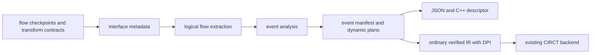

<!-- Defines event compiler ownership, lineage lowering invariants, and extension validation. -->

# Developing event graphs

Read [README.md](README.md) for annotation APIs, supported behavior, and limits.
This package owns static inference, manifest serialization, and immutable
instrumentation, not functional flow behavior, core semantics, or CIRCT lowering.

## Architecture and ownership



| Owner | Responsibility |
|---|---|
| `flow/event.rhdl` | Transparent convenience checkpoints |
| `rhodium/frontend/layers/interface.rhm` | Generic event metadata and typed trace contracts |
| `rhodium/diagram/` | Resolve topology metadata against verified IR connectivity |
| `model.rhm` | Sites, dependencies, manifests, and IR-backed plans |
| `analyze.rhm` | Occurrence expansion and nearest-predecessor inference |
| `json.rhm` | JSON and matching C++ descriptor from one manifest |
| `copy.rhm` | Remap values, places, memories, DPI declarations, and instance bindings |
| `instrument.rhm` | Validate plans, selectively rebuild hierarchy, and emit state/DPI operations |
| `main.rhm` | Public re-exports |
| [RHEG](../../rheg/DEVELOPING.md) | Independent C++ collector and exporter |

Core, frontend, standard/flow libraries, diagrams, and backends must not import
this optional consumer. Instrumentation produces ordinary verified IR; do not
add event cases to CIRCT lowering. RHEG consumes the generated descriptor and
DPI ABI, not compiler sources. The authoritative package inventory is
[rhodium/DEVELOPING.md](../DEVELOPING.md).

## Dynamic lineage plans

Keep static `EventDependency` paths for possible-parent reporting. Dynamic
`trace_plans` are memoized expressions at flow vertices, not independently
delayed static edges. Storage before selection belongs to its input branch;
storage afterward wraps the selected lineage exactly once. `trace_stages` is
the linear compatibility projection and becomes false across nonlinear plans.

| Plan | Information retained for lowering |
|---|---|
| `EventTraceSource` | Nearest annotation or supported unannotated root |
| `EventTracePipeline` | Input plan and ordered fixed, elastic, or queue stages |
| `EventTraceSelection` | Ordered input plans and occurrence-qualified grants |
| `EventTraceRouting` | Input, concrete router ID, original predicates, output index |
| `EventTraceReplication` | Input, concrete atomic-fork ID, output index |
| `EventTraceBroadcast` | Input, concrete broadcast ID, acceptance, recipient pending control |
| `EventTraceJoin` | Ordered contributing input plans |

`event_trace_capacity(plan)` is one at a source, the sum at a join, the maximum
at selection, and unchanged through storage/routing/replication. Lower lineage
to transaction validity plus `VectorType(P, EventRef)`. A reference contains
`valid`, numeric `site`, and `sequence`; numeric sites index the occurrence-aware
manifest rather than a lossy hierarchy hash. Hidden annotation ports remain
singleton references because each annotation replaces incoming ancestry.

At a join, transaction validity is the conjunction of contributors; it is not
the conjunction of every padded slot. Preserve each slot's validity when padding
selection inputs. Registers and memories must use the incoming lineage type and
matching invalid values, including after joins. Emit one edge per valid slot
after asserting transaction completeness. Keep duplicate slots in hardware;
RHEG deduplicates full occurrence pairs. Never deduplicate by site alone.

Explicit roots stop traversal at their inputs but retain their output identity
for downstream inference. Default checkpoints must not turn failed traversal
into a root. Reject partial annotated ancestry, uncertified merges/fanout, and
terminal ancestors according to the public contract.

### Selective hierarchy rebuilding

Mark event-bearing occurrences, observed control-source occurrences, and their
ancestors. Ancestors retarget children and forward hidden metadata; only local
sites get counters and occurrence calls, while the top owns reset emission.
Import each unmarked definition once, memoized by original identity, preserving
its child-definition sharing. Parent instance operations must still be recreated:
core ownership forbids references to modules in another design. Reserve original
names before allocating specialization names. Original extension metadata stays
on the original elaboration and manifest, including for unchanged imports.

Copying scales with distinct unchanged definitions plus specialized occurrences;
analysis remains occurrence-aware. Validate clock/reset ancestry for event and
observed-control owners through their ancestor bindings. Untouched opaque
subtrees may retain private domains.

Route original control values through passive observation ports, deduplicated
by occurrence path and value ID, preserving widths. Never reconstruct controls
by signal name or drive functional RTL from trace state. Lower recursively at
each consuming site, memoizing plan values to share common storage within that
plan. Observation-port pruning is a separate optimization.

### Storage lowering

- **Fixed latency:** compose certified cycle counts and place an unconditional
  lineage delay line at the consumer. Reset each stage to invalid. Functional
  pipeline definitions remain shareable; consumer handshakes suppress filtered
  transactions even across hierarchy.
- **Elastic stages:** preserve ordered `EventTraceStage` controls. Load on actual
  advance, load invalid for a bubble, and hold on stall; reset takes priority.
  A variable-latency summary cannot replace the original advance/input-valid plan.
- **Queues:** `EventTraceQueue` retains actual writes/removals, addresses, head
  validity, and bypass selection. Allocate same-depth async-read shadow memory
  without duplicating pointers or occupancy policy. Suppress writes on reset;
  functional occupancy hides stale entries without a reset sweep. Empty bypass
  uses the live input. Nonblocking writes preserve the old head on full
  simultaneous replacement. Assert parent presence on removal and consumption.
- **Buffered broadcast:** allocate one reference register per broadcast within
  a consuming plan, shared on reconvergence. Capture on acceptance, otherwise
  hold; reset invalidates it. Gate each recipient with its actual pending bit.
  Never bypass with the incoming reference: simultaneous last delivery and
  replacement must expose the old resident identity. Add no shadow pending logic.

### Selection and replication lowering

Select whole lineages with the original grants; default to invalid and assert
pairwise exclusion using an accumulated seen-grant bit. Buffered input plans
remain independent and downstream storage retains the selected transaction even
when grants change later. Do not union all possible parents of an arbiter.

Routing wraps the input before branch-local storage and gates each branch with
the original inline predicate. Assert mutual exclusion rather than rebuilding
the decoder. Atomic replication lowers to its input unchanged, adding no local
state or observation controls. Preserve router/replicator IDs during inference
for the fanout check even when lowering needs no additional hardware.

For every pair of paths to different child sites, require divergence at distinct
outputs of a common certified router or replicator. Different transforms or the
same output do not authorize fanout. Routing exclusion concerns a transaction's
decision, not whether buffered descendants finish in the same cycle. Atomic
fork recipients share acceptance; broadcast recipients consume independently.
Joins combine the accepted lineages without creating a visible node.

## Extend trace coverage

The frontend [interface contract reference](../frontend/layers/README.md#interfaces-and-topology)
owns `InterfaceTraceModel`, storage declarations, and `InterfaceTrace*` builders.
Do not duplicate that API catalog here. To support another transform:

1. State exact possible top-level endpoint routes and transfer, storage, ordering,
   reset, and replication semantics. Route indices refer to flattened endpoint
   arrays. A display label or route-only model is not dynamic authority.
2. Bind stateful contracts to the exact implementation instance and original
   controls. Validate ownership, local one-bit predicates, complete ordered
   routes, and depth-dependent address widths. Reuse functional grants, pointers,
   advances, and pending bits rather than implementing a second controller.
3. Preserve the semantics in the occurrence-qualified dynamic plan and lower it
   through ordinary core IR. Add certified fixed delays; retain variable or
   unknown latency as false, never zero or queue capacity interpreted as delay.
4. Add invalid-contract checks and independent public-transfer scoreboards.
   Typed adapters are trusted contracts, not proofs of arbitrary RTL; unsupported
   traversal must report the concrete boundary instead of approximating lineage.
5. Update the public supported-transform table. Run the relevant validation below
   and boundary checks when imports or package placement change.

## Capture and manifest generation

The interface layer normalizes selected observations into an ordered record and
field descriptors. Scalar projections retain original IR ownership; only that
compact record reaches word instrumentation. Derive offsets from canonical
record packing independently of lineage plans. Generate JSON and C++ tables
from the same manifest, not a second analysis. Use the JSON string encoder for
labels/locations and a content-checked raw C++ delimiter to preserve JSON exactly.
Decoder implementation belongs to RHEG; compiler metadata does not disassemble.
Enum capture tables come from the frontend's nominal variant schema, with decimal
string values to preserve full-width encodings. Preserve table order and explicit
label selection through analysis and JSON/C++ generation. This is display metadata:
it adds neither payload bits nor lineage state and requires no CIRCT support.

## Stall observation lowering

Expand companion sites after transfer-site analysis so transfer IDs and
`event_by_output` cut points remain unchanged. Only certified linear trace
projections supply stall dependencies; nonlinear transfer contracts do not
certify the identity of a blocked offer. Mark observation latency unknown.

Lower each transfer checkpoint's incoming shadow state once, then reuse those
references for its stall companion. Give companions their own counters and
`valid & !ready` predicates, but never export them into downstream lineage.
Exclude observation children from transfer-fanout checks. Parent-presence
assertions still protect transfers; observations emit an edge only when the
incoming reference is valid, since a blocked offer may precede any acceptance.
Do not derive identity from payload equality or add metadata state that drives
functional signals. Preserve reset suppression and independent sequence epochs.

## Focused validation

Use a fresh compiled root for each focused batch, following
[AGENTS.md](../../AGENTS.md#verification):

```sh
export PLTCOMPILEDROOTS="$(mktemp -d /tmp/rhodium-event-tests.XXXXXX)"
make event-test
make event-runtime-test
```

Host tests cover static inference, malformed contracts, capture packing and
rejection, capacity bounds, JSON/C++ agreement, hierarchy identity, unchanged
original CIRCT emission, and sharing of nested/diamond definitions. Preserve
`use_static` capture-binder checks in `tests/frontend/std-flow-static-test.rhm`.

Runtime scoreboards must derive expected identities from **public transfers**,
not observed internal controls, trace vectors, or payload matching. Use repeated
payloads, exact graph comparisons, unannotated reference lanes, and coverage
assertions for stalls, bubbles, drain, and reset with pending work.

| Fixture | Distinct coverage to preserve |
|---|---|
| `event-runtime` | Same-cycle edges, repeated hierarchy, hidden ports, shared functional children, map/filter/gate, ready-valid and Valid transfers, 38 selected bits from a 65-bit input, callback permutations, reset and deduplication |
| `event-pipeline` | One/two-stage and composed hierarchical fixed delays, filters around storage |
| `event-elastic` | Independently stalled repeated instances, simultaneous transfers, full reset, exact ready/valid/payload equivalence |
| `event-queue` | All flow/pipe modes at depths one/three, depth-five hierarchical composition, empty bypass, full replacement, pointer wraparound |
| `event-arbiter` | Fixed/round-robin and nested selection, independent input/output buffers, changing offers under stall |
| `event-demux` | Invalid selectors, changing selection, independent branch buffers, simultaneous completions, nested routing and reconvergence |
| `event-atomic-fork` | All-or-none transfers, pre/post storage, repeated hierarchy, nested/singleton replication, demux/arbiter composition and uncertified-fanout rejection |
| `event-broadcast` | Independent recipients, partial-delivery reset, old delivery before replacement, shared parents and duplicate-delivery rejection |
| `event-join` | Nested joins, differently sized arbiter lineages, pre/post storage, fork/broadcast reconvergence, downstream demux, annotation cut points and distinct sequences at one site |
| `event-stall` | Per-cycle blocked offers, changing/withdrawn Decoupled values, elastic and bypass/replacement queue ancestry, reset, repeated payloads and differential functional behavior |

The `event-runtime` runner includes the standalone collector test. `event-join`
binds a descriptor generated from the same instrumented result as its RTL, adding
manifest validation every cycle. Standalone runtime/export tests are owned by
[RHEG](../../rheg/DEVELOPING.md#focused-validation). Core integration is owned by
[RV5Stage](../../cores/rv5stage/DEVELOPING.md#pipeline-event-annotations) and
[the simulator](../../sims/DEVELOPING.md#event-export-integration).

Run `make diagram-test` after changes to shared logical extraction and
`make check-boundaries` after package/dependency changes. Generated artifacts
stay outside version control.

## Future work

Instrumented area/state cost and simulation overhead still need systematic
measurement. Treat optimization or wider adapter coverage as separate work;
the current contracts do not promise bounded overhead or traversal of unsupported
state. Remaining public coverage limits belong in the README, not a phase ledger.
