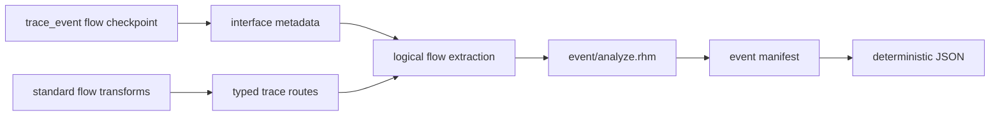

<!-- Explains event inference, immutable instrumentation, DPI ownership, and validation. -->

# Developing event graphs

Read the public [`README.md`](README.md) first. This package owns the
compiler-side static event model, occurrence-aware dependency inference, and
manifest serialization, immutable instrumentation, and the C++ collector. It
does not own ready-valid hardware behavior, core IR semantics, or CIRCT lowering.

## Architecture and ownership



- `rhodium/std/flow/event.rhdl` owns the ready-valid convenience annotation and
  transparent wiring.
- `rhodium/frontend/layers/interface.rhm` owns the generic event and typed
  trace-route metadata because it owns interface topology.
- `rhodium/diagram/` resolves metadata against verified IR connectivity and
  exposes the logical blocks and channels reused here.
- `model.rhm` owns event sites, dependencies, manifests, and IR-backed metadata
  stage plans.
- `analyze.rhm` expands module definitions per concrete instance occurrence and
  infers nearest annotated predecessors.
- `json.rhm` is a projection of the structured manifest, not a second analysis.
- `main.rhm` is the public re-export surface.
- `copy.rhm` remaps values, places, memories, DPI declarations, and instance
  bindings into another design; it leaves extension metadata on the original.
- `instrument.rhm` validates the dynamic subset, selectively specializes
  module occurrences, memoizes unchanged imports, threads hidden references,
  and constructs ordinary core state and DPI operations.
- `runtime/` owns the fixed-width C ABI, order-independent graph storage,
  validation, and deterministic occurrence JSON.

The event package may consume core elaborations, logical diagrams, and
interface-owned metadata. Core, frontend, standard libraries, diagrams, and
backends must not depend on this optional compiler consumer. Hardware
instrumentation constructs ordinary verified IR and continues to use the
existing backend rather than introducing event cases into CIRCT lowering.

### Selective hierarchy rebuilding

Mark event-bearing occurrences, elastic control-source occurrences, and their
ancestors before rebuilding. Ancestors must retarget changed children
and forward hidden metadata even when they contain no local annotation.
Only occurrences with local sites get event counters and node/edge emission;
the root also owns the reset callback.

Import each unmarked module definition once, memoized by original object
identity, recursively preserving its child-definition sharing. Parent instance
operations and bindings are still recreated: core ownership forbids referencing
an original-design module from the derived design. Reserve all original module
names when allocating specialization names so lazy imports cannot collide.
Original extension metadata remains on the original elaboration, including for
unchanged imported definitions.

Copying therefore scales with distinct unchanged definitions plus modified
occurrences; analysis and clock/reset validation remain occurrence-aware.
Fixed-latency paths compose their certified cycle counts during inference and
place a reference delay line in the consumer's module. Each stage samples the
entire upstream reference unconditionally and resets to invalid. This placement
is exact for unconditional delay even across hierarchy, maps, and dropping
filters, because the consuming annotation's transfer predicate controls emission.
It does not require specializing the functional pipeline implementation.
For elastic pipes, preserve the exact ordered `EventTraceStage` plan rather than
summing delays. Export the declared advance and input-valid signals from each
concrete pipe occurrence through hidden observation ports. Route these signals
to the consuming annotation and use them to load, clear, or hold the matching
shadow reference register. Reset takes priority over holding. No observed
signal is reconstructed by name, and no metadata signal drives functional RTL.
Controls are deduplicated by occurrence path and original value ID; unchanged
occurrences of the same pipeline definition remain shared imports. This first
implementation may forward unused observation outputs to higher ancestors;
pruning these ports is an independent optimization.

## Extend trace coverage

Attach an `InterfaceTraceModel` only when a transform can state its possible
top-level endpoint routes exactly. Route indices refer to the transform's
flattened endpoint-array inputs and outputs. Do not infer routes from transform
labels or signal names.

Static routes are necessary but not sufficient authority for dynamic
instrumentation. The current optional `InterfaceTraceCombinational` contract
certifies one-to-one, zero-storage, non-inventing transfers. Its optional guard
retains the functional predicate, while event handshakes determine actual
transfer and parent-reference validity. Before traversing state, extend the
model with the transfer, ordering, and storage semantics needed for exact
lineage. `InterfaceTraceFixedLatency` additionally certifies unconditional,
one-to-one cycle delay with synchronous reset flushing. `valid_pipe` supplies
this contract; `InterfaceTraceModel.latency_cycles()` returns its positive
delay, zero for combinational contracts, and false for elastic/route-only models.
`InterfaceTraceElastic` binds an instance to an ordered list of actual
stage-advance and input-valid values declared by that pipeline implementation.
The frontend validates local one-bit controls, matching nonempty lists, and
that the contract's instance matches the transform implementation. The event
model keeps an IR-backed stage plan in addition to the JSON latency summary;
false latency alone does not authorize runtime traversal.
Inference adds these typed delays across flow arcs; it never parses display
labels or transform properties for timing. The manifest retains unknown latency
as false rather than interpreting it as zero. Never upgrade route-only metadata
to dynamic passthrough merely because its endpoint cardinality is one-to-one.

An unmodeled transform is a supported boundary: inference reports the concrete
transform occurrence and stops with an error when a downstream annotation
requires traversal through it.

## Focused validation

Run:

```sh
make event-test
make event-runtime-test
```

The focused test covers linear transforms, hierarchy occurrence expansion,
forks, merges, JSON parsing, and opaque-transform rejection. Run
`make diagram-test` after changing the shared logical model or extraction, and
`make check-boundaries` after changing package placement or dependencies.

The runtime fixture covers same-cycle edges, repeated definitions, parent/child
hidden ports, map/filter/gate behavior, ready-valid stalls, Valid pulses, 65-bit
payloads, reset epochs, callback ordering, and edge deduplication. Host tests
also compare original CIRCT emission before and after instrumentation, check
unchanged nested/diamond definition sharing, and distinguish metadata-only
wrappers from event-bearing specializations. The runtime scoreboard exercises
functional logic in shared imported children as well as traced descendants.
The `event-pipeline` fixture adds one- and two-stage Valid pipes composed across
hierarchy, filters before and after storage, bursts, bubbles, drain, and reset
with transactions in flight. Its independent C++ transfer scoreboard checks
both functional outputs and exact node payloads, timestamps, and parent edges.
The `event-elastic` fixture uses independently stalled repeated instances,
filters on both sides of storage, an in-order transaction scoreboard, and
unannotated reference lanes. It checks functional ready/valid/payload agreement,
exact occurrence edges, bubbles, simultaneous transfers, draining, and reset
while full. Coverage assertions ensure these scenarios actually occur.

Every direct Racket or Rhombus command must use a fresh `PLTCOMPILEDROOTS` as
required by the repository `AGENTS.md`.
