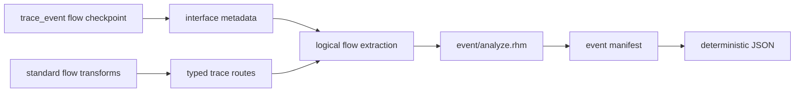

<!-- Explains ownership, extension points, and focused validation for static event graphs. -->

# Developing static event graphs

Read the public [`README.md`](README.md) first. This package owns the
compiler-side static event model, occurrence-aware dependency inference, and
manifest serialization. It does not own ready-valid hardware behavior, core IR
semantics, CIRCT lowering, or runtime DPI instrumentation.

## Architecture and ownership



- `rhodium/std/flow/event.rhdl` owns the ready-valid convenience annotation and
  transparent wiring.
- `rhodium/frontend/layers/interface.rhm` owns the generic event and typed
  trace-route metadata because it owns interface topology.
- `rhodium/diagram/` resolves metadata against verified IR connectivity and
  exposes the logical blocks and channels reused here.
- `model.rhm` owns tool-neutral event sites, dependencies, and manifests.
- `analyze.rhm` expands module definitions per concrete instance occurrence and
  infers nearest annotated predecessors.
- `json.rhm` is a projection of the structured manifest, not a second analysis.
- `main.rhm` is the public re-export surface.

The event package may consume core elaborations, logical diagrams, and
interface-owned metadata. Core, frontend, standard libraries, diagrams, and
backends must not depend on this optional compiler consumer. Future hardware
instrumentation must construct ordinary verified IR and continue to use the
existing backend rather than introducing event cases into CIRCT lowering.

## Extend trace coverage

Attach an `InterfaceTraceModel` only when a transform can state its possible
top-level endpoint routes exactly. Route indices refer to the transform's
flattened endpoint-array inputs and outputs. Do not infer routes from transform
labels or signal names.

Static routes are necessary but not sufficient authority for later dynamic
instrumentation. Before an implementation pass traverses state, the trace model
must be extended with the transfer, ordering, and storage semantics needed to
carry exact runtime lineage.

An unmodeled transform is a supported boundary: inference reports the concrete
transform occurrence and stops with an error when a downstream annotation
requires traversal through it.

## Focused validation

Run:

```sh
make event-test
```

The focused test covers linear transforms, hierarchy occurrence expansion,
forks, merges, JSON parsing, and opaque-transform rejection. Run
`make diagram-test` after changing the shared logical model or extraction, and
`make check-boundaries` after changing package placement or dependencies.

Every direct Racket or Rhombus command must use a fresh `PLTCOMPILEDROOTS` as
required by the repository `AGENTS.md`.
