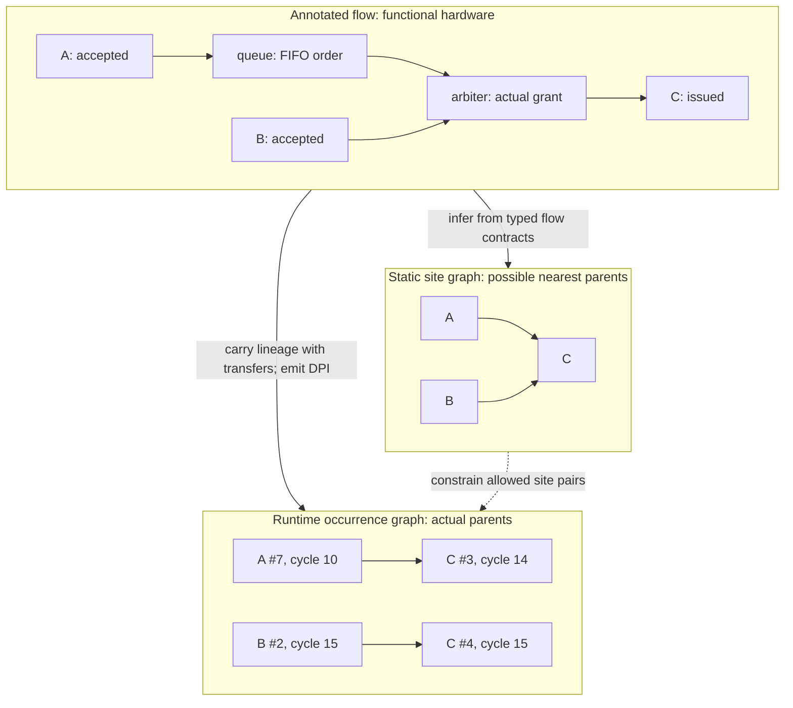

<!-- Documents event annotations, dependency inference, and supported compiler instrumentation. -->

# Event graphs

A microarchitectural event graph records **what happened and which
transfers contributed to it**. Each node is one occurrence at an annotated
checkpoint, identified by site and sequence within a reset epoch, with a cycle
and optional captured fields. Directed edges connect its nearest contributing
parent occurrences—not every earlier event or every electrically connected signal.

Authors select checkpoints; the compiler derives dependencies from the declared
semantics of [flow](../../flow/README.md). Queues preserve transaction order,
arbiters select a granted input, forks replicate lineage, and joins combine it.
Static analysis identifies possible parent sites. Compiler-inserted metadata
follows the actual transfers and emits DPI callbacks, letting
[RHEG](../../rheg/README.md) build the concrete occurrence graph for Perfetto.



Here, `C #3` inherits `A #7` through the queue; the later grant to B produces
`B #2 -> C #4` on the same cycle. The two possible static parents do not become
two actual parents of every C occurrence. Only annotations emit nodes: the queue
and arbiter carry lineage without creating synthetic events. Unsupported flow
semantics are rejected rather than guessed. Ordinary, uninstrumented elaboration
is unchanged; tracing builds a separate design.

## Annotate events

The [flow library](../../flow/README.md) exports transparent checkpoints:

```rhombus
import:
  lib("flow/main.rhdl") open

source
  |> trace_event("accepted", ~root: #true)
  |> pipe(2)
  |> trace_event("issued", ~terminal: #true)
  |> sink
```

`trace_event` accepts `Decoupled` and `Irrevocable` payload flows and fires on
`valid & ready`. `trace_valid_event` accepts `Valid` and fires on `valid`.
Both preserve protocol and payload; ordinary elaboration adds no trace state
or DPI calls. Bare checkpoints capture identity and timing, not payload fields.
Labels must be nonempty and unique within one module definition. Each concrete
instance of a reused definition has distinct event-site identities.

`~root: #true` explicitly starts new lineage, including at an opaque component
output. It cuts off earlier ancestry without certifying the component or
relaxing clock/reset checks. The default is false: ordinary checkpoints still
reject opaque or uncertified ancestry. The manifest records `sites[].root`.
`~terminal: #true` preserves transparent wiring and records terminal metadata;
static inference does not prune downstream paths, but dynamic instrumentation
rejects dependencies on terminal ancestors.

### Stall observations

Enable per-cycle backpressure observations on a ready-valid checkpoint:

```rhombus
def observed = stage |> trace_event("s3.execute", ~stalls: #true, ~fields: payload):
  pc: payload.pc
  instruction(~format: "riscv", ~isa: "rv64imafdc_zicsr", ~pc: "pc"): payload.instruction
```

The original site still fires only on `valid & ready`. Its companion
`s3.execute.stall` fires on `valid & !ready`, with the same selected captures
sampled from that cycle's offer. Neither fires during reset or when invalid.
The graph retains one observation per blocked cycle. Perfetto coalesces consecutive
stalls with unchanged captures and parent identities into a continuous slice;
see the [display contract](../../rheg/README.md#perfetto-display-and-queries).
Stalls share the original event's track and are always named
`stall`; instruction/enum captures remain available as arguments. This traces
local backpressure, not an inferred stall reason or proof that the instruction
will eventually commit.

Stalls are leaf observations: they never advance token metadata, cut ancestry,
or become parents of a later transfer. The compiler reuses the observed
checkpoint's incoming references along certified linear paths, including pipes
and queues, and emits edges only for references actually present. A blocked
offer at an input may have no accepted ancestor. Selection, routing, replication,
and join paths currently produce unlinked stall observations; their transfer
events retain their normal inferred dependencies.

`Decoupled` may change or withdraw an unaccepted offer. No identity is inferred
from repeated PC or payload values, and a stall is not a promise of a future
transfer. `Irrevocable` retains its existing stability contract. The option is
false by default and unavailable on `trace_valid_event`, which has no ready
signal. Enabling it reserves both the label and `<label>.stall` locally.

The manifest marks normal sites with `kind: "transfer"` and companions with
`kind: "stall"` plus `observation_of` naming the normal site's string ID.
Companions have independent site/sequence identities and are appended after
normal sites, preserving normal numeric site IDs. Observation dependencies have
no fixed latency. Runtime nodes and DPI packing are unchanged.

### Capture fields

Select observations independently at each checkpoint with a typed binder:

```rhombus
def observed = source |> trace_event("fetch", ~root: #true, ~fields: payload):
  pc: payload.pc
  instruction: payload.instruction
  low_pc(~format: "unsigned"): payload.pc[0..5]
```

The `~fields` binder is last in the argument list. Names are unique ASCII
identifiers; `cycle` and `sequence` are reserved. Values must be local scalar
hardware expressions. Nested selections, aliases, slices, and combinational
expressions are allowed; select aggregate leaves or explicitly cast an aggregate
to Bits for a packed capture. Missing members, duplicate names, foreign-module
values, and incompatible formats fail during elaboration.

| Format | Meaning |
|---|---|
| `hex` | Fixed-width hexadecimal; default for scalar types other than Bool/SInt |
| `unsigned` | Unsigned integer |
| `signed` | Two's-complement integer; default for SInt |
| `bool` | One-bit Boolean; default for Bool |
| `riscv` | Host-disassembled instruction, with explicit ISA and PC reference |
| `enum` | Numeric capture with a compiler-derived hardware enum symbol table (up to 64 bits) |

For disassembly, replace the instruction entry with:

```rhombus
instruction(~format: "riscv", ~isa: "rv64imafdc_zicsr", ~pc: "pc"): payload.instruction
```

The instruction must be 16 or 32 bits. `~pc` names another capture at the same
site with hex/unsigned format and the ISA's XLEN width; it does not capture PC
again. ISA and PC options are invalid for other formats. The compiler validates
shape and references; the exporter validates ISA extensions. Capture names do
not imply formatting. See
[RHEG instruction formatting](../../rheg/README.md#instruction-disassembly) for
mnemonic slice names, full assembly arguments, and fallback behavior.

To name events with a hardware enum member, explicitly select that capture:

```rhombus
opcode(~format: "enum", ~label: #true): flit.opcode
```

The compiler derives `symbols` from the enum declaration; no handwritten decoder
table is needed. At most one field per site may have `~label: #true`, currently
only with `enum` format. Its decoded member name overrides instruction-based
slice naming, while the track keeps its site label. Unknown values use
fixed-width hex labels. The field argument remains numeric, including for known
members; enum captures without label selection do not rename events. Ordinary
Bits values cannot request enum format. These options do not infer transaction
relationships or change the captured bit layout.

For an intentional whole-payload dump, use `~payload: #true` to create a single
`raw` capture; do not combine it with named fields. Low-level adapters can pass
`~fields: [event_field("pc", pc), ...]` to `describe_interface_event`, whose
`~payload: value` option is an explicit raw capture. The same low-level API
accepts root and terminal metadata.

All captures sample with their occurrence's transfer or stall predicate. They are local
observations, not extra values propagated along dependency edges. The manifest's
ordered `sites[].fields` records names, source types, widths, LSB offsets, and
encodings, plus ISA/PC or enum symbols/label metadata when requested. Packing is
most-significant-field first; `payload_width` sums selected widths, not the functional payload width.
No selection means no payload DPI calls. See [named graph access](../../rheg/README.md#named-captures).

## Infer a manifest

```rhombus
import:
  lib("rhodium/event/main.rhm") open

def manifest = infer_event_manifest(logical_design)
def json = event_manifest_to_json(manifest)
```

`infer_event_manifest` verifies the supplied `DesignElaboration`, expands its
reachable hierarchy by instance occurrence, and walks backward from each site.
It stops at the first annotation on each path: `A -> B -> C` yields possible
direct dependencies `A -> B` and `B -> C`, not `A -> C`. Inference is read-only.

The structured result includes:

- `EventSite`: occurrence ID, label, defining module, instance path, local site
  ordinal, protocol, capture schema, root/terminal flags, and source location.
- `EventDependency`: parent/child IDs, intervening transforms, and
  `latency_cycles` (fixed nonnegative delay, or `false` for variable/unknown
  latency). `trace_stages` describes certified linear paths and is `false`
  across selection, routing, replication, or uncertified paths.
- `EventManifest`: original elaboration, sites, dependencies, and IR-backed
  `trace_plans` keyed by child ID when inferred with `~dynamic: #true`.

`event_manifest_to_json` emits deterministic version-1 `rhodium-event-graph`
JSON with the selected top, sites, and dependencies. Dynamic plans stay in the
structured manifest, not JSON; see the [plan representation](DEVELOPING.md#dynamic-lineage-plans).

## Traceable transforms

Static traversal requires explicit `InterfaceTraceModel` routes. Dynamic
instrumentation additionally requires a typed behavioral contract; neither
transform labels nor apparent signal connectivity establish causality.

| Supported path | Runtime lineage behavior |
|---|---|
| Connections, hierarchy, `map_flow`, `map_valid`, `to_valid` | Preserve the transferred lineage |
| `filter_flow`, `filter_valid`, `gate_flow` | Preserve surviving transfers only |
| `valid_pipe`, `valid_pipe_always_capture` | Delay lineage by the certified fixed cycle count |
| Ready-valid `pipe` | Advance, bubble, and stall with the functional stages |
| `queue` | Preserve FIFO order for all `~pipe`/`~flow` combinations, including bypass and simultaneous replacement |
| `arbiter`, `rr_arbiter` | Select the actual granted input's lineage, including any multiple-parent lineage |
| `demux_flow` | Route to the selected output; no selection blocks transfer |
| `atomic_fork`, `fork_valid` | Replicate lineage on synchronous acceptance; downstream buffers may complete independently |
| `broadcast` | Preserve one accepted lineage until each recipient consumes its copy; replacement cannot change old deliveries |
| Atomic `zip_flow` | Combine all contributing input lineages |

An annotation emits one node and edges for its incoming parents, then replaces
that lineage with its own identity. Reconvergence may repeat a parent reference;
the collector deduplicates exact occurrence pairs, not site IDs. Distinct
sequences at one site remain distinct parents.

## Instrument storage and selection paths

```rhombus
def traced = instrument_events(logical_design)
// Emit traced.instrumented.design through the existing CIRCT backend.
def manifest_json = event_manifest_to_json(traced.manifest)
```

`EventInstrumentedElaboration` retains `original`, `instrumented`, and `manifest`.
The original IR and metadata are unchanged. The derived top keeps its functional
ports; hidden reference state and passive observation ports track lineage without
driving functional ready, valid, or payload signals. Only affected occurrences
and their ancestors are specialized. Unchanged definitions remain shared within
the derived design, not by object identity with the original. See
[selective rebuilding](DEVELOPING.md#selective-hierarchy-rebuilding).

`EventInstrumentationConfig(clock_port, reset_port)` selects top-level `Clock`
and synchronous `Reset` inputs, defaulting to `"clock"` and `"reset"`. Clock/reset
signals for event sites and observed trace controls must resolve to those inputs
through direct wiring or casts. Untouched opaque subtrees may keep private domains.
Assert reset for at least one sampled rising edge before tracing. Reset clears
trace state and the live graph; site/sequence identities are epoch-local.

Each site uses a 64-bit sequence counter. Its current reference is available
to same-cycle consumers; buffered consumers use the corresponding stored
reference. Cycle counts start at zero after reset. Parent-presence,
transaction-completeness, selector-exclusion, and sequence-exhaustion assertions
fail rather than inventing lineage or silently wrapping identities.

## Deliberate limits

- Only flat top-level flow endpoints are traceable, not nested interface members.
- Unmodeled, disconnected, opaque, and route-only boundaries are rejected during
  required traversal. An explicit root can start observation beyond a boundary;
  failure to infer ancestry never implicitly grants root intent.
- If any selectable or joined input has annotated ancestry, all such inputs must
  have it. Fully unannotated, otherwise supported ancestry establishes a root.
- Multiple child sites require every pair of possible paths to diverge through
  distinct outputs of a common certified routing or replication occurrence.
  Unexplained fanout remains an error; buffered branches may complete concurrently.
- Control-only queues/broadcasts, shift queues, selective/control-only forks and
  joins, and valid-only/control-only/packet arbitration need dedicated adapters.
  Direct `Join` instances are not certified by name. Reordering, arbitrary
  memory traversal, and CDC are not inferred from topology.
- Generated clocks and independent reset domains in traced occurrences are
  rejected. Terminal ancestors are rejected during instrumentation.
- Source locations are retained when supplied through the low-level API; flow
  helpers currently report `<unknown>` pending call-site location capture.

## Runtime handoff

Generate `event_manifest_to_cpp(traced.manifest)` from the **same** instrumented
result used for RTL. Its descriptor and fixed `rheg_*` DPI calls connect to
[RHEG](../../rheg/README.md), which owns binding, timing, reset epochs, graph
access, snapshots, and Perfetto export. Instrumented designs contain DPI calls
and are simulation artifacts; use the original elaboration for synthesis.

Contributors should read [DEVELOPING.md](DEVELOPING.md) for source ownership,
lowering invariants, adapter extension, and focused validation.
