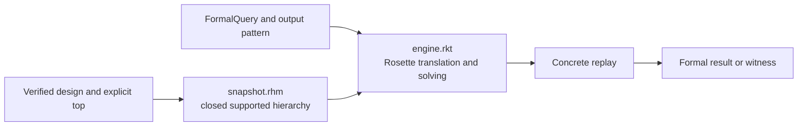

<!-- Explains how to extend and validate Rhodium's Rosette-backed formal engine. -->
<!-- SPDX-License-Identifier: Apache-2.0 -->

# Developing the formal engine

Read the formal [README](README.md) for the public queries, assumptions, result
statuses, supported semantics, and fail-closed limits. This guide owns the
implementation and coverage workflow.

## Architecture and ownership

The formal engine is an optional consumer of verified public IR. It validates
the complete hierarchy, snapshots the supported structure, translates packed
values and operations into Rosette bitvectors, solves the requested query, and
replays any model concretely before returning it.



[`main.rhm`](main.rhm) owns the public Rhombus API and result construction.
[`snapshot.rhm`](snapshot.rhm) owns backend-independent traversal and immutable
input to the solver boundary. [`engine.rkt`](engine.rkt) is the sole Rosette
interoperability module. Core, frontend, and backend packages must not import
the formal engine.

## Extend supported semantics

1. Define the public meaning and failure boundary in [README.md](README.md).
2. Extend preflight and snapshot coverage so unsupported reachable structure
   fails before a success claim.
3. Add the bitvector interpretation in the engine. Preserve canonical record
   and vector packing, unequal shift-width behavior, hierarchy, and strict type
   equality.
4. If the operation has a partial-domain contract, add an explicit proof
   obligation like the existing exactly-one requirement for `rtl.onehot_mux`.
   Never choose a value for unspecified behavior.
5. Replay witnesses and counterexamples through the concrete interpreter before
   returning them.
6. Add focused valid, counterexample, unsupported, invalid-argument, and vacuous
   coverage as applicable.

Sequential state, memories, assertions, DPI, partial values, and new operations
remain unsupported until each receives an explicit semantic model. Do not
silently ignore a reachable operation or restrict the query to one convenient
backward slice.

## Change queries or results

Keep assumptions as explicit packed constraints over named top inputs. Validate
ports, types, widths, masks, and satisfiability before evaluating a query.
Result statuses must distinguish proved facts, counterexamples, vacuity,
unsupported semantics, and solver uncertainty. Invalid API arguments remain
errors rather than formal statuses.

Any returned assignment must be complete, nonnegative, and replayable. Preserve
the complete concrete output value even when a target pattern cares about only
some bits.

## Validation

Run the solver-backed API and semantic suite:

```sh
make formal-test
```

When operation interpretation, packing, replay, or assumptions change, also run
the independent CIRCT/Verilator differential check:

```sh
make formal-differential-test
```

The differential test exercises all 128 reduced-width unequal-shift inputs, 80
aggregate layouts and projections, 256 hierarchical arithmetic inputs, eight
decode selectors, and 12,288 valid one-hot selections against independent
SystemVerilog oracles. It also covers a constrained reachability witness, a
proved output property, and a property counterexample.

The formal target performs a live Rosette/Z3 probe under an isolated compiled
root. State the actual solver and external-tool coverage run; an import-only
probe is not equivalent to solving or differential replay.
