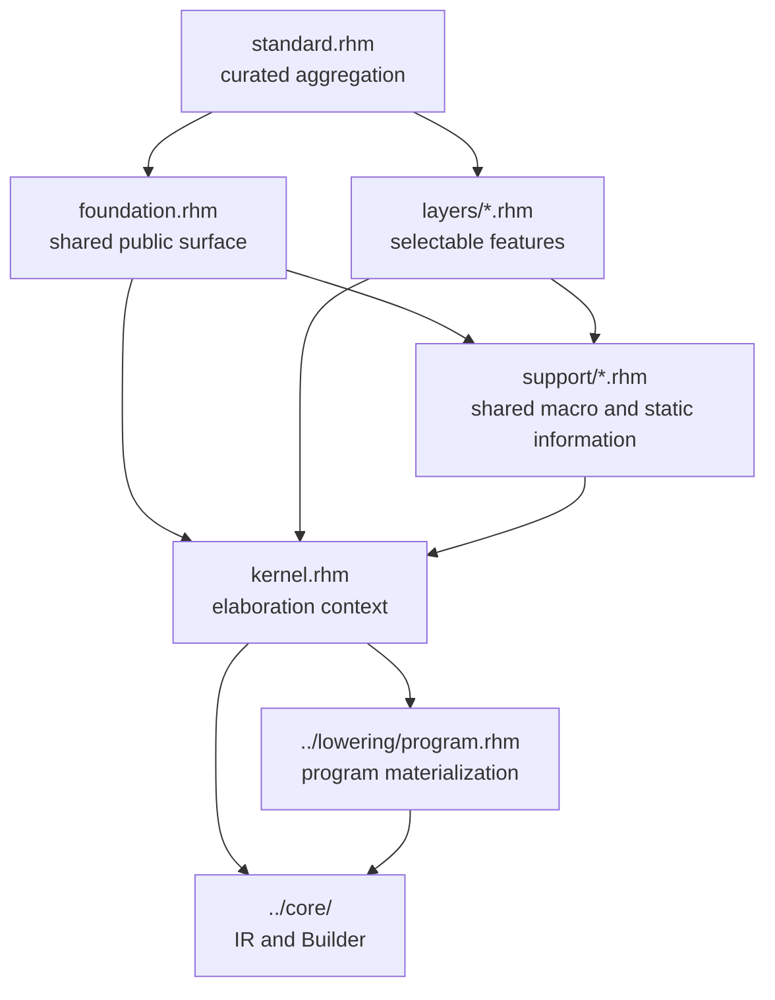

<!-- Explains the Rhodium frontend implementation, extension workflow, and focused validation. -->
<!-- SPDX-License-Identifier: Apache-2.0 -->

# Developing the Rhodium frontend

Read the [frontend guide](README.md) first for the public contracts of language
profiles, elaboration, circuit parameters, hierarchy, and extension routing.
The [layer reference](layers/README.md) owns author-visible feature semantics;
this document owns the machinery and contributor workflow behind those
contracts.

## Architecture and ownership

The frontend is a staged authoring system over the public core IR. It must not
introduce an alternate hardware representation or depend on a backend.



| Location | Implementation responsibility |
|---|---|
| [`kernel.rhm`](kernel.rhm) | Own the active elaboration context, module specialization, deferred values, construction calls into the core Builder, conditional effect collection, program construction, and compatibility materialization |
| [`foundation.rhm`](foundation.rhm) | Export the common authoring surface: circuits, ports, connection, elaboration entry points, base hardware annotations, and public extension protocols |
| [`support/`](support/) | Share non-profile macro and static-information machinery across the foundation and independent layers |
| [`layers/`](layers/DEVELOPING.md) | Implement independently selectable authoring features over existing semantics |
| [`standard.rhm`](standard.rhm) | Aggregate the foundation and curated layers without defining feature behavior |
| [`../language.rhm`](../language.rhm) and [`../base/language.rhm`](../base/language.rhm) | Compose the standard and base `#lang` profiles |

The authoritative package boundaries and direct-dependency inventories live in
the [Rhodium contributor guide](../DEVELOPING.md). In particular, frontend code
must not import backends or the optional standard library, the foundation must
not import layers, support must not import profiles or layers, and layers must
not import one another.

## Elaboration lifecycle

`foundation.rhm` expands a circuit declaration into a stable
`CircuitIdentity`, normalized generator parameters, and a call to
`kernel.build_circuit`. All top-level elaboration entry points then use the
following lifecycle:

1. `run_program_elaboration` creates one core `Design`, `Builder`, and
   `FrontendContext`.
2. `build_circuit` rejects live circuit-bound hardware parameters, resolves or
   creates the selected module definition, and establishes the active module.
3. Layer and foundation forms call kernel operations, which materialize inputs
   through `kernel.read` and delegate construction to the core Builder.
4. Circuit finalizers resolve source-order-independent work and accumulated
   vector-register writes before the Builder finishes the module.
5. Instantiation and top selection normalize through `circuit_reference`.
   Ordinary references use `materialize_circuit` in the active context.
   Retained children record a construct instance and its provider environment
   without realizing the implementation.
6. The context is deactivated on success or failure. Successful
   `run_program_elaboration` returns an `ElaboratedProgram` with the completed
   design and selected top.
7. Compatibility entry points call `lowering.materialize_rtl`, which performs
   core whole-design verification and returns `DesignElaboration`. The explicit
   `elaborate_program` API leaves this step to its caller.

Keep frontend checks close to the authoring construct when they diagnose syntax,
static information, or an elaboration-time contract. Put representation-wide
invariants in the core verifier so every frontend and direct Builder client is
checked.

The [lowering package](../lowering/DEVELOPING.md) owns the concrete identity
case and portable expansion. No backend is imported by the frontend or
materializer. Existing sync certification still occurs during construction.

## Specialization and cache safety

`FrontendContext.specializations_by_circuit` is local to one elaboration and is
keyed first by declaration identity. `build_circuit` reuses a definition only
when every normalized positional and keyword argument is stable:

- scalar immutable host values and recursively stable immutable lists compare
  by value;
- hardware type descriptors compare with `type_equal`;
- `StableCircuitParam` values use a symmetric call to
  `same_stable_circuit_param`;
- other host values are legal but deliberately bypass reuse.

Do not broaden the stable set to mutable collections, functions, or closures.
A cache hit skips the circuit body, so admitting a value whose equality can
change would make elaboration depend on call order. `build_circuit` also tracks
active declaration identities to reject recursive elaboration before a partial
module escapes.

When changing generator binding syntax, update parameter normalization in
[`support/generator-parameters.rhm`](support/generator-parameters.rhm) and test
positional arguments, keywords, defaults, dependent annotations, stable reuse,
uncached calls, and live-hardware rejection together.

## Deferred values and static information

The kernel distinguishes live hardware from deferred frontend descriptions:

- `DeferredHardwareValue` materializes when `kernel.read` needs a core value.
- `StaticHardwareValue` marks an immutable description that may safely cross a
  generator-parameter boundary.
- `RegisterPathValue` delays the choice between a register's current value and
  its next-state place until read or drive context is known.
- `CircuitDefinition` requires `definition_reference()` so wrappers expose
  their signature-bearing reference without realizing its implementation.
- `CircuitReference` separates declaration identity and a core `ModuleSignature`
  from an implementation recipe. Signature inspection and sync wiring policy
  do not execute the recipe. `materialize_circuit` is the explicit concrete
  boundary used by `inst` and top selection; it validates the returned module
  and caches by reference identity within one `FrontendContext`.

Reference realization is independent of generator specialization: do not cache
by a display name or share live modules across elaborations. Detect recursive
realization and remove active markers on failure. Recipes execute in the
current elaboration and must not return modules from earlier designs. Existing
circuit declarations still eagerly construct their bodies. Ordinary reference
support uses concrete RTL instances; retained references use the core construct
instance with the same Value/Place wiring representation.

Sync wrappers expose their control-port names through the reference rather
than requiring instantiation to match a particular wrapper class. Actual
`sync_circuit` construction retains its existing clock certification. Instance
members continue to use the concrete instance's bindings and interface-layer
metadata for concrete children. Retained children use `ConstructInstance`
bindings and do not consult concrete-module member resolvers. Detached nominal
interface descriptors are a separate future change.

`retained_circuit` packages a frontend recipe in an opaque `ExpansionProvider`.
Its callback receives a fresh Builder, establishes a new FrontendContext, and
returns an ExpansionResult plus nested providers. `inst` registers providers in
the current context and constructs only the retained boundary. The final
ElaboratedProgram snapshots that environment. No frontend callback lives in
core IR, and portable lowering never imports the frontend.

[`support/hardware-literal.rhm`](support/hardware-literal.rhm) implements the
public `HardwareLiteral` protocol on that deferred boundary. Field, annotation,
method, and producer-specific surfaces are carried by Rhombus static
information in [`support/fields.rhm`](support/fields.rhm), not by frontend-only
IR operations. See the [layer contributor guide](layers/DEVELOPING.md) before
changing those keys or providers; their propagation is shared by ports,
instances, aggregates, muxes, casts, and state.

## Making a frontend change

First use the [public extension-routing table](README.md#extension-routing) to
confirm that the change belongs in the frontend. Then preserve these seams:

1. Put behavior required by both language profiles in `foundation.rhm` only
   when it is truly part of the minimal public surface.
2. Put independently selectable notation or policy in one file under
   `layers/`; use the [layer workflow](layers/DEVELOPING.md#adding-or-changing-a-layer).
3. Put shared expansion or static-information machinery in `support/` only
   after at least two frontend clients require the same mechanism.
4. Keep semantic construction in the kernel thin: validate frontend entities,
   materialize them, and call the public core Builder.
5. Add a core operation only when the behavior cannot be represented faithfully
   by existing core semantics; update core verification and all consumers in
   that change.
6. Export a curated feature from `standard.rhm`; do not implement it there.
7. Document author-visible behavior in `README.md` or
   [`layers/README.md`](layers/README.md), and implementation details here or in
   [`layers/DEVELOPING.md`](layers/DEVELOPING.md).

## Implementation map

| Concern | Primary implementation | Focused coverage |
|---|---|---|
| Profiles and common circuit forms | [`foundation.rhm`](foundation.rhm), [`standard.rhm`](standard.rhm), [`../language.rhm`](../language.rhm), [`../base/language.rhm`](../base/language.rhm) | [`tests/frontend-test.rhm`](tests/frontend-test.rhm), [`tests/lop-equivalence-test.rhm`](tests/lop-equivalence-test.rhm) |
| Elaboration context and construction | [`kernel.rhm`](kernel.rhm) | [`../../rhodium/frontend/tests/ir-test.rhm`](../../rhodium/frontend/tests/ir-test.rhm), [`../../rhodium/frontend/tests/elaboration-result-test.rhm`](../../rhodium/frontend/tests/elaboration-result-test.rhm) |
| Generator parameters and specialization | [`kernel.rhm`](kernel.rhm), [`support/generator-parameters.rhm`](support/generator-parameters.rhm) | [`../../rhodium/frontend/tests/circuit-param-test.rhm`](../../rhodium/frontend/tests/circuit-param-test.rhm), [`../../rhodium/frontend/tests/generator-parameters-test.rhm`](../../rhodium/frontend/tests/generator-parameters-test.rhm), [`../../rhodium/frontend/tests/nested-circuit-test.rhm`](../../rhodium/frontend/tests/nested-circuit-test.rhm) |
| Hardware annotations, fields, and methods | [`support/fields.rhm`](support/fields.rhm), [`support/hardware-types.rhm`](support/hardware-types.rhm), [`support/hardware-methods.rhm`](support/hardware-methods.rhm) | [`../../rhodium/frontend/tests/hardware-annotation-test.rhm`](../../rhodium/frontend/tests/hardware-annotation-test.rhm), [`../../rhodium/frontend/tests/width-method-test.rhm`](../../rhodium/frontend/tests/width-method-test.rhm), [`../../rhodium/frontend/tests/into-test.rhm`](../../rhodium/frontend/tests/into-test.rhm) |
| Deferred literal descriptions | [`support/hardware-literal.rhm`](support/hardware-literal.rhm) | [`../../rhodium/frontend/tests/hardware-literal-test.rhm`](../../rhodium/frontend/tests/hardware-literal-test.rhm), [`../../rhodium/std/tests/dont-care-test.rhm`](../../rhodium/std/tests/dont-care-test.rhm) |
| Invalid profile and construction uses | Language readers, foundation, kernel, and layers | [`tests/invalid/`](tests/invalid/), [`tests/run-negative-cases.rktd`](tests/run-negative-cases.rktd) |

## Validation

Run checks from the repository root. `tools/run-racket-tests.sh` selects the
persistent worktree-specific `PLTCOMPILEDROOTS` when none is supplied.

For a narrow change, run the directly affected positive tests and any matching
negative cases. For example:

```sh
tools/run-racket-tests.sh \
  rhodium/frontend/tests/circuit-param-test.rhm \
  rhodium/frontend/tests/generator-parameters-test.rhm
bash rhodium/frontend/tests/run-negative.sh
```

Also run:

- `make check-boundaries` after changing imports, package placement, or profile
  composition;
- `make lop-test` after changing the foundation, standard aggregation, or a
  profile reader;
- `make frontend-test` when shared kernel, support, or layer machinery changes
  broadly.

If a frontend change alters the core operations or types produced by existing
programs, run the focused backend fixture that lowers that behavior as well.
Do not infer backend correctness from host elaboration tests alone.
