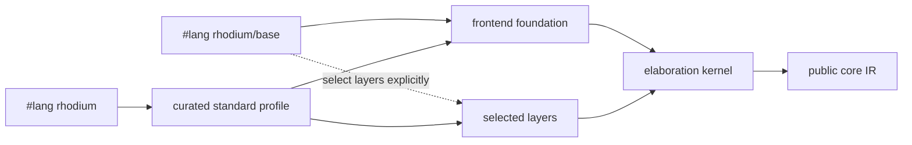

<!-- Documents Rhodium elaboration, public language profiles, and frontend extension boundaries. -->
<!-- SPDX-License-Identifier: Apache-2.0 -->

# Rhodium frontend

The frontend turns ordinary Rhombus computation and Rhodium notation into the
single public core IR. Macro expansion is not a second hardware IR. The public
package map is in [`../README.md`](../README.md); individual language features
are documented in [`layers/README.md`](layers/README.md). Contributors changing
the frontend should also read [`DEVELOPING.md`](DEVELOPING.md), while the
implementation dependency contract and authoritative layer inventory live in
[`../DEVELOPING.md`](../DEVELOPING.md).

This guide answers four frontend questions: which profile to use, what
elaboration does, where host computation ends and hardware begins, and where a
new abstraction belongs.

## Choose a language profile

Both profiles elaborate through the same kernel into the same core IR.
`#lang rhodium` is the normal choice; use `#lang rhodium/base` when a tool,
experiment, or library needs an explicitly minimal language surface.



| Profile | Includes | Use it for |
|---|---|---|
| `#lang rhodium` | Foundation and all curated layers | Designs, reusable hardware libraries, and most tests |
| `#lang rhodium/base` | Foundation only; layers are explicit imports | Layer isolation, language experiments, and minimal tooling fixtures |

The base profile exposes `circuit`, `elaborate`, ports, `<==`, `Bits`, `Clock`,
`Reset`, hardware selection, `.into`, and guarded host `if`. It does not expose
the public core Builder or raw kernel. For example, an adder can select only the
combinational layer:

```rhombus
#lang rhodium/base

import:
  lib("rhodium/frontend/layers/comb.rhm") open

circuit Adder(width):
  input(a, b): Bits(width)
  output sum: Bits(width)
  sum <== a + b

def design = elaborate(Adder(8))
```

The standard profile adds the curated layers without changing the resulting
IR. The four programs under [`../../examples/lop/`](../../examples/lop/)
express one adder through the public core, kernel, explicit base composition,
and standard profile. `make lop-test` checks that all four produce identical
public IR and CIRCT representations.

Library code may use `hardware_value_type(value)` to recover the Rhodium type of
caller-elaborated readable or driveable hardware without importing core IR
classes. Host values are rejected.

## Circuits and elaboration

Elaboration is deterministic host computation that constructs known-width
hardware:

1. A circuit call selects a module specialization from host parameters.
2. The circuit body constructs ports, operations, state, instances, and drives.
3. Stable equivalent calls reuse the same module definition.
4. `elaborate_program` returns an `ElaboratedProgram` with a completed design
   and explicit top. Pass it to `compile_program` with the desired target.
5. `elaborate` and `elaborate_with_top` finalize concrete construction, returning a
   verified core `Design` or `DesignElaboration`, respectively.

The explicit phase boundary is available in both language profiles:

```rhombus
import:
  lib("rhodium/compile/program.rhm").compile_program
  lib("rhodium/backend/circt-target.rhm").circt_target

def program = elaborate_program(Top())
def result = compile_program(program, circt_target)
```

Program construction completes circuit bodies and closes the frontend context.
It checks the selected top's ownership and completion; whole-design verification
occurs during target preparation. For example, a cycle across finished instances is
rejected during compilation, while eager `elaborate` rejects it before
returning. Existing construction-local and sync-certification checks remain at
their authoring boundaries.

Ordinary `CircuitReference` recipes still run during program elaboration.
Compilation prepares fresh reachable RTL for both concrete and retained programs.
Eager construction preserves its original graph when no expansion is required.
See the [program contract](../lowering/README.md) for direct Builder usage.

### Circuit families and explicit tops

Library extensions can separate a known physical interface from construction
of its implementation with a `CircuitReference`:

```rhombus
def signature = ModuleSignature(
  [PortSignature("source", Bits(8))],
  [PortSignature("result", Bits(8))]
)
def leaf = CircuitReference(CircuitIdentity("Leaf"), signature, fun (): Leaf())
```

Here `Leaf()` is an ordinary circuit with matching ports. Constructing `leaf`
or calling `circuit_signature(leaf)` does not execute `Leaf()`. `inst` and
top-level `elaborate` materialize the reference when concrete RTL is required.
The implementation must return a finished module or circuit definition in the
active elaboration, with exactly the declared port names, order, directions,
and types. One reference is realized once per elaboration; separate instances
still have independent hardware state. Reusing it in another elaboration
constructs a new implementation for that design.

The optional fourth and fifth constructor arguments name the `Clock` and
`Reset` inputs for automatic sync-child wiring. Both must be supplied together.
This declaration selects wiring; the implementation's `sync_circuit` still
owns single-clock certification and reset behavior. Clock/reset port names
alone never opt an ordinary module into automatic propagation.

`circuit_reference(module_or_definition)` adapts existing concrete definitions;
`circuit_signature` inspects either kind. `CircuitDefinition` wrappers implement
`definition_reference()` and return their signature-bearing reference directly.
Keep implementation construction in the reference recipe so inspection remains lazy.

This API preserves ordinary eager circuit elaboration. The resulting design
still contains concrete RTL instances, so existing analyses and CIRCT emission
remain applicable after materialization. `CircuitReference` itself does not
retain abstract instances; opt into the separate API below.
Signatures describe typed physical ports. Both kinds of reference accept
`~declarations`, an immutable list of extension-owned `CircuitDeclaration`
objects. The interface layer supplies [detached interface declarations](layers/README.md#detached-interface-declarations)
for nominal roles, grouped members, arrays, and nested endpoints. They bind to
instance ports without inspecting an implementation. Ordinary references
without declarations keep reconstructing groups from concrete module metadata.
Dynamically constructed references use ordinary instance member lookup;
existing circuit declarations retain their richer expansion-time port information.

`retained_circuit(definition, implementation)` pairs a core `ConstructDefinition`
with a zero-argument circuit recipe. `inst child(reference)` records its typed
ports and provider without executing that recipe. `elaborate_program` preserves
these instances; legacy `elaborate` and `elaborate_with_top` expand them before
returning.

```rhombus
def signature = ModuleSignature([PortSignature("source", Bits(8))], [PortSignature("result", Bits(8))])
def definition = ConstructDefinition(ConstructIdentity("Leaf"), [8], signature,
                                    [[OutputLeafDependency([], [InputLeaf(0, [])])]])
def retained = retained_circuit(definition, fun (): Leaf())
```

A retained reference may also be the selected top. `elaborate_program(reference)`
returns its detached `ConstructDefinition` as `.top`, with no synthetic wrapper
or provider execution. Concrete elaboration returns the expanded implementation
as `.top`. `leaf_paths(type)` is available from the public language to describe
exact scalar, record, and vector leaves without importing compiler modules.

The default retained contract is combinational, with data ports and declared
leaf dependencies. It supports ordinary typed port access, including aggregate
ports, and nesting inside ordinary or synchronous RTL parents. Each provider
runs in a fresh frontend context supplied by the materializer; captured live
modules or hardware values are invalid. No provider runs while inspecting the
signature or elaborating the parent. Declared grouped interfaces support ordinary
Flow connections before expansion; implementation-owned tracing contracts are
checked and consumed after expansion. Materialization remaps interface and trace
metadata into the new design.

For register-state children, give `ConstructDefinition` the keyword
`~state: SingleClockState("clock", "reset")` and include those typed inputs in
its signature. A retained reference then participates in `sync_circuit` ambient
clock/reset propagation, including `inst child(reference, ~reset_when: clear)`.
Composition does not run the provider. Expansion validates the declared domain,
reset behavior, permitted state, and combinational dependencies; sync
certification runs again before concrete elaboration returns. The contract
permits registers, including resetless ones, but does not declare fixed latency.
Opt into asynchronous-read storage and synchronous writes with
`SingleClockState("clock", "reset", ~async_read_memory: #true)`, and add
`~clocked_assertions: #true` when the implementation or its children assert
properties. These permissions are independent. Memory writes still follow their
explicit enables during reset; scoped reset suppresses assertions without
clearing storage. See the [core contract](../core/README.md#retained-constructs)
for the supported effects and validation rules.

See the [materialization contract](../lowering/README.md) for provider reuse,
recursion, effects, and dependency checks.

A circuit declaration defines a parameterized module family. Calling it while
elaborating creates the selected specialization once and reuses that definition
for later calls with the same stable parameters:

```rhombus
circuit Passthrough(T):
  input source: T
  output result: T
  result <== source

def design = elaborate(Passthrough(Bits(8)))
```

Consumers that need a stable explicit top, such as RFPL physical annotation,
use `elaborate_with_top`:

```rhombus
def logical = elaborate_with_top(Passthrough(Bits(8)))
def design = logical.design
def top = logical.top
```

`elaborate` remains the concise compatibility form returning a bare `Design`.
`Module.find_instance(name)` provides stable direct-instance inspection; tools
must not infer the top or hierarchy from module-list positions.

The [`layers/clocking.rhm`](layers/clocking.rhm) layer is included in the standard
profile. It records root timing declarations as metadata during ordinary
elaboration. Select `clocking_target()` through `compile_program` to resolve
those declarations and obtain a report; `clocking_target(~check_cdc: #true)`
also rejects unsafe sampling without verified crossing evidence. The target
analyzes a fresh concrete graph and preserves the source program. See the
[clock-analysis contract](../analysis/README.md).

### Ports and drivers

Inputs are readable and cannot be driven. Outputs are driveable and become
readable after they are driven. Outputs, instance inputs, and register
next-state places use `<==`; every place has one effective driver.

Grouped ports share one explicit type:

```rhombus
input(a, b): Bits(width)
output(sum, carry): Bits(width)
```

### Host control versus hardware control

Host values determine which hardware exists. They are not runtime hardware
data:

| Host-side construct | Elaboration meaning | Hardware-side counterpart |
|---|---|---|
| `Int` | A number used while constructing hardware | `Bits(width)` stores a runtime bit vector |
| `Boolean` | A host-only truth value | `Bool` stores a runtime Boolean value |
| `if` | Select which structure to construct | `when` conditionally drives hardware |
| Host lookup or branching | Select a case while elaborating | `switch` selects an exact hardware key at runtime |
| `for` over a host collection | Repeat generated structure | The resulting operations and instances |
| Circuit generator call | Select or create a module specialization | An instance of that module |

Host control retains ordinary Rhombus truthiness. A hardware value is a host
object and is therefore truthy, so using one wherever Rhombus asks for a truth
value—including `if`, `unless`, `cond`, host Boolean operators, and iteration
guards—tests the presence of that object; it never observes the value carried
by hardware at runtime. Use the hardware-only `when` and `switch` forms supplied
by the conditional layer for runtime control. `when` conditions must be one-bit
hardware values; `switch` selectors must be hardware values with supported
exact keys. Host values are rejected by both forms.

## Module specialization and host helpers

Circuit parameters may be any host value; only live circuit-bound hardware is
rejected. Their stability determines specialization reuse:

| Parameter kind | Specialization behavior |
|---|---|
| Integers, Booleans, strings, symbols, recursively stable immutable lists, and hardware-type descriptors | Equivalent values reuse one module definition |
| An immutable class implementing `StableCircuitParam` | Uses Rhombus `==` by default; transparent classes compare structurally and opaque artifacts remain nominal |
| Mutable collections, functions, closures, and other host objects | Legal, but every call creates a fresh module definition |

A configuration opts into stable reuse explicitly:

```rhombus
class EngineConfig(lanes :: PosInt, width :: PosInt):
  implements StableCircuitParam
```

Override `same_stable_circuit_param` only for equality semantics different from
`==`; the result must be symmetric, deterministic, and independent of mutable
elaboration state.

Generator declarations accept positional and keyword bindings with ordinary
Rhombus annotations and default expressions. Ordinary and sync circuits share
these parameter forms and host-value validation.

Within one elaboration, calls with stable equivalent arguments reuse one module
definition. Distinct or non-reusable calls receive deterministic suffixes such
as `Adder` and `Adder_1`; parameters are not embedded in names. Active recursive
calls to the same generator are rejected. The implementation of specialization
identity, comparison, and caching is described in
[`DEVELOPING.md`](DEVELOPING.md#specialization-and-cache-safety).

### Determinism and cache safety

Circuit bodies and parameter defaults must depend only on their parameters,
stable immutable captures, and local elaboration state. Local mutation used to
collect generated structure is valid; observing or modifying external mutable
state is not, because a cache hit does not execute the body again. A physical
or implementation variant that needs a distinct definition should carry an
explicit stable parameter naming that variant.

### Hardware-aware host helpers

Ordinary host functions may accept hardware objects while elaborating,
inspect type descriptors, construct hardware, and return hardware to the
enclosing circuit. This is different from passing runtime hardware as a
circuit generator parameter:

```rhombus
fun low_word(value, width) :: Bits(width):
  value[0..width]
```

Annotate a type parameter as `T :: DataType` and a runtime value with the most
specific hardware annotation the operation accepts. Exact annotations retain
field, indexing, casting, and lookup information. A
`hardware_type Token(width)` declaration provides exact `Token(width)` and
family-wide `Token`; `value.type` recovers the concrete descriptor. Use
`Hardware.of(type)` for a dynamic descriptor, bare `Bits` for any bit-vector
width, `Hardware.packable` for any packed `DataType`, and bare `Hardware` only
for arbitrary readable or driveable hardware entities.

See [`../../examples/rtl/host-parameters.rhdl`](../../examples/rtl/host-parameters.rhdl)
and [`../../examples/rtl/layered-adder.rhdl`](../../examples/rtl/layered-adder.rhdl).

## Nested circuits and hierarchy

A circuit body may declare a private child generator that captures stable host
values, including parameters of the enclosing generator:

```rhombus
circuit Incrementer(width):
  input value_in: Bits(width)
  output value_out: Bits(width)

  circuit Increment():
    input value_in: Bits(width)
    output value_out: Bits(width)
    value_out <== value_in + bits(1, width)

  inst increment(Increment())
  increment.value_in <== value_in
  value_out <== increment.value_out
```

Calling the nested generator still materializes a separate module. Only host
values may be captured; parent hardware crosses the child boundary through
ports. An unused nested declaration emits no module.

A nested `sync_circuit` follows the same domain rules as any other synchronous
child. A sync parent propagates its ambient clock and reset only to marked sync
children; ordinary children never inherit a domain by port name or type. The
physical `clock` and `reset` ports are not source bindings in a `sync_circuit`
body. Use `reset_when(condition)` for a nested reset scope or an instance's
`~reset_when: condition` option to derive a child reset from the ambient one.
Explicit `~clock` and `~reset` controls remain available only outside an active
sync domain.

See [`../../examples/rtl/nested-circuit.rhdl`](../../examples/rtl/nested-circuit.rhdl)
and the integrated host-specialization example
[`../../examples/rtl/tiny-simd.rhdl`](../../examples/rtl/tiny-simd.rhdl).

## Deferred host descriptions

The kernel supports deferred frontend values so layers can retain authoring
metadata until a hardware operation consumes it. Static literal shadows,
enum members, and other reusable host descriptions do not allocate IR merely
by being declared or passed as circuit parameters. Once consumed, they lower
to ordinary core values and operations.

Every `HardwareLiteral` reports its hardware type, packed width, and packed
host value. Ordinary public-surface libraries can therefore build typed static
abstractions—such as [`../std/decode/pattern.rhdl`](../std/decode/pattern.rhdl)—
without importing core or frontend implementation modules.

The static subtype distinguishes reusable descriptions from objects already
owned by an elaborated circuit. This is how extensions add types, literal
forms, mux keys, field access, and annotations without adding frontend-only
operations to the core IR.

## Extension routing

Start with the narrowest boundary that can express the abstraction. The
authoritative import rules remain in the
[package dependency contract](../DEVELOPING.md#dependency-rules).

| The change needs to... | Put it in... | Boundary |
|---|---|---|
| Compose existing hardware operations behind a reusable API | An ordinary Rhombus or Rhodium library | Use only public language forms |
| Add notation, static information, or authoring policy over existing semantics | `frontend/layers/` | A selectable layer; do not import sibling layers |
| Share macro or static-information machinery across layers | `frontend/support/` | Not a selectable profile and not feature behavior |
| Derive certification, provenance, or diagnostics from completed IR | `rhodium/analysis/` | Consume core IR without becoming core semantics |
| Add hardware semantics that verification and every backend must preserve | `rhodium/core/` | Extend the IR, Builder, verifier, printer, and consumers together |
| Lower an existing core operation to a target | `rhodium/backend/` | Consume core IR; never import frontend implementation |

A useful construction abstraction can be an ordinary Rhombus function:

```rhombus
#lang rhombus

import:
  lib("rhodium/frontend/layers/comb.rhm") open

fun add_pair(left, right):
  left + right
```

Importing this function from a `.rhdl` program requires no reader, IR,
verifier, or backend change. For frontend implementation roles, see the
[frontend contributor guide](DEVELOPING.md); for the existing public features,
see the [layer reference](layers/README.md).
