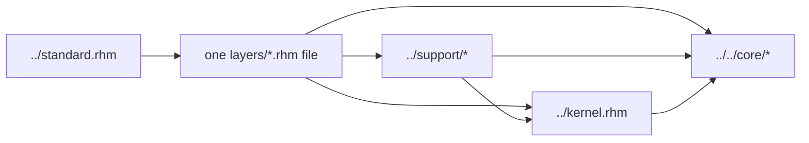

<!-- Explains how to implement, extend, and validate Rhodium frontend layers. -->

# Developing Rhodium frontend layers

Read the [layer reference](README.md) for the author-visible contracts of every
bundled layer and the [frontend contributor guide](../DEVELOPING.md) for the
elaboration lifecycle. This document covers layer placement, shared expansion
machinery, and the process for changing the selectable language surface.

## Layer boundary

A layer adds notation, types, static information, or authoring policy over
existing hardware semantics. It may use the kernel, frontend support, approved
core APIs, and an analysis that is explicitly part of the feature contract. It
must not import:

- another layer;
- `foundation.rhm` or `standard.rhm`;
- a backend or formal engine;
- the optional standard library.

Move machinery used by more than one layer to [`../support/`](../support/)
instead of creating a layer dependency. Keep reusable circuits and protocols
that need no syntax or static-information extension in [`../../std/`](../../std/)
or the relevant domain library. The authoritative dependency inventory and its
enforcement live in the [Rhodium contributor guide](../../DEVELOPING.md).



The arrow into a layer comes only from profile composition. No layer-to-layer
arrow is legal.

## Static information and hardware surfaces

Rhodium uses Rhombus static information to retain an authoring surface while
runtime construction continues to produce ordinary core values and places.
The shared machinery is intentionally centralized:

| Support module | Responsibility |
|---|---|
| [`../support/fields.rhm`](../support/fields.rhm) | Hardware value, port, field, method, variant, and producer-surface keys; common dot, index, append, cast, and width-method dispatch |
| [`../support/hardware-methods.rhm`](../support/hardware-methods.rhm) | Receiver-owned method metadata and exact dispatch precedence |
| [`../support/hardware-types.rhm`](../support/hardware-types.rhm) | `hardware_type` declarations and family annotations |
| [`../support/hardware-literal.rhm`](../support/hardware-literal.rhm) | Immutable deferred packed descriptions and materialization |
| [`../support/generator-parameters.rhm`](../support/generator-parameters.rhm) | Generator binding syntax and substitution into dependent result surfaces |
| [`../support/instance-members.rhm`](../support/instance-members.rhm) | Precise member resolution for child instances |
| [`../support/mux-lookup.rhm`](../support/mux-lookup.rhm) | Typed mux-key normalization and selector protocols |
| [`../support/variants.rhm`](../support/variants.rhm) | Shared enum and tagged-union schemas, nominal descriptors, and member literals |
| [`../support/clocking.rhm`](../support/clocking.rhm) | Ambient sync context, reset scopes, sync-child instantiation, and crossing evidence |
| [`../support/finite-enum.rhm`](../support/finite-enum.rhm), [`../support/mask-type.rhm`](../support/mask-type.rhm), [`../support/one-hot-selection.rhm`](../support/one-hot-selection.rhm) | Narrow cross-layer protocols that avoid importing their owning feature layers |

Dot providers must decline syntax they do not own so the shared resolution
chain can continue. Preserve the documented precedence: receiver-owned methods,
then universal built-ins, then a visible receiver-first function. Field
providers must likewise decline call syntax. Add a new static-information key
only when an existing composable surface cannot carry the needed fact.

Whenever a feature returns a value, decide deliberately which surface the
result retains. Exercise the feature through every applicable producer—literal,
port, wire, register, mux, aggregate projection, memory read, cast, and instance
port—rather than testing only the declaration site.

## Adding or changing a layer

1. Confirm the feature belongs in a selectable layer using the frontend
   [extension-routing guide](../README.md#extension-routing).
2. Choose one owning file under this directory. A layer may expose several
   closely related forms when they share one semantic contract, but unrelated
   behavior should not be hidden behind the same import.
3. Express hardware construction through existing kernel operations and public
   core types. If the semantics require a new core operation, complete the core
   verifier and consumer work before exposing frontend syntax.
4. Reuse support protocols without importing another layer. If shared machinery
   is missing, add the smallest layer-neutral protocol under `../support/` and
   test both clients independently.
5. Export the public bindings from the layer file. Add the import to
   [`../standard.rhm`](../standard.rhm) only when the feature belongs in the
   curated `#lang rhodium` profile; `standard.rhm` must remain aggregation-only.
6. Add positive coverage for supported behavior and invalid fixtures for invalid
   uses of supported features. Do not add tests whose purpose is to prove an
   absent feature remains absent.
7. Update the public contract and layer map in [`README.md`](README.md), plus the
   authoritative dependency row in [`../../DEVELOPING.md`](../../DEVELOPING.md).

### Adding a hardware type

Use `hardware_type` for an extension-defined scalar family and implement only
the core type capabilities the representation actually supports. Nominal type
equality, packed width, literals, annotations, and result surfaces must agree.
For a structural aggregate or finite variant, follow the bundle, vector, enum,
or tagged-union machinery rather than adding a frontend-only core type.

Test at least declaration identity, specialization, ports, state, literals or
construction, equality where supported, packing and explicit casts, and misuse
through an incompatible type. A custom packed description should implement the
public `HardwareLiteral` protocol and remain immutable.

### Adding a hardware method

Prefer an ordinary receiver-first function when lexical extension is enough.
Use receiver-owned method metadata only when the method is part of a nominal
type declaration. Universal built-ins belong in the common field machinery
only when every matching hardware surface must provide the operation.

For dependent return types, attach the exact result annotation so chained field
and method access survives expansion. Test dispatch precedence, invalid
receivers, method/field collisions, and propagation through all producers that
claim to preserve the nominal surface.

Immutable `.updated` dispatch lives in `support/fields.rhm`: vectors retain
selected-element replacement, while records take named replacements and reuse
the receiver's concrete descriptor with kernel record creation/projection.
Preserve the receiver's result static information so nested fields and owned
methods remain available. Do not implement replacement with overlapping drives
or introduce a separate record-update IR operation.

### Adding a clocked or conditional effect

Use [`../support/clocking.rhm`](../support/clocking.rhm) for ambient clock/reset
resolution and explicit-control rejection. A new effect used inside `when` or
`switch` needs an explicit collection and lowering protocol in the kernel. If
that protocol does not exist, reject the effect with
`kernel.reject_unsupported_conditional_effect` and provide author guidance;
never let it execute unguarded.

## Implementation map

Interface trace contracts use one `InterfaceTransformGroup` representation for
inline adapters and named local endpoint relations. Declarations normalize
endpoint polarity with metadata-only connections; never emit functional
drives as part of certification. Stateful control sets are named within their
declaring module, and models retain local or immediate-child ownership.
`validate_interface_contracts` checks whole-instance adapter ownership. Diagram
extraction checks named relations against completed endpoint frontiers, catching
competing producers/consumers through wiring and hierarchy without banning
unrelated internal Flow. These are inspection invariants, not new core hardware
semantics. Diagram extraction and event occurrence expansion own hierarchy resolution;
the interface layer must not import either consumer.

| Public area | Owning layer | Shared machinery | Representative tests |
|---|---|---|---|
| Packed expressions and selection | [`comb.rhm`](comb.rhm), [`bool.rhm`](bool.rhm), [`signed.rhm`](signed.rhm), [`expanding-arithmetic.rhm`](expanding-arithmetic.rhm) | fields, literals, mux lookup, masks, one-hot selection | [`../../../tests/frontend/comparison-test.rhm`](../../../tests/frontend/comparison-test.rhm), [`../../../tests/frontend/concat-test.rhm`](../../../tests/frontend/concat-test.rhm), [`../../../tests/frontend/signed-test.rhm`](../../../tests/frontend/signed-test.rhm), [`../../../tests/frontend/expanding-arithmetic-test.rhm`](../../../tests/frontend/expanding-arithmetic-test.rhm) |
| Nominal and structural data | [`enum.rhm`](enum.rhm), [`tagged-union.rhm`](tagged-union.rhm), [`one-hot.rhm`](one-hot.rhm), [`bundle.rhm`](bundle.rhm), [`vector.rhm`](vector.rhm) | fields, hardware methods, literals, variants, generator parameters | [`../../../tests/frontend/enum-test.rhm`](../../../tests/frontend/enum-test.rhm), [`../../../tests/frontend/tagged-union-test.rhm`](../../../tests/frontend/tagged-union-test.rhm), [`../../../tests/frontend/bundle-test.rhm`](../../../tests/frontend/bundle-test.rhm), [`../../../tests/frontend/vector-test.rhm`](../../../tests/frontend/vector-test.rhm) |
| State and effects | [`wire.rhm`](wire.rhm), [`sequential.rhm`](sequential.rhm), [`memory.rhm`](memory.rhm), [`sync-memory.rhm`](sync-memory.rhm), [`assertion.rhm`](assertion.rhm), [`dpi.rhm`](dpi.rhm) | clocking, fields, kernel effect lowering | [`../../../tests/frontend/register-shorthand-test.rhm`](../../../tests/frontend/register-shorthand-test.rhm), [`../../../tests/frontend/memory-test.rhm`](../../../tests/frontend/memory-test.rhm), [`../../../tests/frontend/sync-memory-test.rhm`](../../../tests/frontend/sync-memory-test.rhm), [`../../../tests/frontend/assertion-test.rhm`](../../../tests/frontend/assertion-test.rhm), [`../../../tests/frontend/clocked-dpi-test.rhm`](../../../tests/frontend/clocked-dpi-test.rhm) |
| Control, hierarchy, and domains | [`conditional.rhm`](conditional.rhm), [`hierarchy.rhm`](hierarchy.rhm), [`sync.rhm`](sync.rhm), [`clocking.rhm`](clocking.rhm) | clocking, instance members, mux lookup, kernel conditional lowering | [`../../../tests/frontend/conditional-test.rhm`](../../../tests/frontend/conditional-test.rhm), [`../../../tests/frontend/nested-circuit-test.rhm`](../../../tests/frontend/nested-circuit-test.rhm), [`../../../tests/frontend/sync-test.rhm`](../../../tests/frontend/sync-test.rhm), [`../../../tests/frontend/clocking-test.rhm`](../../../tests/frontend/clocking-test.rhm) |
| Interfaces and topology | [`interface.rhm`](interface.rhm) | fields, generator parameters, instance members | [`../../../tests/frontend/interface-test.rhm`](../../../tests/frontend/interface-test.rhm), [`../../../tests/frontend/interface-array-test.rhm`](../../../tests/frontend/interface-array-test.rhm), [`../../../tests/frontend/interface-monitor-test.rhm`](../../../tests/frontend/interface-monitor-test.rhm) |

## Validation

Run the smallest directly affected test set from the repository root. The test
wrapper supplies a fresh compiled root unless the caller already supplied one:

```sh
tools/run-racket-tests.sh \
  tests/frontend/enum-test.rhm \
  tests/frontend/enum-method-test.rhm
```

Then select the checks required by the change:

- Run `bash tests/frontend/run-negative.sh` after changing diagnostics,
  annotations, or static-information rejection.
- Run `make check-boundaries` after changing imports, moving machinery, adding a
  layer, or changing profile composition.
- Run `make lop-test` after changing the curated or base profile surface.
- Run `make frontend-test` for changes to shared layer or support machinery.
- Run the focused backend fixture when the elaborated core operation sequence or
  type shape changes.

Keep generated Racket, CIRCT, and Verilator artifacts out of version control.
